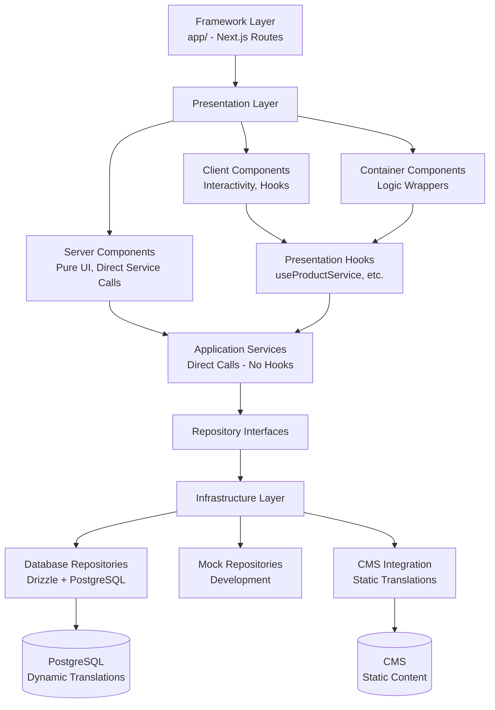

# Complete Migration and Refactoring Plan
## Combined Plan: Architecture, Database Integration, and Translation Strategy

## Overview

This comprehensive plan migrates the entire codebase to clean architecture with:
- **Server/Client Component separation** (Server Components are pure UI by default)
- **Drizzle ORM + PostgreSQL** database integration
- **Dual translation strategy** (static from CMS, dynamic from database)
- **Complete documentation** for each layer
- **Extensive comments** throughout codebase for readability

## Architecture Flow



## Translation Strategy

### Static Translations (CMS at Build Time)
- **Source**: Content Management System (CMS)
- **When**: Fetched at build time
- **Storage**: Embedded in HTML
- **Content**: UI labels, headers, buttons, static text

**Examples**:
- "Featured Products" (section header)
- "Add to Cart" (button label)
- "Shop Now" (CTA button)
- Navigation menu items
- Footer links

### Dynamic Translations (Database)
- **Source**: PostgreSQL database
- **When**: Fetched at runtime
- **Storage**: Database tables with language columns/relations
- **Content**: Product names, descriptions, categories, user-generated content

**Examples**:
- Product name in English/Arabic
- Product description in multiple languages
- Category names
- Review comments

### Implementation Pattern
```typescript
// Static translation (Server Component)
import { getStaticTranslation } from '@/infrastructure/translations/static';

export async function HomePage({ language = 'en' }: { language?: string }) {
  // Get static translations from CMS (build time)
  const t = await getStaticTranslation(language);

  return (
    <section>
      <h2>{t('featured_products_title')}</h2>
      <p>{t('featured_products_subtitle')}</p>
      <button>{t('add_to_cart')}</button>
    </section>
  );
}

// Dynamic translation (Server Component)
import { getProductService } from '@/presentation/server/getServices';

export async function ProductCard({ productId }: { productId: number }) {
  const productService = getProductService();

  // Product already includes translations based on language
  const product = await productService.getById(productId, 'en');

  return (
    <div>
      <h1>{product.name}</h1> {/* Already translated */}
      <p>{product.description}</p> {/* Already translated */}
    </div>
  );
}
```

## Phase 1: Setup and Infrastructure

### 1.1 Install Dependencies

**Dependencies to install:**
- `drizzle-orm` - Drizzle ORM
- `drizzle-kit` - Drizzle CLI and migrations
- `postgres` or `pg` - PostgreSQL driver
- `dotenv` - Environment variables (if not using Next.js built-in)

**Files to create:**
- Update `package.json` with dependencies
- `src/infrastructure/database/drizzle.config.ts` - Drizzle configuration
- `src/infrastructure/database/connection.ts` - Database connection pool
- `src/infrastructure/database/index.ts` - Database exports

### 1.2 Database Schema Design

Create Drizzle schema files with translation support:

**Files to create:**
- `src/infrastructure/database/schema/products.ts`
  - Product table with base fields
  - ProductTranslation table (name, description per language)
  - ProductVariant, ProductImage tables
- `src/infrastructure/database/schema/categories.ts`
  - Category table
  - CategoryTranslation table
- `src/infrastructure/database/schema/users.ts`
  - User table
  - Wishlist table
- `src/infrastructure/database/schema/orders.ts`
  - Order table
  - OrderItem table
- `src/infrastructure/database/schema/reviews.ts`
  - Review table (with language support)
- `src/infrastructure/database/schema/translations.ts`
  - Translation keys table (for static content if storing in DB)
- `src/infrastructure/database/schema/index.ts` - Export all schemas

**Key Schema Decisions:**
- Products: Normalized with translation tables
- Images: Separate images table with product relation
- Cart: In-memory (current) or persisted (optional)
- Orders: Normalized with OrderItem junction table
- Translations: Separate translation tables for multilingual content

### 1.3 Environment Configuration

**Files to create:**
- `.env.example` - Template with:
  - `DATABASE_URL` - PostgreSQL connection string
  - `USE_DATABASE` - true/false for mock vs database
  - `CMS_API_URL` - CMS endpoint for static translations
  - `CMS_API_KEY` - CMS API key
- `src/infrastructure/config/database.config.ts` - Database configuration
- `src/infrastructure/config/cms.config.ts` - CMS configuration

### 1.4 Translation Infrastructure

**Files to create:**
- `src/infrastructure/translations/static.ts` - Static translation service (CMS)
- `src/infrastructure/translations/dynamic.ts` - Dynamic translation utilities
- `src/infrastructure/translations/types.ts` - Translation types
- `src/infrastructure/cms/client.ts` - CMS API client

## Phase 2: Repository Implementation

### 2.1 Translation Repository Interfaces

**Files to create:**
- `src/application/repositories/ITranslationRepository.ts` - Static translations
- `src/application/repositories/IProductRepository.ts` - Update with language param
- `src/application/repositories/ICategoryRepository.ts` - Update with language param

### 2.2 Database Repositories

**Files to create:**
- `src/infrastructure/repositories/DatabaseProductRepository.ts`
  - Implement IProductRepository
  - Handle translations from database
  - Use Drizzle query builder
  - Map database models to domain entities
- `src/infrastructure/repositories/DatabaseCategoryRepository.ts`
- `src/infrastructure/repositories/DatabaseOrderRepository.ts`
- `src/infrastructure/repositories/DatabaseReviewRepository.ts`
- `src/infrastructure/repositories/DatabaseUserRepository.ts`
- `src/infrastructure/repositories/CmsTranslationRepository.ts` - CMS static translations

### 2.3 Repository Factory

**Files to create:**
- `src/infrastructure/repositories/RepositoryFactory.ts`
  - Environment-based repository selection

## Phase 3: Dependency Injection Setup

### 3.1 Service Container

**Files to create:**
- `src/infrastructure/di/ServiceContainer.ts`
  - Singleton pattern for services
  - Repository injection
  - Environment-aware service creation
  - Methods: `getProductService()`, `getCartService()`, `getTranslationService()`, etc.

### 3.2 Server-Side Service Access

**Files to create:**
- `src/presentation/server/getServices.ts`
  - Helper functions for Server Components
  - `getProductService()`, `getCategoryService()`, `getTranslationService()`, etc.
  - No hooks needed - direct service access

### 3.3 Translation Services

**Files to create:**
- `src/application/services/TranslationService.ts`
  - Static translation service (CMS)
  - Dynamic translation utilities
  - Language detection and switching

## Phase 4: Component Migration - Server/Client Separation

### 4.1 Presentation Layer Structure

```
src/presentation/
├── components/
│   ├── server/              # Server Components (default, pure UI)
│   │   ├── atoms/           # Pure UI atoms
│   │   ├── molecules/       # Pure UI molecules
│   │   ├── organisms/       # Pure UI organisms
│   │   └── templates/        # Server Component templates
│   │
│   ├── client/              # Client Components (interactivity)
│   │   ├── atoms/           # Interactive atoms
│   │   ├── molecules/        # Interactive molecules
│   │   └── organisms/        # Interactive organisms
│   │
│   └── containers/          # Container Components (logic wrappers)
│
├── hooks/                   # React hooks (Client Components only)
├── providers/               # Context providers (Client Components)
├── server/                  # Server-side utilities
│   └── getServices.ts       # Service access helpers
│
└── ui/                      # UI adapters
    └── adapters/
        └── UIAdapter.ts
```

### 4.2 Migrate Pure UI Atoms (Server)

**Files to migrate:**
- `src/components/atoms/Badge.tsx` → `src/presentation/components/server/atoms/Badge.tsx`
- `src/components/atoms/Button.tsx` → `src/presentation/components/server/atoms/Button.tsx`
- `src/components/atoms/Icon.tsx` → `src/presentation/components/server/atoms/Icon.tsx`
- `src/components/atoms/Price.tsx` → `src/presentation/components/server/atoms/Price.tsx`
- `src/components/atoms/Rating.tsx` → `src/presentation/components/server/atoms/Rating.tsx`
- `src/components/atoms/Label.tsx` → `src/presentation/components/server/atoms/Label.tsx`
- `src/components/atoms/DiscountBadge.tsx` → `src/presentation/components/server/atoms/DiscountBadge.tsx`
- `src/components/atoms/IndicatorCircle.tsx` → `src/presentation/components/server/atoms/IndicatorCircle.tsx`

**Rules:**
- NO 'use client' directive
- NO hooks, NO state
- Pure props → JSX
- Can use UI adapter pattern
- Add extensive comments explaining purpose

### 4.3 Migrate Interactive Atoms (Client)

**Files to migrate:**
- `src/components/atoms/QuantityInput.tsx` → `src/presentation/components/client/atoms/QuantityInput.tsx`
- `src/components/atoms/Input.tsx` → `src/presentation/components/client/atoms/Input.tsx`
- `src/components/atoms/Textarea.tsx` → `src/presentation/components/client/atoms/Textarea.tsx`
- `src/components/atoms/ToggleSwitch.tsx` → `src/presentation/components/client/atoms/ToggleSwitch.tsx`
- `src/components/atoms/CustomSelect.tsx` → `src/presentation/components/client/atoms/CustomSelect.tsx`

**Rules:**
- MUST have 'use client' directive
- Can use hooks, state, browser APIs
- Handle user interactions
- Add comments explaining interactivity

### 4.4 Migrate Pure UI Molecules (Server)

**Files to migrate:**
- `src/components/molecules/ProductCard.tsx` → `src/presentation/components/server/molecules/ProductCard.tsx`
- `src/components/molecules/CategoryCard.tsx` → `src/presentation/components/server/molecules/CategoryCard.tsx`
- `src/components/molecules/ReviewItem.tsx` → `src/presentation/components/server/molecules/ReviewItem.tsx`
- `src/components/molecules/AdBanner.tsx` → `src/presentation/components/server/molecules/AdBanner.tsx`
- `src/components/molecules/Logo.tsx` → `src/presentation/components/server/molecules/Logo.tsx`
- `src/components/molecules/StatCard.tsx` → `src/presentation/components/server/molecules/StatCard.tsx`
- `src/components/molecules/BrandShowcase.tsx` → `src/presentation/components/server/molecules/BrandShowcase.tsx`
- `src/components/molecules/ScrollingLogoCloud.tsx` → `src/presentation/components/server/molecules/ScrollingLogoCloud.tsx`

**Rules:**
- NO 'use client'
- Receive data via props
- Pure rendering logic only
- Add comments for props and rendering logic

### 4.5 Migrate Interactive Molecules (Client)

**Files to migrate:**
- `src/components/molecules/FilterSidebar.tsx` → `src/presentation/components/client/molecules/FilterSidebar.tsx`
- `src/components/molecules/ReviewForm.tsx` → `src/presentation/components/client/molecules/ReviewForm.tsx`
- `src/components/molecules/Pagination.tsx` → `src/presentation/components/client/molecules/Pagination.tsx`
- `src/components/molecules/VariantSelector.tsx` → `src/presentation/components/client/molecules/VariantSelector.tsx`
- `src/components/molecules/ImageGallery.tsx` → `src/presentation/components/client/molecules/ImageGallery.tsx` (if interactive)
- `src/components/molecules/Accordion.tsx` → `src/presentation/components/client/molecules/Accordion.tsx`
- `src/components/molecules/Tooltip.tsx` → `src/presentation/components/client/molecules/Tooltip.tsx`

**Rules:**
- MUST have 'use client'
- Can use hooks for state management
- Handle user interactions
- Add comments explaining state and interactions

### 4.6 Migrate Pure UI Organisms (Server)

**Files to migrate:**
- `src/components/organisms/Header.tsx` → `src/presentation/components/server/organisms/Header.tsx` (with container wrapper)
- `src/components/organisms/Footer.tsx` → `src/presentation/components/server/organisms/Footer.tsx`
- `src/components/organisms/Hero.tsx` → `src/presentation/components/server/organisms/Hero.tsx`
- `src/components/organisms/AnnouncementBar.tsx` → `src/presentation/components/server/organisms/AnnouncementBar.tsx`

**Pattern for Header:**
```typescript
// Server Component (pure UI)
export function Header({ cartCount, user, onToggleCart, translations }: HeaderProps) {
  return <header>...</header>;
}

// Container (Client Component)
'use client';
export function HeaderContainer() {
  const { cartCount, toggleCart } = useCart();
  const { user } = useUser();
  const translations = useStaticTranslations(); // Client-side static translations
  return <Header cartCount={cartCount} user={user} onToggleCart={toggleCart} translations={translations} />;
}
```

### 4.7 Migrate Interactive Organisms (Client)

**Files to migrate:**
- `src/components/organisms/CartDrawer.tsx` → `src/presentation/components/client/organisms/CartDrawer.tsx`
- `src/components/organisms/ProductPagination.tsx` → `src/presentation/components/client/organisms/ProductPagination.tsx`
- `src/components/organisms/Chatbot.tsx` → `src/presentation/components/client/organisms/Chatbot.tsx`
- `src/components/organisms/CookieConsentBanner.tsx` → `src/presentation/components/client/organisms/CookieConsentBanner.tsx`
- `src/components/organisms/CookieSettingsModal.tsx` → `src/presentation/components/client/organisms/CookieSettingsModal.tsx`
- `src/components/organisms/ProductActions.tsx` → `src/presentation/components/client/organisms/ProductActions.tsx`
- `src/components/organisms/ProductStickyNav.tsx` → `src/presentation/components/client/organisms/ProductStickyNav.tsx`

### 4.8 Create Container Components

**Files to create:**
- `src/presentation/components/containers/ProductListContainer.tsx`
- `src/presentation/components/containers/CartContainer.tsx`
- `src/presentation/components/containers/SearchContainer.tsx`
- `src/presentation/components/containers/HeaderContainer.tsx`
- `src/presentation/components/containers/ShopContentContainer.tsx`
- `src/presentation/components/containers/ProductDetailContainer.tsx`

**Pattern:**
```typescript
'use client';
import { useProductService } from '@/presentation/hooks/useProductService';
import { ProductList } from '../server/organisms/ProductList';

/**
 * Container Component: ProductListContainer
 *
 * This is a Client Component that handles:
 * - Data fetching using hooks
 * - Loading and error states
 * - State management
 *
 * It wraps the Server Component (ProductList) with client-side logic.
 */
export function ProductListContainer({ category, language = 'en' }: { category?: string; language?: string }) {
  // Use hook for data fetching (Client Component)
  const { products, loading, error } = useProductService();

  // Handle loading state
  if (loading) {
    return <div>Loading products...</div>;
  }

  // Handle error state
  if (error) {
    return <div>Error: {error.message}</div>;
  }

  // Pass data to Server Component (pure UI)
  return <ProductList products={products} category={category} language={language} />;
}
```

### 4.9 Migrate Templates (Server Components)

**Files to migrate:**
- `src/components/templates/HomePage.tsx` → `src/presentation/components/server/templates/HomePage.tsx`
- `src/components/templates/ShopTemplate.tsx` → `src/presentation/components/server/templates/ShopTemplate.tsx`
- `src/components/templates/ProductDetailTemplate.tsx` → `src/presentation/components/server/templates/ProductDetailTemplate.tsx`
- `src/components/templates/SearchTemplate.tsx` → `src/presentation/components/server/templates/SearchTemplate.tsx`
- `src/components/templates/CategoriesTemplate.tsx` → `src/presentation/components/server/templates/CategoriesTemplate.tsx`
- `src/components/templates/CheckoutTemplate.tsx` → `src/presentation/components/server/templates/CheckoutTemplate.tsx`
- `src/components/templates/DashboardTemplate.tsx` → `src/presentation/components/server/templates/DashboardTemplate.tsx`
- `src/components/templates/MyAccountTemplate.tsx` → `src/presentation/components/server/templates/MyAccountTemplate.tsx`
- `src/components/templates/RegistrationTemplate.tsx` → `src/presentation/components/server/templates/RegistrationTemplate.tsx`
- `src/components/templates/BrandKitTemplate.tsx` → `src/presentation/components/server/templates/BrandKitTemplate.tsx`
- `src/components/templates/AboutTemplate.tsx` → `src/presentation/components/server/templates/AboutTemplate.tsx`

**Pattern:**
```typescript
/**
 * Server Component Template: HomePage
 *
 * This is a Server Component that:
 * - Calls services directly (no hooks)
 * - Fetches data on the server
 * - Gets static translations from CMS
 * - Renders pure UI
 *
 * NO 'use client' directive - runs on server
 */
import { getProductService } from '@/presentation/server/getServices';
import { getStaticTranslation } from '@/infrastructure/translations/static';

export async function HomePage({ language = 'en' }: { language?: string }) {
  // Direct service calls (no hooks)
  const productService = getProductService();
  const featuredProducts = await productService.getFeaturedProducts(8, language);
  const categories = await getCategoryService().getAll(language);

  // Static translations from CMS
  const t = await getStaticTranslation(language);

  return (
    <>
      <Hero imageUrl="..." />
      <section>
        <h2>{t('featured_products_title')}</h2>
        <p>{t('featured_products_subtitle')}</p>
        <ProductList products={featuredProducts} />
      </section>
      <CategoryList categories={categories} />
    </>
  );
}
```

### 4.10 Migrate Layout Components

**Files to migrate:**
- `src/components/layout/Container.tsx` → `src/presentation/components/server/layout/Container.tsx`
- `src/components/layout/Grid.tsx` → `src/presentation/components/server/layout/Grid.tsx`
- `src/components/layout/ShopClientLayout.tsx` → `src/presentation/components/containers/ShopLayoutContainer.tsx` (convert to container)

## Phase 5: Hook Migration

### 5.1 Update Hooks for Client Components Only

**Files to update:**
- `src/presentation/hooks/useProductService.ts` - Ensure client-only, add comments
- `src/presentation/hooks/useCartService.ts` - Ensure client-only, add comments
- `src/hooks/useUser.ts` → `src/presentation/hooks/useUserService.ts`
- `src/hooks/usePagination.ts` → `src/presentation/hooks/usePagination.ts`
- `src/hooks/useTheme.ts` → `src/presentation/hooks/useTheme.ts`
- `src/hooks/useTranslation.ts` → `src/presentation/hooks/useStaticTranslation.ts` (client-side static translations)
- `src/hooks/useCountUp.tsx` → `src/presentation/hooks/useCountUp.ts`

**Rules:**
- All hooks MUST be client-only
- Hooks are used in Client Components and Containers
- Server Components call services directly
- Add extensive comments explaining hook purpose and usage

### 5.2 Create Server-Side Service Helpers

**Files to create:**
- `src/presentation/server/getServices.ts`
  - Helper functions for Server Components
  - `getProductService()`, `getCategoryService()`, `getTranslationService()`, etc.
  - Add comments explaining server-side usage

## Phase 6: Provider Migration

### 6.1 Update Providers (Client Components)

**Files to migrate:**
- `src/components/providers/CartProvider.tsx` → `src/presentation/providers/CartProvider.tsx` (already done, verify)
- `src/components/providers/UserProvider.tsx` → `src/presentation/providers/UserProvider.tsx`
- `src/components/providers/ThemeProvider.tsx` → `src/presentation/providers/ThemeProvider.tsx`
- `src/components/providers/I18nProvider.tsx` → `src/presentation/providers/I18nProvider.tsx` (update for new translation strategy)
- `src/components/providers/Providers.tsx` → `src/presentation/providers/Providers.tsx`

**Rules:**
- All providers MUST have 'use client'
- Used in root layout to wrap Client Components
- Add comments explaining provider purpose

## Phase 7: Database Migration Scripts

### 7.1 Drizzle Migrations

**Files to create:**
- `drizzle/` directory for migration files
- `src/infrastructure/database/migrations/` - Migration scripts
- Update `drizzle.config.ts` for migration generation

### 7.2 Seed Script

**Files to create:**
- `src/infrastructure/database/seed.ts` - Seed database with initial data
- `scripts/seed-db.js` - Script to run seed
- Migrate data from `src/lib/constants.ts` to database
- Include translation data for multiple languages

### 7.3 Migration Commands

**Files to update:**
- `package.json` - Add scripts:
  - `db:generate` - Generate migrations
  - `db:migrate` - Run migrations
  - `db:seed` - Seed database
  - `db:studio` - Open Drizzle Studio

## Phase 8: Update App Routes

### 8.1 Update Page Components

**Files to update:**
- `src/app/(shop)/page.tsx` - Use Server Component template
- `src/app/(shop)/product/[id]/page.tsx` - Server Component with direct service call
- `src/app/(shop)/search/page.tsx` - Server Component
- `src/app/(shop)/shop/page.tsx` - Server Component
- `src/app/(shop)/categories/page.tsx` - Server Component
- `src/app/(shop)/checkout/page.tsx` - Server Component
- `src/app/(shop)/about/page.tsx` - Server Component
- `src/app/(shop)/brand-kit/page.tsx` - Server Component
- `src/app/(dashboard)/dashboard/page.tsx` - Server Component
- `src/app/(dashboard)/my-account/page.tsx` - Server Component
- `src/app/(auth)/registration/page.tsx` - Server Component

**Pattern:**
```typescript
// app/(shop)/page.tsx
import { HomePage } from '@/presentation/components/server/templates/HomePage';

/**
 * Shop Home Page Route
 *
 * This is a Next.js Server Component route.
 * It simply imports and renders the Server Component template.
 */
export default async function Page() {
  return <HomePage />;
}
```

### 8.2 Update Layouts

**Files to update:**
- `src/app/(shop)/layout.tsx` - Use HeaderContainer, Footer
- `src/app/(dashboard)/layout.tsx` - Update imports
- `src/app/(auth)/layout.tsx` - Update imports
- `src/app/layout.tsx` - Update provider imports

## Phase 9: Data Migration Strategy

### 9.1 Dual Repository Support

**Strategy:**
- Use environment variable: `USE_DATABASE=true`
- Default to mock for development
- Database for production/staging
- Gradual migration per entity

### 9.2 Gradual Data Migration

- Start with read operations from database
- Keep writes to mock initially
- Migrate write operations incrementally
- Test each entity migration separately

## Phase 10: Cleanup and Optimization

### 10.1 Remove Compatibility Layer

**Files to remove:**
- `src/presentation/compatibility/types.ts`
- Update `src/types/index.ts` (keep minimal re-exports if needed)

### 10.2 Update Imports

Global find and replace:
- `@/components` → `@/presentation/components/server` or `@/presentation/components/client`
- `@/hooks` → `@/presentation/hooks`
- `@/types` → `@/domain/types` or `@/domain/entities`

### 10.3 Optimize Database Queries

- Add database indexes
- Optimize N+1 queries
- Add query result caching if needed
- Implement connection pooling

### 10.4 Add Comments Throughout

- Add JSDoc comments to all functions
- Add inline comments for complex logic
- Add file-level comments explaining purpose
- Add architecture comments explaining patterns

## Phase 11: Testing and Validation

### 11.1 Database Testing

- Test all repository methods
- Test database transactions
- Test error handling
- Test connection pooling
- Test translation queries

### 11.2 Integration Testing

- Test service layer with database
- Test hooks with real data
- Test component rendering
- Test full user flows
- Test translation loading

### 11.3 Migration Testing

- Test data migration scripts
- Verify data integrity
- Test rollback procedures
- Test translation data migration

## Implementation Order

1. **Week 1**: Phases 1-3 (Setup, Schema, Repositories, DI, Translation Infrastructure)
2. **Week 2**: Phase 4 (Component Migration - Server Components)
3. **Week 3**: Phase 4 (Component Migration - Client Components, Containers)
4. **Week 4**: Phases 5-8 (Hooks, Providers, Routes, Database Migrations)
5. **Week 5**: Phases 9-11 (Data Migration, Cleanup, Testing, Documentation)

## Success Criteria

- All pure UI components are Server Components
- All interactive components are Client Components
- Server Components call services directly (no hooks)
- Clear server/client directory structure
- All components migrated to presentation layer
- Database integration complete with translations
- Static translations from CMS at build time
- Dynamic translations from database at runtime
- Comprehensive documentation for each layer
- Extensive comments throughout codebase
- All tests passing
- Application fully functional

## Notes

- Maintain backward compatibility during migration
- Test after each phase
- Keep mock repositories for development/testing
- Use feature flags for gradual rollout
- Document all database schema decisions
- Keep migration scripts versioned
- Add comments explaining every major decision
- Document translation strategy clearly