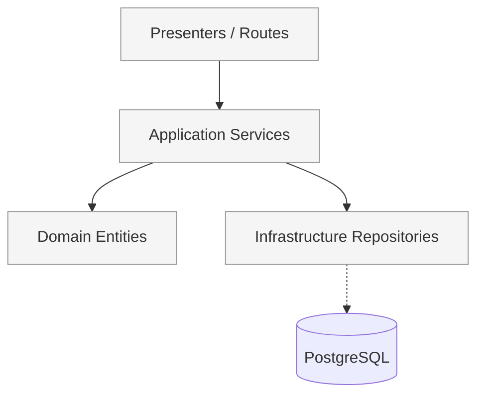

# FindEg.com — Stationery & School Supplies Marketplace

<<<<<<< HEAD
FindEg.com is a modern, trendy e-commerce web application specializing in stationary, kids' toys, and school supplies. Built with Next.js 16, Turborepo monorepo architecture, and clean architecture principles with a focus on great UI/UX.

## 🏗️ Monorepo Architecture

This project is structured as a **Turborepo monorepo** with three main folders:

- **`backend/`** - TypeScript library containing all business logic, database access, and shared utilities
- **`dashboard/`** - Next.js admin app for managing products, orders, and customers (port 3001)
- **`storefront/`** - Next.js customer-facing app for shopping and checkout (port 3000)

**Key Benefits:**

- Independent development and deployment of admin and storefront apps
- Shared business logic in backend package (single source of truth)
- Faster build times with Turborepo caching
- Better TypeScript performance with project references

## 🚀 Quick Start

### Prerequisites

- **Node.js** (v18 or higher)
- **pnpm** (v8 or higher) - Required for workspace management
- **Docker** (for database)

### Installation

1. **Clone the repository**

   ```bash
   git clone <repository-url>
   cd findeg.stationary
   ```

2. **Install pnpm (if not installed)**

   ```bash
   npm install -g pnpm@latest
   ```

3. **Install dependencies**

   ```bash
   pnpm install
   ```

4. **Set up the database**

   ```bash
   # Start PostgreSQL in Docker
   pnpm db:start

   # Push database schema
   pnpm db:push

   # (Optional) Seed with sample data
   pnpm db:seed
   ```

5. **Run the development servers**

   ```bash
   # Start all packages in dev mode
   pnpm dev

   # Or start individual packages:
   pnpm --filter @dashboard dev  # Admin at http://localhost:3001
   pnpm --filter @storefront dev # Shop at http://localhost:3000
   ```

### 📦 Monorepo Commands

| Command                         | Description                                 |
| ------------------------------- | ------------------------------------------- |
| `pnpm dev`                      | Start all packages in development mode      |
| `pnpm build`                    | Build all packages (with Turborepo caching) |
| `pnpm type-check`               | Run TypeScript checks across all packages   |
| `pnpm lint`                     | Run ESLint and i18n checks                  |
| `pnpm --filter <package> <cmd>` | Run command in specific package             |

### 🛡️ Architectural Boundary Validation

We enforce Clean Architecture by completely decoupling apps from the backend infrastructure. To validate that no boundaries are breached:

```bash
# Validate backend exports (Infrastructure should never act as a module entry point)
pnpm --filter @backend test src/__tests__/architectural-boundaries.test.ts

# Ensure apps successfully build without bundling Node.js modules
pnpm --filter @dashboard build
pnpm --filter @storefront build
```

**Examples:**

```bash
# Work on dashboard only
pnpm --filter @dashboard dev
pnpm --filter @dashboard build
pnpm --filter @dashboard test

# Work on storefront only
pnpm --filter @storefront dev
pnpm --filter @storefront build

# Build backend package
pnpm --filter @backend build
```

For detailed development workflows, see [specs/001-separate-admin-project/quickstart.md](specs/001-separate-admin-project/quickstart.md)

### 🧪 Test Accounts

The database comes pre-seeded with Several test accounts representing different roles in the system. The password for all test accounts is `password`.

| Actor / Role           | Email                   | Description                                                        |
| ---------------------- | ----------------------- | ------------------------------------------------------------------ |
| **System Admin (New)** | `admin@findeg.com`      | Use password `Admin1234!` for the new dashboard health cockpit.    |
| **System Admin**       | `superadmin@findeg.com` | Full, unrestricted access to all admin features and settings.      |
| **Catalog Manager**    | `editorial@findeg.com`  | Can manage products, categories, brands, and view analytics.       |
| **Inventory Manager**  | `inventory@findeg.com`  | Can manage stock levels, warehouses, and view orders.              |
| **Operations Manager** | `operations@findeg.com` | Broad access for managing orders, inventory, and viewing catalogs. |
| **Customer Support**   | `support@findeg.com`    | Can view orders, users, and assist with customer issues.           |
| **School Liaison**     | `liaison@findeg.com`    | Manages school supply lists and can browse products.               |
| **B2C Customer**       | `user@findeg.com`       | Standard storefront user with no admin access.                     |
=======
Welcome to the FindEg.com monorepo. This project is a modern, hierarchical marketplace platform designed to provide a premium experience for both B2C (Public Shop) and B2B (School Lists) customers.
>>>>>>> 006-docs-restructure

---

## 👔 Executive Summary

### Purpose

FindEg.com is structured as a **distributed monorepo** to enable rapid, independent development of its core business pillars: the storefront and the administration dashboard. By separating concerns while sharing a robust core, we maximize developer focus, reduce build times, and ensure cross-platform consistency.

### Key Goals & Current Matrix

- **Performance**: Optimized Next.js 16 build pipelines with Turborepo caching.
- **Scalability**: Clean Architecture ensures we can grow features without technical debt sprawl.
- **Accessibility**: A bilingual (EN/AR), RTL-first platform designed for the Egyptian market.

**MVP Status**:

- Backend: ~80% Complete (Clean Arch, ServiceResults)
- Dashboard: ~60% Complete (Products/Catalog Admin)
- Storefront: ~50% Complete (Browse/Cart UI)

### Stakeholder Overview

- **Product Owners**: High-level visibility into feature modules and business-critical flows.
- **Developers**: Hierarchical documentation for fast onboarding.
- **DevOps**: Independent deployment strategies for every package.

---

## 🏢 Business Overview

FindEg.com serves two primary audiences in the Egyptian market:

1. **Public Shop (B2C)**: A high-performance e-commerce experience for stationery, office supplies, and art materials. Incorporates advanced search, category browsing, multi-variant products, and a streamlined checkout.
2. **School Lists (B2B)**: A private, authorized lookup system where parents can access grade-specific supply lists via school-issued secure links or QR codes safely, with targeted one-click cart kits.

---

## 🛠️ Technology Stack & Architecture Overview

- **Framework**: [Next.js 16](https://nextjs.org/) (App Router, Server Actions, PPR).
- **Core Library**: React 19 / DOM.
- **ORMs**: [Drizzle ORM](https://orm.drizzle.team/) with PostgreSQL 16.
- **Styling**: Vanilla CSS + [Tailwind CSS 4](https://tailwindcss.com/) (Logical properties for RTL).
- **Validation**: [Zod](https://zod.dev/) for cross-boundary type safety.
- **i18n**: [next-intl](https://next-intl-docs.vercel.app/) for bilingual implementation.
- **Tooling**: [Turborepo](https://turbo.build/) + `pnpm 10` workspaces for monorepo orchestration.
- **Testing**: `vitest` for localized logic testing, `cypress` for overarching E2E testing.



---

## 📦 Monorepo Package Map & Integration

FindEg uses Turborepo to map specific packages into consuming applications without massive overhead. The backend is installed via `"@findeg/backend": "workspace:*"` inside the dependencies mapping.

```mermaid
graph TD
    subgraph "Consumer Apps (Next.js 16)"
        SF[packages/storefront<br/>(Port 3000)]
        DB[packages/dashboard<br/>(Port 3001)]
    end

    subgraph "Shared Libraries"
        BE[packages/backend<br/>(Core Logic/DB/Validation)]
        UI[packages/ui<br/>(shadcn components)]
    end

    SF --> BE
    SF --> UI
    DB --> BE
    DB --> UI
```

| Package                                         | Purpose                                                                      | Port | Scripts                                |
| ----------------------------------------------- | ---------------------------------------------------------------------------- | ---- | -------------------------------------- |
| [**storefront**](packages/storefront/README.md) | Customer-facing Next.js application.                                         | 3000 | `pnpm --filter @findeg/storefront dev` |
| [**dashboard**](packages/dashboard/README.md)   | Admin & Vendor management application.                                       | 3001 | `pnpm --filter @findeg/dashboard dev`  |
| [**backend**](packages/backend/README.md)       | Pure TypeScript shared kernel. Contains core Drizzle DB, services, entities. | N/A  | `tsc --build --watch`                  |
| [**ui**](packages/ui/README.md)                 | Shared design system & shadcn primitives.                                    | N/A  | N/A                                    |

---

## 🚀 Build, Docker & Deployment Strategy

### Build Lifecycle

The monorepo uses **Turborepo** (`turbo.json`) and `pnpm workspaces`.

- `pnpm build`: Rebuilds cacheable outputs (`dist/**`, `.next/**`) concurrently across all 4 packages using topological sort.
- `pnpm dev:both`: Parallelizes the Next.js servers to support unified development.
- `pnpm type-check`: Validates pure TypeScript bindings via strict configuration paths map in `packages/backend/package.json`'s exports field.

### Docker Configuration

Local persistence uses `docker-compose.yml` to orchestrate a PostgreSQL 16 Alpine container:

- **Image**: `postgres:16-alpine`
- **Volume**: Native volume storage to `/var/lib/postgresql/data` ensuring state lives across reboots.
- **Port Mapping**: `:5432:5432`

### Deployment & CI Validation

The CI Pipeline acts as a strict gateway:

1. `backend-validation.yml`: Builds backend, tests exports against dashboard and storefront to prevent API leakage, checks strictly for package version bumping using Node script introspection on `package.json`.
2. Vercel automatically deploys based on application boundaries.

---

## 🔧 Quick Start & Environment Setup

Ensure you have `Node.js 18+`, `pnpm 10`, and `Docker` installed.

1. **Setup Environment**:
   ```bash
   cp .env.example .env.local
   # Ensure POSTGRES_URL matches docker auth bindings
   ```
2. **Install Dependencies**:
   ```bash
   pnpm install
   ```
3. **Database Spinup (Docker)**:
   ```bash
   pnpm db:start
   pnpm db:setup
   # Runs init-db.sql, drizzle-kit push, and seed-db.js
   ```
4. **Development Mode**:
   ```bash
   pnpm dev
   ```

### Default Test Accounts

- **Admin**: `admin@findeg.com` / `password123`
- **Customer**: `customer@findeg.com` / `password123`

---

## 📐 Engineering Standards

### Coding Rules

- **No Direct Imports**: Frontend code MUST import from `@findeg/backend` and NEVER `../../packages/backend/src`.
- **RTL-First CSS**: Use Tailwind's logical properties (`ps-4`, `me-2`) instead of physical ones (`pl-4`, `mr-2`) so the system elegantly maps English/Arabic alignments.
- **ServiceResult Protocol**: All backend services do NOT throw standard JS errors; they return an `Err` or `Ok` standard `ServiceResult<T, FindEgError>`.

<<<<<<< HEAD
```tsx
import { useTranslations } from "next-intl";
import { T } from "@i18n/content";
=======
### Testing Pipeline
>>>>>>> 006-docs-restructure

- **Unit (Vitest)**: Every exported catalog service, checkout compute engine, and validation module is independently tested. Mocks are isolated.
- **E2E (Cypress)**: The monorepo uses `cypress` and `cypress run --browser chrome --headless` mapped recursively as `npm run e2e:run:ci`. Do not commit brittle selector targeting; use proper `data-cy` attributes.

---

## 🗺️ Master System Specs & Guide Book

FindEg uses a strict **3-tier documentation hierarchy** to capture deep technical constraints. This document serves as the root index. Navigate the system using the structured references below:

### 1. The Core Data & API Layer (Backend)

**[Tier 2: Backend Architecture & Standards](./packages/backend/README.md)**

- **System Schema**: [Drizzle Constraints, Migrations, & JSONB ER Diagram](./packages/backend/docs/database/SCHEMA.md)
- **Tier 3 Feature Domains (Node/Services)**:
  - [Catalog](./packages/backend/src/features/catalog/README.md) — Products, Arrays, Search execution.
  - [Identity](./packages/backend/src/features/identity/README.md) — JWTs, RBAC gating, Hashing constraints.
  - [Order](./packages/backend/src/features/order/README.md) — Transaction immutability, Snapshots.
  - [Cart](./packages/backend/src/features/cart/README.md) — Transient user selection and unit verification.
  - [School](./packages/backend/src/features/school/README.md) — B2B token access layers.
  - [Administration](./packages/backend/src/features/administration/README.md) — Auditing streams, Config state.
  - [Notifications](./packages/backend/src/features/notifications/README.md) — SES/SMTP interface boundaries.
  - [Media](./packages/backend/src/features/media/README.md) — Storage interfaces, upload protections.
  - [Review](./packages/backend/src/features/review/README.md) — UGC limits, Moderation bounds.
  - [Core](./packages/backend/src/features/core/README.md) — Zero-dependency Value Objects, `ServiceResult`.

### 2. The Customer Interaction Layer (Storefront)

**[Tier 2: Storefront RSC Cache Architecture](./packages/storefront/README.md)**

- **Tier 3 Feature Domains (Next.js)**:
  - [Catalog UI](./packages/storefront/src/features/catalog/README.md) — RSC Grids, Search Params syncing.
  - [Cart UI](./packages/storefront/src/features/cart/README.md) — `useOptimistic` Action bridges.
  - [Order UI](./packages/storefront/src/features/order/README.md) — Address Checkouts, Payment iframes.
  - [School UI](./packages/storefront/src/features/school/README.md) — Private token interception bounds.
  - [Review UI](./packages/storefront/src/features/review/README.md) — Revalidation limits via Server Actions.
  - [Notifications UI](./packages/storefront/src/features/notifications/README.md) — Ephemeral Toasts, Browser limits.

### 3. The Command Control Layer (Dashboard)

**[Tier 2: Dashboard UI State Architecture](./packages/dashboard/README.md)**

- **Tier 3 Feature Domains (Next.js)**:
  - [Catalog Admin](./packages/dashboard/src/features/catalog/README.md) — Massive hook-form Variant generation bounds.
  - [Administration Dashboard](./packages/dashboard/src/features/administration/README.md) — Shared Sidebar routing logic.

### 4. The Shared Visual Language (UI)

**[Tier 2: UI Shadcn Monorepo Base](./packages/ui/README.md)**
Contains Global RTL logical CSS mapping, unified utility functions, and foundational primitive rules applied to BOTH frontends.

---

## 📅 Roadmap & Status

- [x] Monorepo Infrastructure Migration & Typescript Typings
- [x] Application Base Models (Products, Brands, Taxonomy)
- [x] Admin Dashboard MVP (Product/Order management forms)
- [x] Documentation Restructuring (Deep System Guidebook complete)
- [ ] School List Private Access (Feature definition complete, integration pending)

---

&copy; 2026 FindEg.com. All rights reserved.
