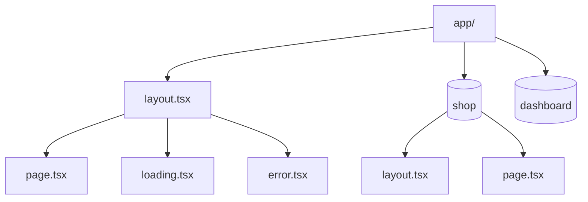
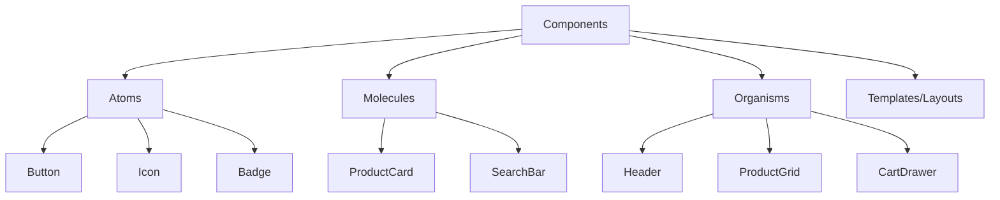
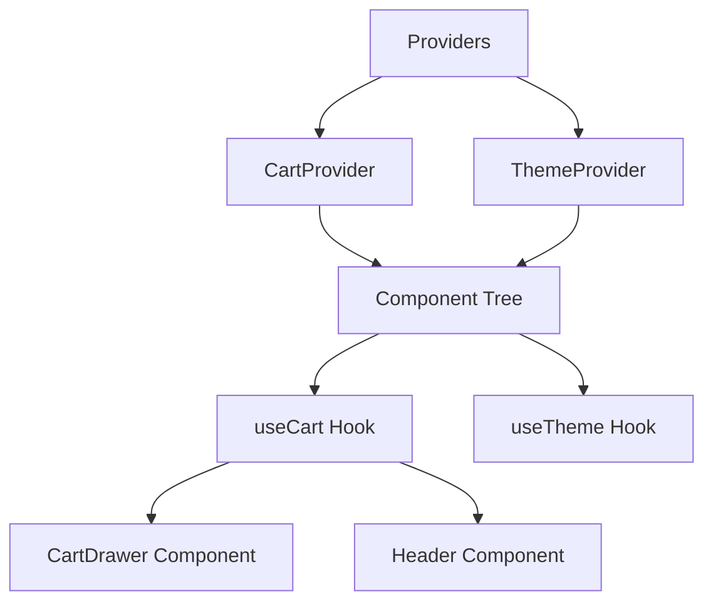
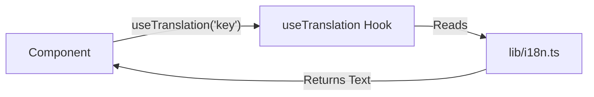

# FindEg.com - Modern E-commerce Platform

FindEg.com is a modern, trendy e-commerce web application specializing in stationary, kids' toys, and school supplies. This project serves as a comprehensive brand kit and a fully functional storefront, built with a focus on great UI/UX, reusability, and cutting-edge web technologies.

## 🚀 Getting Started

### Prerequisites
- Node.js (v18 or higher)
- npm or yarn

### Installation
1. Clone the repository
2. Install dependencies:
   ```bash
   npm install
   ```

### Running the Project
We have a custom script to handle port conflicts automatically. Always use:
```bash
npm run dev
```
*This script checks if port 3000 is in use, kills the process if necessary, and then starts the Next.js server.*

---

## 🏗️ Architecture & Design Patterns

We use a combination of **Next.js App Router**, **Atomic Design**, and the **Container/Presenter Pattern** to ensure scalability and maintainability.

### 1. Next.js App Router Structure
We use the modern App Router (`app/` directory) for routing, layouts, and data fetching.



- **`layout.tsx`**: Defines the shared UI for a segment (e.g., Header, Footer).
- **`page.tsx`**: The unique UI for a route.
- **`loading.tsx`**: Instant loading state (Suspense fallback).
- **`error.tsx`**: Error boundary for the segment.
- **`(groups)`**: Folders with parentheses (e.g., `(shop)`) are Route Groups. They organize files without affecting the URL path.

### 2. Atomic Design
We organize components based on their complexity. This helps in understanding the building blocks of the UI.



- **Atoms**: Basic building blocks (Buttons, Inputs, Icons). They have no dependencies.
- **Molecules**: Groups of atoms working together (Search Bar = Input + Button).
- **Organisms**: Complex sections of the interface (Header, Footer, Product Grid).
- **Templates/Layouts**: Page-level structures.

### 3. Container/Presenter Pattern
To separate logic from UI, we often split complex components into two parts within the same file.

**Why?**
- **Separation of Concerns**: Logic (state, effects) is separate from View (JSX, styles).
- **Reusability**: The UI component can be reused with different data.
- **Testing**: Easier to test logic and UI independently.

**Example (`Header.tsx`):**
```tsx
// 1. Presenter (UI Component)
// Receives data via props. No hooks or side effects.
export const HeaderUI = ({ cartCount, onToggleCart }) => {
  return (
    <header>
      <Logo />
      <button onClick={onToggleCart}>Cart ({cartCount})</button>
    </header>
  );
};

// 2. Container (Logic Component)
// Handles state, hooks, and data fetching.
export const Header = () => {
  const { cartCount, toggleCart } = useCart(); // Custom Hook
  
  return <HeaderUI cartCount={cartCount} onToggleCart={toggleCart} />;
};
```

---

## 📂 Project Structure

```
/
├── app/                  # Next.js App Router (Routes & Pages)
│   ├── (shop)/           # Shop-related routes (grouped)
│   ├── (dashboard)/      # Dashboard routes (grouped)
│   ├── layout.tsx        # Root layout
│   └── globals.css       # Global styles & Tailwind directives
├── components/           # Reusable UI components
│   ├── atoms/            # Smallest units (Button, Icon)
│   ├── molecules/        # Groups of atoms (ProductCard)
│   ├── organisms/        # Complex sections (Header, Footer)
│   └── ui/               # Headless UI primitives (shadcn-like)
├── hooks/                # Custom React Hooks (Logic reuse)
├── lib/                  # Utilities, Constants, Helpers
├── types/                # TypeScript definitions
└── views/                # Page-specific content (keeps app/ clean)
```

**Note on `views/` directory:**
We use a `views/` directory to store the actual page content. The `app/page.tsx` files simply import and render these views. This keeps the routing layer (`app/`) clean and separates it from the page implementation.

---

## 🔄 Data Flow

We use **React Context** for global state management to avoid prop drilling.



- **Providers**: Wrap the application in `app/layout.tsx`.
- **Hooks**: Custom hooks (`useCart`, `useTheme`) consume these contexts.
- **Components**: Use hooks to access and modify global state.

---

## 🎨 Styling & Theming

- **Tailwind CSS**: Utility-first CSS framework.
- **CSS Variables**: Used for theming (Light/Dark mode). Defined in `app/globals.css`.
- **`cn` Utility**: A helper function in `lib/utils.ts` to merge Tailwind classes conditionally.

**Example Usage:**
```tsx
<div className={cn(
  "bg-primary text-white", 
  isActive && "font-bold"
)}>
```

---

## 🛠️ Key Features Implementation

### Internationalization (i18n)
- We use a custom hook `useTranslation` (`hooks/useTranslation.ts`).
- Translations are stored in `lib/i18n.ts`.
- Supports English (`en`) and Arabic (`ar`) with RTL support.

### AI Image Generation
- Located in `components/organisms/ImageGenerator.tsx`.
- Uses a mock implementation for now (simulating API calls).

---

## 🌍 Content Management & Internationalization

We separate **Static Content** (text, labels) and **Configuration Data** (menus, product lists) from the component logic. This makes the app scalable and easy to translate.

### 1. Text & Translations (`lib/i18n.ts`)
All user-facing text is stored here.



**Benefits:**
- **Scalability**: Adding a new language (e.g., French) only requires adding a new key in `i18n.ts`. No component code changes needed.
- **Maintainability**: Copywriters can edit text in one file without touching code.

### 2. Data & Configuration (`lib/constants.ts`)
Structured data like navigation menus, mock products, and FAQ items live here.

**Pattern:**
1.  **Define Structure**: `lib/constants.ts` defines the data shape (e.g., `labelKey` for a menu item).
2.  **Define Text**: `lib/i18n.ts` defines the actual text for that key.
3.  **Render**: Components iterate over the data and use the key to fetch the text.

**Example:**
```tsx
// lib/constants.ts
export const navItems = [{ labelKey: 'nav_home', href: '/' }];

// lib/i18n.ts
export const translations = { en: { nav_home: 'Home' } };

// Component
navItems.map(item => <Link>{t(item.labelKey)}</Link>)
```

---

## 📝 Contribution Workflow

1.  **Atomic Design**: Place new components in the correct folder (`atoms`, `molecules`, etc.).
2.  **Types**: Define interfaces in `types/` or co-located with the component.
3.  **Constants**: Use `lib/constants.ts` for mock data.
4.  **Hooks**: Extract reusable logic into `hooks/`.

---

## ❓ FAQ for New Developers

**Q: I'm lost in the `app` directory. Where is the code?**
A: Check the `views/` directory. We import page content from there to keep `app/` focused on routing.

**Q: How do I change the colors?**
A: Edit the CSS variables in `app/globals.css` or the Tailwind config in `tailwind.config.ts`.

**Q: Why `npm run dev`?**
A: It runs a custom script (`scripts/dev.js`) that ensures port 3000 is free before starting the server.