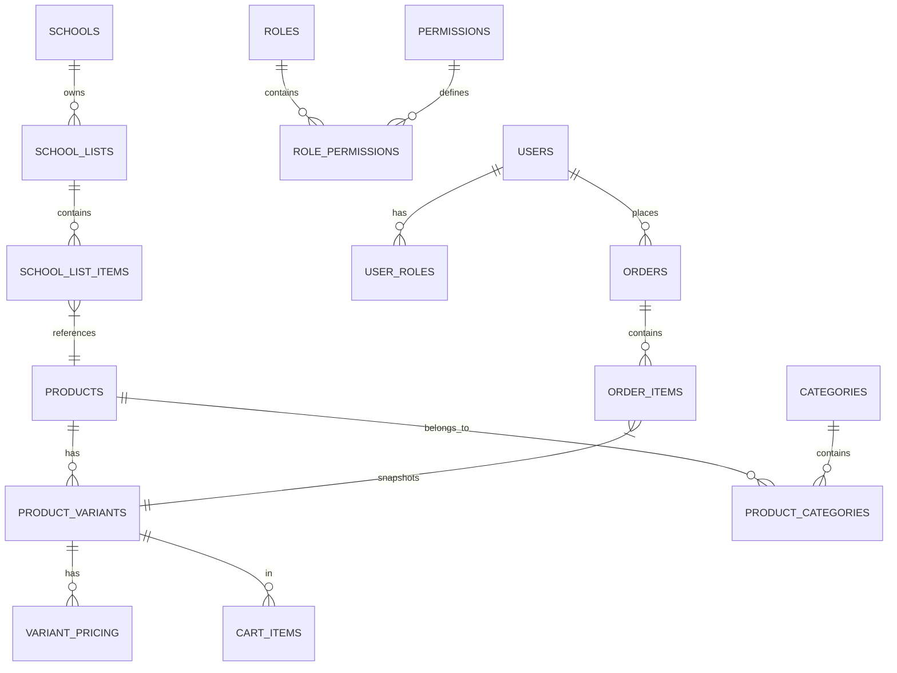

# FindEg Database Schema Reference

This document serves as the central reference for the FindEg marketplace data model. All schemas are strictly typed and managed via **Drizzle ORM** (scattered across feature modules in the backend) executing into PostgreSQL 16.

---

## 🗺️ Global ER Diagram



---

## 📦 Feature-Specific Tables & Complex Types

### 1. Catalog

- `products`: Base product metadata. **Important**: Uses `jsonb` fields for LocalizedStrings (`{ en: string, ar: string }`).
- `product_variants`: SKU-level entities.
- `categories`, `brands`, `tags`: Taxonomy nodes.
- `variant_pricing`: Physical price overrides based on `CustomerGroup`.

### 2. Identity

- `users`: Core profile data (`portalRole`, email).
- `password_credentials`: Separated hashes (Argon2 output).
- `roles`, `permissions`, `user_roles`: RBAC matrix.

### 3. Orders & Cart

- `orders`: Transaction headers.
- `order_items`: Line items strictly holding `jsonb` snapshots of variant pricing to protect against catalog updates.
- `carts`, `cart_items`: Ephemeral user basket headers.

### 4. School

- `schools`, `school_lists`: Grade-scoped academic lists.
- `school_access_tokens`: Secure temporary entrance links mapped to sessions.

---

## 🛠️ Management & Migrations

- **Location**: Scattered intentionally across `packages/backend/src/features/*/infrastructure/persistence/schema.ts`
- **Engine**: PostgreSQL 16.
- **ORM**: Drizzle.

### Essential Commands

```bash
pnpm db:generate   # Safely diff and generate migration SQL inside backend/drizzle
pnpm db:apply      # Apply migrations to target mapped environment
pnpm db:studio     # Open Drizzle introspection UI
```

> [!CAUTION]
> Never bypass Drizzle. All localized columns MUST use the `domain/value-objects` mapping tools to prevent null hydration failures on the backend router.

---

&copy; 2026 FindEg.com
