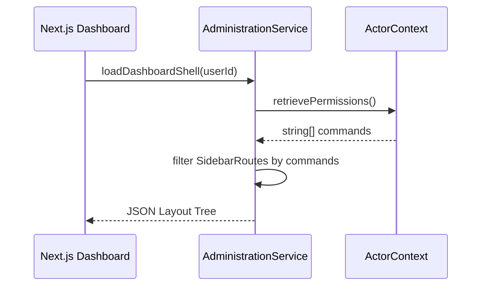

# Administration Feature

The **Administration Feature** is the command-and-control backing layer for dashboard operations. It handles staff assignment matrices, strict operational auditing, and global configuration flags.

## 🎯 Core Responsibilities

- **Staff Hydration**: Mapping identity user profiles to contextual Dashboard administrative bounds.
- **Audit Persistence**: Strictly capturing `AdminAction` events (Who, What, When) for highly sensitive DB mutations (e.g. changing variant pricing).
- **Navigation Orchestration**: Generating dynamic JSON-based sidebars dependent on RBAC permissions to guarantee staff only see accessible routes.

---

## 🏗️ Domain Entities Map

| Entity               | System Role                                                                           |
| -------------------- | ------------------------------------------------------------------------------------- |
| `AuditLog.ts`        | An immutable JSONB capture of state alterations keyed to a specific actor context.    |
| `StaffAssignment.ts` | The intersection mapping a `User` to an administrative `Role`.                        |
| `DashboardShell.ts`  | The purely generated structural tree powering `storefront/dashboard` sidebar layouts. |

---

## 🔄 Staff Session Resolution

---

## 🔐 Boundaries & Mutation Logging

- **Identity Dependency**: The `administration` layer deeply requires the `identity` module to provide the authenticated `ActorContext` (ID and Scope) before ANY action executes.
- **The Audit Rule**: NEVER perform a DB `commit()` modifying Product, Order, or Staff entities without appending a synchronous `.createAuditLog()` transaction.

---

&copy; 2026 FindEg.com
