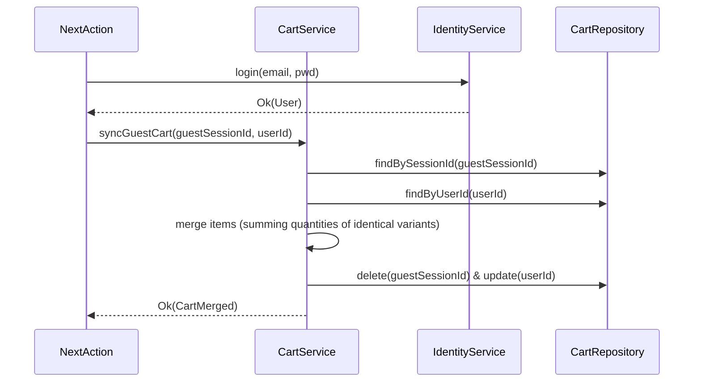

# Cart Feature

The **Cart Feature** manages the transient, ephemeral state of user selections before finalizing into an order. It heavily supports real-time multi-unit math and session-based guest transitions.

## 🎯 Core Responsibilities

- **Ephemeral Sessions**: Storing carts against a User ID OR an anonymous Session ID via cookies.
- **Cart Syncing**: Safely merging anonymous carts into logged-in profiles upon authentication without losing items.
- **Variant Math**: Validating `unitOfMeasure` constraints (e.g. enforcing increments of 12 for dozen-packs).

---

## 🏗️ Domain Entities Map

| Entity        | System Role                                                                                |
| ------------- | ------------------------------------------------------------------------------------------ |
| `Cart.ts`     | The aggregate root tying the items to a session or user.                                   |
| `CartItem.ts` | An individual item representing a _reference_ to a catalog variant and a dynamic quantity. |

---

## 🔄 Merging Guest Carts (Auth Handshake)

---

## 🔐 Boundaries & Validation Rules

- **Price Volatility**: The Cart NEVER stores total monetary values natively in the DB. `CartItem.appliedPrice` is calculated dynamically against the Catalog to ensure user sees the _live_ price when clicking Checkout.
- **Dependency Map**: Depends deeply on `catalog` for live pricing execution.

---

&copy; 2026 FindEg.com
