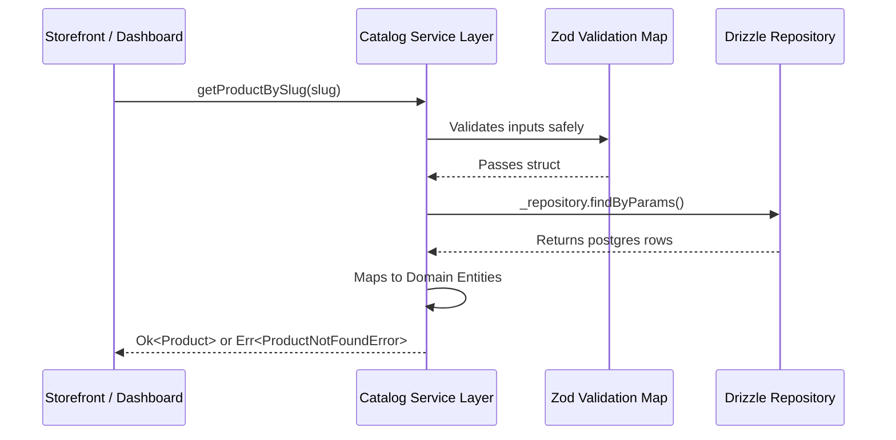

# Catalog Feature

The **Catalog Feature** is the core operational heart of the FindEg backend. It manages the strict lifecycles of products, categories, hierarchical collections, tags, and **School Lists**.

## 🎯 Responsibilities & True Capabilities

- **Product Information Management (PIM)**: Handling variants, brand assignment, and tagging.
- **Nested Taxonomy**: Constructing deep category trees and dynamic collections.
- **B2B School List Infrastructure**: The logic mapping physical `Product` elements into `SchoolList` aggregates.
- **Search & Caching Computations**: Dedicated `SearchService` orchestrating filtering logic and emitting cache invalidation rules.

---

## 🏗️ Domain Model Map

Based on explicit extraction from `src/features/catalog/domain/entities`:

| Entity                   | Core Responsibility                                                              |
| ------------------------ | -------------------------------------------------------------------------------- |
| `Product.ts`             | The root item. Handles name, localization, and relations.                        |
| `Variant.ts`             | The specific Sku. Handles variant matrix (e.g. Color: Red) and weight factors.   |
| `SchoolList.ts`          | The B2B bundle entity assigning products exclusively to specific grades/schools. |
| `Brand.ts`               | Top-level manufacturer data.                                                     |
| `Category.ts`            | Organizational tree nodes.                                                       |
| `Collection.ts`          | Marketing-driven groupings (e.g. "Back to School Sale").                         |
| `Tag.ts`                 | Granular taxonomy (`#notebooks`, `#ruler`).                                      |
| `AttributeDefinition.ts` | Dynamic descriptors controlling JSONB matrices.                                  |

---

## 🚀 Application Services Layer

The layer strictly orchestrated via `ServiceResult<T, CatalogError>`. Exported to Next.js routes.

- `ProductService`: Operations surrounding single-items and mutations.
- `SearchService` (12KB): Complex orchestrator managing the primary B2C listing view `findMany()` operations with fuzzy-matching limits.
- `SchoolListService`: Aggregation tools linking products dynamically to B2B tokens.
- `InventoryService`: Safe compute logic for reserving products BEFORE committing checkout.
- `CategoryService`, `TagService`, `VariantService`, `CollectionService`.

---

## 🔄 Core Execution Pipeline

All interactions follow this extremely strict boundary flow:

---

## 🔐 Boundaries & Constraints

- **Absolute Isolation**: Catalog depends only on `@findeg/backend/features/core`. It must NEVER import `cart`, `order`, or `payment` modules to avoid strict circular dependency failures in Turborepo.
- **Immutable Updates**: Drizzle mutations map JSONB fields via immutable object spread updates inside repository adapters.
- **Export Control**: Storefronts NEVER import `domain/entities` or `infrastructure/persistence`. Everything goes through `index.ts`.

---

&copy; 2026 FindEg.com
