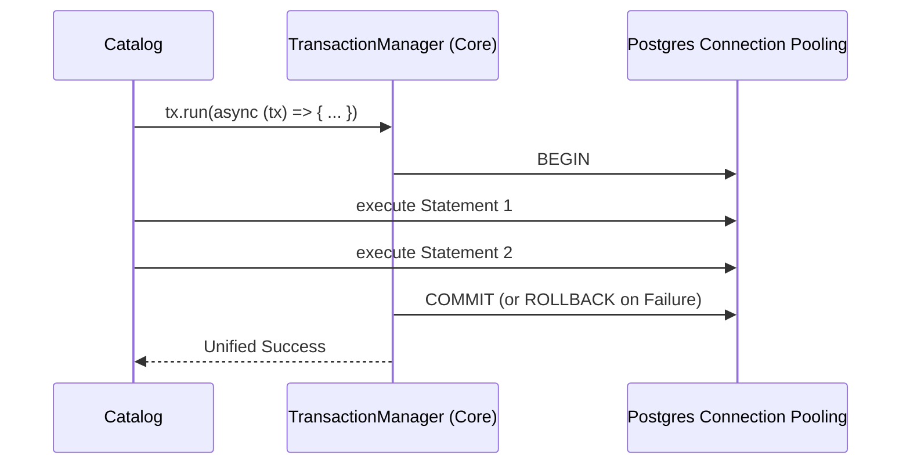

# Core Feature (Shared Kernel)

The **Core Feature** is the untouchable shared boundary of the FindEg monorepo. Every other functional domain (Catalog, Order, Identity) structurally loops dependencies back into `core`.

## 🎯 Core Utility Domains

- **Value Objects**: Pure TS logic defining the physics of the system (e.g. `Money` multiplication, `LocalizedString` fallback lookups).
- **Control Flow Patterns**: Providing the strict `ServiceResult<T, E>` pattern ensuring no controller ever uses `try/catch` natively for expected errors.
- **Drizzle Hub**: Initiating the master Drizzle ORM registry shared memory connection securely.

---

## 🏗️ Foundation Map

| Entity/Object        | System Role                                                                               |
| -------------------- | ----------------------------------------------------------------------------------------- |
| `Money.ts`           | Protects fractional arithmetic failures globally. Enforces strictly EGP.                  |
| `LocalizedString.ts` | Resolves deeply nested JSON JSONB text pairs checking `en` vs `ar` fallback availability. |
| `ServiceResult.ts`   | Railway Oriented Programming tuple generator returning `[Error, null]` or `[null, Data]`. |
| `DrizzleSession.ts`  | Pure `postgres://` connection string pool configuration.                                  |

---

## 🔄 Infrastructure Transaction Orchestration

When an application layer edits multiple tables (like committing an order AND lowering product stock), it utilizes the `runInTransaction` core helper.

---

## 🔐 Boundaries & Purity Rules

- **Universal Dependency**: All modules can rely heavily on `core`.
- **Absolute Purity**: `core` MUST NOT depend on ANY other sibling package. Doing so will violently trigger a physical Circular Dependency break in the Turborepo graph logic.
- **Node Environment**: Code must compile and execute in highly restrictive Vercel Edge networks OR standard Node 18, so filesystem commands (`fs`) are STRICTLY prohibited inside `domain` or `application`.

---

&copy; 2026 FindEg.com
