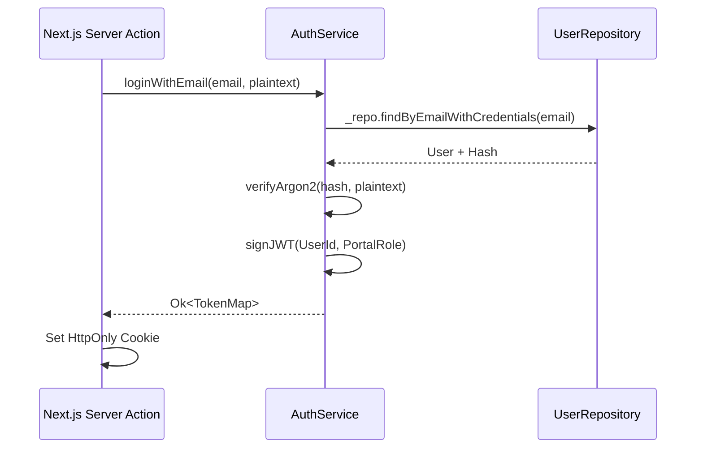

# Identity Feature

The **Identity Feature** oversees the central authentication and authorization mechanics across the FindEg monorepo. It strictly manages `User` context, security credentials, and token-based RBAC enforcement for Next.js applications boundaries.

## 🎯 Core Responsibilities

- **Secured Handshakes**: Cryptographically signing and issuing JWTs across `storefront` and `dashboard`.
- **Portal Separation**: Resolving `customer` vs `staff` logic immediately upon authentication to prevent lateral privilege escalation.
- **RBAC Orchestration**: Extracting fine-grained Permissions via joined `Role` tables.
- **Stateless Guards**: Providing middleware-ready token verifiers for Next.js.

---

## 🏗️ Domain Entities Map

| Entity                      | System Role                                                                         |
| --------------------------- | ----------------------------------------------------------------------------------- |
| `User.ts`                   | The core profile. Contains standard PII (Email, Name) and the `PortalRole` gateway. |
| `PasswordCredentials.ts`    | Decoupled Argon2 hash storage. NEVER serialized out to Next.js.                     |
| `Role.ts` / `Permission.ts` | The RBAC matrix controlling staff administrative endpoints.                         |
| `Address.ts`                | Physical locations attached to user profiles.                                       |

---

## 🔐 Security Principles & Token Exchange

1. **Decoupled Credentials**: The `User` object passed to the presentation layer (`Next.js`) **never** includes the database `PasswordCredential` or MFA seeds.
2. **Stateless JWTs**: Next.js Server Actions manage cookies holding `JWTs`. The `@findeg/backend/features/identity` module exports a strictly typed `verifySession()` service to decode this securely before allowing Server Component renders.
3. **Guard Layers**:
   - `PortalRole` (e.g., `staff`): Checked immediately at the `src/app/[locale]/admin` Next.js Middleware layer.
   - `Permissions` (e.g., `catalog.write`): Checked individually inside `ServiceResult` pipelines before performing a DB mutation.

---

## 🔄 Login Execution Pipeline

---

## 🛠️ Infrastructure Implementation

- **JWT Engine**: Implements `jose` to support the Next.js Edge runtime (which lacks `crypto` APIs natively required by `jsonwebtoken`).
- **Hashing Engine**: Uses `bcryptjs` or `argon2`.

---

&copy; 2026 FindEg.com
