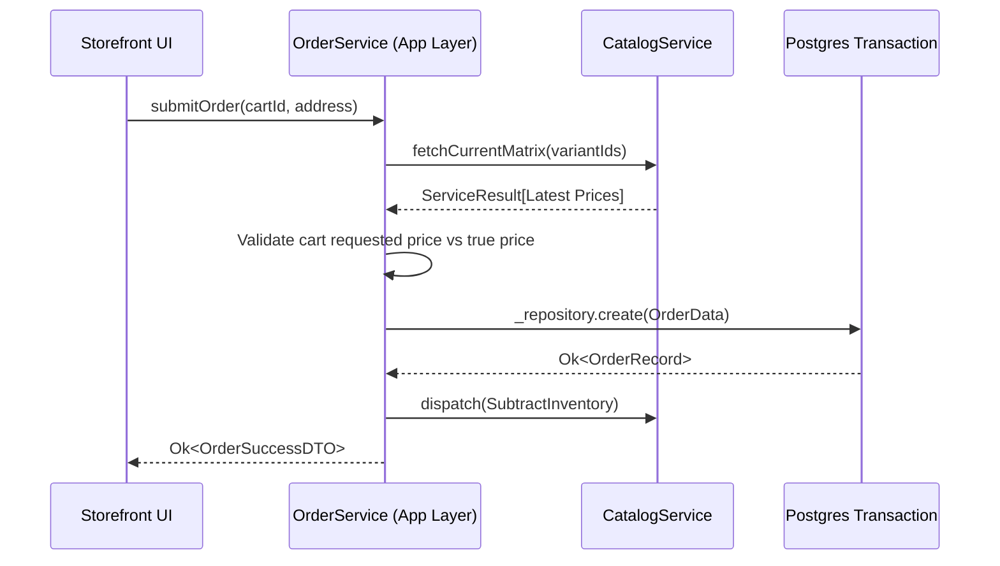

# Order Feature

The **Order Feature** handles the critical path of transforming shopping carts into transactional, immutable historical records. It orchestrates checkout validation, fulfillment tracking, and pricing snapshots.

## 🎯 Core Responsibilities

- **Immutable Snapshots**: Freezing prices and metadata at checkout so downstream catalog edits do not corrupt historical financial ledgers.
- **State Machine Engine**: Enforcing linear transition flows (`Pending` -> `Paid` -> `Processing` -> `Shipped`).
- **Inventory Locking**: Triggering inventory hooks upon order commitment.
- **Transaction Ledger**: Preparing aggregates for payment processing layers.

---

## 🏗️ Domain Entities Map

| Entity         | System Role                                                                                       |
| -------------- | ------------------------------------------------------------------------------------------------- |
| `Order.ts`     | The aggregate root. Holds current state, total compute cache, and relational mapping to the user. |
| `OrderItem.ts` | A strict JSONB-backed array containing the exact payload consumed by the user during purchase.    |

---

## 🔄 Complete Checkout Orchestration Pipeline

---

## 🔐 Boundaries & Validation Rules

- **Snapshot Anti-Corruption**: NEVER reference `CatalogService.getProduct()` when rendering a historical order receipt in the Dashboard. The DB row for `OrderItem` contains the physical JSON values stored precisely when the transaction fired.
- **Database Transactions**: Order creation utilizes Drizzle nested transactions. If inventory allocation fails, the entire order ledger is rolled back to prevent hanging fulfillment errors.
- **Cross-Domain Limits**: Depends on `catalog` for inventory validation, and `identity` for user attribution.

---

&copy; 2026 FindEg.com
