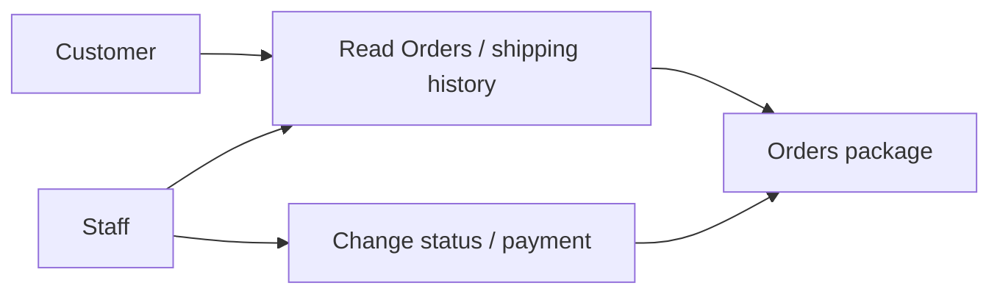
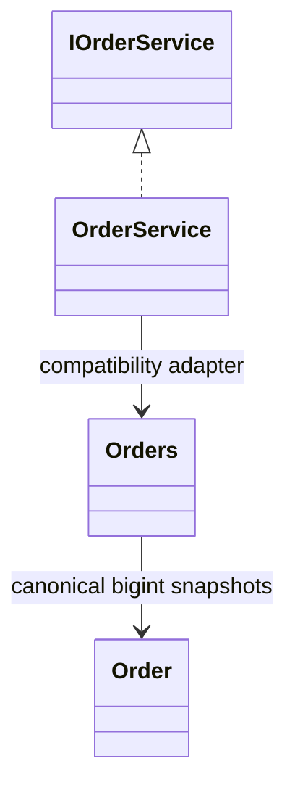
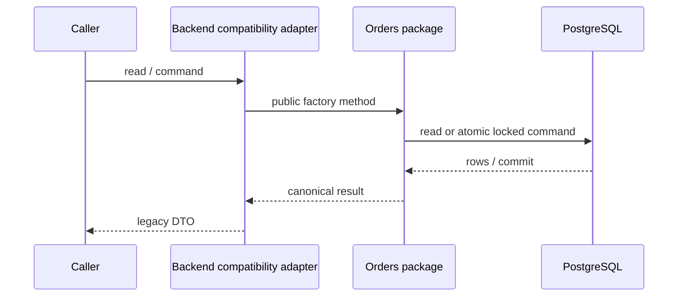

# Order compatibility entry

The canonical server implementation is `@findeg/orders`. Its factory owns Order reads, exact bigint snapshots and atomic Staff-gated lifecycle changes. Checkout Acceptance and Quote pricing remain in Backend Checkout.

This directory temporarily adapts existing consumers to the package with numeric legacy DTOs and `createOrderServices`. Dashboard moves to the package in #367; #368 removes this directory’s adapters and remaining legacy types. New callers must use `@findeg/orders`, `@findeg/orders/schemas` or `@findeg/orders/events`.

```mermaid
flowchart LR
  Customer --> Read[Read Orders / shipping history]
  Staff --> Read
  Staff --> Change[Change status / payment]
  Read --> Orders[Orders package]
  Change --> Orders
```

```mermaid
classDiagram
  IOrderService <|.. OrderService
  OrderService --> Orders : compatibility adapter
  Orders --> Order : canonical bigint snapshots
```

```mermaid
sequenceDiagram
  participant Caller
  participant Adapter as Backend compatibility adapter
  participant Orders as Orders package
  participant DB as PostgreSQL
  Caller->>Adapter: read / command
  Adapter->>Orders: public factory method
  Orders->>DB: read or atomic locked command
  DB-->>Orders: rows / commit
  Orders-->>Adapter: canonical result
  Adapter-->>Caller: legacy DTO
```

The remaining domain entities and interfaces describe the legacy consumer contract. The application adapter calls the public package and projects bigint money to numeric DTOs; it owns no database queries or lifecycle rules. The package handles persistence, mapping, authorization and transactions. Client schemas use the pure package entry; Checkout and notification delivery retain their own boundaries.
