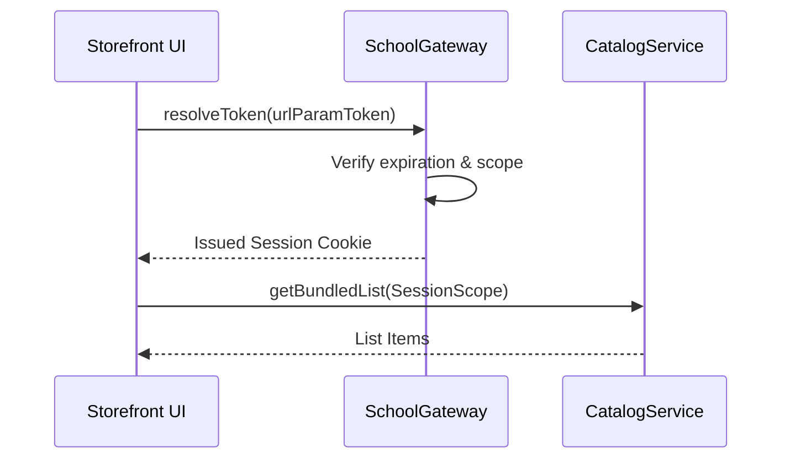

# School Feature

The **School Feature** manages the highly governed B2B segment of FindEg. It orchestrates secure Access Tokens linking physical users to curated supply lists mapped directly from the Catalog.

## 🎯 Core Responsibilities

- **Secured Tokens**: Minting ephemeral or persistent `SchoolAccessToken` strings distributed via QR logic or URLs.
- **List Governance**: Controlling term (season) logic, preventing stale school packs from being purchased out-of-date.
- **Dependency Aggregation**: Merging `Product` entities dynamically against grade constraints.

---

## 🏗️ Domain Entities Map

| Entity                 | System Role                                                                                           |
| ---------------------- | ----------------------------------------------------------------------------------------------------- |
| `School.ts`            | The core client institution profile branding.                                                         |
| `SchoolList.ts`        | The constrained physical aggregate (e.g. "Grade 1 - 2025 Bundle") tied to physical `CatalogVariants`. |
| `SchoolAccessToken.ts` | Time-bound JWT-like string gating storefront access dynamically.                                      |

---

## 🔄 Gateway Verification Logic

---

## 🔐 Boundaries & Validation Rules

- **Access Guard**: Attempting to view a `SchoolList` without an injected, verified HTTP token cookie will instantly yield an `UnauthorizedError`.
- **Identity Fusion**: When a guest successfully completes a school list purchase, the guest token identity MUST seamlessly merge into a standard User Profile if they register sequentially.

---

&copy; 2026 FindEg.com
