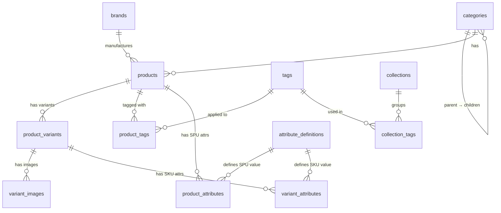

# Catalog Schema (`catalog.*`)

> The product catalog is the commercial heart of Findeg. It answers: **"What do we sell, how is it organized, and what does it cost?"**

## Architecture Overview

The catalog follows an **SPU / SKU** (Standard Product Unit / Stock Keeping Unit) architecture:

- **SPU (Product)** — The *conceptual* item a customer thinks about (e.g., "Pilot G2 Pen").
- **SKU (Product Variant)** — The *purchasable* unit with a specific price, barcode, and inventory count (e.g., "Pilot G2 Pen — Blue 0.7mm").

This separation allows a single product page to display multiple purchasable options (colors, sizes, pack quantities) while keeping pricing, inventory, and images isolated per variant.

---

## Entity-Relationship Diagram



---

## Tables

### 1. `catalog.categories`

**Purpose:** Organizes products into a navigable tree (e.g., *Writing → Pens → Gel Pens*). Powers the storefront sidebar, breadcrumbs, and SEO category pages.

**Source:** [categories.ts](./categories.ts)

| Column | Type | Business Reason |
|---|---|---|
| `id` | `serial PK` | Internal row identifier. |
| `slug` | `text UNIQUE` | URL-safe handle for SEO-friendly routes (`/category/gel-pens`). |
| `localized_name` | `jsonb` | `{ en, ar }` — Bilingual category name for the Egyptian market. |
| `localized_description` | `jsonb` | `{ en, ar }` — Optional description for category landing pages and meta tags. |
| `parent_id` | `integer` | Self-referencing FK. `NULL` = root category. Enables unlimited nesting. |
| `icon` | `text` | Icon identifier for sidebar/navigation rendering. |
| `path` | `text` | **Materialized path** (e.g., `"/1/3/7"`). Enables efficient "get all descendants" queries without recursive CTEs — critical for filtering products by parent category. |
| `depth` | `integer` | Pre-computed nesting level. `0` = root. Avoids computing depth from `path` at query time. |
| `sort_order` | `integer` | Display order among siblings. Lower = shown first. |
| `is_active` | `boolean` | Soft-visibility toggle. Inactive categories are hidden from the storefront but preserved for admin history. |
| `created_at` | `timestamp` | Record creation time. |
| `updated_at` | `timestamp` | Last modification time. |

**Key Design Decision — Materialized Path:** Instead of using adjacency-list-only (`parent_id`) or nested sets, we store a path string. This makes "find all products under *Writing*" a simple `WHERE path LIKE '/1/%'` query, which is fast and index-friendly.

---

### 2. `catalog.brands`

**Purpose:** Tracks manufacturers/brands (e.g., *Faber-Castell*, *Pilot*, *Staedtler*). Used for brand filtering on the storefront and brand landing pages.

**Source:** [brands.ts](./brands.ts)

| Column | Type | Business Reason |
|---|---|---|
| `id` | `serial PK` | Internal row identifier. |
| `slug` | `text UNIQUE` | URL-safe handle for brand pages (`/brand/faber-castell`). |
| `name` | `text` | Canonical (English) brand name used internally and for search indexing. |
| `localized_name` | `jsonb` | `{ en?, ar? }` — Optional bilingual override for display purposes. |
| `localized_description` | `jsonb` | `{ en?, ar? }` — Brand story text for the brand landing page. |
| `logo_url` | `text` | URL to the brand's logo image. |
| `is_active` | `boolean` | Soft-visibility toggle. |
| `created_at` / `updated_at` | `timestamp` | Audit timestamps. |

---

### 3. `catalog.products` (SPU)

**Purpose:** The conceptual product — what a customer *searches for*. Contains brand, category, localized content, and marketing flags. **Does not contain pricing or inventory** — those live on variants.

**Source:** [products.ts](./products.ts)

| Column | Type | Business Reason |
|---|---|---|
| `id` | `serial PK` | Internal row identifier. |
| `slug` | `text UNIQUE` | URL-safe handle for the product detail page (`/product/pilot-g2-pen`). |
| `localized_name` | `jsonb` | `{ en, ar }` — Bilingual product title. Required. |
| `localized_description` | `jsonb` | `{ en, ar }` — Short description for product cards and search results. |
| `localized_long_description` | `jsonb` | `{ en, ar }` — Rich description for the product detail page. |
| `category_id` | `integer FK` | Primary navigation category. `ON DELETE SET NULL` — if a category is removed, the product becomes uncategorized rather than deleted. |
| `brand_id` | `integer FK` | Manufacturer. `ON DELETE SET NULL` — same rationale as category. |
| `media_set` | `jsonb` | SPU-level hero/lifestyle imagery with responsive variants (`thumbnail`, `card`, `pdp`, `zoom`, `original`). Used on the product listing page before a specific variant is selected. |
| `is_active` | `boolean` | Master visibility toggle. When `false`, the entire product (all variants) is hidden from the storefront. |
| `rating` | `decimal(3,2)` | **Denormalized** average rating (e.g., `4.75`). Pre-computed from reviews to avoid expensive aggregation on every product list query. |
| `reviews_count` | `integer` | **Denormalized** review count. Same rationale as `rating`. |
| `created_at` / `updated_at` | `timestamp` | Audit timestamps. |

**Key Design Decision — SPU vs SKU Split:** Pricing and images are intentionally absent from this table. A "Pilot G2 Pen" can have 12 variant SKUs (3 colors × 4 tip sizes), each with different prices and images. Putting pricing here would create data anomalies.

---

### 4. `catalog.product_variants` (SKU)

**Purpose:** The actual purchasable unit. Each row has its own SKU, price, barcode, and weight. This is what goes into a shopping cart and gets tracked in inventory.

**Source:** [product-variants.ts](./product-variants.ts)

| Column | Type | Business Reason |
|---|---|---|
| `id` | `serial PK` | Internal row identifier. |
| `product_id` | `integer FK` | Parent SPU. `ON DELETE CASCADE` — deleting a product removes all its variants. |
| `sku` | `text UNIQUE` | **Store-facing SKU** — the code printed on warehouse labels and shown on invoices (e.g., `PEN-BLUE-07`). |
| `variant_key` | `text` | Deterministic key built from variant-defining attributes (e.g., `"blue-0.7"`). Used to look up a variant when a customer selects options on the PDP. Unique within a product via composite index. |
| `localized_label` | `jsonb` | `{ en?, ar? }` — Display label for the variant selector (e.g., `"Blue 0.7mm"` / `"أزرق ٠.٧مم"`). |
| `display_order` | `integer` | Sort position in the variant picker UI. |
| `is_active` | `boolean` | Per-variant visibility. Allows soft-deleting a single color/size without affecting the rest. |
| `base_price` | `decimal(12,2)` | **B2C sticker price** per EA (each). The price shown to walk-in customers. |
| `strike_price` | `decimal(12,2)` | Was-price for "sale" display. If set, the storefront shows a crossed-out price next to the current `base_price`. |
| `cost_price` | `decimal(12,2)` | Internal cost — never shown to customers. Used for margin calculations in the admin dashboard. |
| `weight_grams` | `integer` | Physical weight for shipping cost calculation. |
| `barcode` | `text` | EAN/UPC barcode for POS scanning and warehouse operations. |
| `low_stock_threshold` | `integer` | When inventory drops below this number, the system triggers a low-stock warning in the admin dashboard. Default: `10`. |
| `created_at` / `updated_at` | `timestamp` | Audit timestamps. |

**Indexes:**
- `uq_variant_product_key` — Ensures no two variants of the same product share a `variant_key`.
- `idx_variant_product` — Fast "get all variants for product X" lookup.
- `idx_variant_sku` — Fast SKU search for warehouse/POS.

**Simple Products:** Products without meaningful variation (e.g., a notebook) still get **one** variant row with `variant_key = "default"`. This keeps the data model uniform — carts, orders, and inventory always reference a variant ID, never a product ID directly.

---

### 5. `catalog.variant_images`

**Purpose:** Image gallery for each variant. Different colors of the same pen need different photos.

**Source:** [product-variants.ts](./product-variants.ts)

| Column | Type | Business Reason |
|---|---|---|
| `id` | `serial PK` | Internal row identifier. |
| `variant_id` | `integer FK` | Which variant this image belongs to. `ON DELETE CASCADE`. |
| `url` | `text` | CDN URL of the image. |
| `alt` | `text` | Alt text for accessibility and SEO. |
| `display_order` | `integer` | Image carousel sort order. First image (`0`) is the hero image. |
| `created_at` | `timestamp` | Upload timestamp. |

---

### 6. `catalog.attribute_definitions`

**Purpose:** The **global dictionary** of all possible product attributes (e.g., "Ink Color", "Tip Size", "Paper Weight"). Defined once, reused across all products. Powers the filter sidebar on the storefront.

**Source:** [product-attributes.ts](./product-attributes.ts)

| Column | Type | Business Reason |
|---|---|---|
| `id` | `serial PK` | Internal row identifier. |
| `key` | `text UNIQUE` | Machine-readable key (e.g., `"ink-color"`). Used in code and URL query params (`?ink-color=blue`). |
| `data_type` | `text` | Value type: `'text'`, `'color'`, `'number'`. Tells the UI which filter widget to render (dropdown, color swatch, range slider). |
| `unit` | `text` | Measurement unit (e.g., `"mm"`, `"gsm"`). Displayed alongside numeric values. |
| `localized_label` | `jsonb` | `{ en, ar }` — Display name for the filter sidebar (e.g., `"Ink Color"` / `"لون الحبر"`). |
| `enum_values` | `jsonb` | Predefined allowed values (e.g., `["blue", "red", "black"]`). Constrains input in the admin and powers filter chips on the storefront. |
| `scope` | `text` | `"product"` or `"variant"`. Determines whether the attribute applies at the SPU or SKU level. |
| `is_filterable` | `boolean` | Whether this attribute appears in the storefront filter sidebar. Some attributes (like internal notes) are informational only. |
| `is_variant_defining` | `boolean` | **Critical flag.** When `true`, this attribute is used to compute the `variant_key`. E.g., "Color" is variant-defining (it differentiates SKUs), but "Material" might not be (all variants of a pen use the same material). |
| `sort_order` | `integer` | Display order in the filter sidebar. |
| `is_active` | `boolean` | Soft-visibility toggle. |
| `created_at` / `updated_at` | `timestamp` | Audit timestamps. |

---

### 7. `catalog.product_attributes` (SPU-level values)

**Purpose:** Assigns attribute values to a **product** (SPU level). Used for attributes that are the same across all variants — e.g., "Material: Plastic" applies to every color of the pen.

**Source:** [product-attributes.ts](./product-attributes.ts)

| Column | Type | Business Reason |
|---|---|---|
| `product_id` | `integer FK` | Which product. Composite PK with `attribute_id`. |
| `attribute_id` | `integer FK` | Which attribute definition. |
| `value_text` | `text` | String/enum value (e.g., `"plastic"`). |
| `value_num` | `decimal(12,4)` | Numeric value (e.g., `80` for 80gsm paper). |
| `value_bool` | `boolean` | Boolean value (e.g., `true` for "refillable"). |
| `created_at` | `timestamp` | Assignment timestamp. |

**Why three value columns?** Using a polymorphic value approach (`value_text`, `value_num`, `value_bool`) avoids casting strings to numbers at query time. The `data_type` on the attribute definition tells the application which column to read.

---

### 8. `catalog.variant_attributes` (SKU-level values)

**Purpose:** Assigns attribute values to a **variant** (SKU level). Used for attributes that differ between variants — e.g., "Ink Color: Blue" on one variant, "Ink Color: Red" on another.

**Source:** [product-variants.ts](./product-variants.ts)

| Column | Type | Business Reason |
|---|---|---|
| `variant_id` | `integer FK` | Which variant. Composite PK with `attribute_id`. |
| `attribute_id` | `integer FK` | Which attribute definition. |
| `value_text` | `text` | String/enum value. |
| `value_num` | `decimal(12,4)` | Numeric value. |
| `value_bool` | `boolean` | Boolean value. |

**Indexes:** Optimized for two query patterns:
- `idx_variant_attr_text` — "Find all variants where ink_color = blue" (filter sidebar).
- `idx_variant_attr_num` — "Find all variants where tip_size between 0.5 and 1.0" (range filter).

---

### 9. `catalog.tags`

**Purpose:** Lightweight, many-to-many labels for cross-cutting concerns that don't fit into the category tree. Examples: `"new-arrival"`, `"best-seller"`, `"back-to-school"`, `"eco-friendly"`.

**Source:** [tags.ts](./tags.ts)

| Column | Type | Business Reason |
|---|---|---|
| `id` | `serial PK` | Internal row identifier. |
| `group` | `text` | Tag family (e.g., `"season"`, `"promotion"`, `"feature"`). Groups tags in the admin UI for easier management. |
| `key` | `text` | Machine-readable key within the group. Unique together with `group` via composite index `uq_tags_group_key`. |
| `slug` | `text UNIQUE` | URL-safe handle for tag-based listing pages (`/tag/back-to-school`). |
| `icon` | `text` | Optional icon for badge display on product cards. |
| `color` | `text` | Optional color hex for tag chip styling. |
| `is_active` | `boolean` | Soft-visibility toggle. |
| `scope` | `text` | `"catalog"` by default. Allows future scoping to other domains (e.g., `"school_engine"`). |
| `created_at` / `updated_at` | `timestamp` | Audit timestamps. |

**Why Tags AND Categories?** Categories are *hierarchical* and *exclusive* (a pen is in "Writing > Pens", not also in "Art Supplies"). Tags are *flat* and *additive* (a pen can be tagged "new-arrival" + "back-to-school" + "eco-friendly" simultaneously).

---

### 10. `catalog.product_tags` (Join Table)

**Purpose:** Many-to-many link between products and tags.

**Source:** [tags.ts](./tags.ts)

| Column | Type | Business Reason |
|---|---|---|
| `product_id` | `integer FK` | Product being tagged. `ON DELETE CASCADE`. |
| `tag_id` | `integer FK` | Tag being applied. `ON DELETE CASCADE`. |

---

### 11. `catalog.collections`

**Purpose:** Marketing-driven, manually curated product groups (e.g., *"Back to School 2026"*, *"Office Essentials"*, *"Ramadan Gifts"*). Unlike categories (structural) or tags (labels), collections are editorial — they have hero images, subtitles, and are time-bounded for campaigns.

**Source:** [collections.ts](./collections.ts)

| Column | Type | Business Reason |
|---|---|---|
| `id` | `serial PK` | Internal row identifier. |
| `slug` | `text UNIQUE` | URL-safe handle for collection landing pages (`/collection/back-to-school`). |
| `localized_title` | `jsonb` | `{ en?, ar? }` — Collection headline. |
| `localized_subtitle` | `jsonb` | `{ en?, ar? }` — Subheading text for the hero banner. |
| `hero_image_url` | `text` | Banner image for the collection landing page. |
| `sort_order` | `integer` | Display order on the homepage carousel or collections index. |
| `is_active` | `boolean` | Publish toggle. |
| `created_at` / `updated_at` | `timestamp` | Audit timestamps. |

**How collections link to products:** Collections use **tags** as the bridge. A collection "Back to School" links to the tag `back-to-school`, and all products with that tag appear in the collection. This avoids maintaining a separate product↔collection join table and keeps product grouping centralized through tags.

---

### 12. `catalog.collection_tags` (Join Table)

**Purpose:** Many-to-many link between collections and tags.

**Source:** [collections.ts](./collections.ts)

| Column | Type | Business Reason |
|---|---|---|
| `collection_id` | `integer FK` | Collection being linked. `ON DELETE CASCADE`. |
| `tag_id` | `integer FK` | Tag that defines membership. `ON DELETE CASCADE`. |

---

## Cross-Schema References

The catalog schema is referenced by other schemas:

| External Schema | Table | References | Reason |
|---|---|---|---|
| `inventory` | `inventory_balances` | `product_variants.id` | Tracks stock levels per variant per warehouse. |
| `sales` | `order_items` | `product_variants.id` | Each order line item references a specific variant SKU. |
| `school_engine` | `school_list_items` | `product_variants.id` | School supply lists reference specific variant SKUs. |
| `system` | `reviews` | `products.id` | Customer reviews are attached at the SPU level. |

---

## Data Flow Summary

```
Customer browses → Category tree (categories)
                 → Product listing (products + first variant price)
                 → Product detail page (product + all variants)
                 → Selects variant (variant_key lookup)
                 → Added to cart (variant_id + qty)
```
