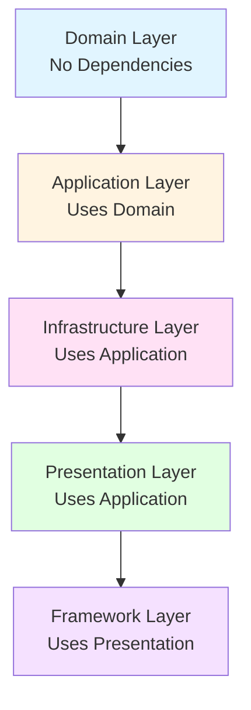

# Domain Layer Documentation

## Overview

The Domain Layer is the innermost layer of our Clean Architecture. It contains the core business entities and rules, with **zero dependencies** on other layers. This layer represents the heart of our application's business logic.

## Purpose

- **Business Entities**: Core domain models (Product, Cart, Order, etc.)
- **Business Rules**: Domain logic and validations
- **Value Objects**: Immutable domain concepts
- **Domain Types**: Business-level type definitions

## Architecture Position



**Key Rule**: Domain Layer has NO dependencies. It's the foundation that everything else builds upon.

## Directory Structure

```
src/domain/
├── entities/           # Business entities with logic
│   ├── Product.ts      # Product entity and business logic
│   ├── Cart.ts         # Cart entity and business logic
│   └── index.ts        # Exports
│
└── types/              # Domain types and interfaces
    ├── index.ts        # Navigation, Category, User, Order, Review types
    └── ...
```

## Entities

### Product Entity

**Location**: `src/domain/entities/Product.ts`

**Purpose**: Represents a product in our e-commerce system with business logic.

**Key Features**:
- Price calculation including variant modifiers
- Stock checking
- Discount calculations
- Business rules for product operations

**Example**:
```typescript
import { ProductEntity, type Product } from '@/domain/entities/Product';

/**
 * Create a product entity instance
 */
const productData: Product = {
  id: 1,
  name: 'Premium Pen',
  price: 19.99,
  strikePrice: 24.99,
  // ... other fields
};

const product = new ProductEntity(productData);

/**
 * Calculate price with variant selections
 * This is business logic - it belongs in the domain layer
 */
const variantSelections = { 'Pack Size': '24-pack' };
const finalPrice = product.calculatePrice(variantSelections);

/**
 * Check if product is in stock
 */
const inStock = product.isInStock(variantSelections);

/**
 * Check for discount
 */
if (product.hasDiscount()) {
  const discountPercent = product.getDiscountPercentage();
  console.log(`Save ${discountPercent}%!`);
}
```

**Business Methods**:
- `calculatePrice(variantSelections?)`: Calculates final price including variant modifiers
- `isInStock(variantSelections?)`: Checks if product/variant is in stock
- `hasDiscount()`: Checks if product has a discount
- `getDiscountPercentage()`: Calculates discount percentage
- `getData()`: Returns the product data

### Cart Entity

**Location**: `src/domain/entities/Cart.ts`

**Purpose**: Represents a shopping cart with business logic for cart operations.

**Key Features**:
- Add/remove items
- Update quantities
- Calculate totals
- Handle variant combinations

**Example**:
```typescript
import { CartEntity, type CartItem } from '@/domain/entities/Cart';
import type { Product } from '@/domain/entities/Product';

/**
 * Create an empty cart
 */
const cart = new CartEntity();

/**
 * Add product to cart
 */
const product: Product = { /* ... */ };
const items = cart.addItem(product, 2, { 'Color': 'blue' });

/**
 * Get cart totals
 */
const totalItems = cart.getTotalItems();
const totalPrice = cart.getTotalPrice();

/**
 * Update item quantity
 */
const updatedItems = cart.updateItemQuantity(productId, 3, variantSelections);
```

**Business Methods**:
- `addItem(product, quantity, variant?)`: Adds item to cart or updates quantity
- `removeItem(productId, variant?)`: Removes item from cart
- `updateItemQuantity(productId, quantity, variant?)`: Updates item quantity
- `getTotalItems()`: Calculates total number of items
- `getTotalPrice()`: Calculates total price including variants
- `clear()`: Clears all items
- `getItems()`: Returns all cart items

## Types

**Location**: `src/domain/types/index.ts`

**Purpose**: Domain-level type definitions that represent business concepts.

**Key Types**:
- `Product`: Product interface
- `CartItem`: Cart item interface
- `Category`: Category interface
- `User`: User interface
- `Order`: Order interface
- `Review`: Review interface
- `NavigationItem`: Navigation structure
- `SortOption`: Product sorting options
- `ViewMode`: Product view modes
- `Theme`: Theme type
- `Language`: Language type

**Example**:
```typescript
import type { Product, SortOption, Language } from '@/domain/types';

/**
 * Use domain types in your code
 */
function sortProducts(products: Product[], sortOption: SortOption): Product[] {
  // Sorting logic
}

function getProductName(product: Product, language: Language): string {
  // Return translated name based on language
}
```

## Design Principles

### 1. No Dependencies
The Domain Layer must NOT import from any other layer:
- ❌ No imports from `application/`
- ❌ No imports from `infrastructure/`
- ❌ No imports from `presentation/`
- ❌ No imports from `app/`

### 2. Pure Business Logic
Entities contain business rules, not infrastructure concerns:
- ✅ Price calculations
- ✅ Stock validations
- ✅ Business validations
- ❌ Database queries
- ❌ API calls
- ❌ UI rendering

### 3. Immutability (Where Appropriate)
Domain entities should be immutable or have controlled mutations:
```typescript
// Good: Returns new instance
const updatedCart = cart.addItem(product, 1);

// Avoid: Direct mutation
cart.items.push(newItem); // ❌
```

### 4. Rich Domain Models
Entities contain behavior, not just data:
```typescript
// Good: Entity has methods
const price = product.calculatePrice(variants);

// Avoid: External function
const price = calculateProductPrice(product, variants); // ❌
```

## When to Add to Domain Layer

**Add to Domain Layer when:**
- ✅ It's a core business concept (Product, Cart, Order)
- ✅ It contains business rules or validations
- ✅ It's used across multiple layers
- ✅ It's independent of infrastructure

**Don't add to Domain Layer when:**
- ❌ It's infrastructure-specific (database models, API responses)
- ❌ It's UI-specific (component props, form data)
- ❌ It's framework-specific (Next.js types, React types)

## Testing Domain Entities

Domain entities are easy to test because they have no dependencies:

```typescript
import { ProductEntity } from '@/domain/entities/Product';

describe('ProductEntity', () => {
  it('should calculate price with variant modifier', () => {
    const product = new ProductEntity({
      id: 1,
      price: 100,
      variants: {
        'Size': {
          name: 'Size',
          options: [
            { value: 'large', label: 'Large', priceModifier: 20, stock: 10 }
          ]
        }
      }
    });

    const price = product.calculatePrice({ 'Size': 'large' });
    expect(price).toBe(120);
  });
});
```

## Common Patterns

### Entity Pattern
```typescript
/**
 * Domain Entity Pattern
 *
 * 1. Define interface for data structure
 * 2. Create entity class with business logic
 * 3. Provide methods for business operations
 */
export interface Product {
  id: number;
  name: string;
  price: number;
  // ... other fields
}

export class ProductEntity {
  constructor(private product: Product) {}

  // Business logic methods
  calculatePrice(): number { /* ... */ }
  isInStock(): boolean { /* ... */ }

  // Accessor
  getData(): Product {
    return { ...this.product };
  }
}
```

### Value Object Pattern
```typescript
/**
 * Value Object: Immutable domain concept
 */
export class Money {
  constructor(
    private readonly amount: number,
    private readonly currency: string
  ) {}

  add(other: Money): Money {
    if (this.currency !== other.currency) {
      throw new Error('Cannot add different currencies');
    }
    return new Money(this.amount + other.amount, this.currency);
  }
}
```

## Best Practices

1. **Keep it Pure**: No side effects, no external dependencies
2. **Rich Models**: Entities should have behavior, not just data
3. **Immutability**: Prefer returning new instances over mutations
4. **Clear Names**: Use domain language (Product, Cart, not ProductDTO, CartModel)
5. **Documentation**: Add JSDoc comments explaining business rules

## Related Documentation

- [Application Layer](./02-application-layer.md) - Uses domain entities
- [Infrastructure Layer](./03-infrastructure-layer.md) - Maps to/from domain entities
- [Presentation Layer](./04-presentation-layer.md) - Displays domain entities

## Examples in Codebase

- `src/domain/entities/Product.ts` - Product entity with business logic
- `src/domain/entities/Cart.ts` - Cart entity with cart operations
- `src/domain/types/index.ts` - All domain type definitions
