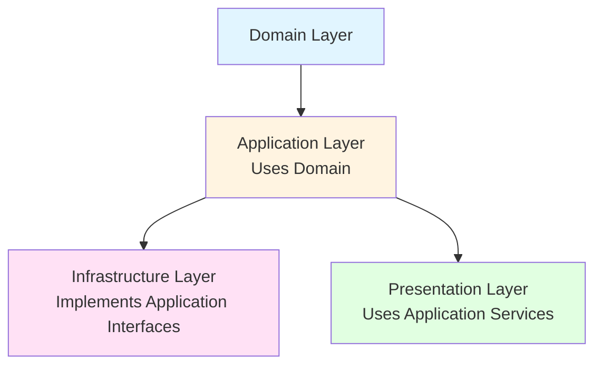

# Application Layer Documentation

## Overview

The Application Layer contains the application-specific business logic. It orchestrates domain entities and uses repository interfaces to access data. This layer defines **what** the application does, not **how** it does it.

## Purpose

- **Services**: Business logic and use cases
- **Repository Interfaces**: Contracts for data access (not implementations)
- **DTOs**: Data Transfer Objects (if needed)
- **Application Logic**: Workflows and business processes

## Architecture Position



**Key Rule**: Application Layer depends on Domain Layer and defines interfaces that Infrastructure Layer implements.

## Directory Structure

```
src/application/
├── repositories/           # Repository interfaces (contracts)
│   ├── IProductRepository.ts
│   ├── ICategoryRepository.ts
│   └── ITranslationRepository.ts
│
└── services/              # Business services
    ├── ProductService.ts
    ├── CartService.ts
    └── TranslationService.ts
```

## Repository Interfaces

Repository interfaces define **contracts** for data access. They don't specify **how** data is accessed, only **what** operations are available.

### IProductRepository

**Location**: `src/application/repositories/IProductRepository.ts`

**Purpose**: Defines the contract for product data access.

**Example**:
```typescript
import type { Product } from '@/domain/entities/Product';

/**
 * Product Repository Interface
 *
 * This interface defines what operations are available for products.
 * The actual implementation (database, API, mock) is in the Infrastructure layer.
 *
 * This follows the Dependency Inversion Principle:
 * - Application layer defines the interface
 * - Infrastructure layer implements it
 */
export interface IProductRepository {
  /**
   * Get all products
   * @param language - Language for translations (optional)
   * @returns Promise of Product array
   */
  getAll(language?: string): Promise<Product[]>;

  /**
   * Get product by ID
   * @param id - Product ID
   * @param language - Language for translations (optional)
   * @returns Promise of Product or null if not found
   */
  getById(id: number, language?: string): Promise<Product | null>;

  /**
   * Search products by query
   * @param query - Search query
   * @param language - Language for translations (optional)
   * @returns Promise of matching Products
   */
  search(query: string, language?: string): Promise<Product[]>;

  /**
   * Get products by category
   * @param category - Category name
   * @param language - Language for translations (optional)
   * @returns Promise of Products in category
   */
  getByCategory(category: string, language?: string): Promise<Product[]>;

  /**
   * Get featured products
   * @param limit - Maximum number of products
   * @param language - Language for translations (optional)
   * @returns Promise of featured Products
   */
  getFeatured(limit?: number, language?: string): Promise<Product[]>;
}
```

**Key Points**:
- Interface only, no implementation
- Uses domain types (Product)
- Methods are async (return Promises)
- Language parameter for translations

## Services

Services contain application-specific business logic. They use repository interfaces (not implementations) to access data.

### ProductService

**Location**: `src/application/services/ProductService.ts`

**Purpose**: Business logic for product operations.

**Example**:
```typescript
import type { IProductRepository } from '../repositories/IProductRepository';
import type { Product } from '@/domain/entities/Product';
import type { SortOption } from '@/domain/types';

/**
 * Product Service
 *
 * This service contains business logic for product operations:
 * - Product retrieval and filtering
 * - Product sorting
 * - Business rules for products
 *
 * It uses IProductRepository to access data, but doesn't know
 * if it's coming from a database, API, or mock data.
 */
export class ProductService {
  /**
   * Constructor with dependency injection
   * @param productRepository - Repository implementation (injected)
   */
  constructor(private productRepository: IProductRepository) {}

  /**
   * Get all products with optional sorting
   *
   * This method:
   * 1. Fetches products from repository
   * 2. Applies business logic (sorting)
   * 3. Returns sorted products
   *
   * @param sortOption - How to sort products
   * @param language - Language for translations
   * @returns Sorted products
   */
  async getAllProducts(
    sortOption?: SortOption,
    language?: string
  ): Promise<Product[]> {
    // Fetch from repository (could be DB, API, or mock)
    const products = await this.productRepository.getAll(language);

    // Apply business logic (sorting)
    return this.sortProducts(products, sortOption);
  }

  /**
   * Get product by ID
   *
   * @param id - Product ID
   * @param language - Language for translations
   * @returns Product or null
   */
  async getProductById(id: number, language?: string): Promise<Product | null> {
    return this.productRepository.getById(id, language);
  }

  /**
   * Search products
   *
   * @param query - Search query
   * @param sortOption - Sort option
   * @param language - Language for translations
   * @returns Sorted search results
   */
  async searchProducts(
    query: string,
    sortOption?: SortOption,
    language?: string
  ): Promise<Product[]> {
    const products = await this.productRepository.search(query, language);
    return this.sortProducts(products, sortOption);
  }

  /**
   * Private method: Sort products
   *
   * This is business logic - how products should be sorted.
   * It belongs in the service layer, not in the repository.
   *
   * @param products - Products to sort
   * @param sortOption - Sort option
   * @returns Sorted products
   */
  private sortProducts(products: Product[], sortOption?: SortOption): Product[] {
    if (!sortOption || sortOption === 'featured') {
      return products; // Return as-is for featured
    }

    const sorted = [...products];

    switch (sortOption) {
      case 'newest':
        sorted.sort((a, b) =>
          (b.isNew === true ? 1 : -1) - (a.isNew === true ? 1 : -1)
        );
        break;
      case 'price-asc':
        sorted.sort((a, b) => a.price - b.price);
        break;
      case 'price-desc':
        sorted.sort((a, b) => b.price - a.price);
        break;
      default:
        break;
    }

    return sorted;
  }
}
```

**Key Points**:
- Uses repository interface (not implementation)
- Contains business logic (sorting, filtering)
- Uses domain types
- Methods are async

### CartService

**Location**: `src/application/services/CartService.ts`

**Purpose**: Business logic for cart operations.

**Example**:
```typescript
import { CartEntity, type CartItem } from '@/domain/entities/Cart';
import type { Product } from '@/domain/entities/Product';

/**
 * Cart Service
 *
 * Manages shopping cart operations using the CartEntity.
 * This service orchestrates cart business logic.
 */
export class CartService {
  private cart: CartEntity;

  /**
   * Constructor
   * @param initialItems - Initial cart items (optional)
   */
  constructor(initialItems: CartItem[] = []) {
    this.cart = new CartEntity(initialItems);
  }

  /**
   * Add product to cart
   *
   * @param product - Product to add
   * @param quantity - Quantity to add
   * @param selectedVariant - Variant selections (optional)
   * @returns Updated cart items
   */
  addToCart(
    product: Product,
    quantity: number,
    selectedVariant?: { [key: string]: string }
  ): CartItem[] {
    const items = this.cart.addItem(product, quantity, selectedVariant);
    this.cart = new CartEntity(items);
    return items;
  }

  /**
   * Get cart total price
   *
   * @returns Total price of all items in cart
   */
  getTotalPrice(): number {
    return this.cart.getTotalPrice();
  }

  // ... other methods
}
```

## Design Principles

### 1. Dependency Inversion
Application layer defines interfaces, Infrastructure layer implements them:

```typescript
// Application Layer (defines interface)
export interface IProductRepository {
  getAll(): Promise<Product[]>;
}

// Infrastructure Layer (implements interface)
export class DatabaseProductRepository implements IProductRepository {
  async getAll(): Promise<Product[]> {
    // Database implementation
  }
}
```

### 2. Use Domain Entities
Services work with domain entities, not database models:

```typescript
// ✅ Good: Uses domain entity
async getProduct(id: number): Promise<Product> {
  return this.repository.getById(id);
}

// ❌ Bad: Uses database model
async getProduct(id: number): Promise<DbProduct> {
  return this.db.products.find(id);
}
```

### 3. Business Logic in Services
Business rules belong in services, not repositories:

```typescript
// ✅ Good: Sorting logic in service
async getAllProducts(sortOption: SortOption): Promise<Product[]> {
  const products = await this.repository.getAll();
  return this.sortProducts(products, sortOption); // Business logic
}

// ❌ Bad: Sorting in repository
async getAllProducts(sortOption: SortOption): Promise<Product[]> {
  return this.repository.getAllSorted(sortOption); // Infrastructure concern
}
```

### 4. Single Responsibility
Each service has a clear, single responsibility:

```typescript
// ✅ Good: ProductService handles products
class ProductService {
  // Product-related methods only
}

// ❌ Bad: Service handles everything
class DataService {
  // Products, orders, users, etc. - too broad
}
```

## When to Add to Application Layer

**Add to Application Layer when:**
- ✅ It's application-specific business logic
- ✅ It orchestrates multiple domain entities
- ✅ It defines data access contracts (interfaces)
- ✅ It's a use case or workflow

**Don't add to Application Layer when:**
- ❌ It's infrastructure-specific (database queries, API calls)
- ❌ It's UI-specific (component logic, rendering)
- ❌ It's domain logic (belongs in Domain layer)

## Testing Services

Services are easy to test by mocking repositories:

```typescript
import { ProductService } from '@/application/services/ProductService';
import type { IProductRepository } from '@/application/repositories/IProductRepository';

describe('ProductService', () => {
  it('should sort products by price ascending', async () => {
    // Mock repository
    const mockRepository: IProductRepository = {
      getAll: jest.fn().mockResolvedValue([
        { id: 1, price: 100, name: 'Product 1' },
        { id: 2, price: 50, name: 'Product 2' },
      ]),
      // ... other methods
    };

    const service = new ProductService(mockRepository);
    const products = await service.getAllProducts('price-asc');

    expect(products[0].price).toBe(50);
    expect(products[1].price).toBe(100);
  });
});
```

## Common Patterns

### Service Pattern
```typescript
/**
 * Service Pattern
 *
 * 1. Takes repository interface in constructor
 * 2. Implements business logic
 * 3. Uses domain entities
 * 4. Returns domain entities
 */
export class MyService {
  constructor(private repository: IMyRepository) {}

  async doSomething(): Promise<DomainEntity> {
    const data = await this.repository.getData();
    // Business logic here
    return processedData;
  }
}
```

### Repository Interface Pattern
```typescript
/**
 * Repository Interface Pattern
 *
 * 1. Define interface in Application layer
 * 2. Use domain types
 * 3. Infrastructure layer implements it
 */
export interface IMyRepository {
  getData(): Promise<DomainEntity>;
  saveData(data: DomainEntity): Promise<void>;
}
```

## Best Practices

1. **Define Interfaces**: Repository interfaces in Application layer
2. **Inject Dependencies**: Services receive repositories via constructor
3. **Use Domain Types**: Work with domain entities, not infrastructure models
4. **Business Logic**: Keep business rules in services, not repositories
5. **Async/Await**: All repository methods are async
6. **Documentation**: Add JSDoc comments explaining business logic

## Related Documentation

- [Domain Layer](./01-domain-layer.md) - Provides entities used by services
- [Infrastructure Layer](./03-infrastructure-layer.md) - Implements repository interfaces
- [Presentation Layer](./04-presentation-layer.md) - Uses services

## Examples in Codebase

- `src/application/repositories/IProductRepository.ts` - Product repository interface
- `src/application/services/ProductService.ts` - Product service
- `src/application/services/CartService.ts` - Cart service
