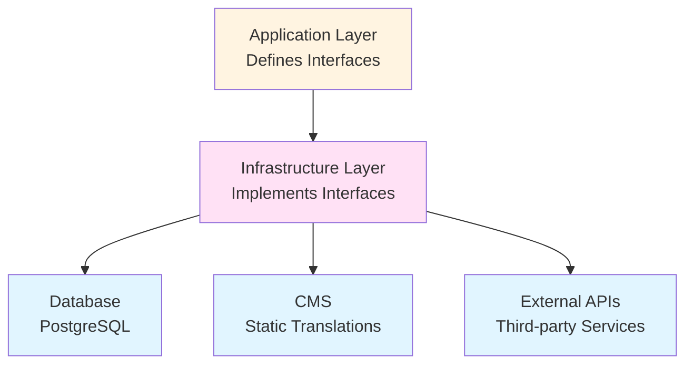

# Infrastructure Layer Documentation

## Overview

The Infrastructure Layer contains all external concerns: database access, API clients, CMS integration, and third-party services. It implements the interfaces defined in the Application layer.

## Purpose

- **Repository Implementations**: Database, API, or mock repositories
- **Database Access**: Drizzle ORM schemas and queries
- **External Services**: CMS clients, payment gateways, etc.
- **Configuration**: Database connections, API keys, etc.

## Architecture Position



**Key Rule**: Infrastructure Layer implements Application layer interfaces and handles all external concerns.

## Directory Structure

```
src/infrastructure/
├── database/              # Database configuration and schemas
│   ├── schema/           # Drizzle schemas
│   ├── migrations/       # Database migrations
│   ├── connection.ts    # Database connection
│   └── drizzle.config.ts # Drizzle configuration
│
├── repositories/         # Repository implementations
│   ├── DatabaseProductRepository.ts
│   ├── MockProductRepository.ts
│   └── RepositoryFactory.ts
│
├── translations/         # Translation infrastructure
│   ├── static.ts         # CMS static translations
│   └── dynamic.ts        # Database dynamic translations
│
├── cms/                  # CMS integration
│   └── client.ts         # CMS API client
│
├── config/            # Configuration files
│   ├── database.config.ts
│   └── cms.config.ts
│
└── di/                  # Dependency injection
    └── ServiceContainer.ts
```

## Database Repositories

### DatabaseProductRepository

**Location**: `src/infrastructure/repositories/DatabaseProductRepository.ts`

**Purpose**: Implements `IProductRepository` using Drizzle ORM and PostgreSQL.

**Example**:
```typescript
import type { IProductRepository } from '@/application/repositories/IProductRepository';
import type { Product } from '@/domain/entities/Product';
import { db } from '@/infrastructure/database/connection';
import { products, productTranslations } from '@/infrastructure/database/schema';
import { eq, and, like, or } from 'drizzle-orm';

/**
 * Database Product Repository
 *
 * This implements IProductRepository using Drizzle ORM and PostgreSQL.
 * It handles:
 * - Database queries
 * - Translation loading
 * - Mapping database models to domain entities
 */
export class DatabaseProductRepository implements IProductRepository {
  /**
   * Get all products with translations
   *
   * @param language - Language code (e.g., 'en', 'ar')
   * @returns Array of products with translations
   */
  async getAll(language: string = 'en'): Promise<Product[]> {
    // Query products with translations
    const result = await db
      .select({
        product: products,
        translation: productTranslations,
      })
      .from(products)
      .leftJoin(
        productTranslations,
        and(
          eq(productTranslations.productId, products.id),
          eq(productTranslations.language, language)
        )
      );

    // Map database results to domain entities
    return result.map((row) => this.mapToDomain(row.product, row.translation));
  }

  /**
   * Get product by ID with translation
   *
   * @param id - Product ID
   * @param language - Language code
   * @returns Product or null
   */
  async getById(id: number, language: string = 'en'): Promise<Product | null> {
    const result = await db
      .select({
        product: products,
        translation: productTranslations,
      })
      .from(products)
      .leftJoin(
        productTranslations,
        and(
          eq(productTranslations.productId, products.id),
          eq(productTranslations.language, language)
        )
      )
      .where(eq(products.id, id))
      .limit(1);

    if (result.length === 0) {
      return null;
    }

    return this.mapToDomain(result[0].product, result[0].translation);
  }

  /**
   * Search products
   *
   * @param query - Search query
   * @param language - Language code
   * @returns Matching products
   */
  async search(query: string, language: string = 'en'): Promise<Product[]> {
    const searchTerm = `%${query}%`;

    const result = await db
      .select({
        product: products,
        translation: productTranslations,
      })
      .from(products)
      .leftJoin(
        productTranslations,
        and(
          eq(productTranslations.productId, products.id),
          eq(productTranslations.language, language)
        )
      )
      .where(
        or(
          like(productTranslations.name, searchTerm),
          like(productTranslations.description, searchTerm)
        )
      );

    return result.map((row) => this.mapToDomain(row.product, row.translation));
  }

  /**
   * Map database model to domain entity
   *
   * This is a crucial method that converts infrastructure models
   * to domain entities. It ensures the domain layer stays pure.
   *
   * @param dbProduct - Database product model
   * @param translation - Product translation (optional)
   * @returns Domain Product entity
   */
  private mapToDomain(
    dbProduct: any,
    translation?: any
  ): Product {
    return {
      id: dbProduct.id,
      name: translation?.name || dbProduct.name, // Use translation if available
      description: translation?.description || dbProduct.description,
      longDescription: translation?.longDescription || dbProduct.longDescription,
      price: dbProduct.price,
      strikePrice: dbProduct.strikePrice,
      category: dbProduct.category,
      images: dbProduct.images || [],
      isNew: dbProduct.isNew,
      rating: dbProduct.rating,
      reviewsCount: dbProduct.reviewsCount,
      variants: dbProduct.variants ? JSON.parse(dbProduct.variants) : undefined,
    };
  }
}
```

**Key Points**:
- Implements `IProductRepository` interface
- Uses Drizzle ORM for queries
- Handles translations from database
- Maps database models to domain entities
- All methods are async

### MockProductRepository

**Location**: `src/infrastructure/repositories/MockProductRepository.ts`

**Purpose**: Mock implementation for development and testing.

**Example**:
```typescript
import type { IProductRepository } from '@/application/repositories/IProductRepository';
import type { Product } from '@/domain/entities/Product';
import { products } from '@/lib/constants';

/**
 * Mock Product Repository
 *
 * This is a simple implementation using mock data.
 * Used for:
 * - Development (when database not available)
 * - Testing
 * - Prototyping
 */
export class MockProductRepository implements IProductRepository {
  async getAll(language: string = 'en'): Promise<Product[]> {
    // Return mock data (translations handled separately in mock)
    return Promise.resolve([...products]);
  }

  async getById(id: number, language: string = 'en'): Promise<Product | null> {
    const product = products.find((p) => p.id === id);
    return Promise.resolve(product || null);
  }

  // ... other methods
}
```

## Database Schema

### Product Schema

**Location**: `src/infrastructure/database/schema/products.ts`

**Example**:
```typescript
import {
  pgTable,
  serial,
  text,
  decimal,
  integer,
  jsonb,
  boolean,
  timestamp,
  primaryKey,
} from 'drizzle-orm/pg-core';
import { relations } from 'drizzle-orm';

/**
 * Products Table
 *
 * Stores base product information (language-independent)
 */
export const products = pgTable('products', {
  id: serial('id').primaryKey(),

  // Pricing
  price: decimal('price', { precision: 10, scale: 2 }).notNull(),
  strikePrice: decimal('strike_price', { precision: 10, scale: 2 }),

  // Category (could be normalized, but keeping simple for now)
  category: text('category').notNull(),

  // Images (array of URLs stored as JSON)
  images: jsonb('images').$type<string[]>().default([]),

  // Flags
  isNew: boolean('is_new').default(false),

  // Ratings
  rating: decimal('rating', { precision: 3, scale: 2 }).default('0'),
  reviewsCount: integer('reviews_count').default(0),

  // Variants (stored as JSON for flexibility)
  // Format: { "Color": { name: "Color", options: [...] }, ... }
  variants: jsonb('variants').$type<Record<string, any>>(),

  // Timestamps
  createdAt: timestamp('created_at').defaultNow().notNull(),
  updatedAt: timestamp('updated_at').defaultNow().notNull(),
});

/**
 * Product Translations Table
 *
 * Stores language-specific product information:
 * - Name, description, long description
 * - One row per product per language
 *
 * This allows us to have:
 * - Product 1 in English: "Premium Pen"
 * - Product 1 in Arabic: "قلم ممتاز"
 */
export const productTranslations = pgTable('product_translations', {
  id: serial('id').primaryKey(),

  // Foreign key to products table
  productId: integer('product_id')
    .notNull()
    .references(() => products.id, { onDelete: 'cascade' }),

  // Language code (e.g., 'en', 'ar')
  language: text('language').notNull(),

  // Translated content
  name: text('name').notNull(),
  description: text('description').notNull(),
  longDescription: text('long_description').notNull(),

  // Timestamps
  createdAt: timestamp('created_at').defaultNow().notNull(),
  updatedAt: timestamp('updated_at').defaultNow().notNull(),
}, (table) => ({
  // Composite primary key: one translation per product per language
  pk: primaryKey({ columns: [table.productId, table.language] }),
}));

/**
 * Product Images Table (Optional - if you want normalized images)
 *
 * If you prefer normalized approach instead of JSON array:
 * - Store images in separate table
 * - Allows for additional image metadata
 * - Better for complex image management
 */
export const productImages = pgTable('product_images', {
  id: serial('id').primaryKey(),
  productId: integer('product_id')
    .notNull()
    .references(() => products.id, { onDelete: 'cascade' }),
  url: text('url').notNull(),
  alt: text('alt'),
  order: integer('order').default(0), // For ordering images
  createdAt: timestamp('created_at').defaultNow().notNull(),
});

/**
 * Define Relations for Drizzle
 *
 * These relations help with type-safe queries and joins.
 */
export const productsRelations = relations(products, ({ many }) => ({
  // One product has many translations
  translations: many(productTranslations),

  // One product has many images (if using normalized approach)
  images: many(productImages),
}));

export const productTranslationsRelations = relations(productTranslations, ({ one }) => ({
  // Each translation belongs to one product
  product: one(products, {
    fields: [productTranslations.productId],
    references: [products.id],
  }),
}));

export const productImagesRelations = relations(productImages, ({ one }) => ({
  // Each image belongs to one product
  product: one(products, {
    fields: [productImages.productId],
    references: [products.id],
  }),
}));

/**
 * Type Exports
 *
 * Export types for use in repositories and services.
 */
export type Product = typeof products.$inferSelect;
export type NewProduct = typeof products.$inferInsert;
export type ProductTranslation = typeof productTranslations.$inferSelect;
export type NewProductTranslation = typeof productTranslations.$inferInsert;
export type ProductImage = typeof productImages.$inferSelect;
export type NewProductImage = typeof productImages.$inferInsert;
```

## Repository Factory

**Location**: `src/infrastructure/repositories/RepositoryFactory.ts`

**Purpose**: Creates appropriate repository based on environment.

**Example**:
```typescript
import { DatabaseProductRepository } from './DatabaseProductRepository';
import { MockProductRepository } from './MockProductRepository';
import type { IProductRepository } from '@/application/repositories/IProductRepository';

/**
 * Repository Factory
 *
 * Creates repository instances based on environment configuration.
 * This allows switching between mock and database repositories
 * without changing application code.
 */
export class RepositoryFactory {
  /**
   * Create product repository
   *
   * Uses USE_DATABASE environment variable to decide:
   * - true: Database repository
   * - false/undefined: Mock repository
   *
   * @returns Product repository implementation
   */
  static createProductRepository(): IProductRepository {
    const useDatabase = process.env.USE_DATABASE === 'true';

    if (useDatabase) {
      return new DatabaseProductRepository();
    }

    return new MockProductRepository();
  }

  // ... other repository factories
}
```

## Translation Infrastructure

### Static Translations (CMS)

**Location**: `src/infrastructure/translations/static.ts`

**Purpose**: Fetches static translations from CMS at build time.

**Example**:
```typescript
import { cmsClient } from '@/infrastructure/cms/client';

/**
 * Get static translations from CMS
 *
 * These translations are:
 * - Fetched at build time
 * - Embedded in HTML
 * - UI labels, headers, buttons, etc.
 *
 * @param language - Language code
 * @returns Translation function
 */
export async function getStaticTranslation(language: string = 'en') {
  // Fetch from CMS (at build time)
  const translations = await cmsClient.getTranslations(language);

  return (key: string): string => {
    return translations[key] || key;
  };
}
```

### Dynamic Translations (Database)

**Location**: `src/infrastructure/translations/dynamic.ts`

**Purpose**: Utilities for handling database translations.

**Example**:
```typescript
/**
 * Dynamic Translation Utilities
 *
 * These handle translations stored in the database:
 * - Product names, descriptions
 * - Category names
 * - User-generated content
 *
 * Translations are loaded with the entity data.
 */
export function getTranslatedField(
  entity: any,
  field: string,
  language: string,
  fallback?: string
): string {
  // Check if translation exists
  if (entity.translations?.[language]?.[field]) {
    return entity.translations[language][field];
  }

  // Fallback to default language or provided fallback
  return entity.translations?.['en']?.[field] || fallback || '';
}
```

## CMS Integration

**Location**: `src/infrastructure/cms/client.ts`

**Example**:
```typescript
/**
 * CMS Client
 *
 * Handles communication with Content Management System
 * for static translations and content.
 */
export class CmsClient {
  private apiUrl: string;
  private apiKey: string;

  constructor() {
    this.apiUrl = process.env.CMS_API_URL || '';
    this.apiKey = process.env.CMS_API_KEY || '';
  }

  /**
   * Get translations for a language
   *
   * @param language - Language code
   * @returns Translation object
   */
  async getTranslations(language: string): Promise<Record<string, string>> {
    const response = await fetch(
      `${this.apiUrl}/translations/${language}`,
      {
        headers: {
          'Authorization': `Bearer ${this.apiKey}`,
        },
      }
    );

    if (!response.ok) {
      throw new Error('Failed to fetch translations from CMS');
    }

    return response.json();
  }
}

export const cmsClient = new CmsClient();
```

## Dependency Injection

**Location**: `src/infrastructure/di/ServiceContainer.ts`

**Purpose**: Provides services with injected dependencies.

**Example**:
```typescript
import { RepositoryFactory } from '../repositories/RepositoryFactory';
import { ProductService } from '@/application/services/ProductService';
import { CartService } from '@/application/services/CartService';

/**
 * Service Container
 *
 * Provides dependency injection for services.
 * Creates services with appropriate repository implementations.
 */
export class ServiceContainer {
  private static instance: ServiceContainer;
  private productService: ProductService;
  private cartService: CartService;

  private constructor() {
    // Create repositories
    const productRepository = RepositoryFactory.createProductRepository();

    // Create services with injected repositories
    this.productService = new ProductService(productRepository);
    this.cartService = new CartService();
  }

  /**
   * Get singleton instance
   */
  static getInstance(): ServiceContainer {
    if (!ServiceContainer.instance) {
      ServiceContainer.instance = new ServiceContainer();
    }
    return ServiceContainer.instance;
  }

  /**
   * Get product service
   */
  getProductService(): ProductService {
    return this.productService;
  }

  /**
   * Get cart service
   */
  getCartService(): CartService {
    return this.cartService;
  }
}
```

## Design Principles

### 1. Implement Interfaces
Infrastructure implements Application layer interfaces:

```typescript
// ✅ Good: Implements interface
export class DatabaseProductRepository implements IProductRepository {
  // Implementation
}

// ❌ Bad: Doesn't implement interface
export class DatabaseProductRepository {
  // No contract
}
```

### 2. Map to Domain Entities
Always map infrastructure models to domain entities:

```typescript
// ✅ Good: Maps to domain entity
private mapToDomain(dbProduct: DbProduct): Product {
  return {
    id: dbProduct.id,
    name: dbProduct.name,
    // ...
  };
}

// ❌ Bad: Returns infrastructure model
async getById(id: number): Promise<DbProduct> {
  return db.products.find(id);
}
```

### 3. Handle Translations
Infrastructure layer handles translation loading:

```typescript
// ✅ Good: Loads translations
async getById(id: number, language: string): Promise<Product> {
  const product = await db.products.find(id);
  const translation = await db.productTranslations.find({
    productId: id,
    language,
  });
  return this.mapToDomain(product, translation);
}
```

## Best Practices

1. **Implement Interfaces**: Always implement Application layer interfaces
2. **Map to Domain**: Convert infrastructure models to domain entities
3. **Handle Errors**: Proper error handling for external services
4. **Connection Pooling**: Use connection pooling for databases
5. **Environment Config**: Use environment variables for configuration
6. **Documentation**: Document external service integrations

## Related Documentation

- [Application Layer](./02-application-layer.md) - Defines interfaces to implement
- [Domain Layer](./01-domain-layer.md) - Entities to map to
- [Presentation Layer](./04-presentation-layer.md) - Uses infrastructure through services

## Examples in Codebase

- `src/infrastructure/repositories/DatabaseProductRepository.ts` - Database implementation
- `src/infrastructure/repositories/MockProductRepository.ts` - Mock implementation
- `src/infrastructure/database/schema/` - Database schemas
- `src/infrastructure/di/ServiceContainer.ts` - Dependency injection
