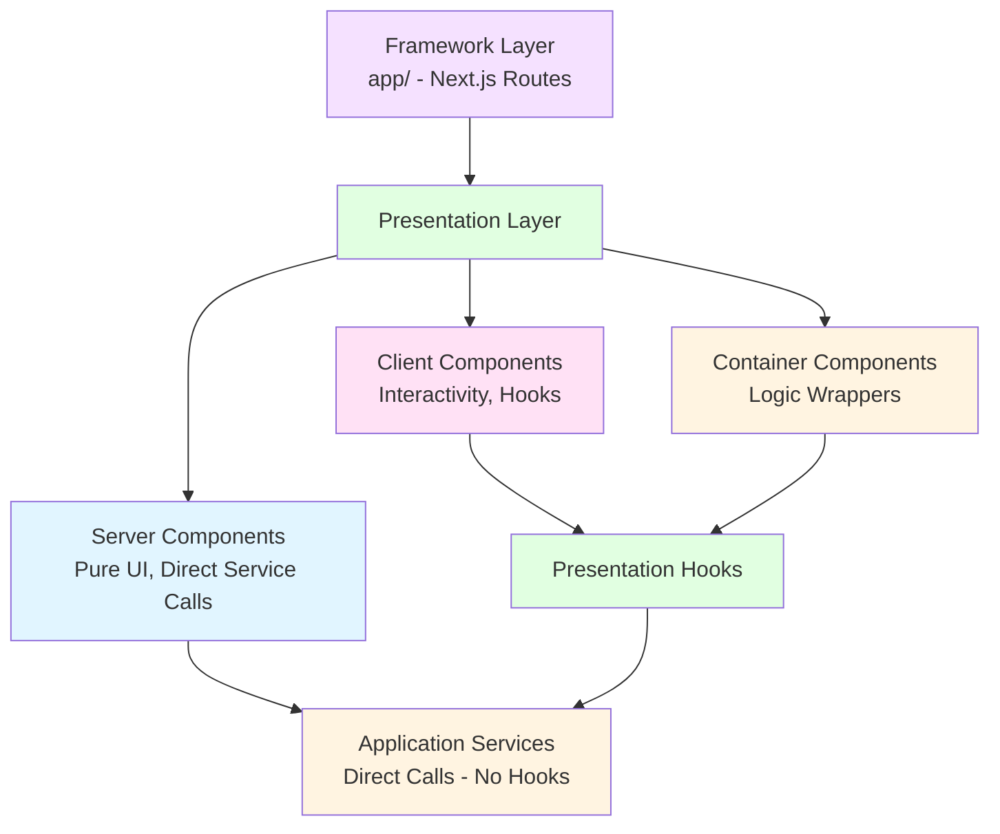
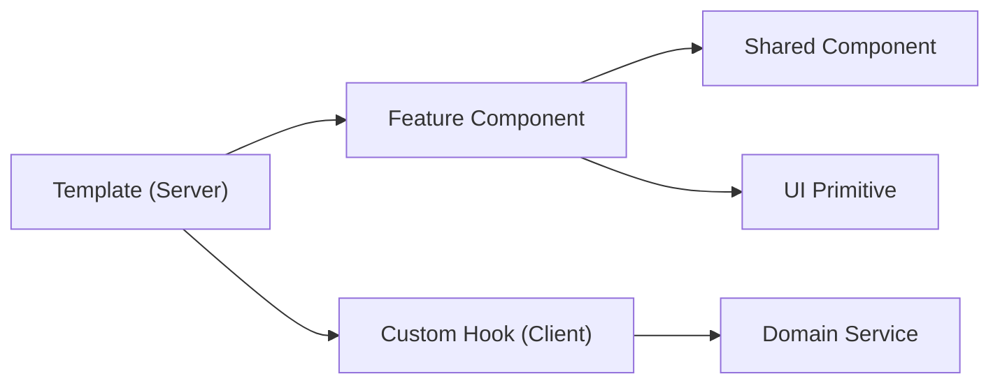

# Presentation Layer Documentation

## Overview

The Presentation Layer contains all UI-related code: React components, hooks, and providers. It's split into **Server Components** (pure UI, default) and **Client Components** (interactivity).

## Purpose

- **Server Components**: Pure UI, no logic, call services directly
- **Client Components**: Interactive UI, use hooks, handle state
- **Container Components**: Wrap Server Components with Client Component logic
- **Hooks**: Client-side data fetching and state management
- **Providers**: Context providers for global state

## Architecture Position



## Component Interplay



## Directory Structure

```
src/presentation/
├── components/
│   ├── features/            # Domain-specific components (Logic + UI)
│   │   ├── shop/           # ProductCard, CartDrawer, etc.
│   │   ├── dashboard/      # SalesChart, StatCard, etc.
│   │   └── user/           # LoginForm, ProfileHeader, etc.
│   │
│   ├── layout/              # Structural components (Pure UI)
│   │   ├── Header.tsx
│   │   ├── Footer.tsx
│   │   └── Container.tsx
│   │
│   ├── shared/              # Reusable Domain components (Pure UI)
│   │   ├── Icon.tsx
│   │   ├── Price.tsx
│   │   └── Badge.tsx
│   │
│   ├── templates/           # Page compositions (Server Components)
│   │   ├── HomePage.tsx
│   │   └── ProductDetailTemplate.tsx
│   │
│   └── ui/                  # Generic UI primitives (Pure UI - shadcn)
│       ├── button.tsx
│       ├── input.tsx
│       └── card.tsx
│
├── hooks/                   # React hooks (Client Components only)
├── providers/               # Context providers (Client Components)
└── server/                  # Server-side utilities (getServices.ts)
```

## Server Components

Server Components are the **default** in Next.js. They:
- Run on the server
- Can call services directly (no hooks)
- Are pure UI (no state, no interactivity)
- Can be async

### Feature Component (e.g., Shop)

**Location**: `src/presentation/components/features/shop/ProductCard.tsx`

**Example**:
```typescript
import type { Product } from '@/domain/entities/Product';

/**
 * Product Card Component (Server Component)
 *
 * This is a pure UI component that:
 * - Receives data via props
 * - Renders product information
 * - Has no logic, no state, no hooks
 *
 * NO 'use client' directive - runs on server
 */
interface ProductCardProps {
  product: Product;
  onAddToCart?: (product: Product) => void;
}

export function ProductCard({ product, onAddToCart }: ProductCardProps) {
  return (
    <div className="product-card">
      
      <h3>{product.name}</h3>
      <p>{product.description}</p>
      <div className="price">${product.price}</div>
      {onAddToCart && (
        <button onClick={() => onAddToCart(product)}>
          Add to Cart
        </button>
      )}
    </div>
  );
}
```

**Key Points**:
- NO 'use client' directive
- Pure props → JSX
- No hooks, no state
- Can receive callbacks as props

### Server Component with Direct Service Call

**Location**: `src/presentation/components/templates/HomePage.tsx`

**Example**:
```typescript
import { getProductService } from '@/presentation/server/getServices';
import { ProductCard } from '../molecules/ProductCard';

/**
 * Product List Component (Server Component)
 *
 * This Server Component:
 * - Calls services directly (no hooks)
 * - Fetches data on the server
 * - Renders pure UI
 *
 * NO 'use client' directive
 */
export async function ProductList({
  category,
  language = 'en'
}: {
  category?: string;
  language?: string;
}) {
  // Direct service call (no hooks needed)
  const productService = getProductService();

  // Fetch data on server
  const products = category
    ? await productService.getProductsByCategory(category, undefined, language)
    : await productService.getAllProducts(undefined, language);

  // Render pure UI
  return (
    <div className="product-list">
      {products.map((product) => (
        <ProductCard key={product.id} product={product} />
      ))}
    </div>
  );
}
```

**Key Points**:
- Async function (can await)
- Calls services directly
- No hooks needed
- Runs on server

## Client Components

Client Components handle interactivity:
- Must have 'use client' directive
- Can use hooks and state
- Run in the browser
- Handle user interactions

### Interactive Client Component

**Location**: `src/presentation/components/client/organisms/ProductPagination.tsx`

**Example**:
```typescript
'use client';

import { useState } from 'react';
import { ProductCard } from '../server/molecules/ProductCard';
import type { Product } from '@/domain/entities/Product';

/**
 * Product Pagination Component (Client Component)
 *
 * This Client Component:
 * - Handles pagination state
 * - Manages user interactions
 * - Uses hooks for state management
 *
 * MUST have 'use client' directive
 */
interface ProductPaginationProps {
  products: Product[];
  productsPerPage?: number;
}

export function ProductPagination({
  products,
  productsPerPage = 4
}: ProductPaginationProps) {
  const [currentPage, setCurrentPage] = useState(1);

  const totalPages = Math.ceil(products.length / productsPerPage);
  const currentProducts = products.slice(
    (currentPage - 1) * productsPerPage,
    currentPage * productsPerPage
  );

  return (
    <div>
      {/* Render Server Component with data */}
      {currentProducts.map((product) => (
        <ProductCard key={product.id} product={product} />
      ))}

      {/* Pagination controls */}
      <div className="pagination">
        <button
          onClick={() => setCurrentPage(p => Math.max(1, p - 1))}
          disabled={currentPage === 1}
        >
          Previous
        </button>
        <span>Page {currentPage} of {totalPages}</span>
        <button
          onClick={() => setCurrentPage(p => Math.min(totalPages, p + 1))}
          disabled={currentPage === totalPages}
        >
          Next
        </button>
      </div>
    </div>
  );
}
```

**Key Points**:
- MUST have 'use client'
- Can use hooks (useState, useEffect, etc.)
- Handles user interactions
- Can use browser APIs

## Container Components

Container Components wrap Server Components with Client Component logic:
- Client Components (have 'use client')
- Use hooks for data fetching
- Handle loading/error states
- Pass data to Server Components

**Location**: `src/presentation/components/containers/ProductListContainer.tsx`

**Example**:
```typescript
'use client';

import { useProductService } from '@/presentation/hooks/useProductService';
import { ProductList } from '../server/organisms/ProductList';

/**
 * Product List Container Component
 *
 * This Container Component:
 * - Uses hooks for data fetching (Client Component)
 * - Handles loading and error states
 * - Passes data to Server Component (pure UI)
 *
 * Pattern: Container wraps Server Component with logic
 */
export function ProductListContainer({
  category,
  language = 'en'
}: {
  category?: string;
  language?: string;
}) {
  // Use hook for data fetching (Client Component)
  const { products, loading, error } = useProductService();

  // Handle loading state
  if (loading) {
    return <div>Loading products...</div>;
  }

  // Handle error state
  if (error) {
    return <div>Error: {error.message}</div>;
  }

  // Pass data to Server Component (pure UI)
  return <ProductList products={products} category={category} language={language} />;
}
```

**Key Points**:
- Client Component (has 'use client')
- Uses hooks for data fetching
- Handles loading/error states
- Wraps Server Component

## Hooks

Hooks are **Client Components only**. They provide:
- Data fetching using services
- State management
- Reusable logic

**Location**: `src/presentation/hooks/useProductService.ts`

**Example**:
```typescript
'use client';

import { useState, useEffect } from 'react';
import { ProductService } from '@/application/services/ProductService';
import { getServiceContainer } from '@/infrastructure/di/ServiceContainer';
import type { Product } from '@/domain/entities/Product';
import type { SortOption } from '@/domain/types';

/**
 * useProductService Hook
 *
 * This hook provides product data and operations.
 * It's a Client Component hook, so it can only be used
 * in Client Components or Container Components.
 *
 * Usage:
 * ```tsx
 * 'use client';
 * const { products, loading, error } = useProductService();
 * ```
 */
export function useProductService() {
  const [products, setProducts] = useState<Product[]>([]);
  const [loading, setLoading] = useState(true);
  const [error, setError] = useState<Error | null>(null);

  // Get service from container
  const productService = getServiceContainer().getProductService();

  useEffect(() => {
    loadProducts();
  }, []);

  const loadProducts = async (sortOption?: SortOption, language?: string) => {
    try {
      setLoading(true);
      setError(null);
      const data = await productService.getAllProducts(sortOption, language);
      setProducts(data);
    } catch (err) {
      setError(err instanceof Error ? err : new Error('Failed to load products'));
    } finally {
      setLoading(false);
    }
  };

  return {
    products,
    loading,
    error,
    loadProducts,
    // ... other methods
  };
}
```

**Key Points**:
- Client Component hook (can use hooks)
- Uses services from Application layer
- Manages state (loading, error, data)
- Only used in Client Components

## Server-Side Service Access

**Location**: `src/presentation/server/getServices.ts`

**Purpose**: Helper functions for Server Components to access services.

**Example**:
```typescript
import { getServiceContainer } from '@/infrastructure/di/ServiceContainer';
import type { ProductService } from '@/application/services/ProductService';

/**
 * Get Product Service
 *
 * This helper function allows Server Components to access
 * services directly without hooks.
 *
 * Usage in Server Components:
 * ```tsx
 * const productService = getProductService();
 * const products = await productService.getAllProducts();
 * ```
 */
export function getProductService(): ProductService {
  return getServiceContainer().getProductService();
}

// ... other service getters
```

## Component Decision Tree

```
Is the component interactive?
├─ NO → Server Component (default)
│   ├─ Does it need data?
│   │   ├─ YES → Call service directly (async)
│   │   └─ NO → Pure UI component
│   └─ Receives data via props
│
└─ YES → Client Component ('use client')
    ├─ Does it need complex logic?
    │   ├─ YES → Container Component
    │   │   └─ Wraps Server Component
    │   └─ NO → Direct Client Component
    └─ Uses hooks for state/logic
```

## Best Practices

### Server Components
1. **Default to Server**: Use Server Components unless you need interactivity
2. **Direct Service Calls**: Call services directly, no hooks
3. **Pure UI**: No state, no logic, just rendering
4. **Async Support**: Can be async functions

### Client Components
1. **Only When Needed**: Use Client Components only for interactivity
2. **Use Hooks**: Use hooks for data fetching and state
3. **Mark Explicitly**: Always include 'use client' directive
4. **Compose Server Components**: Can use Server Components as children

### Container Pattern
1. **Separate Concerns**: Logic in Container, UI in Server Component
2. **Handle States**: Loading, error states in Container
3. **Pass Data**: Container passes data to Server Component

## Related Documentation

- [Application Layer](./02-application-layer.md) - Services used by components
- [Framework Layer](./05-framework-layer.md) - Next.js routes using components
- [Translation Strategy](../translations/README.md) - Translation in components

## Examples in Codebase

- `src/presentation/components/server/` - Server Components
- `src/presentation/components/client/` - Client Components
- `src/presentation/components/containers/` - Container Components
- `src/presentation/hooks/` - React hooks
- `src/presentation/server/getServices.ts` - Server-side service access
