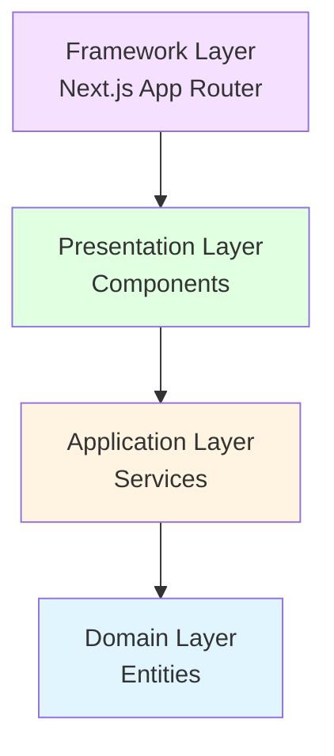

# Framework Layer Documentation

## Overview

The Framework Layer contains Next.js-specific code: routes, layouts, and framework configuration. This is the outermost layer that handles routing and page composition.

## Purpose

- **Routes**: Next.js App Router pages
- **Layouts**: Shared layouts for route groups
- **Metadata**: SEO and page metadata
- **Route Handlers**: API routes (if needed)
- **Next.js Configuration**: Framework-specific setup

## Architecture Position



**Key Rule**: Framework Layer is the entry point. It uses Presentation layer components and handles routing.

## Directory Structure

```
src/app/
├── layout.tsx              # Root layout
├── page.tsx                # Home page
├── globals.css             # Global styles
│
├── (shop)/                 # Shop route group
│   ├── layout.tsx         # Shop layout
│   ├── page.tsx           # Shop home
│   ├── product/
│   │   └── [id]/
│   │       └── page.tsx   # Product detail
│   ├── search/
│   │   └── page.tsx       # Search page
│   └── ...
│
├── (dashboard)/            # Dashboard route group
│   ├── layout.tsx
│   └── dashboard/
│       └── page.tsx
│
└── (auth)/                 # Auth route group
    ├── layout.tsx
    └── registration/
        └── page.tsx
```

## Route Files

Route files are **Server Components by default**. They:
- Handle routing
- Fetch data if needed
- Render page templates
- Set metadata

### Page Route

**Location**: `src/app/(shop)/page.tsx`

**Example**:
```typescript
import { HomePage } from '@/presentation/components/server/templates/HomePage';

/**
 * Shop Home Page Route
 *
 * This is a Next.js Server Component route.
 * It:
 * - Handles the / route
 * - Renders the HomePage template
 * - Can fetch data if needed
 *
 * NO 'use client' directive - runs on server
 */
export default async function Page() {
  // Can fetch data here if needed
  // Or let the template component handle it

  return <HomePage />;
}

/**
 * Metadata for SEO
 *
 * This is a Next.js feature for setting page metadata.
 */
export const metadata = {
  title: 'FindEg.com - Modern E-commerce Platform',
  description: 'Your one-stop shop for stationary, kids toys, and school supplies.',
};
```

**Key Points**:
- Default export is the page component
- Can be async (Server Component)
- Can export metadata
- Uses Presentation layer components

### Dynamic Route

**Location**: `src/app/(shop)/product/[id]/page.tsx`

**Example**:
```typescript
import { ProductDetailTemplate } from '@/presentation/components/server/templates/ProductDetailTemplate';
import { getProductService } from '@/presentation/server/getServices';
import { notFound } from 'next/navigation';

/**
 * Product Detail Page Route
 *
 * This route:
 * - Handles /product/[id] URLs
 * - Fetches product data
 * - Renders product detail template
 * - Handles 404 if product not found
 */
export default async function ProductPage({
  params,
}: {
  params: Promise<{ id: string }>;
}) {
  // Await params (Next.js 15+)
  const { id } = await params;
  const productId = parseInt(id);

  // Validate product ID
  if (isNaN(productId)) {
    notFound();
  }

  // Fetch product data (Server Component can call services directly)
  const productService = getProductService();
  const product = await productService.getById(productId);

  // Handle not found
  if (!product) {
    notFound();
  }

  // Render template with data
  return <ProductDetailTemplate product={product} />;
}

/**
 * Generate static params for static generation
 * (Optional - for SSG)
 */
export async function generateStaticParams() {
  const productService = getProductService();
  const products = await productService.getAllProducts();

  return products.map((product) => ({
    id: product.id.toString(),
  }));
}
```

**Key Points**:
- Receives route params
- Can fetch data directly
- Can use Next.js functions (notFound, redirect)
- Can generate static params

### Search Route with Query Params

**Location**: `src/app/(shop)/search/page.tsx`

**Example**:
```typescript
import { SearchTemplate } from '@/presentation/components/server/templates/SearchTemplate';

/**
 * Search Page Route
 *
 * Handles search with query parameters:
 * - /search?q=pen
 * - /search?q=pen&sort=price-asc
 */
export default async function SearchPage({
  searchParams,
}: {
  searchParams: Promise<{ [key: string]: string | string[] | undefined }>;
}) {
  // Await searchParams (Next.js 15+)
  const params = await searchParams;
  const query = typeof params.q === 'string' ? params.q : '';
  const sort = typeof params.sort === 'string' ? params.sort : undefined;

  return <SearchTemplate searchQuery={query} sortOption={sort} />;
}
```

## Layouts

Layouts wrap route groups and provide shared UI.

### Root Layout

**Location**: `src/app/layout.tsx`

**Example**:
```typescript
import type { Metadata, Viewport } from 'next';
import { Providers } from '@/presentation/providers/Providers';
import './globals.css';

/**
 * Root Layout
 *
 * This is the root layout for the entire application.
 * It:
 * - Wraps all pages
 * - Provides global providers
 * - Sets global metadata
 * - Applies global styles
 */
export const metadata: Metadata = {
  title: {
    default: 'FindEg.com - Modern E-commerce Platform',
    template: '%s | FindEg.com',
  },
  description: 'Your one-stop shop for stationary, kids toys, and school supplies.',
};

export const viewport: Viewport = {
  themeColor: '#14b8a6',
};

export default function RootLayout({
  children,
}: {
  children: React.ReactNode;
}) {
  return (
    <html lang="en" suppressHydrationWarning>
      <body>
        {/* Global providers (Client Components) */}
        <Providers>
          {children}
        </Providers>
      </body>
    </html>
  );
}
```

**Key Points**:
- Wraps entire app
- Sets global metadata
- Provides global providers
- Applies global styles

### Route Group Layout

**Location**: `src/app/(shop)/layout.tsx`

**Example**:
```typescript
import { HeaderContainer } from '@/presentation/components/containers/HeaderContainer';
import { Footer } from '@/presentation/components/server/organisms/Footer';

/**
 * Shop Layout
 *
 * This layout wraps all shop routes:
 * - / (home)
 * - /product/[id]
 * - /search
 * - /shop
 * - etc.
 *
 * It provides:
 * - Header (with cart, navigation)
 * - Footer
 * - Shared styling
 */
export default function ShopLayout({
  children,
}: {
  children: React.ReactNode;
}) {
  return (
    <>
      {/* Header with cart and navigation (Container Component) */}
      <HeaderContainer />

      {/* Page content */}
      <main>{children}</main>

      {/* Footer (Server Component) */}
      <Footer />
    </>
  );
}
```

**Key Points**:
- Wraps route group
- Provides shared UI (Header, Footer)
- Can use both Server and Client Components

## Route Groups

Route groups (folders with parentheses) organize routes without affecting URLs:

```
app/
├── (shop)/          # Shop routes - URL: /
│   └── page.tsx    # Renders at /
│
├── (dashboard)/     # Dashboard routes - URL: /dashboard
│   └── dashboard/
│       └── page.tsx # Renders at /dashboard
│
└── (auth)/          # Auth routes - URL: /registration
    └── registration/
        └── page.tsx # Renders at /registration
```

**Note**: Parentheses don't appear in URLs. They're just for organization.

## Special Files

### loading.tsx

**Location**: `src/app/(shop)/loading.tsx`

**Purpose**: Loading UI shown while page loads.

**Example**:
```typescript
/**
 * Loading Component
 *
 * Shown automatically while the page is loading.
 * Next.js shows this during Suspense boundaries.
 */
export default function Loading() {
  return (
    <div className="loading">
      <div className="spinner">Loading...</div>
    </div>
  );
}
```

### error.tsx

**Location**: `src/app/(shop)/error.tsx`

**Purpose**: Error UI shown when errors occur.

**Example**:
```typescript
'use client';

/**
 * Error Component
 *
 * Shown when an error occurs in this route segment.
 * Must be a Client Component.
 */
export default function Error({
  error,
  reset,
}: {
  error: Error & { digest?: string };
  reset: () => void;
}) {
  return (
    <div className="error">
      <h2>Something went wrong!</h2>
      <button onClick={reset}>Try again</button>
    </div>
  );
}
```

### not-found.tsx

**Location**: `src/app/(shop)/not-found.tsx`

**Purpose**: 404 page for this route segment.

**Example**:
```typescript
/**
 * Not Found Component
 *
 * Shown when a route is not found.
 */
export default function NotFound() {
  return (
    <div className="not-found">
      <h2>404 - Page Not Found</h2>
      <p>The page you're looking for doesn't exist.</p>
    </div>
  );
}
```

## Data Fetching Patterns

### Pattern 1: Fetch in Route

```typescript
export default async function Page() {
  const productService = getProductService();
  const products = await productService.getAllProducts();

  return <ProductList products={products} />;
}
```

### Pattern 2: Fetch in Template

```typescript
// Route
export default function Page() {
  return <HomePage />;
}

// Template (Server Component)
export async function HomePage() {
  const productService = getProductService();
  const products = await productService.getAllProducts();

  return <ProductList products={products} />;
}
```

**Recommendation**: Fetch in templates for better reusability.

## Best Practices

1. **Server Components by Default**: Routes are Server Components
2. **Use Templates**: Fetch data in template components, not routes
3. **Metadata**: Set metadata for SEO
4. **Error Handling**: Use error.tsx and not-found.tsx
5. **Loading States**: Use loading.tsx for better UX
6. **Route Groups**: Use route groups for organization
7. **Type Safety**: Type route params and searchParams

## Related Documentation

- [Presentation Layer](./04-presentation-layer.md) - Components used in routes
- [Next.js App Router](https://nextjs.org/docs/app) - Official Next.js documentation

## Examples in Codebase

- `src/app/layout.tsx` - Root layout
- `src/app/(shop)/layout.tsx` - Shop layout
- `src/app/(shop)/page.tsx` - Shop home page
- `src/app/(shop)/product/[id]/page.tsx` - Product detail page
