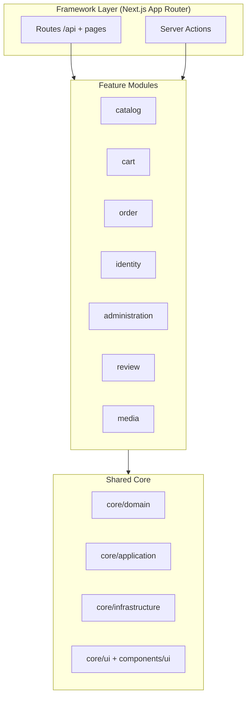
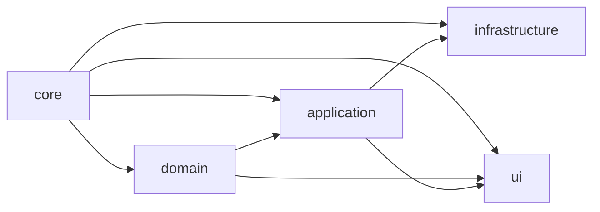
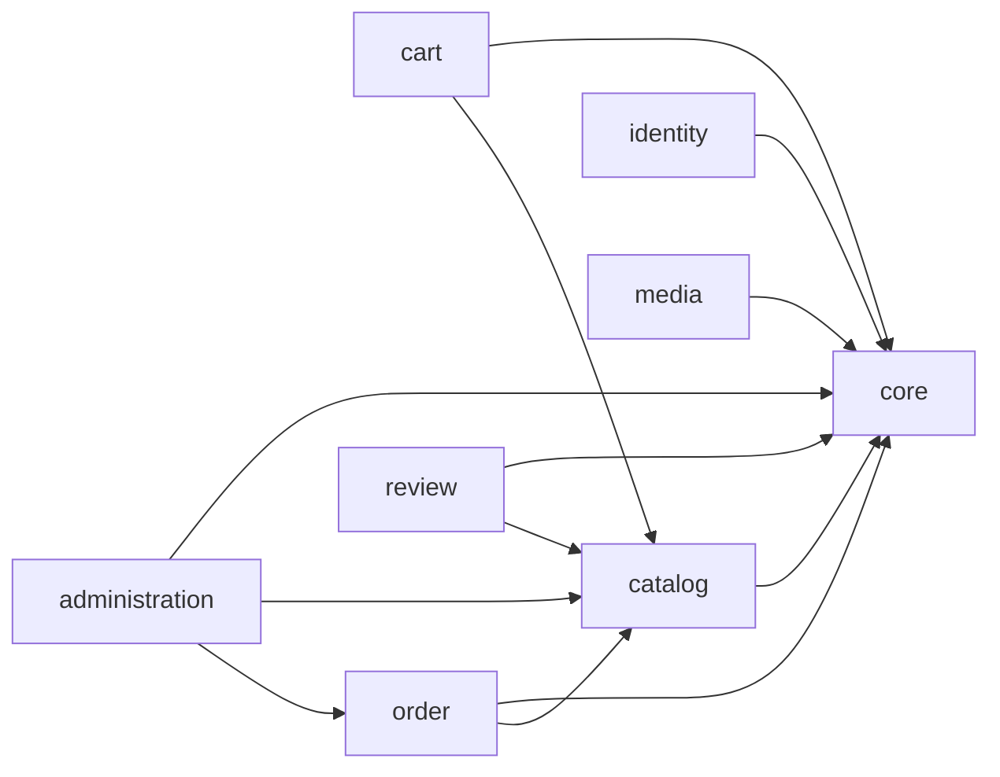

# FindEg Architecture Playbook

This playbook is the single source of truth for:
- Clean architecture boundaries
- Feature responsibilities and dependencies
- Layer-specific implementation standards
- Delivery workflow for new features and changes
- Domain type/value-object foundation (`docs/architecture/DOMAIN_TYPE_BLOCKS.md`)
- Identity and permission guard boundaries (`docs/AUTH_ARCHITECTURE.md`)

It consolidates architecture conventions previously spread across multiple docs.

---

## 1. Architecture Model



### Core Rule
Features may depend on `core`, and may depend on other features only through interfaces/contracts.  
No feature may import another feature's infrastructure implementation directly.

Authorization rule:
- Permission checks must use application guard interfaces (for example `IPermissionService`), never role-string checks in delivery/UI.

---

## 2. Layer Contracts

| Layer | Allowed Dependencies | Must Not Depend On | Purpose |
| --- | --- | --- | --- |
| `domain` | TypeScript stdlib, same-domain files | `application`, `infrastructure`, framework | Business rules and pure types |
| `application` | `domain`, feature interfaces, core ports | concrete infra adapters | Use cases and orchestration |
| `infrastructure` | `domain`, `application` interfaces, external SDKs | app/router UI layer | Adapter implementations (DB/storage/auth) |
| `ui`/presentation | `application` services/actions, domain types, ui primitives | direct DB and adapter access | Rendering and interaction |

### Import Matrix



Interpretation:
- `application` imports `domain`.
- `infrastructure` implements interfaces from `application`.
- `ui` can use `domain` and `application` contracts, but never direct infrastructure details.

---

## 2.1. Package Boundary Enforcement

**Context**: FindEg is a monorepo with separate packages (@backend, @dashboard, @storefront, @ui). Apps MUST NOT import backend infrastructure implementations directly - they consume backend functionality through well-defined package exports.

### Backend Package (@backend)

**Type**: Pure TypeScript library (framework-agnostic, no React/Next.js dependencies)  
**Exports**: Application layer interfaces and presentation layer utilities ONLY  
**Enforcement**: package.json `exports` field restricts what apps can import

#### Allowed Imports from Apps

✅ **Application Layer** (use cases, services, interfaces):
```typescript
import { IProductRepository } from "@backend/features/catalog";
import { ProductService } from "@backend/features/catalog";
import { CreateProductUseCase } from "@backend/features/catalog";
```

✅ **Presentation Layer** (hooks, actions, view models):
```typescript
import { useProducts } from "@backend/features/catalog";
import { createProduct } from "@backend/features/catalog";  
import type { ProductViewModel } from "@backend/features/catalog";
```

✅ **Domain Layer** (entities, value objects, types):
```typescript
import type { Product, Money } from "@backend/features/catalog";
import { ProductStatus } from "@backend/features/catalog";
```

#### Forbidden Imports from Apps

❌ **Infrastructure Layer** (repository implementations, database clients):
```typescript
// BLOCKED by package.json exports - TypeScript will error
import { DrizzleProductRepository } from "@backend/features/catalog/infrastructure";
import { db } from "@backend/features/core/infrastructure/persistence/database";
import { SchemaTypes } from "@backend/features/core"; // Schema types are infrastructure
```

❌ **Direct Source Access** (bypassing package exports):
```typescript
// BLOCKED by TypeScript path configuration
import { something } from "@features/catalog"; // @features/* no longer resolves to backend
```

### Enforcement Mechanisms

1. **Package.json Exports** (Primary)
   - Backend package.json only exports application/presentation/domain per feature
   - Infrastructure paths are NOT in exports field
   - TypeScript resolves imports through package exports (not source files)

2. **TypeScript Path Configuration** 
   - Apps' tsconfig.json does NOT map `@backend/*` to source (`../backend/src/*`)
   - Apps rely on pnpm workspace + package references for resolution
   - `@features/*` in apps resolves ONLY to app-local features, not backend

3. **serverExternalPackages** (Build Optimization)
   - Next.js config lists Node.js-only packages: postgres, drizzle-orm, fs, etc.
   - Prevents bundling server-only code in client bundles
   - Configured in `packages/{dashboard,storefront}/next.config.ts`

### Import Rules Summary

| Import Pattern | Status | Reason |
|---------------|--------|--------|
| `@backend/features/[feature]` | ✅ Allowed | Package export (application + presentation) |
| `@backend/features/[feature]/application` | ✅ Allowed | Explicit layer export |
| `@backend/features/[feature]/infrastructure` | ❌ Blocked | Not in package exports |
| `@features/[backend-feature]` | ❌ Blocked | Path no longer resolves to backend |
| Direct repository imports | ❌ Blocked | Infrastructure layer is internal-only |

### Verification Commands

```bash
# Verify no infrastructure imports in apps
grep -r "infrastructure" packages/{dashboard,storefront}/src --include="*.ts" --include="*.tsx"

# Verify type-check passes (enforces boundaries)
npm run type-check

# Verify builds succeed without bundling errors
npm run build
```

---

## 3. Context Map



---

## 4. Implementation Workflow (Required)

When implementing any new capability:

1. **Spec first**
   - Update `project-planning/SYSTEM_SPECIFICATION.md` with scope/API/schema implications.
   - Update `project-planning/MISSING_FLOWS_MATRIX.md`.
   - Update `project-planning/USE_CASE_BACKLOG.md` when priorities/scope shift.
   - Update `docs/testing/FRONTEND_TEST_MASTER_PLAN.md` when coverage scope changes.

2. **Domain first**
- Define/extend domain types and value objects.
- Add runtime schemas (`zod`) for external boundaries.

3. **Application contracts**
- Add or update interface methods (`I*Repository`, `I*Service`) before implementations.

4. **Infrastructure adapters**
- Implement repository/storage/auth adapters.
- Keep DB-specific concerns inside infrastructure.

5. **API/actions**
- Expose explicit contracts and keep route ownership clear.
- During MVP, optimize for correctness and speed. Internal contract changes are allowed if all in-repo consumers are updated in the same change.

6. **UI**
- Bind forms/pages to contracts.
- Keep mapping/transformation logic thin.

7. **Validation**
- `npm run type-check`
- `npm run lint`
- run migration validation (if schema changed)
- update docs and plan status

---

## 5. Layer Standards

### Domain Standards
- Define explicit primitive aliases/types (`ID`, `Price`, `UomCode`, etc.).
- Keep domain deterministic and framework-agnostic.
- Prefer value objects for snapshots (`VariantSnapshot`, `ShippingAddress`).

### Application Standards
- Every side-effectful use case goes through a service.
- Service interfaces are stable contracts; implementations are swappable.
- Validate all incoming DTOs at boundaries before orchestration.
- Authorization decisions are expressed as permission codes, not hard-coded role names.
- Session payload consumption must go through actor-context resolvers.

### Infrastructure Standards
- Repositories map DB models to domain models in one place.
- Keep SQL/ORM types out of UI/application contracts.
- Use explicit migrations for schema evolution; document any breaking change in planning docs and test plan.
- Identity infrastructure owns token verification, credential hashing, and role/permission lookup adapters.
- Payment adapters store tokenized instruments only; no raw payment secrets in domain/application layers.

### UI Standards
- Forms own presentation and basic client validation only.
- No direct DB access and no raw SQL in UI code.
- Prefer explicit field typing over `any`.

### API Standards
- Keep endpoint contracts explicit and versioned at `/api/v1`.
- Use consistent error shape `{ errorCode, message, details }`.
- Validate params/body/query with zod schemas.
- Protect privileged endpoints via permission-based guards.
- Keep auth/session middleware and permission resolution centralized in shared wrappers.

---

## 6. Identity & Authorization Contract

Mandatory boundaries:

1. Delivery layer (middleware/routes/server actions)
- parses request context
- calls auth application services to resolve actor/session context
- delegates authorization to permission guard service

2. Application layer
- defines `IAuthService`, `ISessionService`, `IPermissionService`
- returns explicit allow/deny outcomes with typed reasons

3. Infrastructure layer
- implements JWT/session adapters
- persists and resolves users, linked accounts, memberships, roles, and permissions

Prohibited:

- direct `role === "admin"` checks in UI/routes
- direct DB/ORM imports inside middleware/page components for auth decisions

---

## 7. Migration Standards

1. Add schema in `src/features/core/infrastructure/persistence/schema/*`.
2. Add migration SQL in `scripts/migrations/`.
3. Validate migration on local DB.
4. Document data/backfill assumptions in:
   - `project-planning/SYSTEM_SPECIFICATION.md`
   - `project-planning/MISSING_FLOWS_MATRIX.md`
   - `project-planning/USE_CASE_BACKLOG.md`

---

## 8. Feature Documentation Rule

Each feature README must include:
- Responsibilities
- Use-case diagram
- Class diagram
- Sequence diagram
- Layer implementation notes
- Clean architecture boundaries and anti-patterns

Feature docs:
- `src/features/core/README.md`
- `src/features/catalog/README.md`
- `src/features/cart/README.md`
- `src/features/order/README.md`
- `src/features/identity/README.md`
- `src/features/administration/README.md`
- `src/features/review/README.md`
- `src/features/media/README.md`
