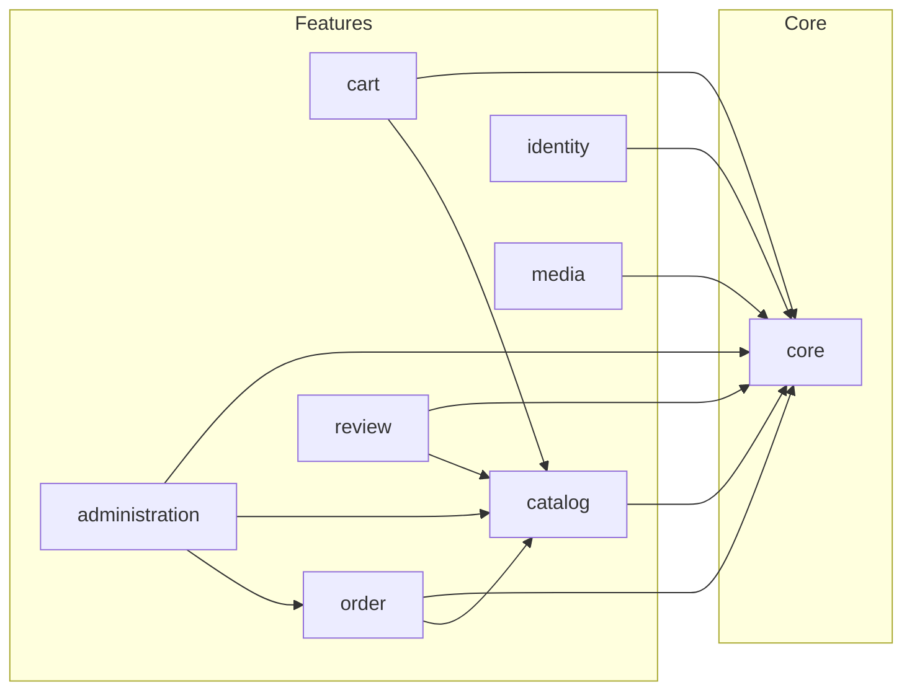

# Bounded Contexts

This document describes the bounded contexts (features) of the FindEg platform and their responsibilities. Each context maps to a feature folder under `src/features/`.

---

## Context Map

---

## core

**Purpose**: Cross-cutting concerns used by all features. No dependencies on other features.

**Domain**:
- Auth types: `AuthCredentials`, `AuthResult`, `SessionPayload`, `UserWithPassword`

**Application**:
- Ports: `ISessionManager`, `ISessionProvider`, `ILoggerService`, `IStorageProvider`
- Services: `LoggerService`

**Infrastructure**:
- Auth: JWT, cookie session
- Persistence: DB connection, Drizzle schema
- Storage: Local storage provider
- Logging: File logger
- DI: ServiceContainer

**UI**:
- Layout: Header, Footer, Container, Hero
- Shared: Icon, Pagination, ErrorPage

**Note**: shadcn primitives (Button, Input, Card, etc.) stay at `src/components/ui/` — the shadcn CLI expects this path.

---

## catalog

**Purpose**: Product catalog — products, categories, brands. Browsing, search, filtering.

**Domain**:
- Entities: `Product`, `Category`, `Brand`
- Value objects: `ProductVariant`, `ProductVariantOption`
- Rich entity: `ProductEntity` (price, stock, discount logic)

**Application**:
- Ports: `IProductRepository`, `ICategoryRepository`, `IBrandRepository`
- Services: `ProductService`, `CategoryService`

**Infrastructure**:
- DrizzleProductRepository, DrizzleCategoryRepository, DrizzleBrandRepository

**UI**:
- ProductCard, ProductListItem, Price, DiscountBadge, Rating, VariantSelector

**Depends on**: core

---

## cart

**Purpose**: Shopping cart — add, remove, update quantities, calculate totals.

**Domain**:
- Entities: `Cart`, `CartItem`
- Rich entity: `CartEntity`

**Application**:
- Ports: Uses `IProductRepository` from catalog for product resolution
- Services: `CartService`

**Infrastructure**:
- In-memory cart storage (no DB)

**UI**:
- CartDrawer, QuantityInput

**Depends on**: core, catalog

---

## order

**Purpose**: Checkout, order lifecycle, fulfillment.

**Domain**:
- Entities: `Order`, `OrderItem`
- Value objects: `ShippingAddress`, `VariantSnapshot`

**Application**:
- Ports: `IOrderRepository`
- Services: Checkout logic, order creation

**Infrastructure**:
- DrizzleOrderRepository

**UI**:
- Checkout components

**Depends on**: core, catalog

---

## identity

**Purpose**: Users, authentication, registration, addresses.

**Domain**:
- Entities: `User`, `Address`

**Application**:
- Ports: `IUserRepository`
- Services: `AuthService`

**Infrastructure**:
- DrizzleUserRepository

**UI**:
- Login form, user avatar

**Depends on**: core

---

## administration

**Purpose**: Admin dashboard — CRUD for products, categories, brands, orders, inventory; audit logging; dashboard stats.

**Domain**:
- Entities: `AuditLogEntry`
- Types: `ProductInput`, `CategoryInput`, `BrandInput`, `OrderStatusUpdate`, `InventoryUpdate`, `DashboardStats`

**Application**:
- Ports: `IAuditLogRepository`
- Services: AdminProductService, AdminCategoryService, AdminBrandService, AdminOrderService, AdminInventoryService, AdminDashboardService, AuditLogService

**Infrastructure**:
- DrizzleAuditLogRepository

**UI**:
- Admin forms, tables, dashboard

**Depends on**: core, catalog, order (via ports)

---

## review

**Purpose**: Product reviews.

**Domain**:
- Entities: `Review`

**Application**:
- Ports: `IReviewRepository`

**Infrastructure**:
- DrizzleReviewRepository

**UI**:
- ReviewItem, ReviewForm

**Depends on**: core, catalog

---

## media

**Purpose**: File upload, storage.

**Application**:
- Ports: Uses `IStorageProvider` from core
- Services: `MediaService`

**Depends on**: core
