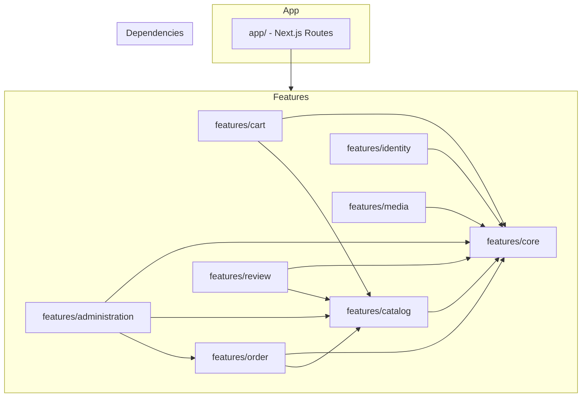

# Full DDD & Clean Architecture Refactor Plan

> **Business Context**: FindEg.com is an education-focused e-commerce platform for the Egyptian market (stationery, school supplies). Phase 1 delivers: Public B2C shop (web + mobile API), Admin dashboard, and a shared backend. Future phases add Teacher tools and School integration (B2B2C).

---

## 1. Architecture Approach: Feature-Based with Core

The codebase is organized by **features** (vertical slices). Each feature is self-contained with its own domain, application, infrastructure, and UI. The **core** feature holds shared cross-cutting concerns (auth, persistence, layout). This structure maximizes:

- **Reusability**: Shared code lives in `core`; features depend on core, not on each other.
- **Readability**: All catalog-related code is in `features/catalog/`; no hunting across layers.
- **Maintainability**: Changes to one feature have minimal impact on others.
- **Testability**: Features can be tested in isolation with mocked dependencies.
- **Strong Typing**: The codebase is strictly typed with type inference and JSDoc throughout to maintain clarity and IDE support.

---

## 2. Business Bounded Contexts (Features)

| Feature | Description | Phase 1 Entities | Future |
|---------|-------------|------------------|--------|
| **core** | Cross-cutting: auth, session, persistence, storage, logging, layout | SessionPayload, AuthCredentials, AuthResult | — |
| **catalog** | Product browsing, search, categories, brands | Product, Category, Brand | Bundles, kits, supply lists |
| **cart** | Shopping cart management | Cart, CartItem | Wishlist, saved carts |
| **order** | Checkout, order lifecycle, fulfillment | Order, OrderItem, Address | Refunds, multi-shipment |
| **identity** | Users, auth service, registration | User, Address | Teacher, School accounts |
| **administration** | Admin CRUD, inventory, audit, dashboard | AuditLogEntry, admin DTOs | Permissions, roles |
| **review** | Product reviews | Review | Moderation |
| **media** | File upload, storage service | — | CDN, transcoding |

---

## 3. Target Structure Overview



**Rule**: Features may depend on `core`. Features may depend on other features only via their **ports** (interfaces), not concrete implementations.

---

## 4. Directory Structure (Feature-Based)

```
src/
├── features/
│   ├── core/                           # Shared kernel — no feature dependencies
│   │   ├── domain/
│   │   │   ├── auth/
│   │   │   │   ├── AuthCredentials.ts
│   │   │   │   ├── AuthResult.ts
│   │   │   │   ├── SessionPayload.ts
│   │   │   │   ├── UserWithPassword.ts
│   │   │   │   └── index.ts
│   │   │   └── index.ts
│   │   ├── application/
│   │   │   ├── ports/
│   │   │   │   ├── ISessionManager.ts
│   │   │   │   ├── ISessionProvider.ts
│   │   │   │   ├── ILoggerService.ts
│   │   │   │   ├── IStorageProvider.ts
│   │   │   │   └── index.ts
│   │   │   ├── services/
│   │   │   │   └── LoggerService.ts
│   │   │   └── index.ts
│   │   ├── infrastructure/
│   │   │   ├── auth/
│   │   │   │   ├── JwtSessionManager.ts
│   │   │   │   ├── CookieSessionProvider.ts
│   │   │   │   └── index.ts
│   │   │   ├── persistence/
│   │   │   │   ├── drizzle/
│   │   │   │   │   ├── schema/
│   │   │   │   │   └── index.ts
│   │   │   │   └── index.ts
│   │   │   ├── storage/
│   │   │   │   └── LocalStorageProvider.ts
│   │   │   ├── logging/
│   │   │   │   └── FileLogger.ts
│   │   │   ├── di/
│   │   │   │   └── ServiceContainer.ts
│   │   │   └── config/
│   │   │       ├── database.config.ts
│   │   │       └── cms.config.ts
│   │   ├── ui/
│   │   │   ├── layout/                 # Header, Footer, Container, Hero
│   │   │   ├── Icon.tsx
│   │   │   ├── Pagination.tsx
│   │   │   ├── ErrorPage.tsx
│   │   │   └── index.ts
│   │   └── index.ts
│   │
│   ├── catalog/
│   │   ├── domain/
│   │   │   ├── entities/
│   │   │   │   ├── Product.ts          # Product interface + ProductEntity class
│   │   │   │   ├── Category.ts
│   │   │   │   ├── Brand.ts
│   │   │   │   └── index.ts
│   │   │   ├── value-objects/
│   │   │   │   ├── ProductVariant.ts
│   │   │   │   └── ProductVariantOption.ts
│   │   │   └── index.ts
│   │   ├── application/
│   │   │   ├── ports/
│   │   │   │   ├── IProductRepository.ts
│   │   │   │   ├── ICategoryRepository.ts
│   │   │   │   ├── IBrandRepository.ts
│   │   │   │   └── index.ts
│   │   │   ├── services/
│   │   │   │   ├── ProductService.ts
│   │   │   │   └── CategoryService.ts
│   │   │   └── index.ts
│   │   ├── infrastructure/
│   │   │   └── persistence/
│   │   │       ├── DrizzleProductRepository.ts
│   │   │       ├── DrizzleCategoryRepository.ts
│   │   │       ├── DrizzleBrandRepository.ts
│   │   │       └── index.ts
│   │   ├── ui/
│   │   │   ├── ProductCard.tsx
│   │   │   ├── ProductListItem.tsx
│   │   │   ├── Price.tsx
│   │   │   ├── DiscountBadge.tsx
│   │   │   ├── Rating.tsx
│   │   │   └── VariantSelector.tsx
│   │   └── index.ts
│   │
│   ├── cart/
│   │   ├── domain/
│   │   │   ├── entities/
│   │   │   │   ├── Cart.ts
│   │   │   │   └── index.ts
│   │   │   └── index.ts
│   │   ├── application/
│   │   │   ├── ports/                  # Uses catalog ports for product resolution
│   │   │   ├── services/
│   │   │   │   └── CartService.ts
│   │   │   └── index.ts
│   │   ├── infrastructure/
│   │   │   └── (in-memory cart; no DB repo)
│   │   ├── ui/
│   │   │   ├── CartDrawer.tsx
│   │   │   └── QuantityInput.tsx
│   │   └── index.ts
│   │
│   ├── order/
│   │   ├── domain/
│   │   │   ├── entities/
│   │   │   │   ├── Order.ts
│   │   │   │   ├── OrderItem.ts
│   │   │   │   └── index.ts
│   │   │   ├── value-objects/
│   │   │   │   ├── ShippingAddress.ts  # Was ShippingAddressSnapshot
│   │   │   │   └── VariantSnapshot.ts
│   │   │   └── index.ts
│   │   ├── application/
│   │   │   ├── ports/
│   │   │   │   └── IOrderRepository.ts
│   │   │   ├── services/
│   │   │   │   └── (checkout logic; AdminOrderService in administration)
│   │   │   └── index.ts
│   │   ├── infrastructure/
│   │   │   └── persistence/
│   │   │       └── DrizzleOrderRepository.ts
│   │   ├── ui/
│   │   │   └── (checkout-specific components)
│   │   └── index.ts
│   │
│   ├── identity/
│   │   ├── domain/
│   │   │   ├── entities/
│   │   │   │   ├── User.ts
│   │   │   │   ├── Address.ts
│   │   │   │   └── index.ts
│   │   │   └── index.ts
│   │   ├── application/
│   │   │   ├── ports/
│   │   │   │   └── IUserRepository.ts
│   │   │   ├── services/
│   │   │   │   └── AuthService.ts
│   │   │   └── index.ts
│   │   ├── infrastructure/
│   │   │   └── persistence/
│   │   │       └── DrizzleUserRepository.ts
│   │   ├── ui/
│   │   │   └── (login form, user avatar)
│   │   └── index.ts
│   │
│   ├── administration/
│   │   ├── domain/
│   │   │   ├── entities/
│   │   │   │   ├── AuditLogEntry.ts
│   │   │   │   └── index.ts
│   │   │   ├── types/
│   │   │   │   ├── ProductInput.ts
│   │   │   │   ├── CategoryInput.ts
│   │   │   │   ├── BrandInput.ts
│   │   │   │   ├── OrderStatusUpdate.ts
│   │   │   │   ├── InventoryUpdate.ts
│   │   │   │   ├── DashboardStats.ts
│   │   │   │   └── index.ts
│   │   │   └── index.ts
│   │   ├── application/
│   │   │   ├── ports/
│   │   │   │   └── IAuditLogRepository.ts
│   │   │   ├── services/
│   │   │   │   ├── AdminProductService.ts
│   │   │   │   ├── AdminCategoryService.ts
│   │   │   │   ├── AdminBrandService.ts
│   │   │   │   ├── AdminOrderService.ts
│   │   │   │   ├── AdminInventoryService.ts
│   │   │   │   ├── AdminDashboardService.ts
│   │   │   │   └── AuditLogService.ts
│   │   │   └── index.ts
│   │   ├── infrastructure/
│   │   │   └── persistence/
│   │   │       └── DrizzleAuditLogRepository.ts
│   │   ├── ui/
│   │   │   ├── brands/
│   │   │   ├── orders/
│   │   │   ├── inventory/
│   │   │   ├── categories/
│   │   │   └── products/
│   │   └── index.ts
│   │
│   ├── review/
│   │   ├── domain/
│   │   │   ├── entities/
│   │   │   │   ├── Review.ts
│   │   │   │   └── index.ts
│   │   │   └── index.ts
│   │   ├── application/
│   │   │   ├── ports/
│   │   │   │   └── IReviewRepository.ts
│   │   │   └── index.ts
│   │   ├── infrastructure/
│   │   │   └── persistence/
│   │   │       └── DrizzleReviewRepository.ts
│   │   └── ui/
│   │       └── (ReviewItem, ReviewForm)
│   │
│   └── media/
│       ├── application/
│       │   ├── ports/                  # IStorageProvider from core
│       │   ├── services/
│       │   │   └── MediaService.ts
│       │   └── index.ts
│       └── index.ts
│
├── components/
│   └── ui/                             # shadcn primitives — KEEP AT src/components/ui
│       └── ...                         # shadcn CLI expects this path for add/init
│
├── app/                                # Next.js App Router (unchanged)
│   └── [locale]/
│       ├── (shop)/
│       ├── (admin)/
│       ├── (auth)/
│       └── (dashboard)/
│
├── hooks/                              # Feature-agnostic hooks (or move to features)
│   ├── useCart.ts
│   ├── useProducts.ts
│   ├── useUser.ts
│   └── ...
│
├── providers/
│   ├── Providers.tsx
│   ├── CartProvider.tsx
│   ├── UserProvider.tsx
│   └── ThemeProvider.tsx
│
├── lib/                                # Utils, constants, navigation
│   ├── types.ts
│   ├── navigation.tsx
│   ├── icons.tsx
│   ├── constants.ts
│   └── utils.ts
│
├── server/
│   └── getServices.ts
│
└── actions/                            # Server Actions (or colocate in features)
    ├── auth/
    ├── admin/
    └── logging/
```

---

## 5. Reusability Principles

### 5.1 What Goes in Core

| Concern | Why in Core |
|---------|-------------|
| Auth types (SessionPayload, AuthCredentials) | Used by identity, administration, middleware |
| Session/JWT infrastructure | Cross-cutting security |
| DB connection, Drizzle instance | Single source of persistence |
| Storage provider (IStorageProvider) | Used by media, catalog (images) |
| Logging | Used by all features |
| Layout (Header, Footer) | Shared across shop, admin |
| Icon, Pagination, ErrorPage | Generic, no domain coupling |

### 5.2 Keep `src/components/ui` Unchanged (shadcn)

**Do NOT move shadcn components** (Button, Input, Card, Dialog, etc.) into features. The shadcn CLI expects `src/components/ui` as the default path when adding new components via `npx shadcn@latest add <component>`. Keeping this path:

- Ensures consistency when adding new shadcn components via CLI
- Avoids manual path reconfiguration for each add
- Follows shadcn's documented convention

Feature UIs import primitives from `@/components/ui`. Core's `ui/` holds layout and shared domain-agnostic components (Icon, Pagination, ErrorPage), not shadcn primitives.

### 5.3 Cross-Feature Dependencies

- **Cart** needs **Catalog** (Product) to resolve product by ID when adding to cart. Cart imports `IProductRepository` from catalog's ports.
- **Administration** needs **Catalog**, **Order**, **Identity** for admin CRUD. Administration imports their ports.
- **Review** needs **Catalog** (Product) for product–review association. Review imports catalog entities or ports as needed.

### 5.4 Barrel Exports for Readability

Each feature exposes a single entry point:

```typescript
// features/catalog/index.ts
export * from './domain';
export * from './application';
// Optionally export UI: export * from './ui';
```

Consumers import: `import { Product, ProductEntity } from '@/features/catalog'`

---

## 6. Readability Guidelines

### 6.1 Naming Conventions

| Type | Convention | Example |
|------|------------|---------|
| Feature folders | lowercase | `catalog`, `administration`, `core` |
| Domain entities | PascalCase | `Product`, `Order`, `CartEntity` |
| Value objects | PascalCase | `ShippingAddress`, `VariantSnapshot` |
| Ports (interfaces) | I + PascalCase | `IProductRepository`, `IAuthService` |
| Services | PascalCase + Service | `ProductService`, `AdminOrderService` |
| Repositories (impl) | Drizzle + Entity + Repository | `DrizzleProductRepository` |
| Components | PascalCase | `ProductCard`, `CartDrawer` |

### 6.2 Import Path Aliases (tsconfig.json)

```json
{
  "compilerOptions": {
    "paths": {
      "@/features/*": ["src/features/*"],
      "@/features/core": ["src/features/core"],
      "@/features/catalog": ["src/features/catalog"],
      "@/features/cart": ["src/features/cart"],
      "@/features/order": ["src/features/order"],
      "@/features/identity": ["src/features/identity"],
      "@/features/administration": ["src/features/administration"],
      "@/features/review": ["src/features/review"],
      "@/features/media": ["src/features/media"],
      "@/app/*": ["src/app/*"],
      "@/components/*": ["src/components/*"],
      "@/components/ui/*": ["src/components/ui/*"],
      "@/lib/*": ["src/lib/*"],
      "@/hooks/*": ["src/hooks/*"],
      "@/providers/*": ["src/providers/*"],
      "@/server/*": ["src/server/*"]
    }
  }
}
```

### 6.3 File Naming

- **Entities**: `Product.ts`, `Cart.ts` (singular, PascalCase)
- **Value objects**: `ShippingAddress.ts`, `VariantSnapshot.ts`
- **Ports**: `IProductRepository.ts`, `IAuthService.ts`
- **Services**: `ProductService.ts`, `CartService.ts`
- **Repositories**: `DrizzleProductRepository.ts`
- **Components**: `ProductCard.tsx`, `CartDrawer.tsx`

---

## 6.4 Typing Standards

The codebase is **strongly typed** with **type inference** and **JSDoc** applied throughout to maintain readability and IDE support.

### Strong Typing

- Avoid `any`; use explicit types or `unknown` when necessary
- Define interfaces for all entities, DTOs, and port contracts
- Use domain types for function parameters and return values

### Type Inference

- Prefer inference where types are obvious: `const items: CartItem[] = cart.getItems();`
- Use `satisfies` for object literals when you want inference with validation
- Let TypeScript infer generic parameters where possible

### JSDoc for Readability

- Document public APIs: interfaces, class methods, exported functions
- Use `@param`, `@returns`, `@throws` for function signatures
- Add `@description` or block comments for non-obvious business logic

```typescript
/**
 * Calculate the final price including variant modifiers.
 * @param variantSelections - Map of variant key to selected option value
 * @returns Final computed price in EGP
 */
calculatePrice(variantSelections?: { [key: string]: string }): number {
  // ...
}
```

### tsconfig Recommendations

- `strict: true`, `noImplicitAny: true`
- Enable `declaration` and `declarationMap` for library-style exports if needed

---

## 7. Domain Fixes (Infra Coupling)

### 7.1 Order Entity

**Current**: `domain/entities/Order.ts` imports `ShippingAddressSnapshot`, `VariantSnapshot` from `@/infrastructure/database/schema/orders`.

**Fix**: Create `features/order/domain/value-objects/ShippingAddress.ts` and `VariantSnapshot.ts`. Order entity imports from these. Schema imports from domain:

```typescript
// features/order/infrastructure/persistence/... schema
import type { ShippingAddress, VariantSnapshot } from '@/features/order/domain/value-objects';
```

### 7.2 Administration Types (Rename)

- `AdminProductInput` → `ProductInput` (in administration context)
- `AdminCategoryInput` → `CategoryInput`
- `AdminBrandInput` → `BrandInput`
- `AdminOrderStatusUpdate` → `OrderStatusUpdate`
- `AdminInventoryUpdate` → `InventoryUpdate`
- `DashboardStats` → unchanged

---

## 8. File Mapping Reference

### Current → New (Feature-Based)

| Current | New |
|---------|-----|
| `domain/entities/Product.ts` | `features/catalog/domain/entities/Product.ts` |
| `domain/entities/Category.ts` | `features/catalog/domain/entities/Category.ts` |
| `domain/entities/Brand.ts` | `features/catalog/domain/entities/Brand.ts` |
| `domain/entities/Cart.ts` | `features/cart/domain/entities/Cart.ts` |
| `domain/entities/Order.ts` | `features/order/domain/entities/Order.ts` |
| `domain/entities/User.ts` | `features/identity/domain/entities/User.ts` |
| `domain/entities/Address.ts` | `features/identity/domain/entities/Address.ts` |
| `domain/entities/Review.ts` | `features/review/domain/entities/Review.ts` |
| `domain/entities/AuditLogEntry.ts` | `features/administration/domain/entities/AuditLogEntry.ts` |
| `domain/types/admin.ts` (auth) | `features/core/domain/auth/` |
| `domain/types/admin.ts` (admin DTOs) | `features/administration/domain/types/` |
| `application/repositories/*` | `features/*/application/ports/` |
| `application/services/*` | `features/*/application/services/` |
| `infrastructure/repositories/*` | `features/*/infrastructure/persistence/` |
| `infrastructure/auth/*` | `features/core/infrastructure/auth/` |
| `infrastructure/database/*` | `features/core/infrastructure/persistence/` |
| `infrastructure/di/ServiceContainer.ts` | `features/core/infrastructure/di/` |
| `components/common/ProductCard.tsx` | `features/catalog/ui/ProductCard.tsx` |
| `components/common/CartDrawer.tsx` | `features/cart/ui/CartDrawer.tsx` |
| `components/layout/*` | `features/core/ui/layout/` |
| `components/ui/*` | **KEEP** at `src/components/ui/` (shadcn CLI convention) |
| `components/admin/*` | `features/administration/ui/` |

---

## 9. Migration Strategy

### Phase 1: Create Core Feature

1. Create `src/features/core/` with domain, application, infrastructure, ui.
2. Move auth types from `domain/types/admin.ts` to `core/domain/auth/`.
3. Move auth infrastructure (JwtSessionManager, CookieSessionProvider) to `core/infrastructure/auth/`.
4. Move persistence (DB connection, schema) to `core/infrastructure/persistence/`.
5. Move storage, logging to `core/infrastructure/`.
6. Move ServiceContainer to `core/infrastructure/di/`.
7. Move layout to `core/ui/layout/`. Keep `components/ui/` unchanged (shadcn primitives).
8. Update all imports. Verify build.

### Phase 2: Create Catalog Feature

1. Create `features/catalog/`.
2. Move Product, Category, Brand entities.
3. Move ProductService, CategoryService, repository interfaces.
4. Move Drizzle repositories for catalog.
5. Move ProductCard, Price, DiscountBadge, etc. to catalog/ui.
6. Update imports and ServiceContainer wiring.
7. Verify build.

### Phase 3: Create Cart, Order, Identity, Review Features

1. Create each feature folder with domain, application, infrastructure, ui.
2. Move entities, ports, services, repositories.
3. Fix Order domain: create value-objects (ShippingAddress, VariantSnapshot); remove infra import.
4. Move CartDrawer, QuantityInput to cart/ui.
5. Update imports and DI.
6. Verify build.

### Phase 4: Create Administration Feature

1. Create `features/administration/`.
2. Move AuditLogEntry, admin DTOs (ProductInput, etc.).
3. Move AdminProductService, AdminCategoryService, etc.
4. Move DrizzleAuditLogRepository.
5. Move admin UI (brands, orders, inventory, categories, products).
6. Update imports. Administration depends on catalog, order ports.
7. Verify build.

### Phase 5: Create Media Feature

1. Create `features/media/`.
2. MediaService uses IStorageProvider from core.
3. Update imports.
4. Verify build.

### Phase 6: Remove Legacy Structure

1. Delete `src/domain/`, `src/application/`, `src/infrastructure/` (flat structure).
2. Delete `src/components/common/`, `src/components/admin/`, `src/components/layout/` (moved to features). **Keep** `src/components/ui/` — shadcn components remain here for CLI consistency.
3. Ensure `src/components/` only re-exports from features if needed, or remove and import from features directly.
4. Update `app/` imports to use `@/features/*/ui` components.
5. Update hooks, providers to use new paths.

### Phase 7: Documentation

1. Update all READMEs.
2. Add/update `docs/architecture/BOUNDED_CONTEXTS.md`.
3. Add `docs/architecture/FEATURE_STRUCTURE.md`.
4. Update DEVELOPMENT.md, SCALING.md.
5. Update root README project structure.

---

## 10. API Routes and App

- **API routes** (`app/api/v1/`) remain in place. They import services from `getServices()` which reads from ServiceContainer in core.
- **App routes** (`app/[locale]/`) import UI components from `@/features/*/ui` or from path aliases.

---

## 11. Hooks and Providers

Options:
- **A**: Keep `hooks/` and `providers/` at `src/` level (feature-agnostic).
- **B**: Move catalog-related hooks to `features/catalog/`, cart hooks to `features/cart/`, etc.

**Recommendation**: Start with **A** for minimal disruption. `useCart` calls CartService; `useProducts` calls ProductService. They can import from `@/features/catalog`, `@/features/cart` without moving.

---

## 12. Risks and Mitigations

| Risk | Mitigation |
|------|------------|
| Import path breakage | Use path aliases; run `npm run build` after each phase |
| Circular dependencies | Core has no feature deps; features depend only on core and other features' ports |
| Large PR | Split into 7 phases; each phase is a separate PR |
| Test coverage | Add/run tests before refactor; ensure no behavioral changes |
| Team confusion | Document feature structure; update onboarding docs |

---

## 13. Success Criteria

- [ ] Feature-based structure: `features/core`, `features/catalog`, `features/cart`, `features/order`, `features/identity`, `features/administration`, `features/review`, `features/media`
- [ ] Core has zero dependencies on other features
- [ ] Domain has zero imports from application or infrastructure
- [ ] Order domain does not import from infrastructure (value-objects in domain)
- [ ] Administration types use `administration` (not backoffice)
- [ ] All READMEs and docs reflect the new structure
- [ ] Reusability: shared code in core; features depend on core
- [ ] Readability: clear naming, barrel exports, path aliases
- [ ] `src/components/ui/` retained for shadcn CLI consistency
- [ ] Strong typing: avoid `any`; JSDoc on public APIs; type inference where appropriate
- [ ] `npm run build` and `npm run lint` pass
- [ ] No functional regression
