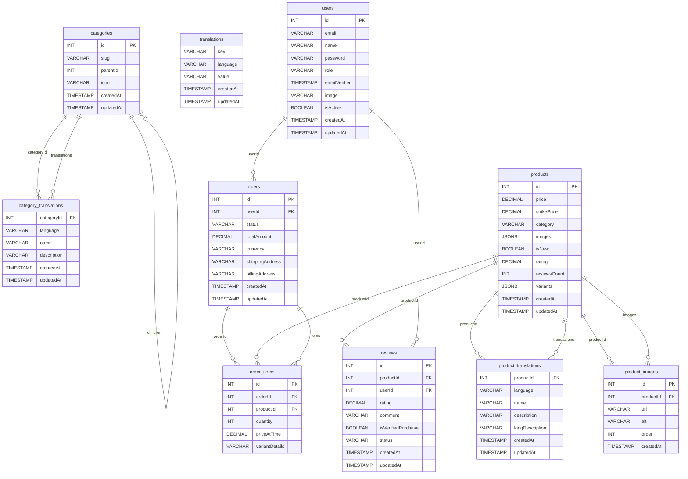

# Database Schema

This file is auto-generated by `scripts/generate-schema-doc.js`.

```mermaid
erDiagram
    categories {
        INT id PK
        VARCHAR slug 
        INT parentId 
        VARCHAR icon 
        TIMESTAMP createdAt 
        TIMESTAMP updatedAt 
    }
    category_translations {
        INT categoryId FK
        VARCHAR language 
        VARCHAR name 
        VARCHAR description 
        TIMESTAMP createdAt 
        TIMESTAMP updatedAt 
    }
    orders {
        INT id PK
        INT userId FK
        VARCHAR status 
        DECIMAL totalAmount 
        VARCHAR currency 
        VARCHAR shippingAddress 
        VARCHAR billingAddress 
        TIMESTAMP createdAt 
        TIMESTAMP updatedAt 
    }
    order_items {
        INT id PK
        INT orderId FK
        INT productId FK
        INT quantity 
        DECIMAL priceAtTime 
        VARCHAR variantDetails 
    }
    products {
        INT id PK
        DECIMAL price 
        DECIMAL strikePrice 
        VARCHAR category 
        JSONB images 
        BOOLEAN isNew 
        DECIMAL rating 
        INT reviewsCount 
        JSONB variants 
        TIMESTAMP createdAt 
        TIMESTAMP updatedAt 
    }
    product_translations {
        INT productId FK
        VARCHAR language 
        VARCHAR name 
        VARCHAR description 
        VARCHAR longDescription 
        TIMESTAMP createdAt 
        TIMESTAMP updatedAt 
    }
    product_images {
        INT id PK
        INT productId FK
        VARCHAR url 
        VARCHAR alt 
        INT order 
        TIMESTAMP createdAt 
    }
    reviews {
        INT id PK
        INT productId FK
        INT userId FK
        DECIMAL rating 
        VARCHAR comment 
        BOOLEAN isVerifiedPurchase 
        VARCHAR status 
        TIMESTAMP createdAt 
        TIMESTAMP updatedAt 
    }
    translations {
        VARCHAR key 
        VARCHAR language 
        VARCHAR value 
        TIMESTAMP createdAt 
        TIMESTAMP updatedAt 
    }
    users {
        INT id PK
        VARCHAR email 
        VARCHAR name 
        VARCHAR password 
        VARCHAR role 
        TIMESTAMP emailVerified 
        VARCHAR image 
        BOOLEAN isActive 
        TIMESTAMP createdAt 
        TIMESTAMP updatedAt 
    }
    categories ||--o{ category_translations : "categoryId"
    categories ||--o{ categories : "children"
    categories ||--o{ category_translations : "translations"
    users ||--o{ orders : "userId"
    orders ||--o{ order_items : "orderId"
    products ||--o{ order_items : "productId"
    orders ||--o{ order_items : "items"
    products ||--o{ product_translations : "productId"
    products ||--o{ product_images : "productId"
    products ||--o{ product_translations : "translations"
    products ||--o{ product_images : "images"
    products ||--o{ reviews : "productId"
    users ||--o{ reviews : "userId"

```
