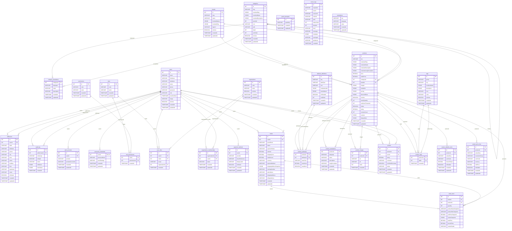

# Database Schema

This file is auto-generated by `scripts/generate-schema-doc.js`.

For target redesign planning, see `docs/database/SCHEMA_REDESIGN_TARGET.md`.

```mermaid
erDiagram
    addresses {
        INT id PK
        INT userId FK
        VARCHAR label 
        VARCHAR fullName 
        VARCHAR phone 
        VARCHAR city 
        VARCHAR area 
        VARCHAR street 
        VARCHAR building 
        VARCHAR floor 
        VARCHAR apartment 
        VARCHAR notes 
        BOOLEAN isDefault 
        TIMESTAMP createdAt 
        TIMESTAMP updatedAt 
    }
    audit_log {
        INT id PK
        INT adminUserId FK
        VARCHAR entityType 
        VARCHAR entityId 
        VARCHAR action 
        JSONB oldValues 
        JSONB newValues 
        TIMESTAMP createdAt 
    }
    brands {
        INT id PK
        VARCHAR slug 
        VARCHAR name 
        JSONB localizedName 
        JSONB localizedSlug 
        VARCHAR logoUrl 
        BOOLEAN isActive 
        TIMESTAMP createdAt 
        TIMESTAMP updatedAt 
    }
    categories {
        INT id PK
        VARCHAR slug 
        JSONB localizedSlug 
        JSONB localizedName 
        JSONB localizedDescription 
        INT parentId 
        VARCHAR icon 
        VARCHAR path 
        INT depth 
        INT sortOrder 
        BOOLEAN isActive 
        TIMESTAMP createdAt 
        TIMESTAMP updatedAt 
    }
    category_translations {
        INT categoryId FK
        VARCHAR language 
        VARCHAR name 
        VARCHAR description 
        TIMESTAMP createdAt 
        TIMESTAMP updatedAt 
    }
    auth_accounts {
        INT id PK
        INT userId FK
        VARCHAR provider 
        VARCHAR providerAccountId 
        TIMESTAMP createdAt 
        TIMESTAMP updatedAt 
    }
    password_credentials {
        INT userId PK,FK
        VARCHAR passwordHash 
        VARCHAR hashStrategy 
        TIMESTAMP createdAt 
        TIMESTAMP updatedAt 
    }
    organizations {
        INT id PK
        VARCHAR code 
        VARCHAR name 
        BOOLEAN isActive 
        TIMESTAMP createdAt 
        TIMESTAMP updatedAt 
    }
    roles {
        INT id PK
        VARCHAR code 
        VARCHAR name 
        TIMESTAMP createdAt 
        TIMESTAMP updatedAt 
    }
    permissions {
        INT id PK
        VARCHAR code 
        VARCHAR name 
        TIMESTAMP createdAt 
        TIMESTAMP updatedAt 
    }
    role_permissions {
        INT roleId FK
        INT permissionId FK
        TIMESTAMP createdAt 
    }
    user_roles {
        INT id PK
        INT userId FK
        INT roleId FK
        VARCHAR scope 
        INT organizationId FK
        TIMESTAMP createdAt 
    }
    organization_memberships {
        INT id PK
        INT organizationId FK
        INT userId FK
        VARCHAR status 
        TIMESTAMP createdAt 
        TIMESTAMP updatedAt 
    }
    payment_methods {
        INT id PK
        INT userId FK
        VARCHAR provider 
        VARCHAR tokenReference 
        VARCHAR displayLabel 
        BOOLEAN isDefault 
        TIMESTAMP createdAt 
        TIMESTAMP updatedAt 
    }
    guest_principals {
        INT id PK
        VARCHAR guestKey 
        TIMESTAMP createdAt 
        TIMESTAMP updatedAt 
    }
    orders {
        INT id PK
        INT userId FK
        VARCHAR guestEmail 
        VARCHAR status 
        VARCHAR paymentStatus 
        DECIMAL subtotal 
        DECIMAL shippingCost 
        DECIMAL totalAmount 
        VARCHAR currency 
        VARCHAR paymentMethod 
        JSONB shippingAddressSnapshot 
        VARCHAR trackingNumber 
        VARCHAR adminNotes 
        VARCHAR shippingAddress 
        VARCHAR billingAddress 
        TIMESTAMP createdAt 
        TIMESTAMP updatedAt 
    }
    order_items {
        INT id PK
        INT orderId FK
        INT productId FK
        INT quantity 
        VARCHAR productNameSnapshot 
        VARCHAR productSkuSnapshot 
        DECIMAL unitPriceSnapshot 
        JSONB variantSnapshot 
        DECIMAL totalPrice 
        DECIMAL priceAtTime 
        VARCHAR variantDetails 
    }
    attribute_definitions {
        INT id PK
        VARCHAR key 
        VARCHAR dataType 
        VARCHAR unit 
        JSONB localizedLabel 
        JSONB enumValues 
        BOOLEAN isFilterable 
        INT sortOrder 
        TIMESTAMP createdAt 
        TIMESTAMP updatedAt 
    }
    product_attributes {
        INT productId FK
        INT attributeId FK
        VARCHAR valueText 
        DECIMAL valueNum 
        BOOLEAN valueBool 
    }
    products {
        INT id PK
        VARCHAR sku 
        JSONB localizedSlug 
        JSONB localizedName 
        JSONB localizedDescription 
        JSONB localizedLongDescription 
        DECIMAL price 
        DECIMAL strikePrice 
        INT categoryId FK
        INT brandId FK
        JSONB images 
        JSONB mediaSet 
        JSONB pricing 
        JSONB discountRules 
        BOOLEAN isActive 
        INT stockQuantity 
        INT lowStockThreshold 
        BOOLEAN isNew 
        DECIMAL rating 
        INT reviewsCount 
        JSONB variants 
        JSONB displayMeta 
        TIMESTAMP createdAt 
        TIMESTAMP updatedAt 
    }
    product_translations {
        INT productId FK
        VARCHAR language 
        VARCHAR name 
        VARCHAR description 
        VARCHAR longDescription 
        TIMESTAMP createdAt 
        TIMESTAMP updatedAt 
    }
    product_images {
        INT id PK
        INT productId FK
        VARCHAR url 
        VARCHAR alt 
        INT order 
        TIMESTAMP createdAt 
    }
    reviews {
        INT id PK
        INT productId FK
        INT userId FK
        DECIMAL rating 
        VARCHAR comment 
        BOOLEAN isVerifiedPurchase 
        VARCHAR status 
        TIMESTAMP createdAt 
        TIMESTAMP updatedAt 
    }
    server_logs {
        INT id PK
        VARCHAR requestId 
        INT userId 
        VARCHAR sessionId 
        VARCHAR method 
        VARCHAR path 
        INT statusCode 
        INT duration 
        VARCHAR level 
        VARCHAR message 
        JSONB metadata 
        VARCHAR userAgent 
        VARCHAR ipAddress 
        TIMESTAMP createdAt 
    }
    tags {
        INT id PK
        VARCHAR group 
        VARCHAR key 
        JSONB localizedLabel 
        JSONB description 
        VARCHAR icon 
        VARCHAR color 
        BOOLEAN isActive 
        TIMESTAMP createdAt 
        TIMESTAMP updatedAt 
    }
    product_tags {
        INT productId FK
        INT tagId FK
        TIMESTAMP createdAt 
    }
    translations {
        VARCHAR key 
        VARCHAR language 
        VARCHAR value 
        TIMESTAMP createdAt 
        TIMESTAMP updatedAt 
    }
    users {
        INT id PK
        VARCHAR email 
        VARCHAR firstName 
        VARCHAR lastName 
        VARCHAR name 
        VARCHAR phone 
        VARCHAR password 
        VARCHAR role 
        TIMESTAMP emailVerified 
        VARCHAR image 
        BOOLEAN isActive 
        TIMESTAMP createdAt 
        TIMESTAMP updatedAt 
    }
    variant_sellable_uoms {
        INT id PK
        INT productId FK
        VARCHAR variantKey 
        VARCHAR uomCode 
        DECIMAL factorToBase 
        BOOLEAN isEnabled 
        TIMESTAMP createdAt 
        TIMESTAMP updatedAt 
    }
    variant_price_lists {
        INT id PK
        INT productId FK
        VARCHAR variantKey 
        VARCHAR customerGroup 
        VARCHAR uomCode 
        VARCHAR currency 
        DECIMAL unitPrice 
        BOOLEAN isSellable 
        TIMESTAMP createdAt 
        TIMESTAMP updatedAt 
    }
    users ||--o{ addresses : "userId"
    users ||--o{ audit_log : "adminUserId"
    brands ||--o{ products : "products"
    categories ||--o{ category_translations : "categoryId"
    categories ||--o{ categories : "children"
    categories ||--o{ category_translations : "translations"
    categories ||--o{ products : "products"
    users ||--o{ auth_accounts : "userId"
    users ||--o{ password_credentials : "userId"
    roles ||--o{ role_permissions : "roleId"
    permissions ||--o{ role_permissions : "permissionId"
    users ||--o{ user_roles : "userId"
    roles ||--o{ user_roles : "roleId"
    organizations ||--o{ user_roles : "organizationId"
    organizations ||--o{ organization_memberships : "organizationId"
    users ||--o{ organization_memberships : "userId"
    users ||--o{ payment_methods : "userId"
    users ||--o{ orders : "userId"
    orders ||--o{ order_items : "orderId"
    products ||--o{ order_items : "productId"
    orders ||--o{ order_items : "items"
    products ||--o{ product_attributes : "productId"
    attribute_definitions ||--o{ product_attributes : "attributeId"
    attribute_definitions ||--o{ product_attributes : "productAttributes"
    categories ||--o{ products : "categoryId"
    brands ||--o{ products : "brandId"
    products ||--o{ product_translations : "productId"
    products ||--o{ product_images : "productId"
    products ||--o{ product_translations : "translations"
    products ||--o{ product_images : "images"
    products ||--o{ product_tags : "tags"
    products ||--o{ product_attributes : "attributes"
    products ||--o{ reviews : "productId"
    users ||--o{ reviews : "userId"
    products ||--o{ product_tags : "productId"
    tags ||--o{ product_tags : "tagId"
    tags ||--o{ product_tags : "productTags"
    users ||--o{ orders : "orders"
    users ||--o{ reviews : "reviews"
    users ||--o{ addresses : "addresses"
    users ||--o{ audit_log : "auditLogs"
    products ||--o{ variant_sellable_uoms : "productId"
    products ||--o{ variant_price_lists : "productId"

```
