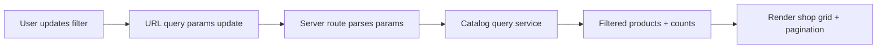
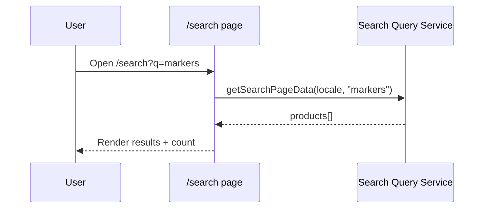
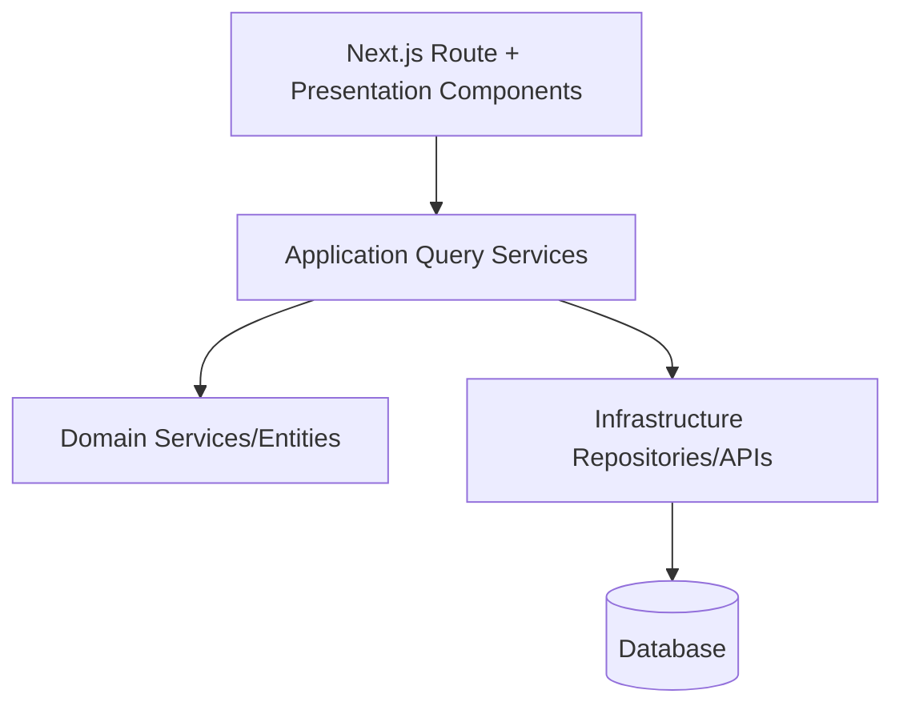
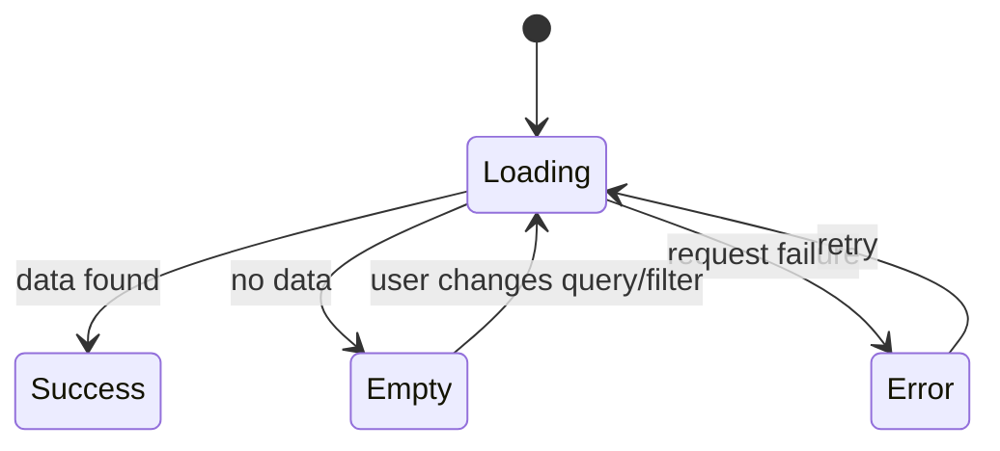

# Next Phase Feature Spec: Public E-Stationary Shop Completion

Last updated: 2026-02-17  
Status: Ready for implementation planning

## 1) Executive Summary

This phase completes the public buyer storefront before private school-access features.
Primary objective: deliver a coherent, production-ready shopping experience across discovery, listing, purchase, and account continuity.

## 2) Business Context

## 2.1 Problem

Core routes now exist (`/shop`, `/categories`, `/search`, `/checkout`), but feature depth is uneven:
- listing/filter behavior is partially mock-driven
- search and category discovery are basic
- account continuity (profile/history) is not complete
- quality gates need broader buyer-flow coverage

## 2.2 Business Goals

1. Increase conversion by improving product discovery and browse-to-checkout flow.
2. Reduce user drop-off from inconsistent filtering/search UX.
3. Establish stable quality gates for safe iteration.

## 2.3 Success Metrics

- Search-to-product-click rate increases.
- Checkout-start to order-submit completion improves.
- Reduced storefront regressions after deploy (CI gate pass + smoke E2E coverage).

## 3) Scope

## 3.1 In Scope

1. `/shop` listing parity with real filter/sort URL-state flow.
2. `/search` feature completion and robust empty/no-result states.
3. `/categories` index enhancement with richer category discovery metadata.
4. Buyer account continuity (`/my-account` profile + order history/detail basics).
5. Quality gates for buyer critical path.

## 3.2 Out of Scope

1. School private-access implementation (deferred; already spec’d separately).
2. School admin dashboard.
3. Major redesign of backend domain model.

## 4) Feature Breakdown (Business + Technical)

## 4.1 Feature A: Shop Listing Parity (`/shop`)

### Business intent

Allow buyers to reliably browse catalog by meaningful constraints (category, brand, price, sort) with URL-shareable states.

### Functional requirements

1. Filter options derive from real data or configured facets.
2. URL query state is canonical source (`categories`, `brands`, `price`, `sort`, `page`).
3. Filter changes reflect immediately in results and pagination.
4. Clear-all resets to baseline listing.

### Technical design

- Convert existing filter sidebar from mock arrays to service-backed options.
- Normalize query param parsing and defaults in server route layer.
- Keep product rendering in existing presentation components.

### Data flow

## 4.2 Feature B: Search Completion (`/search`)

### Business intent

Support quick discovery with clear query behavior and predictable result UX.

### Functional requirements

1. `?q=` drives server query.
2. Empty query shows prompt/help state, not fake results.
3. No-result state gives actionable guidance.
4. Search results can be shared via URL.

### Technical design

- Reuse `getSearchPageData(language, query)`.
- Add result metadata block (count/query echo).
- Keep UI states explicit: empty query, loading, no results, results.

### Sequence

## 4.3 Feature C: Category Discovery (`/categories`)

### Business intent

Improve category-led shopping entry point and reduce friction into `/categories/[slug]`.

### Functional requirements

1. Category index includes clear title/description and cards.
2. Optional product count per category (if available).
3. Empty/error/loading states are standardized.

### Technical design

- Start with existing category cards + service data.
- Add count enrichment where query cost is acceptable.

## 4.4 Feature D: Buyer Account Continuity (`/my-account`)

### Business intent

Increase trust and repeat purchase by exposing profile and order history basics.

### Functional requirements

1. Authenticated user profile summary and editable fields.
2. Order history list with status/total/date.
3. Order detail drill-down for past orders.
4. Protected route behavior with auth guard.

### Technical design

- Build on existing dashboard/account templates.
- Normalize loading/empty/error states.
- Ensure auth middleware/guards are consistent.

## 4.5 Feature E: Quality Gates Expansion

### Business intent

Prevent regressions in core buyer journey during rapid iteration.

### Functional requirements

1. Smoke E2E for:
   - browse/listing
   - add to cart
   - checkout submit path
2. CI must pass:
   - `type-check`
   - `lint`
   - `build`

### Technical design

- Add lightweight E2E harness for critical path only.
- Keep tests deterministic and data-minimal.

## 5) System Architecture View

## 6) State Model (Storefront Pages)

All target pages must implement these states:

1. `loading`
2. `empty`
3. `error`
4. `success`

## 7) Non-Functional Requirements

1. Accessibility:
   - semantic landmarks/headings
   - keyboard reachable controls
   - ARIA labels for non-text controls
2. Localization:
   - EN/AR parity for all new UI copy
3. Performance:
   - avoid unnecessary client components
   - preserve cache usage in query layer

## 8) Risks and Mitigations

1. Risk: query/filter logic drifts across routes.
   - Mitigation: centralize query parsing contracts.
2. Risk: slow category count computation.
   - Mitigation: optional/async count enrichment and caching.
3. Risk: E2E fragility.
   - Mitigation: smoke-level scope and stable selectors.

## 9) Implementation Plan (Recommended Order)

1. Feature A: `/shop` real filters/sort + URL-state.
2. Feature B: `/search` robust query states.
3. Feature C: `/categories` enhancement.
4. Feature D: `/my-account` continuity.
5. Feature E: E2E + quality hardening.

## 10) Acceptance Criteria (Phase Exit)

1. Buyer can discover products from `/shop`, `/categories`, and `/search` without dead states.
2. Filter/search URL states are shareable and reproducible.
3. Buyer account route provides basic profile + order history continuity.
4. Critical buyer path is covered by smoke E2E and CI gates pass.

## 11) Related Docs

- `project-planning/MISSING_FLOWS_MATRIX.md`
- `project-planning/USE_CASE_BACKLOG.md`
- `docs/testing/FRONTEND_TEST_MASTER_PLAN.md`
- `docs/features/SCHOOL_LIST_PRIVATE_ACCESS_FEATURE_SPEC.md`
