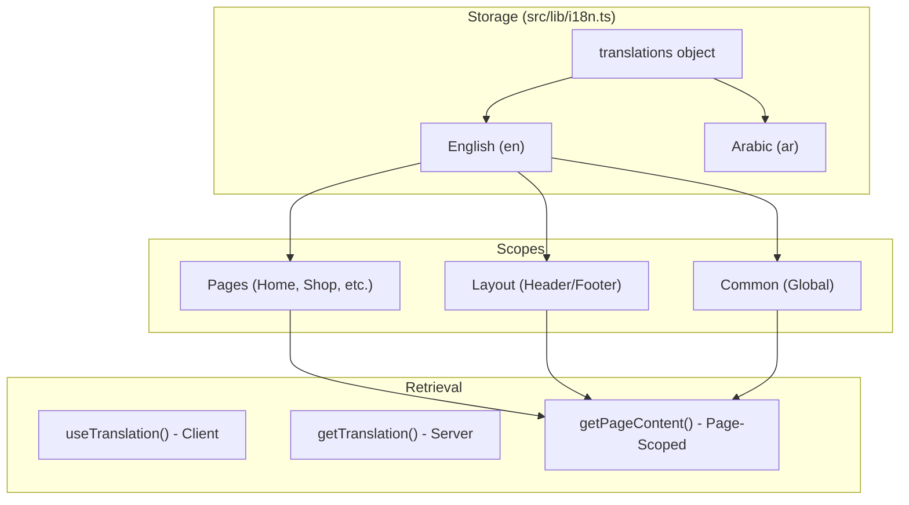

# CMS Static Content & Internationalization

This guide explains how to manage static UI text, translations, and CMS content in the FindEg application.

## 🏗️ Architecture

The system uses a **Page-Based Scoped Structure**. Translations are nested by their scope (common, layout, or a specific page).



## 📂 Structure Example (Localized-at-Leaf)

Translations are located in `src/lib/i18n.ts`. Each leaf node is an object containing all supported languages.

```ts
export const translations = {
  common: {
    save: { en: 'Save', ar: 'حفظ' }
  },
  layout: {
    header: { 
      cart: { en: 'Cart', ar: 'العربة' } 
    }
  },
  pages: {
    home: {
      hero: { 
        title: { en: 'Welcome', ar: 'مرحبا' } 
      }
    }
  }
}
```

This ensures that for any piece of content, translations are kept physically together, reducing the risk of missing a language.

## 📖 Usage Patterns

### 1. Using Scoped Translation (Dot Notation)
Both the client hook and server helper support dot notation for deep keys.

**Server Component:**
```tsx
import { getTranslation } from '@/lib/i18n-server';

export default function Page() {
  const { t } = getTranslation('en');
  return <h1>{t('pages.home.hero.title')}</h1>;
}
```

**Client Component:**
```tsx
'use client';
import { useTranslation } from '@/presentation/shared/hooks/useTranslation';

export function Component() {
  const { t } = useTranslation();
  return <button>{t('common.save')}</button>;
}
```

### 2. Page-Wide Content Fetching
For pages with many static labels, use `getPageContent` to get a structured object.

```tsx
import { getPageContent } from '@/lib/static-content';

export default function HomePage({ params: { lang } }) {
  const content = getPageContent('home', lang);
  
  return (
    <Hero 
      title={content.hero.title_part1} 
      subtitle={content.hero.subtitle}
      cta={content.common.save}
    />
  );
}
```

## ➕ Adding New Content

1. Open `src/lib/i18n.ts`.
2. Find the language you want to edit (`en` or `ar`).
3. If it's for a new page, add a new key under `pages`.
4. Add your key-value pairs.
5. (Optional) Run `npm run lint` to ensure no syntax errors.

## 🔄 Dynamic Content (CMS)

While static content is in `i18n.ts`, dynamic content (products, categories) is fetched from the database/CMS.
- **Static**: "Add to Cart", "Contact Us", "Summer Sale".
- **Dynamic**: Product Name, Price, Category Description.

Use Case Diagram for Content Population:
```mermaid
useCaseDiagram
    actor Developer
    actor System
    
    package "Build Time (SSG)" {
        Developer -- (Define Static Keys)
        System -- (Inject into HTML)
    }
    
    package "Run Time (SSR/Client)" {
        System -- (Resolve with Language Context)
        System -- (Replace placeholders {name})
    }
```
