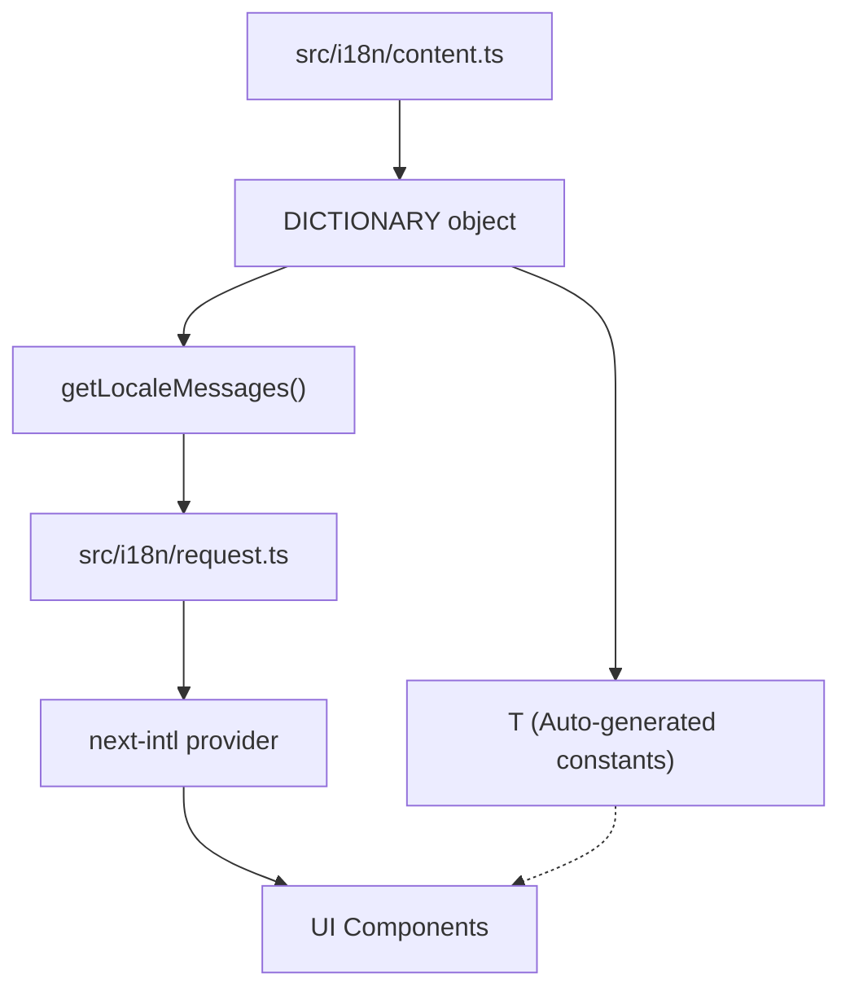

# CMS Static Content & Internationalization

This guide explains how to manage static UI text and translations in the FindEg application using our **Single Source of Truth** system.

## 🏗️ Architecture

All static content is centralized in `src/i18n/content.ts`. This file serves as the definitive source for both English and Arabic text.



## 📂 Organisation

Translations are grouped by scope:
- **COMMON**: UI Primitives (Save, Cancel, Loading)
- **LAYOUT**: Shared elements (Header, Footer, Nav)
- **PAGES**: Content specific to a route (Home, Shop, Product Detail)

## 📖 Usage Patterns

### 1. In Components (Server or Client)

We use the `useTranslations` hook from `next-intl` combined with the type-safe `T` constant.

```tsx
import { useTranslations } from 'next-intl';
import { T } from '@/i18n/content';

export function MyComponent() {
  const t = useTranslations();
  
  // T.COMMON.SAVE is auto-completed by your IDE
  return <button>{t(T.COMMON.SAVE)}</button>;
}
```

### 2. Formatting (Placeholders)

You can use standard `next-intl` interpolation:

**In `content.ts`**:
`WELCOME: { en: 'Welcome, {name}!', ar: 'مرحباً، {name}!' }`

**In component**:
`t(T.PAGES.MY_ACCOUNT.WELCOME, { name: 'Ali' })`

## ➕ Adding New Content

This is the **single step** needed to add new content:

1.  Open `src/i18n/content.ts`.
2.  Add your key-value pair to the appropriate group in `DICTIONARY`.
    ```ts
    MY_NEW_KEY: { en: 'New Text', ar: 'نص جديد' }
    ```
3.  Use it immediately in your code via `T.GROUP.MY_NEW_KEY`.

## 🔄 Dynamic vs Static Content

- **Static (Managed in `content.ts`)**: Buttons, Nav labels, Error messages, Placeholder text.
- **Dynamic (Managed in Database)**: Product titles, prices, descriptions, images.

For dynamic content, translations are handled via the database schema and service layer.
