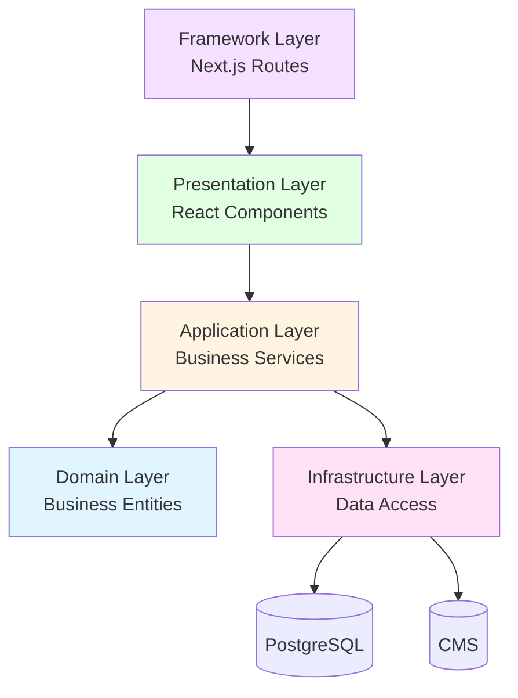

# Onboarding Guide for New Developers

Welcome to the FindEg.com e-commerce platform! This guide will help you understand the codebase architecture and get started quickly.

## Table of Contents

1. [Quick Start](#quick-start)
2. [Architecture Overview](#architecture-overview)
3. [Project Structure](#project-structure)
4. [Key Concepts](#key-concepts)
5. [Common Tasks](#common-tasks)
6. [Development Workflow](#development-workflow)
7. [Best Practices](#best-practices)

## Quick Start

### Prerequisites

- Node.js v18 or higher
- PostgreSQL (for database)
- npm or yarn

### Setup

1. **Clone and Install**
   ```bash
   git clone <repository-url>
   cd 27-10-2025ecommerceV2
   npm install
   ```

2. **Environment Setup**
   ```bash
   cp .env.example .env
   # Edit .env with your configuration
   ```

3. **Database Setup**
   ```bash
   npm run db:migrate
   npm run db:seed
   ```

4. **Run Development Server**
   ```bash
   npm run dev
   ```

5. **Open Browser**
   ```
   http://localhost:3000
   ```

## Architecture Overview

Our application follows **Clean Architecture** principles with clear layer separation:



### Layer Responsibilities

1. **Domain Layer**: Core business entities and rules (no dependencies)
2. **Application Layer**: Business services and use cases
3. **Infrastructure Layer**: Database, CMS, external services
4. **Presentation Layer**: React components (Server/Client)
5. **Framework Layer**: Next.js routes and configuration

**Key Rule**: Dependencies flow inward. Outer layers depend on inner layers, not vice versa.

## Project Structure

```
src/
├── domain/                 # Business entities and types
│   ├── entities/          # Product, Cart, etc.
│   └── types/             # Domain types
│
├── application/            # Business services
│   ├── repositories/      # Repository interfaces
│   └── services/          # Business services
│
├── infrastructure/        # External concerns
│   ├── database/          # Drizzle schemas and migrations
│   ├── repositories/      # Repository implementations
│   ├── translations/      # Translation infrastructure
│   └── di/                # Dependency injection
│
├── presentation/           # UI layer
│   ├── components/         # React components
│   │   ├── server/        # Server Components (pure UI)
│   │   ├── client/        # Client Components (interactivity)
│   │   └── containers/    # Container Components
│   ├── hooks/             # React hooks
│   ├── providers/         # Context providers
│   └── server/            # Server-side utilities
│
└── app/                   # Next.js routes
    ├── (shop)/            # Shop routes
    ├── (dashboard)/       # Dashboard routes
    └── (auth)/            # Auth routes
```

## Key Concepts

### Server vs Client Components

**Server Components** (default):
- Run on the server
- Can call services directly (no hooks)
- Pure UI, no state
- Can be async

**Client Components**:
- Run in the browser
- Use hooks for state
- Handle interactivity
- Must have 'use client'

**Decision Tree**:
```
Need interactivity?
├─ NO → Server Component (default)
└─ YES → Client Component ('use client')
```

### Translation Strategy

**Static Translations** (CMS):
- UI labels, headers, buttons
- Fetched at build time
- Embedded in HTML

**Dynamic Translations** (Database):
- Product names, descriptions
- Fetched at runtime
- Stored in database

### Component Patterns

1. **Server Component**: Pure UI, receives props
2. **Client Component**: Interactive, uses hooks
3. **Container Component**: Wraps Server Component with logic

## Common Tasks

### Adding a New Feature

1. **Define Domain Entity** (if needed)
   ```typescript
   // src/domain/entities/MyEntity.ts
   export interface MyEntity {
     id: number;
     name: string;
   }
   ```

2. **Create Repository Interface**
   ```typescript
   // src/application/repositories/IMyRepository.ts
   export interface IMyRepository {
     getAll(): Promise<MyEntity[]>;
   }
   ```

3. **Implement Repository**
   ```typescript
   // src/infrastructure/repositories/DatabaseMyRepository.ts
   export class DatabaseMyRepository implements IMyRepository {
     async getAll(): Promise<MyEntity[]> {
       // Database implementation
     }
   }
   ```

4. **Create Server Component**
   ```typescript
   // src/presentation/components/server/organisms/MyList.tsx
   import { getMyService } from '@/presentation/server/getServices';

   export async function MyList() {
     const service = getMyService();
     const items = await service.getAll();
     return <div>{/* render items */}</div>;
   }
   ```

### Adding a New Page

1. **Create Route File**
   ```typescript
   // src/app/my-page/page.tsx
   import { MyPageTemplate } from '@/presentation/components/server/templates/MyPageTemplate';

   export default function MyPage() {
     return <MyPageTemplate />;
   }
   ```

2. **Create Template**
   ```typescript
   // src/presentation/components/server/templates/MyPageTemplate.tsx
   export async function MyPageTemplate() {
     // Fetch data, render UI
   }
   ```

### Using Translations

**Static Translation (Server Component)**:
```typescript
import { getStaticTranslation } from '@/infrastructure/translations/static';

export async function MyComponent() {
  const t = await getStaticTranslation('en');
  return <h1>{t('my_title')}</h1>;
}
```

**Dynamic Translation (Already in Entity)**:
```typescript
const product = await productService.getById(id, 'en');
return <h1>{product.name}</h1>; // Already translated
```

## Development Workflow

### 1. Start Development

```bash
npm run dev
```

### 2. Make Changes

- Follow the architecture layers
- Add comments for clarity
- Test your changes

### 3. Database Changes

```bash
# Generate migration
npm run db:generate

# Run migration
npm run db:migrate

# Seed database
npm run db:seed
```

### 4. Testing

```bash
# Run tests (when implemented)
npm test

# Type checking
npm run type-check

# Linting
npm run lint
```

## Best Practices

### Code Organization

1. **Follow Layer Structure**: Put code in the right layer
2. **Server Components First**: Default to Server Components
3. **Clear Naming**: Use descriptive names
4. **Comments**: Add comments explaining complex logic

### Component Development

1. **Server Components**: Pure UI, no logic
2. **Client Components**: Only when needed for interactivity
3. **Container Pattern**: Separate logic from UI
4. **Reusability**: Make components reusable

### Data Access

1. **Use Services**: Don't access repositories directly
2. **Server Components**: Call services directly
3. **Client Components**: Use hooks
4. **Error Handling**: Always handle errors

### Translations

1. **Static**: Use for UI labels
2. **Dynamic**: Use for content
3. **Language Parameter**: Always pass language
4. **Fallbacks**: Provide fallback values

## Learning Resources

### Internal Documentation

- [Domain Layer](../architecture/01-domain-layer.md)
- [Application Layer](../architecture/02-application-layer.md)
- [Infrastructure Layer](../architecture/03-infrastructure-layer.md)
- [Presentation Layer](../architecture/04-presentation-layer.md)
- [Framework Layer](../architecture/05-framework-layer.md)
- [Translation Strategy](../translations/README.md)

### External Resources

- [Next.js App Router](https://nextjs.org/docs/app)
- [React Server Components](https://react.dev/blog/2023/03/22/react-labs-what-we-have-been-working-on-march-2023#react-server-components)
- [Drizzle ORM](https://orm.drizzle.team/)
- [Clean Architecture](https://blog.cleancoder.com/uncle-bob/2012/08/13/the-clean-architecture.html)

## Getting Help

1. **Check Documentation**: Read the layer-specific docs
2. **Look at Examples**: Check existing code for patterns
3. **Ask Questions**: Reach out to the team
4. **Code Reviews**: Learn from code reviews

## Next Steps

1. Read the [Architecture Overview](#architecture-overview)
2. Explore the [Project Structure](#project-structure)
3. Try a [Common Task](#common-tasks)
4. Read layer-specific documentation
5. Start contributing!

Welcome to the team! 🚀
