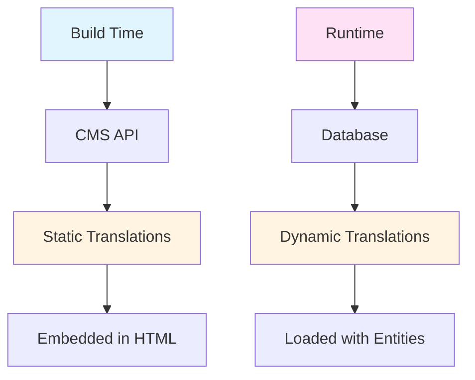

# Translation Strategy Documentation

## Overview

Our application uses a **dual translation strategy**:
1. **Static Translations**: UI labels, headers, buttons (from CMS at build time)
2. **Dynamic Translations**: Product names, descriptions, content (from database at runtime)

## Translation Types

### Static Translations (CMS)

**Source**: Content Management System (CMS)
**When**: Fetched at build time
**Storage**: Embedded in HTML
**Content**: UI labels, headers, buttons, static text

**Examples**:
- "Featured Products" (section header)
- "Add to Cart" (button label)
- "Shop Now" (CTA button)
- Navigation menu items
- Footer links

### Dynamic Translations (Database)

**Source**: PostgreSQL database
**When**: Fetched at runtime
**Storage**: Database tables with language columns/relations
**Content**: Product names, descriptions, categories, user-generated content

**Examples**:
- Product name in English/Arabic
- Product description in multiple languages
- Category names
- Review comments

## Architecture



## Implementation

### Static Translations

#### Server Component Usage

```typescript
/**
 * Server Component using static translations
 *
 * Translations are fetched at build time from CMS
 */
import { getStaticTranslation } from '@/infrastructure/translations/static';

export async function HomePage({ language = 'en' }: { language?: string }) {
  // Get static translations from CMS (build time)
  const t = await getStaticTranslation(language);

  return (
    <section>
      <h2>{t('featured_products_title')}</h2>
      <p>{t('featured_products_subtitle')}</p>
      <button>{t('add_to_cart')}</button>
    </section>
  );
}
```

#### Client Component Usage

```typescript
'use client';

/**
 * Client Component using static translations
 *
 * Uses hook for client-side translations
 */
import { useStaticTranslation } from '@/presentation/hooks/useStaticTranslation';

export function AddToCartButton() {
  const { t } = useStaticTranslation();

  return <button>{t('add_to_cart')}</button>;
}
```

### Dynamic Translations

#### Database Schema

```typescript
/**
 * Product Translations Table
 *
 * Stores language-specific product information
 */
export const productTranslations = pgTable('product_translations', {
  id: serial('id').primaryKey(),

  // Foreign key to products table
  productId: integer('product_id')
    .notNull()
    .references(() => products.id, { onDelete: 'cascade' }),

  // Language code (e.g., 'en', 'ar')
  language: text('language').notNull(),

  // Translated content
  name: text('name').notNull(),
  description: text('description').notNull(),
  longDescription: text('long_description').notNull(),

  // Timestamps
  createdAt: timestamp('created_at').defaultNow().notNull(),
  updatedAt: timestamp('updated_at').defaultNow().notNull(),
}, (table) => ({
  // Composite primary key: one translation per product per language
  pk: primaryKey({ columns: [table.productId, table.language] }),
}));
```

#### Repository Implementation

```typescript
/**
 * Repository loads translations with entities
 */
export class DatabaseProductRepository implements IProductRepository {
  async getById(id: number, language: string = 'en'): Promise<Product | null> {
    const result = await db
      .select({
        product: products,
        translation: productTranslations,
      })
      .from(products)
      .leftJoin(
        productTranslations,
        and(
          eq(productTranslations.productId, products.id),
          eq(productTranslations.language, language)
        )
      )
      .where(eq(products.id, id))
      .limit(1);

    // Map database results to domain entities
    return this.mapToDomain(result[0].product, result[0].translation);
  }
}
```

#### Component Usage

```typescript
/**
 * Server Component using dynamic translations
 *
 * Product data already includes translations from database
 */
import { getProductService } from '@/presentation/server/getServices';

export async function ProductDetail({ productId }: { productId: number }) {
  const productService = getProductService();

  // Product already includes translations based on language
  const product = await productService.getById(productId, 'en');

  return (
    <div>
      <h1>{product.name}</h1> {/* Already translated */}
      <p>{product.description}</p> {/* Already translated */}
    </div>
  );
}
```

## Translation Flow

### Static Translation Flow

```
1. Build Time
   ↓
2. CMS API Call
   ↓
3. Fetch Translations
   ↓
4. Embed in HTML
   ↓
5. Server Component Renders
```

### Dynamic Translation Flow

```
1. Request with Language
   ↓
2. Repository Query
   ↓
3. Join Translation Table
   ↓
4. Map to Domain Entity
   ↓
5. Return Translated Entity
```

## Language Detection

### Server-Side

```typescript
/**
 * Detect language from request
 */
export function getLanguageFromRequest(
  headers: Headers
): string {
  // Check Accept-Language header
  const acceptLanguage = headers.get('accept-language');

  // Check custom header
  const customLanguage = headers.get('x-language');

  // Default to 'en'
  return customLanguage || acceptLanguage?.split(',')[0] || 'en';
}
```

### Client-Side

```typescript
'use client';

/**
 * Client-side language detection
 */
import { useLanguage } from '@/presentation/hooks/useLanguage';

export function LanguageSwitcher() {
  const { language, setLanguage } = useLanguage();

  return (
    <select value={language} onChange={(e) => setLanguage(e.target.value)}>
      <option value="en">English</option>
      <option value="ar">العربية</option>
    </select>
  );
}
```

## Best Practices

### Static Translations

1. **Build Time**: Fetch at build time, not runtime
2. **Cache**: Cache translations in build process
3. **Fallback**: Provide fallback keys if translation missing
4. **Type Safety**: Use typed translation keys

### Dynamic Translations

1. **Load with Entity**: Load translations when loading entities
2. **Language Parameter**: Always pass language parameter
3. **Fallback**: Fallback to default language if translation missing
4. **Efficient Queries**: Use JOINs to load translations efficiently

### General

1. **Consistent Keys**: Use consistent translation key naming
2. **Documentation**: Document translation keys
3. **Testing**: Test with multiple languages
4. **RTL Support**: Handle RTL languages (Arabic) properly

## Translation Key Naming

### Static Translation Keys

```
Format: [section]_[element]_[type]

Examples:
- featured_products_title
- add_to_cart_button
- shop_now_cta
- nav_home_link
- footer_copyright_text
```

### Dynamic Translation Keys

Dynamic content doesn't use keys - it's stored directly in database:
- Product name: `product.name` (translated)
- Product description: `product.description` (translated)
- Category name: `category.name` (translated)

## File Structure

```
src/infrastructure/
├── translations/
│   ├── static.ts          # Static translation service (CMS)
│   └── dynamic.ts         # Dynamic translation utilities
│
└── cms/
    └── client.ts          # CMS API client

src/presentation/
├── hooks/
│   └── useStaticTranslation.ts  # Client-side static translations
│
└── server/
    └── getServices.ts     # Server-side service access
```

## Examples

### Example 1: Home Page with Both Types

```typescript
/**
 * Home Page using both static and dynamic translations
 */
import { getProductService } from '@/presentation/server/getServices';
import { getStaticTranslation } from '@/infrastructure/translations/static';

export async function HomePage({ language = 'en' }: { language?: string }) {
  // Static translations (CMS)
  const t = await getStaticTranslation(language);

  // Dynamic translations (Database)
  const productService = getProductService();
  const products = await productService.getFeaturedProducts(8, language);

  return (
    <>
      {/* Static translation */}
      <h2>{t('featured_products_title')}</h2>

      {/* Dynamic translations (already translated) */}
      {products.map(product => (
        <ProductCard key={product.id} product={product} />
      ))}
    </>
  );
}
```

### Example 2: Product Detail Page

```typescript
/**
 * Product Detail with translations
 */
export async function ProductDetailPage({
  params,
}: {
  params: Promise<{ id: string }>;
}) {
  const { id } = await params;
  const language = getLanguageFromRequest(); // Detect language

  const productService = getProductService();
  const product = await productService.getById(parseInt(id), language);

  if (!product) {
    notFound();
  }

  // Product name and description are already translated
  return (
    <div>
      <h1>{product.name}</h1>
      <p>{product.description}</p>
    </div>
  );
}
```

## Related Documentation

- [Infrastructure Layer](../architecture/03-infrastructure-layer.md) - Translation infrastructure
- [Presentation Layer](../architecture/04-presentation-layer.md) - Using translations in components
- [Application Layer](../architecture/02-application-layer.md) - Services handling translations
