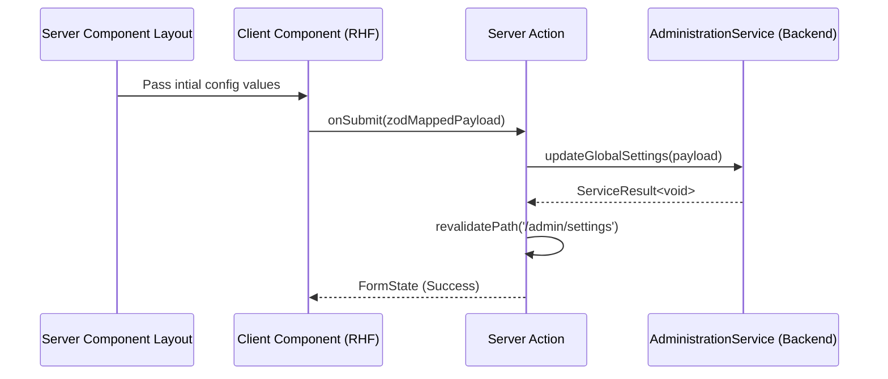

# Dashboard Administration Feature

The **Dashboard Administration Feature** surfaces the operational UI primitives required for platform-level management (staff, config, audit).

## 🎯 Technical Responsibilities

- **Staff Hydration Rendering**: Listing the complex RBAC associations for staff via the UI.
- **Server Action Passthrough**: Exporting localized form actions (`createStaff`, `updateSettings`) bridging directly to `@findeg/backend/features/administration`.
- **Zod UI Mapping**: Constructing React Hook Form schemas inheriting natively from the backend's zod definitions.

---

## 🏗️ UI Architecture

### Presentation Structure

- **Groups**: Located in `src/app/[locale]/admin/(dashboard)/...`.
- **Layouts**: Heavy reliance on Next.js 16 nested layouts to render the `NavigationProvider` Sidebar fetched from the backend.
- **Data Tables**: Headless UI table configurations filtering Audit logs directly via Next.js Search Parameters (`?page=1&query=X`).

---

## 🔄 Interaction Flow

---

## 🔐 Boundaries & Constraints

- **Never Native Fetch**: Dashboard components MUST NOT initialize raw API calls or connect to Postgres. All queries are strictly executed via synchronous importing of `packages/backend` services within Next.js Server Components.

---

&copy; 2026 FindEg.com
