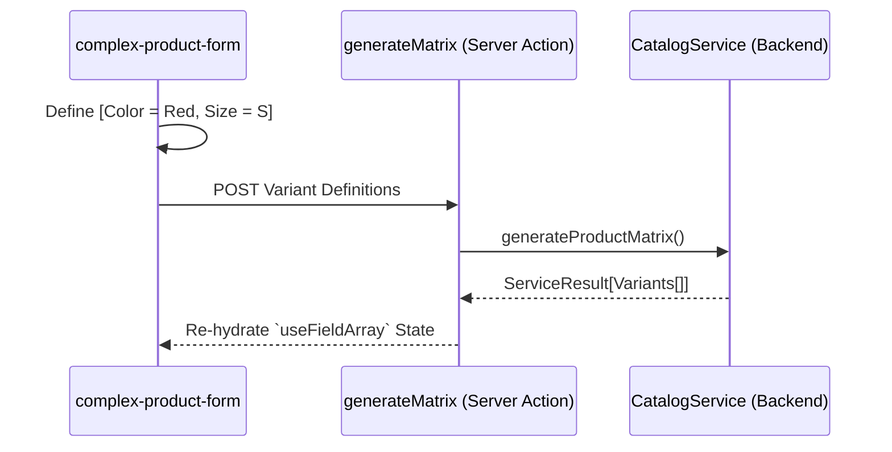

# Dashboard Catalog Feature

The **Dashboard Catalog Feature** provides the incredibly dense administrative interfaces handling PIM, Variants logic, and multi-unit forms.

## 🎯 Technical Responsibilities

- **Matrix UI Generation**: Complex Client Components rendering combinatorial Variant matrices (Size x Color + Price Overrides) via `useFieldArray`.
- **Locale Mirroring**: Specialized translation inputs generating `LocalizedString` DB payloads dynamically over AR/EN UI boundaries.
- **Image Pipeline**: Linking dashboard drag-and-drop file inputs to the backend's presigned S3/Local proxy generation endpoints.

---

## 🏗️ UI Architecture & Structure

- **Physical Paths**: Located under `src/app/[locale]/admin/(dashboard)/products`.
- **Form Patterns**: Strictly enforcing Uncontrolled React-Hook-Form bindings to prevent catastrophic re-renders when generating 100+ matrix variant inputs simultaneously.

---

## 🔄 Complex Mutation Flow

---

## 🔐 Boundaries & Constraints

- **Zod Inheritance**: Dashboard UI schemas (`CatalogFormSchema.ts`) must extend or compose the strict backend value-objects (e.g., `LocalizedStringSchema`) to guarantee 1:1 validation parity.
- **Action Safe Mapping**: Data retrieved from `CatalogService` MUST be plain serialized objects. `Date` objects or raw Classes returned from the backend must be mapped via `toDTO()` before crossing the `use server` barrier to the UI tree.

---

&copy; 2026 FindEg.com
