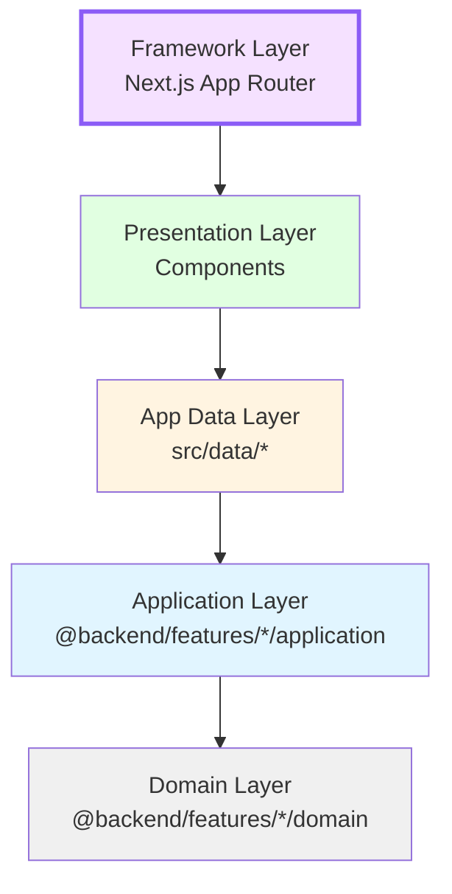

# 🔴 App Layer (Next.js Routing)

> **The entry point layer.** Follows Next.js 16 App Router conventions. Route files should be **thin orchestrators** — they fetch data via the **App Data Layer** and delegate rendering to components/templates.

---

## Architecture Position



**Key Rule**: Framework Layer is the entry point. It uses Presentation layer components and fetches data via the App Data Layer (which implements caching).

---

## Purpose

The `app/` directory defines **WHERE things are accessed** — URL routes, layouts, loading states, and error boundaries. It uses Next.js App Router conventions and should contain minimal logic beyond layout composition. Data fetching is delegated to the `src/data/` layer to leverage Next.js 16 Cache Components.

---

## Directory Structure

```
app/
├── globals.css                # Global CSS
└── [locale]/                  # i18n locale segment
    ├── layout.tsx             # Root layout (fonts, providers, metadata)
    ├── error.tsx              # Global error boundary
    ├── not-found.tsx          # Global 404
    ├── (storefront)/          # Public shop route group
    │   ├── layout.tsx         # Storefront layout (Header, Footer)
    │   ├── page.tsx           # Home page
    │   ├── _components/       # Shared shop components
    │   ├── shop/              # /shop route
    │   ├── product/[id]/      # /product/:id route
    │   └── categories/        # /categories route
    ├── (auth)/                # Auth route group
    │   ├── layout.tsx
    │   ├── login/
    │   └── registration/
    └── (dashboard)/           # Customer dashboard group
        ├── layout.tsx
        ├── dashboard/
        └── my-account/
```

---

## Import Rules

### ✅ Allowed Imports

| Source                                | Why                                                    |
| ------------------------------------- | ------------------------------------------------------ |
| `@/data/*`                            | **Mandatory**: Fetch data via cached data layer        |
| `@backend/features/*/domain`          | For typing data passed to components                   |
| `@components/*` or `@features/*/ui/*` | Route files render components                          |
| `@/hooks/*`, `@/providers/*`          | Layouts compose providers; client components use hooks |
| `@/data/*/actions`                    | Client components call server actions                  |
| `@/lib/*`                             | Constants, utilities, UI types                         |
| `next/*`, `next-intl/*`               | Framework APIs (navigation, headers, metadata)         |

### ❌ Forbidden Imports

| Source                               | Why                                                    |
| ------------------------------------ | ------------------------------------------------------ |
| `@backend/features/*/infrastructure` | **CRITICAL**: Apps must NEVER touch databases directly |
| `@backend/features/*/application`    | Don't call backend services directly — use `@/data/*`  |
| `@server/getServices`                | **DEPRECATED**: Use the new App Data Layer instead     |

---

## Key Patterns

### Thin Route Files

```typescript
// ✅ GOOD — app/[locale]/(storefront)/page.tsx
import { HomePageContent } from './_components/HomePageContent';
import { getHomePageData } from '@/data/catalog/queries';

export default async function Page({ params }: { params: { locale: string } }) {
  const data = await getHomePageData(params.locale);
  return <HomePageContent data={data} />;
}
```

### Data Fetching in Server Components

```typescript
// ✅ GOOD — Server Component fetches data via cached query
import { getDashboardData } from "@/data/dashboard/queries";

export default async function DashboardPage({ params }: { params: { locale: string } }) {
  const data = await getDashboardData(params.locale);
  return <DashboardView data={data} />;
}
```

---

## Adding a New Route — Checklist

1.  **Create the route directory** under the appropriate group: `(storefront)/`, `(dashboard)/`, etc.
2.  **Identify data requirements** and check if a query exists in `src/data/`.
3.  **Create/Update `@/data/{feature}/queries.ts`** with `"use cache"` if needed.
4.  **Create `page.tsx`** — fetch data from your new query and pass to a template component.
5.  **Add `loading.tsx`** to provide an instant static shell via PPR.
6.  **Page-specific components** → co-locate in `_components/` within the route directory.

---

## Cache Management

- **Queries (`queries.ts`)**: Use `"use cache"` and `cacheTag()`/`cacheLife()`.
- **Actions (`actions.ts`)**: Use `"use server"` and `updateTag()` to invalidate related caches after mutations.
