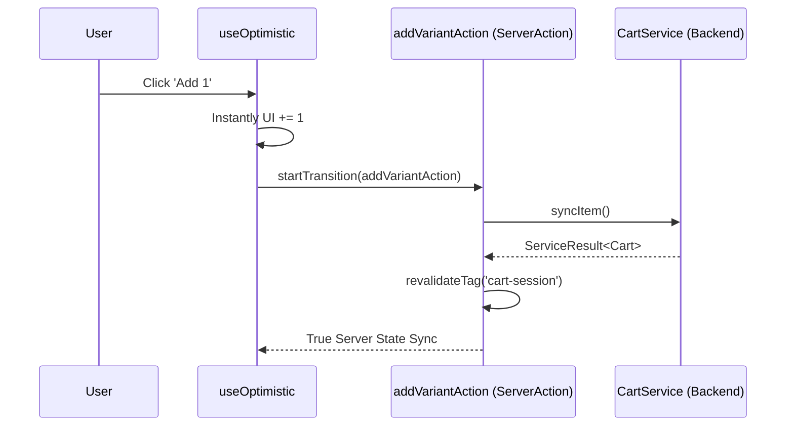

# Storefront Cart Feature

The **Storefront Cart Feature** manages the highly interactive shopping basket session using bleeding-edge React 19 / Next 16 asynchronous mutation primitives.

## 🎯 Technical Responsibilities

- **Optimistic Concurrency**: Implementing `useOptimistic` to instantly render quantity bumps while the background Server Action strictly validates it against the `packages/backend`.
- **Drawer Global Access**: Providing a top-level headless Context/Store that opens the Cart Drawer from any deeply nested sibling component.
- **Pricing Edge Calculation**: Safely hiding the actual monetary computations entirely on the Backend, and only displaying serialized strings on the Client.

---

## 🏗️ UI Architecture

### Critical Path Components

- **`AddToCartButton`**: An isolated Client Component that triggers Next.js Server Actions directly via `onClick` rather than form submissions.
- **`CartSummarySheet`**: An interactive overlay displaying the aggregated session token contents fetched from the initial SSR payload.

---

## 🔄 Optimistic Update Flow

---

## 🔐 Boundaries & Constraints

- **Never Calculate Totals**: The Storefront Cart UI MUST NEVER execute `price * quantity` math in JavaScript. It must strictly render the literal calculated output generated by `@findeg/backend/features/cart` to avoid client-side manipulation risks.
- **Authentication Handshake**: Migrating guest carts is done exclusively during the OAuth callback or local-password login boundary hook.

---

&copy; 2026 FindEg.com
