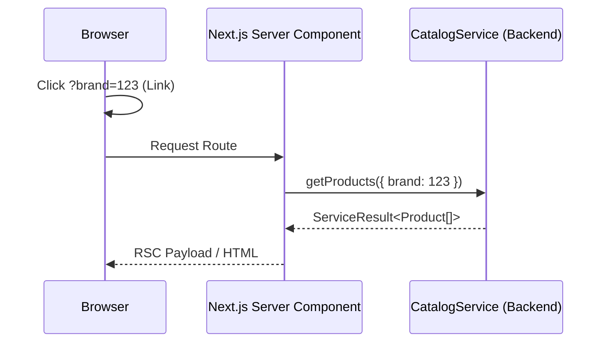

# Storefront Catalog Feature

The **Storefront Catalog Feature** orchestrates the hyper-optimized public discovery funnel. It strictly relies on Next.js 16 Server Components to guarantee maximum SEO visibility and 0kb client-side Javascript over-fetching.

## 🎯 Technical Responsibilities

- **RSC Hydration**: Rendering massive DOM trees (Product Cards, Categories) exclusively on the server before transmitting pure HTML to the edge.
- **Search Param Syncing**: Utilizing Next.js `searchParams` structurally on `page.tsx` layers to trigger cached backend filter requests.
- **Micro-Interactions**: Client components strictly cordoned off to leaf nodes (e.g. `VariantSelectionSwitch`, `ImageCarousel`).

---

## 🏗️ UI Architecture

### Presentation Layouts

- **Shop Grid (`/shop`)**: Uses Next.js dynamic routing to catch URL search params and pass them deeply into suspended generic grids.
- **PDP (`/product/[slug]`)**: Leverages exact statically generated metadata.

---

## 🔄 URL Synchronization Flow

---

## 🔐 Boundaries & Constraints

- **No Client Fetching**: The storefront MUST NEVER bundle `swr` or `react-query` to fetch catalog items. Features like infinite scroll are executed by appending URL params or using Server Actions.
- **Variant Logic Isolation**: Deep complex multi-selects for Matrix items MUST occur inside isolated Client Components, preventing the parent PDP layout from turning into `"use client"`.

---

&copy; 2026 FindEg.com
