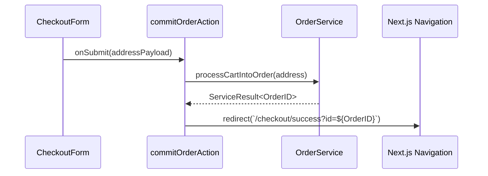

# Storefront Order Feature

The **Storefront Order Feature** surfaces the high-stakes checkout funnel. It protects user intent, validates physical addresses, and delegates secure payment handoffs.

## 🎯 Technical Responsibilities

- **Funnel Checkpoints**: Step-based Wizard rendering (`Address` -> `Review` -> `Pay`) isolating Zod validation triggers at each distinct boundary.
- **Client/Server Form Bindings**: Leveraging React Hook Form connected to Server Actions via `useActionState` to surface Drizzle errors directly in the UI.

---

## 🏗️ UI Architecture

### Checkout Primitives

- **`CheckoutStepper`**: Purely visual timeline sync hook utilizing Next.js `searchParams` for step isolation (`?step=shipping`).
- **`AddressBookSelector`**: Client heavy component retrieving backend pre-saved addresses and injecting them into the form context.
- **`PaymentPortal`**: Locked UI that acts as the final irreversible trigger to `@findeg/backend/features/order`.

---

## 🔄 Synchronous Checkout Flow

---

## 🔐 Boundaries & Constraints

- **Revalidation Strictness**: Once an order successfully submits, the Action MUST call Next.js `revalidateTag` for the user's cart cache and order history cache before executing the physical URL `redirect()`.
- **Payment Sandboxing**: 3rd-party Payment integrations (Paymob, Stripe) UI elements are strictly cordoned inside isolated `CheckoutPaymentIframe` or similar Client modules to prevent breaking Next.js hydration.

---

&copy; 2026 FindEg.com
