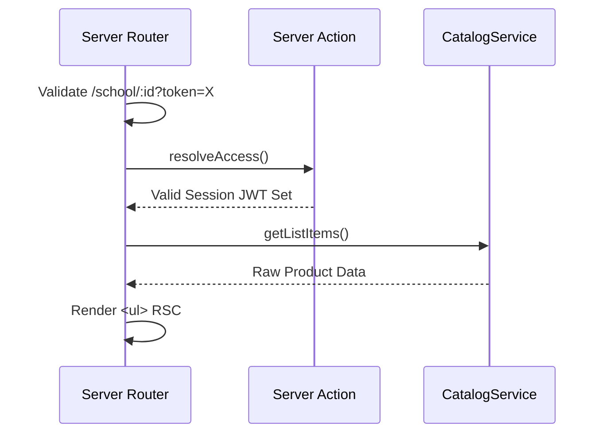

# Storefront School Feature

The **Storefront School Feature** renders strictly gated React components bridging B2B parents into authorized specific bundles.

## 🎯 Technical Responsibilities

- **URL Interception & Auth**: Validating dynamic `?token=` parameters at the Next.js `generateMetadata` and `page.tsx` boundaries to prevent unauthorized layout painting.
- **Aggregated Form Mutations**: Allowing deeply customized one-click "Add Bundle to Cart" interactions that fire multiple `CartService` hook lines safely.

---

## 🏗️ UI Architecture

### Component Constraints

- **Public School Listing**: Leverages full RSC capabilities for maximum SEO lookup.
- **Gated Private Lists**: MUST be wrapped in Server Components that securely invoke `SchoolService.validateToken()` before passing raw bundles downward.

---

## 🔄 Authorization & Hydration Flow

---

## 🔐 Boundaries & Constraints

- **No Client Secrets**: Next.js Client components must never hold or transmit the raw token string natively; HTTP-Only cookies are set via the Server Action immediately upon link clicking.

---

&copy; 2026 FindEg.com
