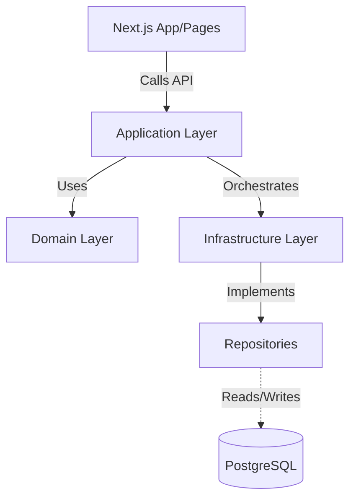

# @findeg/backend

The **FindEg Backend** is a pure TypeScript library serving as the monorepo's shared business kernel. It isolates the domain logic, database schemas (via Drizzle), and unified application services away from React server components. This enforces a strict separation of concerns, ensuring features are runtime-agnostic.

## 🏗️ Clean Architecture Execution



### 1. Domain Layer (`src/features/*/domain`)

The nucleus of the business. Absolutely no external dependencies (no Drizzle, no Next.js).

- **Entities**: Pure business objects (e.g., `Product`, `Order`, `SchoolList`).
- **Value Objects**: Shared foundational types (`Money`, `LocalizedString`, `ActorContext`).
- **Zod Schemas**: Strict parsing boundaries validating inputs before crossing into the Service layer.
- **Domain Errors**: Extends `Error` into bounded, semantic failures (`InsufficientStockError`, `UnauthorizedError`).

### 2. Application Layer (`src/features/*/application`)

Orchestrators defining _use cases_.

- **Services**: Classes containing business logic (e.g., `CatalogService.ts`, `CheckoutService.ts`).
- **Interfaces**: Contracts that Infrastructure must fulfill (e.g., `IProductRepository`).

### 3. Infrastructure Layer (`src/features/*/infrastructure`)

The dirty boundaries talking to the outside world.

- **Persistence**: Drizzle ORM schemas mapped perfectly to database tables.
- **Repositories**: Implementing Application interfaces wrapping Drizzle logic.
- **Adapters**: Connecting to external systems (Resend for emails, AWS S3 for media).

---

## 🗄️ Database Management & Schema

The `@findeg/backend` owns the entire truth of the data.

**Database ER Diagram & Deep Schema Docs**:  
👉 [Read the detailed SCHEMA.md & Global ER Diagram](docs/database/SCHEMA.md)

### Development Workflow

```bash
# Generate SQL migration file based on any schema changes
pnpm db:generate

# Push changes directly for fast local iteration
pnpm db:push

# Spin up local introspection UI
pnpm db:studio
```

---

## 📦 Feature Inventory

The backend is composed of 10 rigidly bounded context modules:

| Feature Module                                              | Business Purpose                                       | Key Domain Entities                           |
| ----------------------------------------------------------- | ------------------------------------------------------ | --------------------------------------------- |
| [**Catalog**](src/features/catalog/README.md)               | Central PIM handling all discoverability.              | `Product`, `Category`, `Variant`, `Brand`     |
| [**Cart**](src/features/cart/README.md)                     | Ephemeral shopping session state.                      | `CartHeader`, `CartItem`                      |
| [**Order**](src/features/order/README.md)                   | Checkout, fulfillment, and post-purchase ledger.       | `Order`, `OrderItem`, `Transaction`           |
| [**Identity**](src/features/identity/README.md)             | Hardened auth, RBAC permissions, token vending.        | `User`, `Role`, `PasswordCredentials`         |
| [**Administration**](src/features/administration/README.md) | Operations auditing and back-office metrics.           | `AuditLog`, `DashboardMetric`                 |
| [**School**](src/features/school/README.md)                 | B2B2C School Supply Lists (secure gateways).           | `SchoolList`, `SchoolListItem`, `AccessToken` |
| [**Review**](src/features/review/README.md)                 | UGC (User Generated Content), scoring, and moderation. | `Review`, `HelpfulVote`                       |
| [**Media**](src/features/media/README.md)                   | Media delivery, S3 uploads, image compression.         | `MediaAsset`, `FileLink`                      |
| [**Core**](src/features/core/README.md)                     | System-wide building blocks.                           | `ServiceResult`, `Pagination`                 |
| [**Notifications**](src/features/notifications/README.md)   | Broadcasts, transactional emails, Bell-alerts.         | `Notification`, `EmailTemplate`               |

---

## 💎 Pure TypeScript Rules & `ServiceResult`

To maintain extreme purity in `@findeg/backend`:

- **NO FRAMEWORK LEAKS**: Do NOT import Next.js specific functions (`cookies()`, `headers()`, `redirect()`).
- **NO THROWING EXCEPTIONS**: Services employ the **Railway Oriented Programming** pattern via the custom `ServiceResult` utility.

### Example Integration Contract

```typescript
// Good
export async function getProduct(slug: string): Promise<ServiceResult<Product, CatalogError>> {
  if (!product) return Err(new ProductNotFoundError(slug));
  return Ok(product);
}
```

---

## 🧪 Testing Pipeline

The backend guarantees soundness via **Vitest**. E2E is avoided entirely in this layer; it is purely logic/unit.

```bash
# Run all unit logic tests locally
pnpm test

# Run tests watching for TDD integration
pnpm test:watch

# Enforce no-emit TypeScript structural checks (crucial for CI)
pnpm type-check
```

---

&copy; 2026 FindEg.com. All rights reserved.
