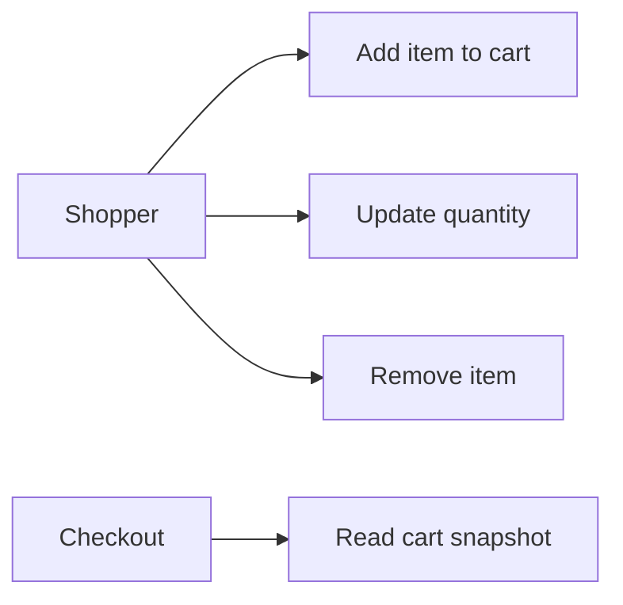
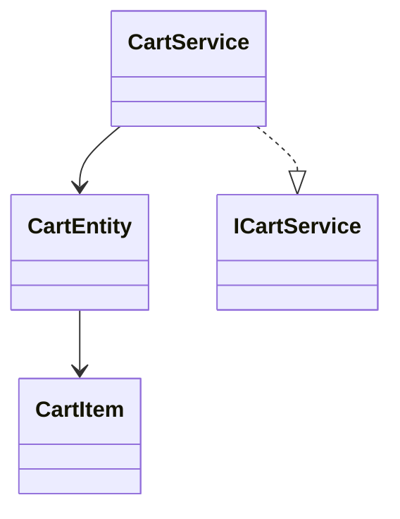
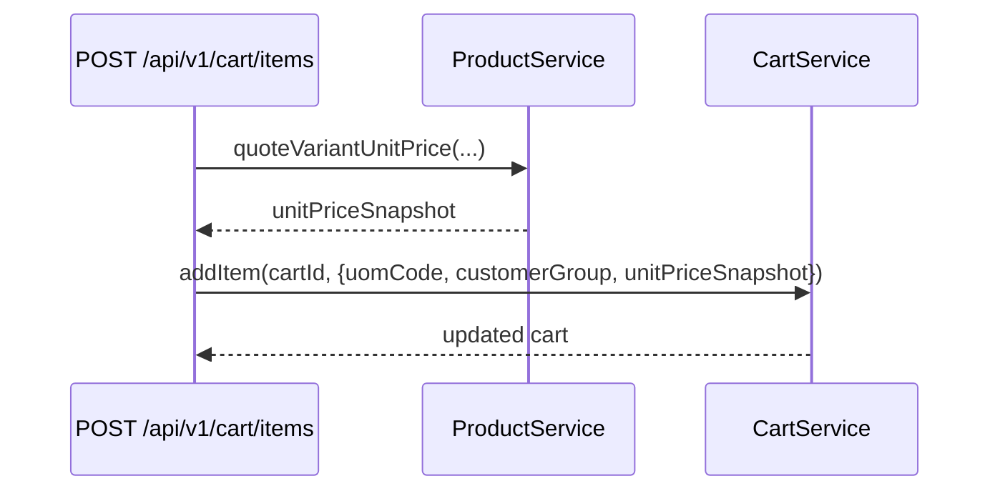

# Cart Feature

Owns cart lifecycle for guest and authenticated sessions, including pricing snapshots used at checkout.

## Use Cases

## UML (Class View)

## Sequence (Add Item with Pricing Context)

## Layer Notes
- `domain`: `CartEntity` and cart totals logic.
- `application`: cart service contract and managed cart operations.
- `infrastructure`: currently in-memory cart persistence path.

## Clean Architecture Boundaries
- Depends on `catalog` for product/price context.
- Feeds `order` as source of checkout snapshots.
- Cart logic must remain decoupled from direct DB order writes.

