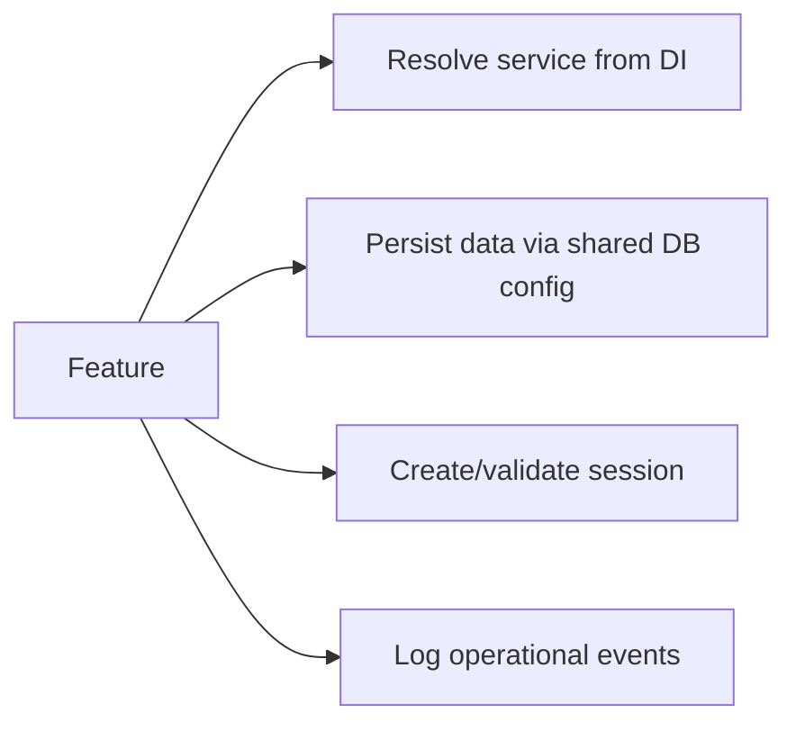
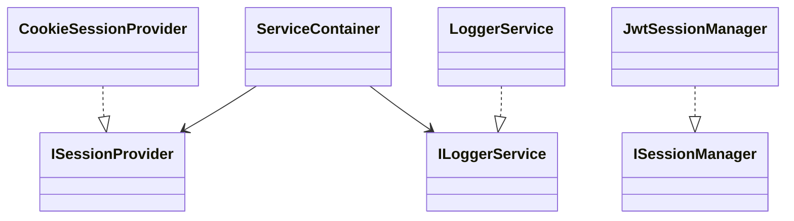
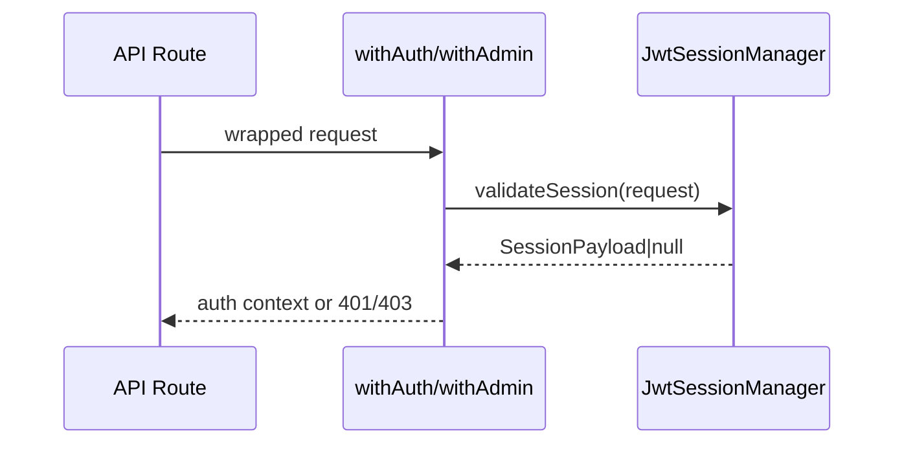

# Core Feature

Provides shared kernel capabilities used across all features: ports, infrastructure adapters, DI composition, and shared primitives.

## Use Cases

## UML (Component/Class View)

## Sequence (Route Auth Middleware)

## Layer Notes
- `domain`: shared auth and primitive types.
- `application`: cross-cutting ports/services.
- `infrastructure`: auth, persistence, storage, DI, logging.

## Clean Architecture Boundaries
- Core is dependency base; it does not depend on feature modules.
- New adapters must implement existing ports before DI registration.

