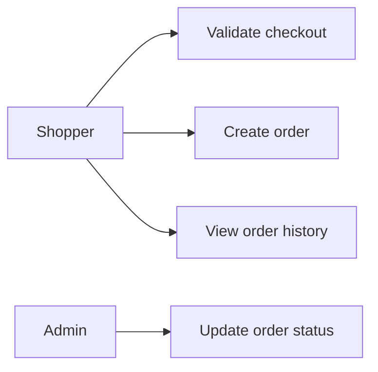
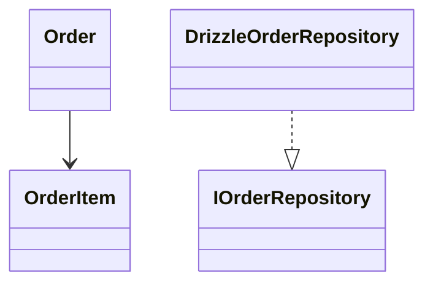
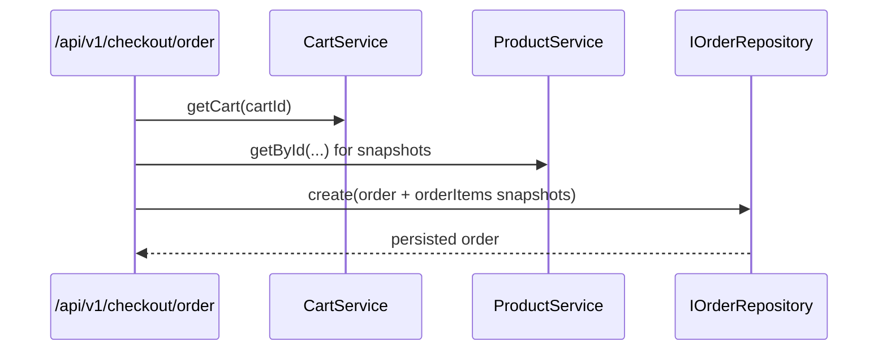

# Order Feature

Owns checkout orchestration and order lifecycle, including immutable line-item snapshots.

## Use Cases

## UML (Class View)

## Sequence (Checkout to Order)

## Layer Notes
- `domain`: `Order`, `OrderItem`, `ShippingAddress`, `VariantSnapshot`.
- `application`: repository contracts and checkout-facing actions.
- `infrastructure`: Drizzle persistence and analytics queries.

## Clean Architecture Boundaries
- Depends on `cart` and `catalog` contracts for data capture.
- Must preserve historical snapshot integrity despite catalog changes.
- Administration reads/updates order lifecycle via service contracts.

