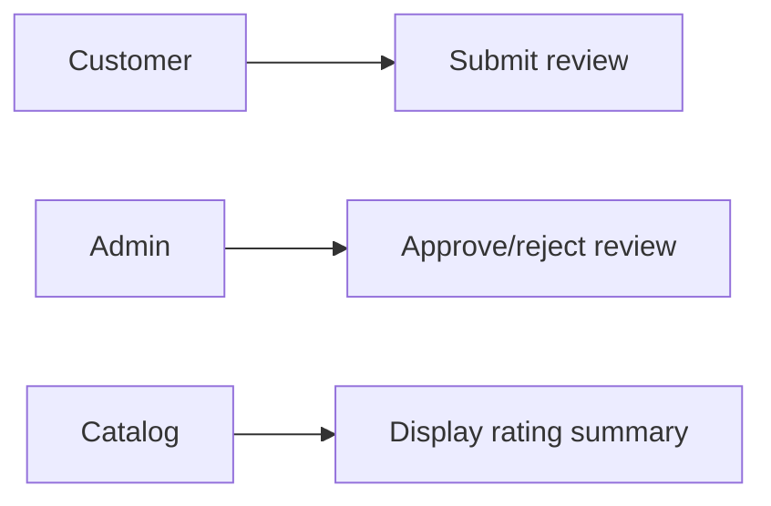
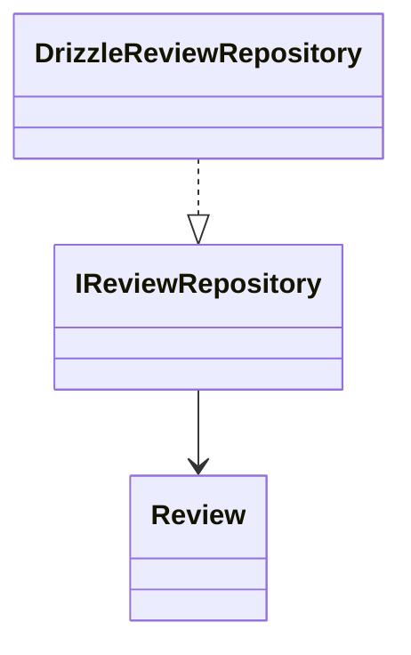
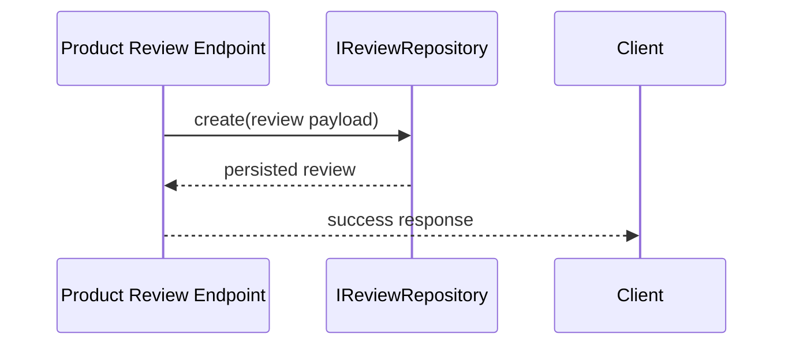

# Review Feature

Owns product feedback lifecycle: submission, moderation state, and rating aggregation inputs.

## Use Cases

## UML (Class View)

## Sequence (Create Review)

## Layer Notes
- `domain`: `Review` entity and validation boundaries.
- `application`: review repository contract.
- `infrastructure`: Drizzle repository implementation.

## Clean Architecture Boundaries
- Depends on `catalog` and `identity` IDs, not their infrastructure adapters.
- Rating aggregation consumed by catalog views.

