# FindEg.com — System Specification

> **Version:** 1.5 · **Updated:** 2026-02-18 · **Current Phase:** Phase 1 (Public E-Shop MVP, Dual-Track Strategy)

---

## 1. Vision & Business Model

**FindEg.com** is a modern education-focused e-commerce platform for the Egyptian market, specializing in stationery and school supplies. It combines a **public B2C shop** (web + mobile) with a future **school integration layer (B2B2C)** that automates supply-list distribution and purchasing.

> _From classroom requirements to a ready-to-buy cart in minutes._

### Current Business Goal (Dual Track)

As of **February 16, 2026**, FindEg follows a **balanced dual-track strategy**:

1. **Short-term B2C growth**: maximize conversion and order throughput in the public storefront.
2. **Mid-term B2B2C readiness**: preserve clean architecture boundaries so school workflows can be introduced without a rewrite of Phase 1 commerce flows.

**Operating goal statement:**
Become the default back-to-school commerce platform in Egypt by converting retail shoppers efficiently now (`catalog -> cart -> checkout -> fulfillment`) while preparing the platform for school-driven purchasing workflows (lists, templates, institutional journeys) next.

### Core Differentiator

- Schools prepare supply lists.
- Parents open a shared link/QR and land in a pre-filled cart.
- Parents can modify options if school policy allows.
- School co-branding overlays increase trust and conversion.

### Platform Strategy

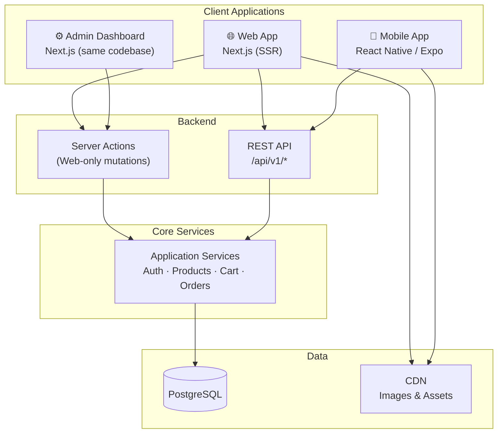

One catalog. One checkout. One API. Three client surfaces (web, mobile, admin).

### Revenue Streams

| Stream                   | Phase | Description                                                 |
| ------------------------ | ----- | ----------------------------------------------------------- |
| **Product margins**      | 1 ✅  | Markup on stationery sales                                  |
| **Bundles & kits**       | 1     | Pre-assembled school supply packs                           |
| **Upsells & add-ons**    | 1     | Related product suggestions                                 |
| **School subscriptions** | 3     | SaaS for supply list management, co-branded links, QR codes |

### Market Context

- **Region:** Egypt (EGP currency)
- **Languages:** Arabic (primary) + English
- **Peak Season:** August–September (Back to School) — 10–40× normal traffic
- **Go-to-Market:** Launch public shop (web + mobile) → pilot with 2–3 private schools → scale

### Success Criteria (Dual)

1. **Commerce outcomes:** Improve checkout completion, repeat order rate, and fulfillment reliability.
2. **Platform readiness outcomes:** Add school-domain features using isolated modules and clear contracts with minimal refactor risk.
3. **Operational outcomes:** Keep admin operations fully functional for catalog, inventory, order lifecycle, and auditability.

### Current-Phase Design Directives

- Build and operate a production-grade public B2C marketplace now.
- Keep taxonomy customer-friendly and stable, with admin-controlled category/sub-category linking.
- Prioritize import automation and deterministic catalog operations in admin.
- Prepare schema and domain extensions now for school and multi-UoM requirements while keeping web/mobile clients in this repo aligned.

---

## 2. Actors & Use Cases

### System Actors

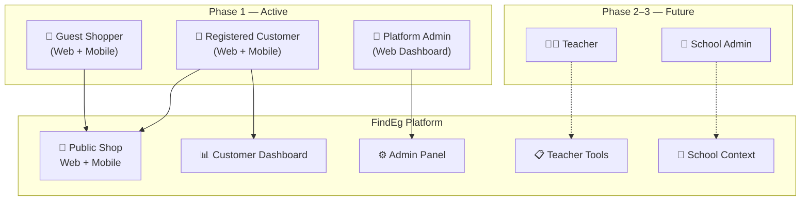

### Use Case Map

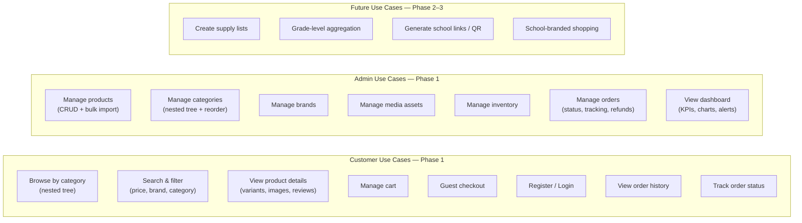

### Admin Roles (Phase 1)

| Role                | Permissions                                                   |
| ------------------- | ------------------------------------------------------------- |
| **Super Admin**     | Full system access — users, payments config, settings         |
| **Catalog Manager** | Product CRUD, brand CRUD, category tree, media assets         |
| **Operations**      | Order management, status updates, tracking, refund initiation |

---

## 3. Phased Roadmap

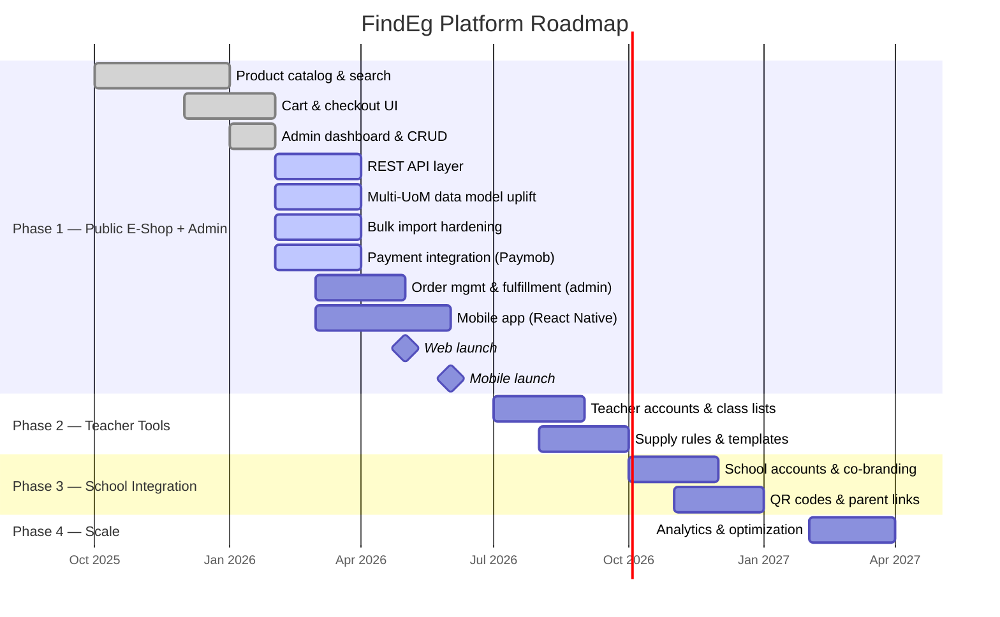

### Phase 1 Scope — Three Pillars

Phase 1 delivers **three parallel workstreams** that share a single backend:

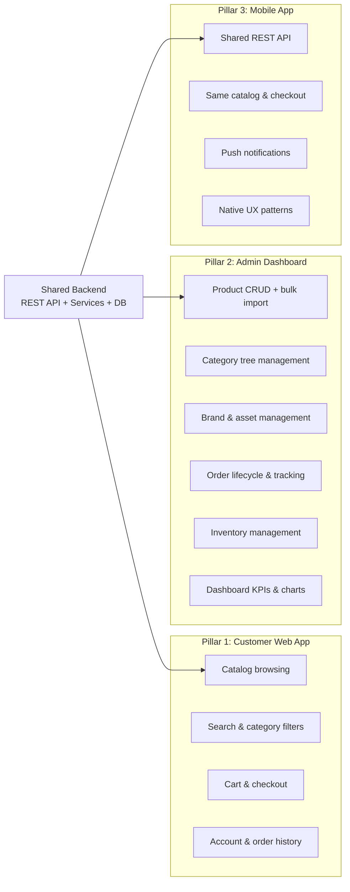

**In scope:**

- Public product browsing, search, nested category filtering
- Product details with variants (color, size)
- Cart & checkout (guest + registered) — web + mobile
- User registration, login, account management
- Admin dashboard: product/category/brand CRUD, order lifecycle, inventory, reporting
- REST API for all features (required for mobile app)
- i18n (EN/AR), RTL, mobile-first, SEO
- Phase 1 schema/domain uplift for multi-UoM selling and customer-group pricing
- Admin-controlled product-to-sub-category linking (no supplier taxonomy mapping layer)

**Out of scope (deferred):**

- School/teacher accounts, supply lists, QR codes, subscriptions
- Advanced analytics, multi-country pricing

---

## 4. User Flows

### Shopping Flow (Web + Mobile)

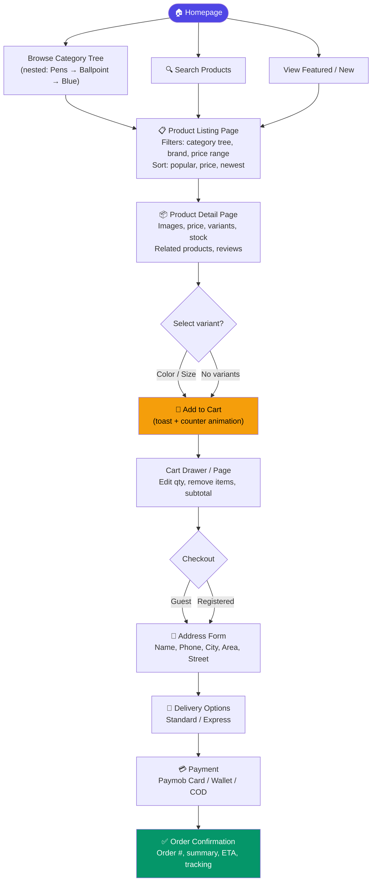

### Category Browsing — Nested Tree Filtering

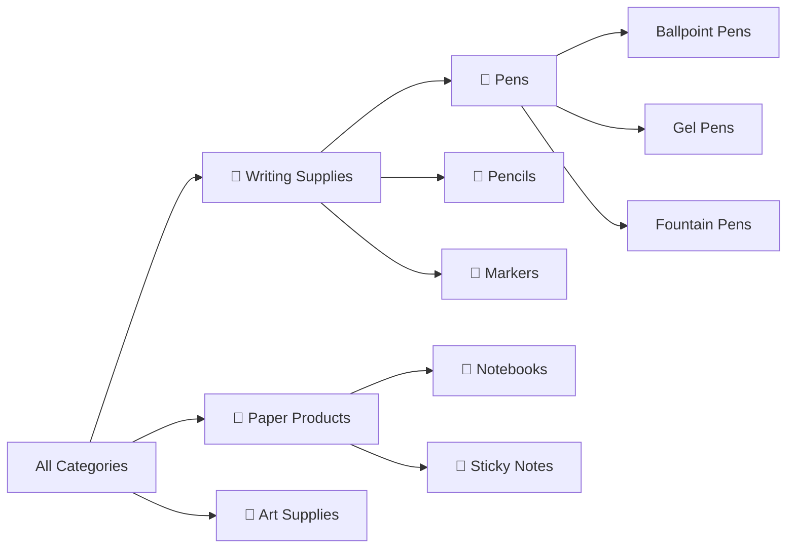

When a user selects a parent category (e.g., "Pens"), the system queries all descendants using `path` or `ltree`, returning products from the selected category **and all children** — this is the core nested category filtering behavior.

### Admin Flow (Phase 1)

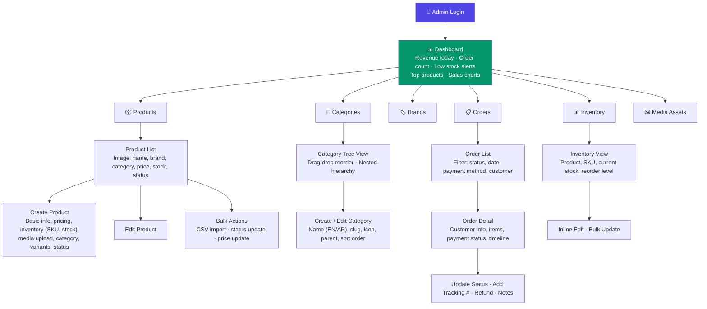

### Order Lifecycle

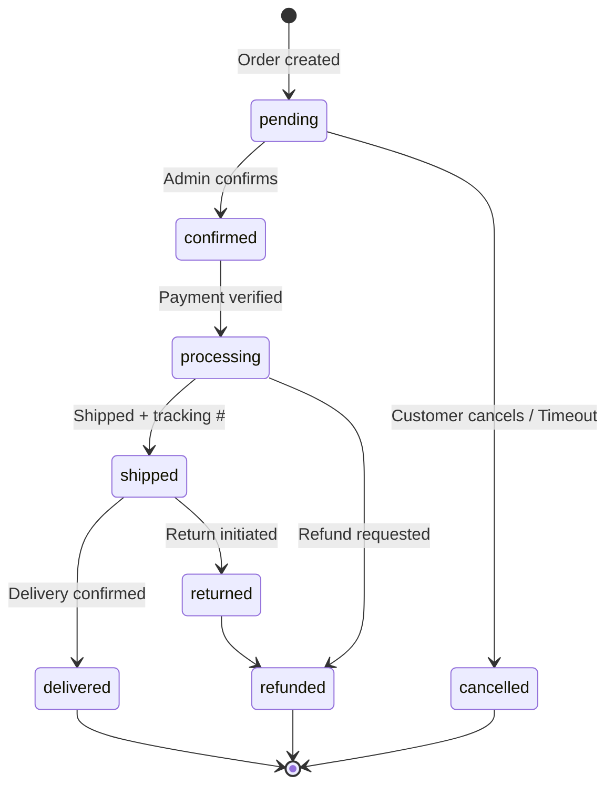

### School-Context Flow (Phase 2+ — Future)

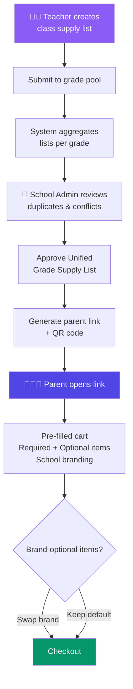

---

## 5. Architecture

### Clean Architecture Layers

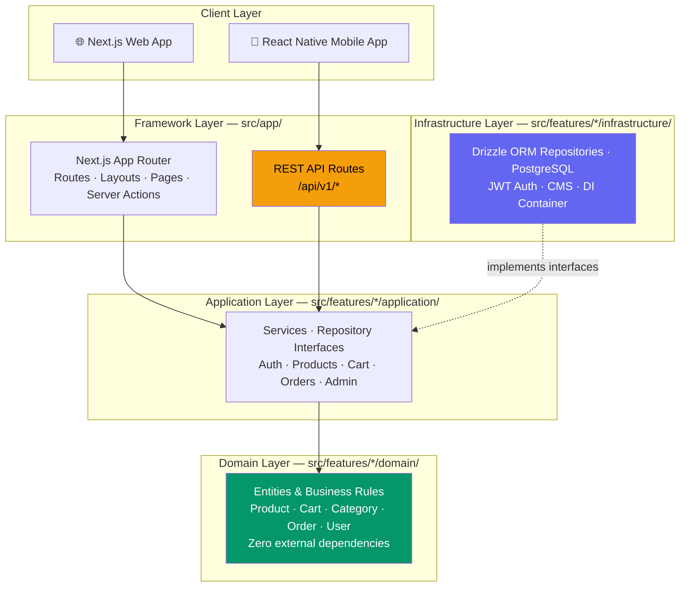

**Dependency rule:** All arrows point inward. Domain has zero dependencies. Infrastructure implements contracts defined by Application. The REST API and Server Actions are two different entry points into the same Application Services.

### Technology Stack

| Layer                | Technology                                        |
| -------------------- | ------------------------------------------------- |
| **Web Framework**    | Next.js 16 (App Router), React 19, TypeScript 5.7 |
| **Mobile**           | React Native / Expo (planned, shares API layer)   |
| **Database**         | PostgreSQL (Docker) + Drizzle ORM                 |
| **Styling (Web)**    | Tailwind CSS 3.4, CSS variables for theming       |
| **UI Library (Web)** | shadcn/ui (Radix primitives), Lucide icons        |
| **i18n**             | next-intl 4.7 (EN/AR, RTL support)                |
| **Auth**             | jose (JWT) + bcryptjs (password hashing)          |
| **Forms**            | react-hook-form + zod validation                  |
| **State**            | React Context (Cart, User, Theme providers)       |
| **Dev Tools**        | ESLint 9, Prettier, JSDoc, Drizzle Kit, Docker    |

### Service Architecture

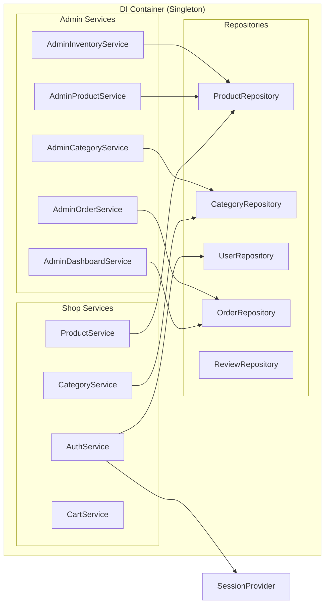

All services expose **interface types** (e.g., `IProductService`) so implementations can be swapped for testing or future changes.

---

## 6. Database Schema

### ER Diagram (Phase 1)

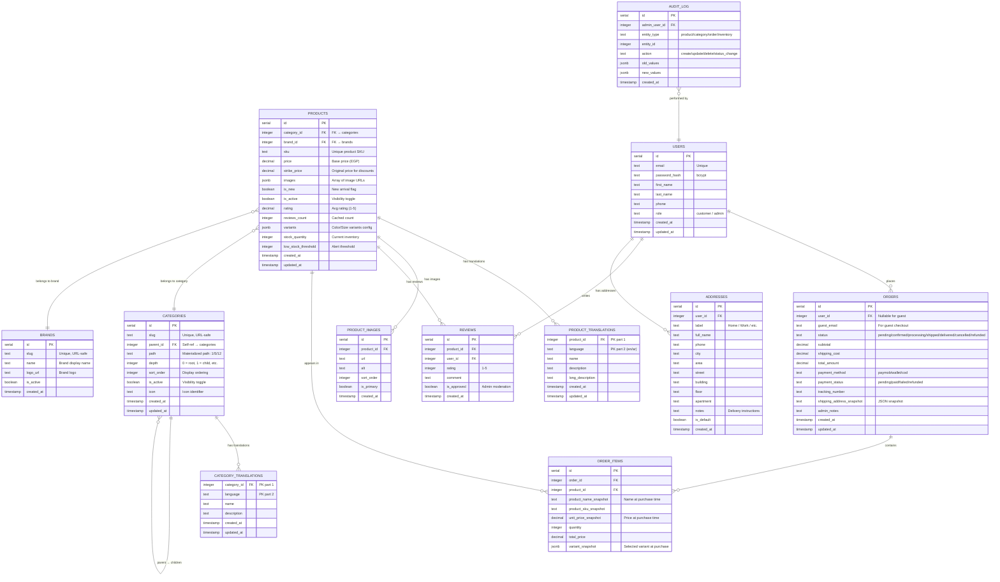

### Current Phase Schema & Domain Changes (Phase 1, In Progress)

To support immediate B2C operations and near-term B2B2C readiness, Phase 1 includes schema/domain updates:

1. Multi-sellable UoMs per variant (`pcs`, `pack`, `carton`)
2. Customer-group specific price lists (starting with `public_b2c`, `school_b2b`)

Phase 1 tables:

```sql
variant_sellable_uoms (
  id serial primary key,
  variant_id integer not null,
  uom_code text not null,                 -- pcs/pack/carton
  factor_to_base numeric(12,4) not null, -- conversion to base_uom
  is_enabled boolean not null default true,
  unique (variant_id, uom_code)
);

variant_price_lists (
  id serial primary key,
  variant_id integer not null,
  customer_group text not null,           -- public_b2c/school_b2b
  uom_code text not null,
  currency text not null default 'EGP',
  unit_price numeric(12,2) not null,
  is_sellable boolean not null default true,
  unique (variant_id, customer_group, uom_code)
);

```

Domain entity changes in current phase:

| Domain Entity | Required Change |
| ------------- | --------------- |
| `Product` / Variant model | Add `baseUom` and normalized sellable-UoM model per variant |
| Pricing model | Resolve price by `{ variantId, customerGroup, uom }` |
| `CartItem` | Persist selected `uom` and effective `customerGroup` snapshot |
| `OrderItem` | Snapshot `uom`, conversion factor, and group-specific unit price |
| Import domain/service | Enforce deterministic upsert and explicit category/sub-category linkage |

### Nested Category Design

Categories use a **materialized path** pattern for efficient hierarchical queries:

```
┌──────────────────────────────────────────────────────────────┐
│ id │ slug            │ parent_id │ path    │ depth │ order  │
├──────────────────────────────────────────────────────────────┤
│  1 │ writing         │ NULL      │ 1       │   0   │  1     │
│  2 │ pens            │ 1         │ 1/2     │   1   │  1     │
│  3 │ ballpoint-pens  │ 2         │ 1/2/3   │   2   │  1     │
│  4 │ gel-pens        │ 2         │ 1/2/4   │   2   │  2     │
│  5 │ pencils         │ 1         │ 1/5     │   1   │  2     │
│  6 │ paper-products  │ NULL      │ 6       │   0   │  2     │
│  7 │ notebooks       │ 6         │ 6/7     │   1   │  1     │
└──────────────────────────────────────────────────────────────┘
```

**Why materialized path?**

| Operation                                   | Query Pattern                                | Performance  |
| ------------------------------------------- | -------------------------------------------- | ------------ |
| Get all children of "Pens" (id=2)           | `WHERE path LIKE '1/2/%'`                    | Fast (index) |
| Get full breadcrumb for product             | `WHERE id IN (split path)`                   | O(depth)     |
| Get root categories                         | `WHERE depth = 0 ORDER BY sort_order`        | Instant      |
| Category tree for nav menu                  | `WHERE depth <= 2 ORDER BY path, sort_order` | Single query |
| Filter products by "Writing" (+ all nested) | `JOIN categories WHERE path LIKE '1/%'`      | Single query |

This enables:

- Admin drag-drop reorder (update `sort_order`)
- Admin move category to different parent (update `parent_id`, `path`, `depth` for subtree)
- Storefront sidebar with expandable tree nav
- Product filtering across any category level

### Key Schema Design Decisions

| Decision                               | Rationale                                                                                                  |
| -------------------------------------- | ---------------------------------------------------------------------------------------------------------- |
| **`category_id` FK on products**       | Proper relational link replaces `text category` — enables JOIN filtering, cascading, referential integrity |
| **`brand_id` FK on products**          | Dedicated brands table with logo, slug — enables brand pages and brand filtering                           |
| **`path` on categories**               | Materialized path enables single-query hierarchical filtering without recursive CTEs                       |
| **`depth` on categories**              | Enables instant "get root categories" and "get N-level" queries                                            |
| **`sort_order` on categories**         | Admin-controlled display ordering, independent of name or creation date                                    |
| **`is_active` on categories/products** | Soft visibility toggle — admin can hide without deleting                                                   |
| **Snapshot fields on order_items**     | Product name, price, variant at purchase time — immune to future catalog changes                           |
| **`audit_log` table**                  | All admin mutations are tracked with old/new values — required for operations                              |
| **`addresses` table**                  | Separate from users — supports multiple saved addresses                                                    |
| **Guest checkout support**             | `user_id` nullable on orders, `guest_email` for non-registered purchases                                   |
| **`variant_sellable_uoms` table**     | Enables selling each variant in multiple units (pcs/pack/carton) without duplicating variants             |
| **`variant_price_lists` table**        | Supports per-customer-group pricing by UoM in Phase 1 pricing workflows                                    |

### Translation Strategy

| Tier                | What                        | Where                                                   | Example                     |
| ------------------- | --------------------------- | ------------------------------------------------------- | --------------------------- |
| **Static UI text**  | Buttons, labels, navigation | `src/features/core/infrastructure/cms/messages/{locale}.json` | "Add to Cart" / "أضف للسلة" |
| **Dynamic content** | Product names, descriptions | `product_translations` / `category_translations` tables | "Premium Pen" / "قلم ممتاز" |

Each translatable entity has a companion `_translations` table with composite PK `(entity_id, language)`.

### Phase 2–3 Schema Extensions (School Tables)

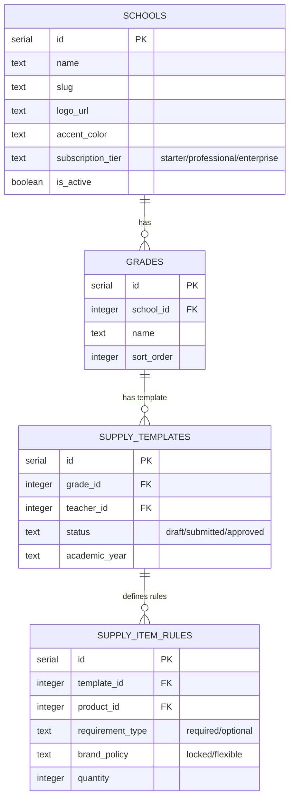

Phase 2–3 will add these school-specific tables on top of the Phase 1 commerce foundation (including multi-UoM and group-pricing tables).

---

## 7. REST API

The REST API is a **Phase 1 requirement** and powers both the web dashboard and mobile app.
This section includes current contracts plus current-phase contract extensions required by the multi-UoM and admin-import workstream.

### API Architecture

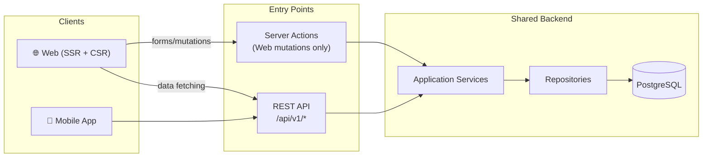

**Base URL:** `/api/v1`

### Authentication

| Method | Endpoint         | Description                                                |
| ------ | ---------------- | ---------------------------------------------------------- |
| `POST` | `/auth/guest`    | Create anonymous session + cart                            |
| `POST` | `/auth/register` | Register `{ email, password, firstName, lastName, phone }` |
| `POST` | `/auth/login`    | Login → JWT + merge guest cart                             |
| `POST` | `/auth/refresh`  | Refresh access token                                       |
| `POST` | `/auth/logout`   | Invalidate session                                         |

### Products & Catalog

| Method | Endpoint                      | Description                                                                                                           |
| ------ | ----------------------------- | --------------------------------------------------------------------------------------------------------------------- |
| `GET`  | `/products`                   | List with filters: `categoryId` (includes children!), `brandId`, `q`, `minPrice`, `maxPrice`, `sort`, `page`, `limit`, optional `customerGroup` |
| `GET`  | `/products/{slug}`            | Full detail: translations, images, variants, stock, and sellable options by `{uom, customerGroup}`                 |
| `GET`  | `/categories`                 | Full tree (hierarchical, respects `sort_order`)                                                                       |
| `GET`  | `/categories/{slug}`          | Single category + immediate children                                                                                  |
| `GET`  | `/categories/{slug}/products` | Products in category + all descendants                                                                                |
| `GET`  | `/brands`                     | All active brands                                                                                                     |
| `POST` | `/products/{id}/pricing/quote`| Resolve effective price by `{ variantId, uom, customerGroup, quantity }`                                             |

### Cart

| Method   | Endpoint           | Description                             |
| -------- | ------------------ | --------------------------------------- |
| `GET`    | `/cart`            | Get cart by JWT / sessionId             |
| `POST`   | `/cart/items`      | Add `{ productId, quantity, variant?, uom?, customerGroup? }` |
| `PUT`    | `/cart/items/{id}` | Update quantity                         |
| `DELETE` | `/cart/items/{id}` | Remove item                             |

### Checkout & Orders

| Method | Endpoint                        | Description                              |
| ------ | ------------------------------- | ---------------------------------------- |
| `POST` | `/checkout/validate`            | Validate inventory + prices + totals     |
| `POST` | `/checkout/address`             | Submit shipping address (guest-friendly) |
| `POST` | `/checkout/order`               | Create order → returns orderId           |
| `POST` | `/payments/initiate`            | Initiate payment `{ orderId, provider }` |
| `POST` | `/webhooks/payments/{provider}` | Payment provider webhook                 |
| `GET`  | `/orders`                       | Order history (authenticated)            |
| `GET`  | `/orders/{id}`                  | Order detail with items + status history |

### Admin API

| Method           | Endpoint                       | Description                            |
| ---------------- | ------------------------------ | -------------------------------------- |
| `GET/POST`       | `/admin/products`              | List / Create product                  |
| `GET/PUT/DELETE` | `/admin/products/{id}`         | Get / Update / Delete product          |
| `GET/POST`       | `/admin/categories`            | List tree / Create category            |
| `PUT`            | `/admin/categories/{id}`       | Update (including move in tree)        |
| `PUT`            | `/admin/categories/reorder`    | Batch reorder `[{ id, sortOrder }]`    |
| `DELETE`         | `/admin/categories/{id}`       | Delete (cascades to children)          |
| `GET/POST`       | `/admin/brands`                | List / Create brand                    |
| `PUT/DELETE`     | `/admin/brands/{id}`           | Update / Delete brand                  |
| `PUT`            | `/admin/inventory/{productId}` | Update stock `{ quantity }`            |
| `PUT`            | `/admin/inventory/bulk`        | Batch stock update                     |
| `GET/PUT`        | `/admin/products/{id}/uoms`    | Manage sellable UoMs per variant       |
| `GET/PUT`        | `/admin/products/{id}/pricing` | Manage per-customer-group price lists  |
| `GET`            | `/admin/orders`                | List with filters                      |
| `PUT`            | `/admin/orders/{id}/status`    | Update status + optional tracking #    |
| `GET`            | `/admin/dashboard`             | KPIs, revenue, top products, low stock |
| `GET`            | `/admin/audit-log`             | Paginated audit trail                  |
| `POST`           | `/admin/products/bulk-import`  | Import with explicit category/sub-category linking + deterministic upsert |

### Error Format

```json
{ "errorCode": "OUT_OF_STOCK", "message": "This item is no longer available", "details": {} }
```

### Future-Proofing Headers (Reserved, No-Op in Phase 1)

```
X-Context-Type: public | school
X-School-Id: optional
X-Class-Id: optional
X-Customer-Group: public_b2c | school_b2b
```

---

## 8. Feature Matrix

### Phase 1 Feature Map

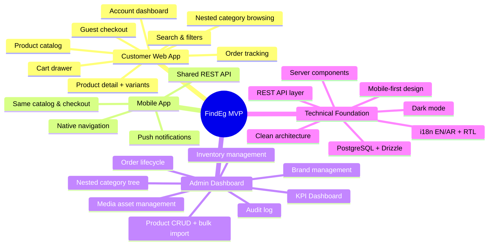

### Feature Status

| Feature                    | Status     | Notes                                |
| -------------------------- | ---------- | ------------------------------------ |
| Product catalog & search               | ✅ Done        | Filters, sorting, pagination                               |
| Product detail + variants              | ✅ Done        | Images, base pricing, variant selection                    |
| Cart (client-side + API)               | ✅ Done        | Variant-aware cart and session support                     |
| i18n (EN/AR, RTL)                      | ✅ Done        | Static + dynamic content                                   |
| Admin dashboard                         | ✅ Done        | Stats, charts, sidebar                                     |
| Admin catalog CRUD                      | ✅ Done        | Products/categories/brands                                 |
| User registration & login               | ✅ Done        | JWT cookies, bcrypt                                        |
| Customer dashboard                      | ✅ Done        | Orders and account flows                                   |
| REST API layer                          | ✅ Done        | Core `/api/v1/*` implemented for web/mobile parity         |
| Checkout flow                           | 🟡 Partial     | Payment provider integration pending                        |
| Multi-UoM schema/domain uplift          | 🟡 In Progress | Variant UoMs + group pricing + order/cart snapshots        |
| Bulk import hardening                   | 🟡 In Progress | Deterministic upsert + explicit category/sub-category linking |
| School prefilled-cart flow              | ⬜ Planned     | Phase 2 implementation                                     |
| Substitution/approval policies          | ⬜ Planned     | Phase 2 policy engine                                      |
| School co-brand overlays                | ⬜ Planned     | Phase 2 UX layer                                           |
| Mobile app app-shell                    | ⬜ Planned     | React Native client on shared API                          |
| Automated testing                       | ⬜ Planned     | Unit + integration                                         |
| CI/CD pipeline                          | ⬜ Planned     | Automated deploy + checks                                  |

---

## 9. Non-Functional Requirements

### Performance Targets

| Metric                      | Target                      |
| --------------------------- | --------------------------- |
| API P50 / P95 / P99 latency | < 120ms / < 300ms / < 700ms |
| Homepage LCP                | < 2.5s                      |
| Product Page LCP            | < 2.5s                      |
| Category tree query         | < 50ms                      |
| Cart operations             | < 200ms                     |
| Checkout validation         | < 500ms                     |
| Mobile app cold start       | < 3s                        |

### Scalability

| Scenario              | Concurrent Users |
| --------------------- | ---------------- |
| Normal                | 100–500          |
| Peak (Back to School) | 5,000–20,000     |

Horizontal scaling, stateless backend, CDN for assets, read replica ready.

### Security

| Concern   | Approach                                  |
| --------- | ----------------------------------------- |
| Auth      | JWT (short expiry) + refresh rotation     |
| Passwords | bcrypt hashing                            |
| Transport | HTTPS everywhere                          |
| Cards     | Provider tokenization only                |
| Mobile    | Certificate pinning, secure token storage |
| OWASP     | SQL injection, XSS, CSRF protection       |
| Admin     | Role-based access control, audit logging  |

### Availability

| Component                 | SLA                     |
| ------------------------- | ----------------------- |
| Storefront (web + mobile) | 99.9%                   |
| Checkout & Payments       | 99.95%                  |
| Admin Dashboard           | 99.5%                   |
| RPO                       | 15 min                  |
| RTO                       | 1 hour                  |
| Backups                   | Daily, 30-day retention |

### SEO & Accessibility

- Server-side rendering (Next.js)
- Structured data (JSON-LD)
- Semantic HTML5
- High contrast + screen reader labels
- Touch targets ≥ 44×44px
- Category pages with SEO-friendly nested URLs

---

## 10. Project Structure

```
findeg.stationary/
├── src/
│   ├── app/[locale]/           # Routes & pages
│   │   ├── (shop)/             # Public storefront
│   │   ├── (admin)/admin/      # Admin dashboard
│   │   ├── (dashboard)/        # Customer dashboard
│   │   ├── (auth)/             # Login & registration
│   │   └── api/v1/             # REST API routes (for mobile + external)
│   ├── domain/entities/        # Product, Cart, Category, User, Order, Review
│   ├── application/
│   │   ├── services/           # Auth, Product, Cart, Category, Admin*, Order
│   │   ├── services/interfaces/# All service contracts
│   │   ├── repositories/       # All repository contracts
│   │   └── actions/            # Server Actions (web mutations)
│   ├── infrastructure/
│   │   ├── database/schema/    # Drizzle schema definitions
│   │   ├── repositories/       # Drizzle repository implementations
│   │   ├── di/                 # ServiceContainer (singleton DI)
│   │   ├── auth/               # CookieSessionProvider (JWT)
│   │   └── cms/                # Static translation messages
│   ├── components/             # common/ · layout/ · ui/
│   ├── hooks/                  # useCart, useProducts, useUser, useTheme
│   ├── providers/              # CartProvider, UserProvider, ThemeProvider
│   └── i18n/                   # Routing, request config, navigation
├── scripts/                    # Dev, DB, seeding scripts
├── docs/                       # Guides, DB docs, onboarding
├── docker-compose.yml          # PostgreSQL dev container
└── package.json
```

### Key Commands

| Command             | Purpose                                 |
| ------------------- | --------------------------------------- |
| `npm run dev`       | Start dev server (auto-kills port 3000) |
| `npm run db:setup`  | Start DB + push schema + seed data      |
| `npm run db:studio` | Visual database browser                 |
| `npm run lint`      | Type-check + ESLint                     |

---

## 11. Success Metrics

| Metric                        | Target       | Phase |
| ----------------------------- | ------------ | ----- |
| Checkout completion rate      | > 60%        | 1     |
| Mobile vs web conversion      | Parity ± 10% | 1     |
| Product creation time (admin) | < 5 min      | 1     |
| Order processing time (admin) | < 2 min      | 1     |
| Category tree query time      | < 50ms       | 1     |
| Bulk import success rate      | > 99% rows   | 1     |
| Import rows with valid sub-category link | > 98% rows | 1     |
| UoM pricing resolution errors | < 0.1% req   | 1     |
| Time to create supply list    | < 10 min     | 2     |
| School reuse rate next year   | > 80%        | 3     |

---

## 12. Schema + DDD Redesign Program (Catalog + Identity)

This section defines the approved target model for the in-progress internal refactor.

### 12.1 Catalog Model Targets

- Localized content is modeled as locale-keyed objects across product/category/brand names, descriptions, and slugs.
- Pricing persistence is split into:
  - persisted `pricing` data (base/cost/wholesale and channel-aware contexts),
  - persisted `discountRules`,
  - computed `resolvedPricing` runtime output.
- `strikePrice` is computed from discount rules and not persisted.
- Media is modeled for multiple display contexts (for example grid, PDP, zoom).

### 12.2 Identity and Access Targets

- User profile (`users`) is separate from authentication credentials and linked accounts.
- Identity supports multiple linked auth providers per user.
- Passwords are persisted as hashes only, with strategy metadata.
- Authorization is permission-based:
  - roles map to permissions,
  - users and organization memberships map to roles,
  - checks enforce permissions, not role strings.
- Guest users are represented by persisted guest principals for cart/checkout continuity.

### 12.3 Organization and Business Access Targets

- Organizations are first-class entities for business context.
- Memberships scope user access per organization.
- Session payload includes scoped role IDs and actor metadata.

### 12.4 Contract Boundaries

- Domain types are the source of truth for application and infrastructure contracts.
- Mapping layers should be minimized; only keep adapters at true boundary seams.
- Locale and pricing types must remain consistent from domain to persistence schemas.

### 12.5 Governance

- Execution tracker: `project-planning/SCHEMA_DDD_REFACTOR_TASKS.md`.
- Architecture release timeline: `docs/architecture/RELEASE_NOTES.md`.
- Changelog remains git-history generated (`npm run changelog`), with release notes as curated architecture milestones.

---

_End of System Specification_
