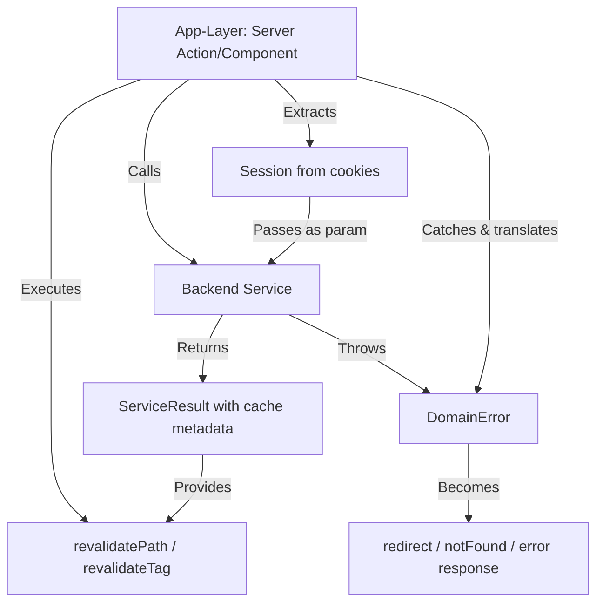

# Data Model: Backend Pure TypeScript Refactoring

**Feature**: Backend Pure TypeScript Refactoring  
**Date**: April 5, 2026  
**Phase**: 1 - Design

## Overview

This document defines the core domain entities (error types), service interfaces, and data contracts introduced by the refactoring. These abstractions enable backend services to remain framework-agnostic while providing clear contracts for app-layer integration.

---

## 1. Domain Error Types

All backend services throw typed domain errors instead of calling framework APIs (`redirect`, `notFound`). App-layer catches these errors and translates to HTTP responses or Next.js navigation.

### Base Error Class

```typescript
// packages/backend/src/features/core/domain/errors/DomainError.ts

/**
 * Base class for all domain-specific errors.
 * Provides structured error information for app-layer translation.
 */
export abstract class DomainError extends Error {
  /**
   * Unique error code for programmatic handling
   * @example "NOT_AUTHENTICATED", "RESOURCE_NOT_FOUND"
   */
  public readonly code: string;
  
  /**
   * Additional error context for logging/debugging
   * @example { userId: "123", resourceType: "Product", statusCode: 404 }
   */
  public readonly metadata?: Record<string, any>;
  
  constructor(code: string, message: string, metadata?: Record<string, any>) {
    super(message);
    this.name = this.constructor.name;
    this.code = code;
    this.metadata = metadata;
    
    // Restore prototype chain for instanceof checks
    Object.setPrototypeOf(this, new.target.prototype);
  }
}
```

### Authentication & Authorization Errors

```typescript
// packages/backend/src/features/core/domain/errors/NotAuthenticatedError.ts

/**
 * Thrown when user is not authenticated (no valid session).
 * App-layer should redirect to login page.
 */
export class NotAuthenticatedError extends DomainError {
  constructor(message = "User not authenticated") {
    super("NOT_AUTHENTICATED", message, { statusCode: 401 });
  }
  
  /**
   * Returns the path where unauthenticated users should be redirected.
   * App-layer calls: redirect(error.getRedirectPath())
   */
  getRedirectPath(): string {
    return "/login";
  }
}

/**
 * Thrown when authenticated user lacks required permissions.
 * App-layer should redirect to 403 page or display error message.
 */
export class NotAuthorizedError extends DomainError {
  constructor(action: string, resource?: string) {
    const message = `Not authorized to ${action}${resource ? ` on ${resource}` : ""}`;
    super("NOT_AUTHORIZED", message, { 
      statusCode: 403, 
      action, 
      resource 
    });
  }
}
```

### Resource Errors

```typescript
// packages/backend/src/features/core/domain/errors/ResourceNotFoundError.ts

/**
 * Thrown when requested resource does not exist.
 * App-layer should call notFound() or return 404 JSON response.
 */
export class ResourceNotFoundError extends DomainError {
  constructor(resourceType: string, identifier: string | number) {
    super(
      "RESOURCE_NOT_FOUND",
      `${resourceType} with identifier ${identifier} not found`,
      { statusCode: 404, resourceType, identifier }
    );
  }
}
```

### Validation Errors

```typescript
// packages/backend/src/features/core/domain/errors/ValidationError.ts

/**
 * Thrown when input validation fails.
 * App-layer should display field-specific error messages to user.
 */
export class ValidationError extends DomainError {
  constructor(field: string, message: string, invalidValue?: any) {
    super("VALIDATION_ERROR", message, { 
      statusCode: 400, 
      field, 
      invalidValue 
    });
  }
}

/**
 * Thrown when multiple validation errors occur.
 * App-layer should display all errors to user.
 */
export class ValidationErrors extends DomainError {
  public readonly errors: Array<{ field: string; message: string }>;
  
  constructor(errors: Array<{ field: string; message: string }>) {
    super(
      "VALIDATION_ERRORS",
      `Validation failed: ${errors.map(e => e.field).join(", ")}`,
      { statusCode: 400, errors }
    );
    this.errors = errors;
  }
}
```

### Business Logic Errors

```typescript
// packages/backend/src/features/core/domain/errors/ConflictError.ts

/**
 * Thrown when operation conflicts with current state.
 * @example Order already shipped, cannot cancel
 * @example Email already exists, cannot register
 */
export class ConflictError extends DomainError {
  constructor(message: string, conflictingResource?: string) {
    super("CONFLICT", message, { statusCode: 409, conflictingResource });
  }
}

/**
 * Thrown when business rule is violated.
 * @example Cannot ship order with unpaid status
 * @example Cannot delete category with active products
 */
export class BusinessRuleViolationError extends DomainError {
  constructor(rule: string, message: string) {
    super("BUSINESS_RULE_VIOLATION", message, { statusCode: 422, rule });
  }
}
```

### Error Catalog Index

```typescript
// packages/backend/src/features/core/domain/errors/index.ts

export { DomainError } from "./DomainError";
export { NotAuthenticatedError } from "./NotAuthenticatedError";
export { NotAuthorizedError } from "./NotAuthorizedError";
export { ResourceNotFoundError } from "./ResourceNotFoundError";
export { ValidationError, ValidationErrors } from "./ValidationError";
export { ConflictError } from "./ConflictError";
export { BusinessRuleViolationError } from "./BusinessRuleViolationError";

/**
 * Type guard to check if error is a domain error
 */
export function isDomainError(error: unknown): error is DomainError {
  return error instanceof DomainError;
}
```

---

## 2. Service Interfaces

Backend services depend on these abstractions instead of concrete framework implementations.

### Session Provider Interface

```typescript
// packages/backend/src/features/core/application/interfaces/ISessionProvider.ts

import type { SessionPayload } from "@features/core/domain/auth";

/**
 * Abstraction for session management.
 * Backend depends on this interface; app-layer provides implementation.
 */
export interface ISessionProvider {
  /**
   * Creates a new session with the given payload.
   * App-layer implementation sets HttpOnly cookie with JWT.
   * 
   * @throws {Error} if session creation fails
   */
  createSession(payload: SessionPayload): Promise<void>;
  
  /**
   * Retrieves the current session from request context.
   * Returns null if no valid session exists.
   */
  getSession(): Promise<SessionPayload | null>;
  
  /**
   * Deletes the current session.
   * App-layer implementation clears session cookie.
   */
  deleteSession(): Promise<void>;
}
```

### Cache Invalidation Interface (Optional - for observer pattern)

```typescript
// packages/backend/src/features/core/application/interfaces/ICacheInvalidator.ts

/**
 * Abstraction for cache invalidation notifications.
 * Backend calls this interface; app-layer provides Next.js implementation.
 * 
 * NOTE: This is OPTIONAL - simpler pattern is to return cache paths as data.
 * Included for completeness if observer pattern is preferred.
 */
export interface ICacheInvalidator {
  /**
   * Notifies cache to invalidate specific paths
   * @param paths - Array of route paths to revalidate
   */
  invalidatePaths(paths: string[]): Promise<void>;
  
  /**
   * Notifies cache to invalidate specific tags
   * @param tags - Array of cache tags to revalidate
   */
  invalidateTags(tags: string[]): Promise<void>;
}

/**
 * No-op implementation for testing
 */
export class NoOpCacheInvalidator implements ICacheInvalidator {
  async invalidatePaths(paths: string[]): Promise<void> {
    // No-op for tests
  }
  
  async invalidateTags(tags: string[]): Promise<void> {
    // No-op for tests
  }
}
```

---

## 3. Data Transfer Objects (DTOs)

DTOs for backend service inputs/outputs.

### Service Result Types

```typescript
// packages/backend/src/features/core/application/types/ServiceResult.ts

/**
 * Standard result type for operations that may include cache invalidation metadata.
 * Backend returns data + cache metadata; app-layer executes invalidation.
 */
export interface ServiceResult<T> {
  /**
   * The operation result data
   */
  data: T;
  
  /**
   * Optional cache invalidation metadata
   */
  cache?: {
    /**
     * Paths to revalidate (passed to revalidatePath)
     */
    paths?: string[];
    
    /**
     * Tags to revalidate (passed to revalidateTag)
     */
    tags?: string[];
  };
}

/**
 * Helper to create result without cache metadata
 */
export function result<T>(data: T): ServiceResult<T> {
  return { data };
}

/**
 * Helper to create result with cache invalidation
 */
export function resultWithCache<T>(
  data: T, 
  cache: { paths?: string[]; tags?: string[] }
): ServiceResult<T> {
  return { data, cache };
}
```

### Authentication DTOs

```typescript
// packages/backend/src/features/identity/application/types/AuthTypes.ts

/**
 * Input for login operation
 */
export interface LoginInput {
  email: string;
  password: string;
}

/**
 * Result from login operation
 */
export interface LoginResult {
  success: boolean;
  user?: {
    id: string;
    email: string;
    firstName: string;
    lastName: string;
    portalRole: string;
    activeRoleIds: string[];
    permissionCodes: string[];
  };
  error?: string;
}

/**
 * Input for profile update operation
 */
export interface ProfileUpdateInput {
  firstName?: string;
  lastName?: string;
  phone?: string;
  address?: {
    street?: string;
    city?: string;
    postalCode?: string;
  };
}
```

### Order DTOs

```typescript
// packages/backend/src/features/order/application/types/OrderTypes.ts

/**
 * Input for order status update
 */
export interface OrderStatusUpdate {
  status: "pending" | "processing" | "shipped" | "delivered" | "cancelled";
  trackingNumber?: string;
  notes?: string;
}

/**
 * Result from order status update (includes cache metadata)
 */
export interface OrderUpdateResult {
  order: Order;
  invalidatePaths: string[];  // Paths to revalidate
}
```

---

## 4. Cache Metadata

Centralized cache configuration and path builders.

### Cache Constants

```typescript
// packages/backend/src/features/core/domain/constants/cache-tags.ts

/**
 * Centralized cache tags for revalidation.
 * Used by both backend (to return metadata) and app-layer (to execute revalidation).
 */
export const CACHE_TAGS = {
  // Catalog
  PRODUCTS: "products",
  CATEGORIES: "categories",
  BRANDS: "brands",
  SHOP_PAGE: "shop-page",
  
  // Orders
  ORDERS: "orders",
  USER_ORDERS: "user-orders",
  
  // Identity
  USER_PROFILE: "user-profile",
  
  // School
  SCHOOL_LISTS: "school-lists",
  
  // Admin
  ADMIN_PRODUCTS: "admin-products",
  ADMIN_ORDERS: "admin-orders",
  ADMIN_INVENTORY: "admin-inventory",
} as const;

export type CacheTag = typeof CACHE_TAGS[keyof typeof CACHE_TAGS];
```

### Cache Path Builders

```typescript
// packages/backend/src/features/order/domain/cache.ts

/**
 * Returns cache paths to invalidate after order operations.
 * Backend returns these paths; app-layer executes revalidatePath.
 */
export function getOrderCachePaths(orderId?: number): string[] {
  const paths = ["/admin/orders"];
  if (orderId) {
    paths.push(`/admin/orders/${orderId}`);
  }
  return paths;
}

/**
 * Returns cache tags to invalidate after order operations.
 */
export function getOrderCacheTags(): string[] {
  return [CACHE_TAGS.ORDERS, CACHE_TAGS.ADMIN_ORDERS];
}

// packages/backend/src/features/catalog/domain/cache.ts

/**
 * Returns cache paths to invalidate after product operations.
 */
export function getProductCachePaths(productId?: number): string[] {
  const paths = ["/shop", "/admin/products"];
  if (productId) {
    paths.push(`/admin/products/${productId}`);
  }
  return paths;
}

/**
 * Returns cache tags to invalidate after product operations.
 */
export function getProductCacheTags(): string[] {
  return [CACHE_TAGS.PRODUCTS, CACHE_TAGS.SHOP_PAGE, CACHE_TAGS.ADMIN_PRODUCTS];
}
```

### Query Cache Configuration

```typescript
// packages/backend/src/features/catalog/application/queries/cache-config.ts

/**
 * Cache configuration for shop page query.
 * Backend exports config; app-layer applies via "use cache" + cacheTag.
 */
export const SHOP_PAGE_CACHE_CONFIG = {
  tags: [CACHE_TAGS.SHOP_PAGE, CACHE_TAGS.PRODUCTS, CACHE_TAGS.CATEGORIES],
  revalidate: 3600,  // 1 hour in seconds
  staleWhileRevalidate: 600,  // 10 minutes
} as const;

/**
 * Cache configuration for category page query.
 */
export const CATEGORY_PAGE_CACHE_CONFIG = {
  tags: [CACHE_TAGS.CATEGORIES, CACHE_TAGS.PRODUCTS],
  revalidate: 3600,
} as const;

/**
 * Cache configuration for product detail query.
 */
export const PRODUCT_DETAIL_CACHE_CONFIG = {
  tags: [CACHE_TAGS.PRODUCTS],
  revalidate: 1800,  // 30 minutes
} as const;
```

---

## 5. Session & User Context

Session data structures passed to backend services as parameters.

### Session Payload

```typescript
// packages/backend/src/features/core/domain/auth/SessionPayload.ts

/**
 * User session data stored in JWT and passed to backend services.
 * Backend services accept this as a parameter (not read from global context).
 */
export interface SessionPayload {
  /**
   * Unique user identifier
   */
  userId: string;
  
  /**
   * User basic information (for display, not authorization)
   */
  user: {
    email: string;
    firstName: string;
    lastName: string;
  };
  
  /**
   * User's portal role (admin, customer, etc.)
   */
  portalRole: string;
  
  /**
   * Active role IDs for RBAC
   */
  activeRoleIds: string[];
  
  /**
   * Permission codes for fine-grained access control
   */
  permissionCodes: string[];
  
  /**
   * Actor type (user, organization, system)
   */
  actorType: string;
  
  /**
   * Organization ID (if applicable)
   */
  organizationId?: string;
}

/**
 * Type guard to check if session is admin
 */
export function isAdminSession(session: SessionPayload | null): boolean {
  return session?.portalRole === "admin";
}
```

### Required Session Fields

Different backend services require different session fields. Define minimal types:

```typescript
// packages/backend/src/features/core/domain/auth/SessionTypes.ts

/**
 * Minimal session for authenticated operations (user ID only)
 */
export interface AuthenticatedContext {
  userId: string;
}

/**
 * Session with user info (for display purposes)
 */
export interface UserContext extends AuthenticatedContext {
  user: {
    email: string;
    firstName: string;
    lastName: string;
  };
}

/**
 * Session with permissions (for authorized operations)
 */
export interface AuthorizedContext extends UserContext {
  permissionCodes: string[];
}

/**
 * Full admin session (for admin-only operations)
 */
export interface AdminContext extends AuthorizedContext {
  portalRole: "admin";
}
```

Backend service signatures use these minimal types:

```typescript
// Example: Service only needs user ID
export async function getUserOrders(context: AuthenticatedContext): Promise<Order[]> {
  return repositories.orders.getByUserId(context.userId);
}

// Example: Service needs permissions
export async function deleteProduct(
  productId: number, 
  context: AuthorizedContext
): Promise<void> {
  if (!context.permissionCodes.includes("DELETE_PRODUCT")) {
    throw new NotAuthorizedError("delete", "Product");
  }
  await repositories.products.delete(productId);
}
```

---

## 6. Refactored Service Signatures

Examples of refactored backend service signatures (before/after).

### Identity Services

**Before (violates Principle VIII)**:
```typescript
export async function getDashboardDataOrRedirect(locale: string): Promise<DashboardData> {
  const session = await auth.getSession();  // ❌ Reads global context
  if (!session?.userId) {
    redirect("/login");  // ❌ Framework API
  }
  // ...
}
```

**After (pure TypeScript)**:
```typescript
export async function getDashboardData(
  locale: string,
  context: AuthenticatedContext  // ✅ Explicit parameter
): Promise<DashboardData> {
  // context.userId is guaranteed to exist (validated by app-layer)
  const [products, orders, schoolLists] = await Promise.all([
    repositories.products.getAll(locale),
    repositories.orders.getByUserId(context.userId),
    repositories.schoolLists.getAll(),
  ]);
  return { products, orders, schoolLists };
}
```

### Order Services

**Before (violates Principle VIII)**:
```typescript
export async function updateOrderStatusAction(id: number, input: OrderStatusUpdate) {
  await service.updateStatus(id, input);
  revalidatePath("/admin/orders");  // ❌ Framework API
  revalidatePath(`/admin/orders/${id}`);
  return { success: true };
}
```

**After (pure TypeScript)**:
```typescript
export async function updateOrderStatus(
  id: number, 
  input: OrderStatusUpdate
): Promise<ServiceResult<Order>> {
  const order = await service.updateStatus(id, input);
  
  return resultWithCache(order, {
    paths: getOrderCachePaths(id),  // ✅ Returns data, not action
    tags: getOrderCacheTags(),
  });
}
```

### Catalog Services

**Before (violates Principle VIII)**:
```typescript
"use cache";  // ❌ Next.js directive
export async function getShopPageViewModel(locale: string, query: object) {
  cacheTag("shop-page");  // ❌ Framework API
  cacheLife("hours");
  // ...
}
```

**After (pure TypeScript)**:
```typescript
// Pure function - no cache directives
export async function getShopPageViewModel(
  locale: string, 
  query: object
): Promise<ShopPageViewModel> {
  const products = await repositories.products.getAll(locale);
  const categories = await repositories.categories.getAll(locale);
  
  const filtered = applyListingFilters(products, parseFilters(query));
  const categoryTree = buildCategoryTree(categories, products);
  
  return { products, filtered, categoryTree };
}

// Cache config exported separately
export { SHOP_PAGE_CACHE_CONFIG } from "./cache-config";
```

---

## 7. Entity Relationships



---

## 8. Type Exports

Backend package exports these types for app-layer consumption:

```typescript
// packages/backend/src/features/core/index.ts
export * from "./domain/errors";
export * from "./domain/auth/SessionPayload";
export * from "./domain/auth/SessionTypes";
export * from "./domain/constants/cache-tags";
export * from "./application/interfaces/ISessionProvider";
export * from "./application/interfaces/ICacheInvalidator";
export * from "./application/types/ServiceResult";

// packages/backend/src/features/identity/index.ts
export * from "./application/types/AuthTypes";
export * from "./application/services/AuthService";
export * from "./application/queries/dashboard";

// packages/backend/src/features/order/index.ts
export * from "./domain/entities/Order";
export * from "./application/types/OrderTypes";
export * from "./application/services/OrderService";
export * from "./domain/cache";

// packages/backend/src/features/catalog/index.ts
export * from "./domain/entities/Product";
export * from "./application/queries/shop-page";
export * from "./application/queries/cache-config";
export * from "./domain/cache";
```

---

## Summary

Data model defines:

1. **Domain Errors**: 7 error types (NotAuthenticated, NotAuthorized, ResourceNotFound, Validation, Conflict, BusinessRuleViolation)
2. **Service Interfaces**: ISessionProvider, ICacheInvalidator (optional)
3. **DTOs**: ServiceResult<T>, LoginInput/Result, OrderUpdateResult, ProfileUpdateInput
4. **Cache Metadata**: CACHE_TAGS constants, path/tag builder functions, query cache configs
5. **Session Types**: SessionPayload, AuthenticatedContext, UserContext, AuthorizedContext, AdminContext
6. **Service Signatures**: Refactored to accept explicit parameters, return data (not side effects)

All types exported from backend package for app-layer consumption. Ready for Phase 1 contract generation.
