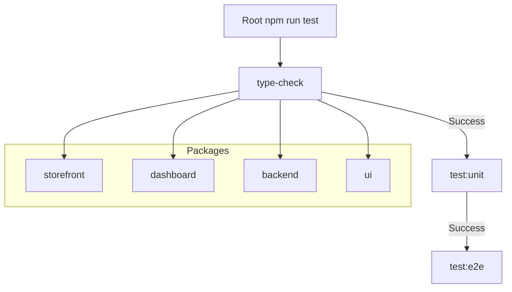

# Data Model: Standardized Test Pipeline

This feature does not introduce new database entities, but it standardizes the "Command Interface" across the monorepo.

## Standardized Shell Interface (`package.json`)

### Command Entities

#### `test`

- **Purpose**: Cascading entry point for all quality checks.
- **Contract**: `type-check && test:unit && test:e2e`.
- **Exit Code**: Non-zero if any phase fails.

#### `type-check`

- **Purpose**: Static type analysis.
- **Contract**: `tsc --noEmit` (or package-specific equivalent).
- **Dependency**: Must run before `test:unit`.

#### `test:unit`

- **Purpose**: Component and logic isolation testing.
- **Contract**: Runs Vitest/Jest suite.
- **Condition**: Only executes if `type-check` passes.

#### `test:e2e`

- **Purpose**: Integration and user flow testing.
- **Contract**: Runs Cypress/Playwright suite.
- **Condition**: Only executes if `test:unit` passes.

## Dependency Relationships

