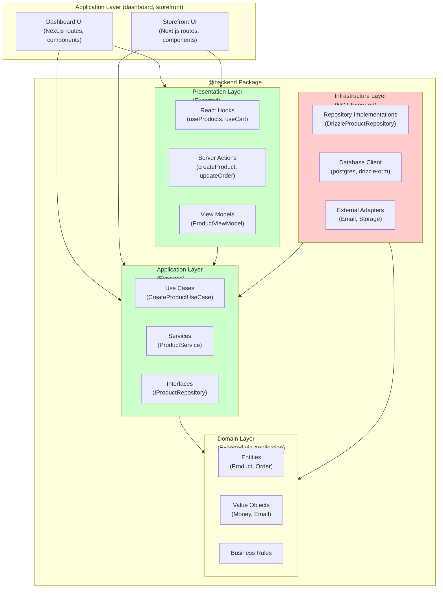
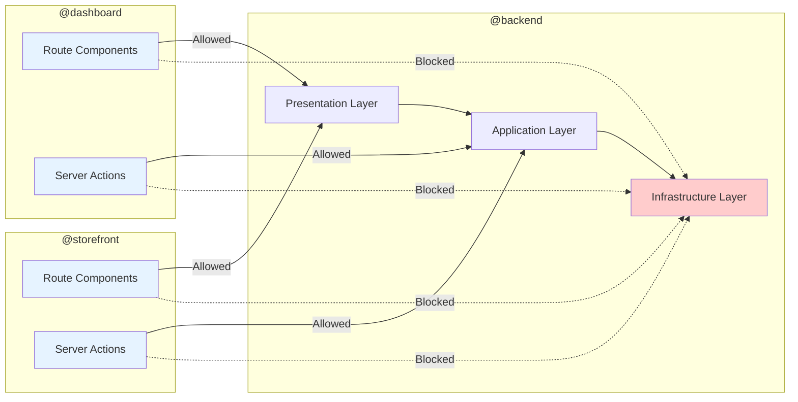
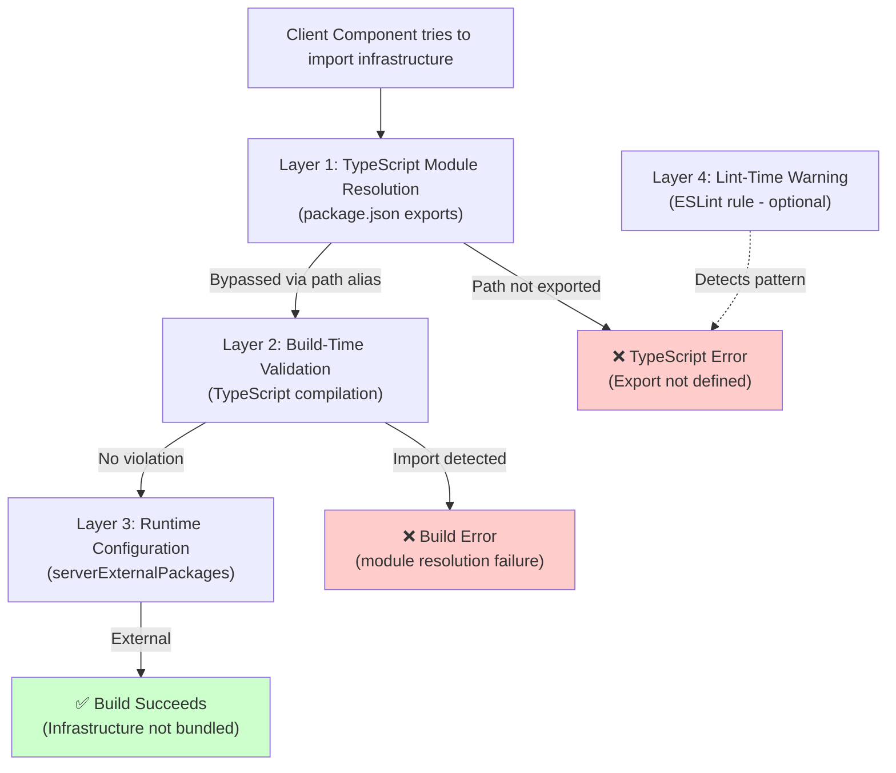

# Data Model: Architectural Boundary Enforcement Patterns

**Phase 1 Output** | **Date**: 2026-04-05 | **Plan**: [plan.md](./plan.md)

This document defines the architectural boundary patterns and module organization that enforce Clean Architecture layer separation between apps and backend infrastructure.

---

## 1. Layer Boundary Model

### Layer Hierarchy (Backend Package)



**Legend**:
- 🟢 Green = Exported (apps can import)
- 🔴 Red = Not exported (apps cannot import)

---

## 2. Package Export Contract

### Backend Package Structure

```typescript
// packages/backend/package.json
{
  "name": "@backend",
  "exports": {
    "./features/catalog": {
      "types": "./dist/features/catalog/index.d.ts",
      "default": "./dist/features/catalog/index.js"
    },
    "./features/cart": { /* ... */ },
    "./features/order": { /* ... */ },
    "./features/identity": { /* ... */ },
    // ... other features
  }
}
```

### Feature Index Pattern (Barrel Export)

```typescript
// packages/backend/src/features/catalog/index.ts

// ✅ EXPORT: Presentation layer (hooks, actions, view models)
export * from './presentation/hooks/useProducts';
export * from './presentation/hooks/useCategories';
export * from './presentation/actions/productActions';
export * from './presentation/mappers/ProductViewModel';

// ✅ EXPORT: Application layer (use cases, services, interfaces)
export * from './application/use-cases/CreateProductUseCase';
export * from './application/services/ProductService';
export type { IProductRepository } from './application/contracts/IProductRepository';

// ✅ EXPORT: Domain layer (entities, value objects, types)
export type { Product } from './domain/entities/Product';
export type { Category } from './domain/entities/Category';
export type { ProductStatus } from './domain/value-objects/ProductStatus';

// ❌ DO NOT EXPORT: Infrastructure layer
// NOT exported: './infrastructure/DrizzleProductRepository'
// NOT exported: './infrastructure/persistence/productSchema'
```

**Key principle**: The feature index acts as a **firewall** between external consumers (apps) and internal implementations (infrastructure).

---

## 3. Infrastructure Layer Protection Pattern

### ❗ Important: Backend Must Remain Framework-Agnostic

**Constitution Principle VIII violation**: Adding `server-only` package to backend would require installing React/Next.js, violating the pure TypeScript library principle.

**Correct approach**: Infrastructure protection happens through **package.json exports** (primary) and **TypeScript path resolution** (secondary).

### Package.json Exports Guard

The backend package.json exports field acts as the primary enforcement mechanism:

```json
// packages/backend/package.json
{
  "exports": {
    "./features/catalog/application": "./src/features/catalog/application/index.ts",
    "./features/catalog/domain": "./src/features/catalog/domain/index.ts",
    "./features/catalog/presentation": "./src/features/catalog/presentation/index.ts"
    // NOTE: No infrastructure export - this makes infrastructure inaccessible
  }
}
```

```typescript
// packages/backend/src/features/catalog/infrastructure/DrizzleProductRepository.ts

// ✅ NO framework dependencies - backend remains pure TypeScript
import { db } from '@features/core/infrastructure/persistence/db';
import type { IProductRepository } from '../application/contracts/IProductRepository';
import type { Product } from '../domain/entities/Product';

export class DrizzleProductRepository implements IProductRepository {
  async findById(id: string): Promise<Product | null> {
    // Database access implementation
    const row = await db.query.products.findFirst({
      where: (products, { eq }) => eq(products.id, id),
    });
    return row ? toDomainProduct(row) : null;
  }
}
```

**Effect**: Apps cannot import infrastructure files because they're not exposed in exports:

```typescript
// ❌ Blocked by TypeScript module resolution
import { DrizzleProductRepository } from '@backend/features/catalog/infrastructure/DrizzleProductRepository';
// Error: Package subpath './features/catalog/infrastructure/DrizzleProductRepository' is not defined by "exports"
```

### Optional: server-only in App Layer Only

If apps need to mark their own Server Actions as server-only, this is acceptable (apps are Next.js apps):

```typescript
// ✅ ALLOWED: App-level Server Action
// packages/dashboard/src/features/catalog/actions.ts
import 'server-only'; // OK - dashboard is a Next.js app
import { getProducts } from '@backend/features/catalog/presentation';

export async function fetchProductsAction() {
  return await getProducts();
}
```

```typescript
// ❌ FORBIDDEN: Backend infrastructure
// packages/backend/src/features/catalog/infrastructure/DrizzleProductRepository.ts
import 'server-only'; // VIOLATES PRINCIPLE VIII - backend must be framework-agnostic
```

---

## 4. App Import Patterns

### Allowed Import Patterns

```typescript
// packages/dashboard/src/app/products/page.tsx (Server Component)

// ✅ ALLOWED: Import presentation layer hooks
import { useProducts } from '@backend/features/catalog';

// ✅ ALLOWED: Import application layer types
import type { Product } from '@backend/features/catalog';

// ✅ ALLOWED: Import Server Actions
import { createProduct } from '@backend/features/catalog';
```

### Forbidden Import Patterns

```typescript
// packages/dashboard/src/app/products/page.tsx

// ❌ FORBIDDEN: Direct infrastructure import (blocked by package.json exports)
import { DrizzleProductRepository } from '@backend/features/catalog/infrastructure/DrizzleProductRepository';
// Error: Package subpath './features/catalog/infrastructure/DrizzleProductRepository' is not defined by "exports"

// ❌ FORBIDDEN: Bypass package exports via path alias (will be removed)
import { DrizzleProductRepository } from '@features/catalog/infrastructure/DrizzleProductRepository';
// Error: Module not found (after path alias cleanup)

// ❌ FORBIDDEN: Import database client directly
import { db } from '@backend/features/core/infrastructure/persistence/db';
// Error: Not exported
```

---

## 5. TypeScript Path Resolution Configuration

### Before (Problematic)

```json
// packages/dashboard/tsconfig.json
{
  "compilerOptions": {
    "paths": {
      "@features/*": [
        "./src/features/*",        // Dashboard features
        "../backend/src/features/*" // ⚠️ PROBLEM: Bypasses package.json exports
      ]
    }
  }
}
```

**Problem**: Apps can import ANY file from backend, including infrastructure implementations, bypassing the package.json exports firewall.

### After (Fixed)

```json
// packages/dashboard/tsconfig.json
{
  "compilerOptions": {
    "paths": {
      "@features/*": ["./src/features/*"], // Only dashboard features
      "@backend": ["../backend/src"],
      "@backend/*": ["../backend/src/*"]
    }
  }
}
```

**Effect**: Apps must import backend features using the package name (`@backend/features/catalog`), which enforces the package.json exports boundary.

---

## 6. Dependency Flow Diagram



**Legend**:
- Solid arrows = Allowed dependencies
- Dotted arrows = Blocked dependencies (enforced by package.json exports + TypeScript path resolution)

---

## 7. Module Organization Standards

### Feature Directory Structure (Backend)

```text
packages/backend/src/features/catalog/
├── index.ts                    # PUBLIC API (barrel export)
│
├── domain/                     # Exported via index.ts
│   ├── entities/
│   │   ├── Product.ts
│   │   └── Category.ts
│   └── value-objects/
│       └── ProductStatus.ts
│
├── application/                # Exported via index.ts
│   ├── use-cases/
│   │   └── CreateProductUseCase.ts
│   ├── services/
│   │   └── ProductService.ts
│   └── contracts/
│       └── IProductRepository.ts
│
├── infrastructure/             # NOT exported (internal only)
│   ├── DrizzleProductRepository.ts  # ❌ NO server-only (backend is framework-agnostic)
│   ├── persistence/
│   │   └── productSchema.ts         # ❌ NO server-only
│   └── external/
│       └── ImageStorageAdapter.ts   # ❌ NO server-only
│
└── presentation/               # Exported via index.ts
    ├── hooks/
    │   └── useProducts.ts
    ├── actions/
    │   └── productActions.ts   # Server Action (uses infrastructure)
    └── mappers/
        └── ProductViewModel.ts
```

**Framework-agnostic principle**: Backend infrastructure files must NOT import framework-specific packages like `server-only`. Enforcement happens exclusively at the package boundary through exports field.

**Optional app-level guards** (dashboard/storefront only):
- ✅ Can add `import 'server-only'` to: app-level Server Actions in `packages/{dashboard|storefront}/src/features/*/actions.ts`
- ❌ NEVER add to: backend package files (violates Principle VIII)

---

## 8. Enforcement Layers (Defense in Depth)



**Enforcement progression**:
1. **Package.json exports**: Blocks unauthorized imports at module resolution (primary enforcement)
2. **TypeScript Build**: Validates all imports resolve correctly (catches bypasses via path aliases)
3. **serverExternalPackages**: Optimizes server bundles, prevents bundling Node.js packages (performance optimization)
4. **ESLint** (optional): Provides early feedback during development (developer experience)

**Note**: Backend remains framework-agnostic - no `server-only` package dependency required.

---

## 9. Migration Checklist (Storefront Cleanup)

### Duplicated Infrastructure Removal

**Files to remove**:
```text
packages/storefront/src/features/
├── notifications/
│   ├── infrastructure/         # ❌ DELETE: Duplicates backend
│   │   └── DrizzleNotificationRepository.ts
│   └── domain/                 # ❌ DELETE: Should use backend domain types
│       └── entities/
└── [other-features]/
    └── infrastructure/         # ❌ DELETE if duplicates backend
```

**Migration steps per feature**:
1. Identify what the app needs from the feature (hooks? actions? types?)
2. Verify backend exports those items in `features/[feature]/index.ts`
3. Update app imports from `@features/[feature]` to `@backend/features/[feature]`
4. Delete `src/features/[feature]/infrastructure/` and `src/features/[feature]/domain/`
5. Keep ONLY app-specific presentation code (if any) in `src/features/[feature]/`
6. Run `npm run type-check && npm run build` to verify

---

## 10. Validation Patterns

### Build-Time Test Pattern

```typescript
// packages/dashboard/src/components/__tests__/BoundaryTest.tsx
'use client';

// This test file exists to INTENTIONALLY fail the build if infrastructure is importable
// Delete this import and the file after validation passes
import { DrizzleProductRepository } from '@backend/features/catalog/infrastructure/DrizzleProductRepository';
// Expected: Build error during CI

export function BoundaryTest() {
  return null;
}
```

**Usage**: Create temporary test file, run build, verify it fails, delete test file.

### Runtime Validation (E2E)

```typescript
// packages/dashboard/cypress/e2e/boundary-validation.cy.ts

describe('Architectural Boundaries', () => {
  it('should not include database code in client bundles', () => {
    // Visit a page that uses backend features
    cy.visit('/products');
    
    // Check that client-side JavaScript doesn't include database code
    cy.window().then((win) => {
      const hasPostgres = win.document.body.innerHTML.includes('postgres');
      const hasDrizzle = win.document.body.innerHTML.includes('drizzle');
      
      expect(hasPostgres).to.be.false;
      expect(hasDrizzle).to.be.false;
    });
  });
});
```

---

## Summary

This architectural boundary model enforces Clean Architecture principles through multiple layers of defense:

1. **Package.json exports** define the public API (presentation + application layers only) - PRIMARY ENFORCEMENT
2. **TypeScript path resolution** removes app shortcuts that bypass exports - SECONDARY ENFORCEMENT
3. **serverExternalPackages** prevents Node.js-only packages from client bundling - OPTIMIZATION
4. **Optional ESLint rules** provide early developer feedback - DX ENHANCEMENT

The result: Apps depend on **abstractions** (interfaces, use cases, hooks), never **implementations** (repositories, database clients, adapters).

**Key architectural principle**: Backend remains a pure TypeScript library with no framework dependencies. Enforcement happens at the package boundary and app configuration layer, not within backend code.
