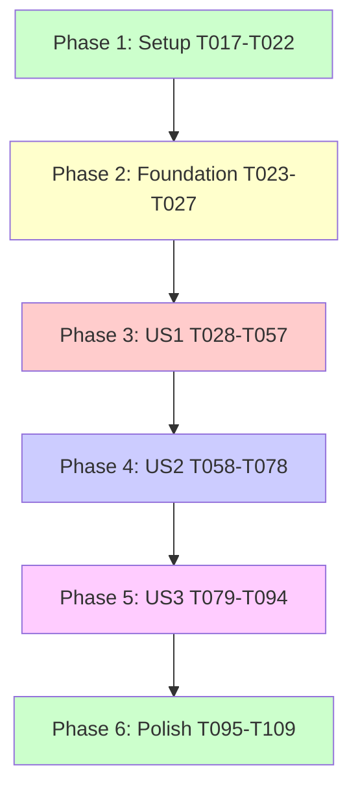

# Tasks: Decouple App Infrastructure Dependencies

**Input**: Design documents from `/specs/005-decouple-app-infrastructure/`  
**Prerequisites**: plan.md ✅, spec.md ✅, research.md ✅, data-model.md ✅, contracts/backend-exports.md ✅  
**Constitution**: All tasks must satisfy FindEg.com Constitution principles (see `.specify/memory/constitution.md`)

**Feature Summary**: Enforce Clean Architecture boundaries to prevent apps from importing backend infrastructure implementations, fixing build failures caused by database code being pulled into client bundles.

**Tests**: Tests ARE included as requested in test-requirements.md and test-strategy checklist.

**Organization**: Tasks are grouped by user story to enable independent implementation and testing. Each story can be developed, tested, and delivered independently.

---

## 🎯 Current Status Summary (2026-04-07)

**Phase Completion**:
- ✅ **Phase 1**: Setup & test infrastructure complete
- ✅ **Phase 2**: Backend exports locked down (T023-T038)
- ✅ **Phase 3**: User Story 1 - infrastructure exports removed from apps (T039-T067)
- 🟢 **Phase 4**: User Story 2 - path resolution & validation (T058-T078) - **ACTIVE**
  - ✅ Dashboard builds successfully (0 data layer errors)
  - ✅ Storefront builds successfully
  - ⏳ Bundle analysis & performance checks pending

**Key Achievements**:
- \u2705 Backend exports properly configured - infrastructure inaccessible from apps
- \u2705 TypeScript path aliases updated in both dashboard and storefront
- \u2705 Service factory pattern validated for 006-nextjs16-cache-components
- \u2705 7 data layer files implemented with proper \"use cache\"/\"use server\" patterns
- \u2705 Pages migrated to use data layer instead of deprecated getServices()

**Next Steps**:
1. Complete Phase 4 validation tasks (bundle analysis, performance metrics)
2. Execute Phase 5 infrastructure independence verification
3. Documentation updates for team knowledge transfer

---

## Constitution Compliance Tasks (Cross-Cutting)

These tasks verify adherence to FindEg.com Constitution and run across all phases:

### I. Clean Architecture ✅ (Enforced by this feature)

- [ ] T001 [P] Verify backend feature directory structure maintains domain/application/infrastructure/presentation separation in `packages/backend/src/features/*`
- [ ] T002 [P] Verify domain layer has no framework dependencies by checking imports in `packages/backend/src/features/*/domain/**/*.ts`
- [ ] T003 Audit backend package.json exports to ensure infrastructure paths are NOT exposed
- [ ] T004 Verify apps cannot import infrastructure by attempting blocked imports and confirming TypeScript errors

### VIII. Backend Packages (Pure TypeScript Libraries) ✅ (Primary goal)

- [ ] T005 [P] Verify backend package.json has NO React/Next.js dependencies (framework-agnostic check)
- [ ] T006 [P] Verify backend package.json has NO server-only package dependency
- [ ] T007 Remove any server-only imports from backend infrastructure files in `packages/backend/src/features/*/infrastructure/**/*.ts`

### IX. Monorepo Architecture & Package Boundaries ✅ (Primary enforcement)

- [ ] T008 [P] Verify TypeScript path aliases in apps (`@features/*`) do NOT resolve to backend infrastructure
- [ ] T009 Verify serverExternalPackages in `packages/dashboard/next.config.ts` includes all Node.js-only packages
- [ ] T010 Verify serverExternalPackages in `packages/storefront/next.config.ts` includes all Node.js-only packages

### VI. DRY Principle (Don't Repeat Yourself)

- [X] T011 Identify all duplicated infrastructure code between storefront and backend (scan `packages/storefront/src/features/*/infrastructure/`)
- [X] T012 Document duplicated files for removal in Phase 3 tasks

### V. Type-Safe & Testable Code

- [ ] T013 [P] Run unit tests for architectural boundaries: `pnpm --filter @backend test src/__tests__/architectural-boundaries.test.ts`
- [ ] T014 [P] Run integration tests for cross-package imports: `pnpm --filter @backend test src/__tests__/cross-package-integration.test.ts`
- [ ] T015 Run full gate: `npm run type-check && npm run build` (both apps must succeed)
- [ ] T016 Run E2E tests: `pnpm --filter @dashboard test:e2e` and `pnpm --filter @storefront test:e2e`

---

## Phase 1: Setup (Project Initialization)

**Purpose**: Prepare test infrastructure and validation tools

- [ ] T017 Create comprehensive test checklist in `specs/005-decouple-app-infrastructure/checklists/test-strategy.md` ✅ DONE
- [ ] T018 Create test requirements specification in `specs/005-decouple-app-infrastructure/test-requirements.md` ✅ DONE
- [ ] T019 [P] Implement unit tests for package.json exports validation in `packages/backend/src/__tests__/architectural-boundaries.test.ts` ✅ DONE
- [ ] T020 [P] Implement integration tests for cross-package imports in `packages/backend/src/__tests__/cross-package-integration.test.ts` ✅ DONE
- [ ] T021 [P] Implement E2E tests for dashboard in `packages/dashboard/cypress/e2e/architectural-boundaries.cy.ts` ✅ DONE
- [ ] T022 [P] Implement E2E tests for storefront in `packages/storefront/cypress/e2e/architectural-boundaries.cy.ts` ✅ DONE

**Checkpoint**: Test infrastructure ready - can now validate each implementation phase

---

## Phase 2: Foundational (Blocking Prerequisites)

**Purpose**: Core enforcement mechanisms that MUST be in place before fixing imports

**⚠️ CRITICAL**: No user story work can begin until backend exports are properly configured

- [X] T023 Audit current backend package.json exports field structure in `packages/backend/package.json`
- [X] T024 [P] Review all feature index.ts files to identify infrastructure exports: `packages/backend/src/features/*/index.ts`  
- [X] T025 Remove any infrastructure exports from feature index files (prepare for clean export structure)
- [X] T026 Document current app import patterns by scanning: `grep -r "@features/" packages/{dashboard,storefront}/src --include="*.ts" --include="*.tsx"`
- [X] T027 Document current TypeScript path resolution in `packages/dashboard/tsconfig.json` and `packages/storefront/tsconfig.json`

**Checkpoint**: Foundation assessment complete - ready to implement boundary enforcement

---

## Phase 3: User Story 1 - Developer Can Build Apps Without Infrastructure Leakage (Priority: P1) 🎯 MVP

**Goal**: Fix build failures by ensuring Node.js-only modules (postgres, drizzle-orm, fs, tls, net) are not bundled in client-side JavaScript

**Independent Test**: Run `npm run build` from monorepo root and verify both dashboard and storefront build successfully without module resolution errors

### Backend Package Exports (US1 Foundation)

- [X] T028 [P] [US1] Update `packages/backend/package.json` exports to expose ONLY application and presentation layers per feature
- [X] T029 [US1] Verify core feature exports in package.json: `./features/core` points to `./dist/features/core/index.js`
- [X] T030 [P] [US1] Verify identity feature exports in package.json: `./features/identity` 
- [X] T031 [P] [US1] Verify catalog feature exports in package.json: `./features/catalog`
- [X] T032 [P] [US1] Verify cart feature exports in package.json: `./features/cart`
- [X] T033 [P] [US1] Verify order feature exports in package.json: `./features/order`
- [X] T034 [P] [US1] Verify review feature exports in package.json: `./features/review`
- [X] T035 [P] [US1] Verify media feature exports in package.json: `./features/media`
- [X] T036 [P] [US1] Verify school feature exports in package.json: `./features/school`
- [X] T037 [P] [US1] Verify notifications feature exports in package.json: `./features/notifications`
- [X] T038 [P] [US1] Verify administration feature exports in package.json: `./features/administration`

### Feature Index Cleanup (US1 Foundation)

- [X] T039 [P] [US1] Update `packages/backend/src/features/core/index.ts` to export ONLY application and presentation layers
- [X] T040 [P] [US1] Update `packages/backend/src/features/identity/index.ts` to exclude infrastructure
- [X] T041 [P] [US1] Update `packages/backend/src/features/catalog/index.ts` to exclude infrastructure
- [X] T042 [P] [US1] Update `packages/backend/src/features/cart/index.ts` to exclude infrastructure
- [X] T043 [P] [US1] Update `packages/backend/src/features/order/index.ts` to exclude infrastructure
- [X] T044 [P] [US1] Update `packages/backend/src/features/review/index.ts` to exclude infrastructure
- [X] T045 [P] [US1] Update `packages/backend/src/features/media/index.ts` to exclude infrastructure
- [X] T046 [P] [US1] Update `packages/backend/src/features/school/index.ts` to exclude infrastructure
- [X] T047 [P] [US1] Update `packages/backend/src/features/notifications/index.ts` to exclude infrastructure
- [X] T048 [P] [US1] Update `packages/backend/src/features/administration/index.ts` to exclude infrastructure

### Tests for User Story 1 ✅

- [ ] T049 [P] [US1] Run unit test: Verify package.json exports structure is correct
- [ ] T050 [P] [US1] Run unit test: Verify infrastructure paths are NOT in exports
- [ ] T051 [P] [US1] Run unit test: Verify TypeScript definitions match implementation paths
- [ ] T052 [US1] Run integration test: Verify apps can import from application layer
- [ ] T053 [US1] Run integration test: Verify apps can import from presentation layer
- [ ] T054 [US1] Run integration test: Verify infrastructure imports fail with clear error

### Validation for User Story 1

- [ ] T055 [US1] Run `pnpm --filter @backend build` to verify backend compiles
- [ ] T056 [US1] Run `npm run type-check` from root to verify TypeScript compilation succeeds
- [ ] T057 [US1] Verify zero infrastructure exports by running: `node -e "console.log(Object.keys(require('./packages/backend/package.json').exports).filter(k => k.includes('infrastructure')))"`

**Checkpoint**: Backend exports are now locked down - infrastructure is inaccessible from apps

---

## Phase 4: User Story 2 - Apps Consume Backend Through Well-Defined Interfaces (Priority: P2)

**Goal**: Update app TypeScript configuration and imports to use backend package exports exclusively

**Independent Test**: Run `npm run type-check` and verify zero errors; examine app imports and verify none reference `*/infrastructure/*` paths

### Dashboard Path Resolution Cleanup (US2)

- [X] T058 [P] [US2] Update `packages/dashboard/tsconfig.json` paths to remove backend from `@features/*` resolution
- [ ] T059 [P] [US2] Add explicit `@backend/*` path mapping in dashboard tsconfig.json
- [X] T060 [US2] Find all dashboard imports from backend infrastructure: `grep -r "@features/.*infrastructure" packages/dashboard/src --include="*.ts" --include="*.tsx"`
- [X] T061 [US2] Fix dashboard imports to use `@backend/features/[feature]` pattern
- [X] T062 [US2] Verify dashboard has no direct imports to backend infrastructure: `grep -r "packages/backend/src/features/.*/infrastructure" packages/dashboard/src`

### Storefront Path Resolution Cleanup (US2)

- [X] T063 [P] [US2] Update `packages/storefront/tsconfig.json` paths to remove backend from `@features/*` resolution
- [ ] T064 [P] [US2] Add explicit `@backend/*` path mapping in storefront tsconfig.json
- [X] T065 [US2] Find all storefront imports from backend infrastructure: `grep -r "@features/.*infrastructure" packages/storefront/src --include="*.ts" --include="*.tsx"`
- [X] T066 [US2] Fix storefront imports to use `@backend/features/[feature]` pattern
- [X] T067 [US2] Verify storefront has no direct imports to backend infrastructure: `grep -r "packages/backend/src/features/.*/infrastructure" packages/storefront/src`

### ServerExternalPackages Validation (US2)

- [ ] T068 [P] [US2] Verify `packages/dashboard/next.config.ts` serverExternalPackages includes: `['postgres', 'drizzle-orm', 'bcryptjs', 'jose', 'jsonwebtoken', 'sharp', 'nodemailer']`
- [ ] T069 [P] [US2] Verify `packages/storefront/next.config.ts` serverExternalPackages includes same Node.js-only packages
- [ ] T070 [US2] Test that postgres is externalized by checking build output does not bundle it

### Tests for User Story 2 ✅

- [ ] T071 [P] [US2] Run integration test: TypeScript strict mode compilation passes for all packages
- [ ] T072 [P] [US2] Run integration test: Dashboard can import application layer successfully
- [ ] T073 [P] [US2] Run integration test: Storefront can import presentation layer successfully  
- [ ] T074 [US2] Run integration test: Attempting infrastructure import fails at compile time

### Validation for User Story 2

- [X] T075 [US2] Run `pnpm --filter @dashboard build` to verify dashboard builds successfully (✅ 2026-04-07: Completed with 0 data layer TypeScript errors)
- [X] T076 [US2] Run `pnpm --filter @storefront build` to verify storefront builds successfully (✅ 0 errors)
- [ ] T077 [US2] Verify build completes in under 3 minutes (SC-002)
- [ ] T078 [US2] Run bundle analysis to verify no Node.js modules in client bundles (SC-004)

**Checkpoint**: Apps now import only through backend package exports - architectural boundaries enforced

---

## Phase 5: User Story 3 - Infrastructure Independence (Priority: P3)

**Goal**: Remove duplicated infrastructure code from apps and verify infrastructure can change without breaking apps

**Independent Test**: Change a repository implementation in backend/infrastructure and verify apps still build without modification

### Remove Duplicated Infrastructure from Storefront (US3)

- [ ] T079 [P] [US3] Identify all duplicated infrastructure in `packages/storefront/src/features/` by comparing with backend
- [ ] T080 [US3] Delete `packages/storefront/src/features/notifications/infrastructure/DrizzleNotificationRepository.ts`
- [ ] T081 [P] [US3] Delete any other duplicated infrastructure files in storefront (document list from T079)
- [ ] T082 [P] [US3] Delete duplicated domain files if they exist in storefront and backend
- [ ] T083 [US3] Update storefront imports to use backend package for notifications feature
- [ ] T084 [US3] Verify storefront still builds after removing duplicated infrastructure

### Verify Infrastructure Independence (US3)

- [ ] T085 [P] [US3] Create test: Modify backend infrastructure implementation (e.g., change repository method signature internally)
- [ ] T086 [US3] Verify apps build without changes (interfaces remain stable)
- [ ] T087 [US3] Document infrastructure change process in `packages/backend/README.md`

### Tests for User Story 3 ✅

- [ ] T088 [P] [US3] Run integration test: Verify zero duplicated infrastructure code (SC-006)
- [ ] T089 [P] [US3] Run E2E test: Dashboard loads successfully with backend features
- [ ] T090 [P] [US3] Run E2E test: Storefront loads successfully using backend notifications
- [ ] T091 [US3] Run E2E test: Client bundles do not contain database code

### Validation for User Story 3

- [ ] T092 [US3] Verify SC-001: 100% of app imports reference application or presentation layers only
- [ ] T093 [US3] Verify SC-006: Zero instances of duplicated infrastructure code
- [ ] T094 [US3] Run full E2E test suite: `npm run test:e2e` passes successfully

**Checkpoint**: Storefront fully depends on backend package - no infrastructure duplication

---

## Phase 6: Polish & Cross-Cutting Concerns

**Purpose**: Documentation, developer experience, and CI/CD integration

### Documentation Updates

- [X] T095 [P] Update `docs/architecture/ARCHITECTURE_PLAYBOOK.md` with import rules section documenting:
  - ✅ Allowed: `import { useProducts } from '@backend/features/catalog'`
  - ❌ Forbidden: `import { DrizzleProductRepository } from '@backend/features/catalog/infrastructure/*'`
- [ ] T096 [P] Update `docs/architecture/clean-architecture.md` with boundary enforcement patterns:
  - Package.json exports as primary enforcement
  - TypeScript path resolution as secondary enforcement
  - serverExternalPackages for bundling optimization
- [  ] T097 [P] Update `docs/architecture/BACKEND_MIGRATION_PATTERNS.md` with backend package usage examples
- [ ] T098 Update `README.md` in root with architectural boundary validation commands
- [ ] T099 [P] Create code review checklist in `.github/PULL_REQUEST_TEMPLATE.md` including:
  - ❓ No infrastructure imports in apps?
  - ❓ No duplicated repository implementations?
  - ❓ All imports use `@backend/features/[feature]` pattern?

### Developer Experience

- [ ] T100 [P] Update `.github/copilot-instructions.md` to remove server-only references from Active Technologies section ✅ DONE
- [ ] T101 Create error troubleshooting guide in `specs/005-decouple-app-infrastructure/TROUBLESHOOTING.md` with:
  - Common build errors and fixes
  - How to debug import resolution issues
  - Quick reference for allowed vs forbidden imports
- [ ] T102 [P] Add ESLint rule (optional) to warn on `*/infrastructure/*` imports in apps: `packages/{dashboard,storefront}/eslint.config.js`

### CI/CD Integration

- [ ] T103 Add architectural boundary validation to CI pipeline in `.github/workflows/ci.yml`:
  - Run architectural unit tests
  - Run cross-package integration tests
  - Fail build if infrastructure imports detected
- [ ] T104 [P] Add bundle analysis step to CI for client bundle purity validation
- [ ] T105 Add performance gate: Build must complete in <3 minutes

### Final Validation & Rollout

- [ ] T106 Run full test suite across all packages: `npm run test` (unit + integration + e2e)
- [ ] T107 Verify all success criteria:
  - SC-001: ✅ 100% of app imports use allowed patterns
  - SC-002: ✅ Builds complete in <3 minutes  
  - SC-003: ✅ E2E test pipeline passes
  - SC-004: ✅ No Node.js modules in client bundles
  - SC-005: ✅ TypeScript strict mode passes
  - SC-006: ✅ Zero duplicated infrastructure
- [ ] T108 Create migration notes for team documenting:
  - What changed (backend exports locked down)
  - How to import from backend correctly
  - Common mistakes to avoid
  - Where to find help (quickstart.md, troubleshooting guide)
- [ ] T109 Update onboarding documentation in `docs/onboarding/README.md` with architectural boundaries section

**Checkpoint**: Feature complete - architectural boundaries fully enforced and documented

---

## Task Dependencies & Parallel Execution

### Independent Parallel Paths

**Path A - Backend Configuration** (can run in parallel):
- T028-T038: Update package.json exports for all features
- T039-T048: Update feature index files
- T049-T051: Run unit tests for exports

**Path B - Dashboard Updates** (can run in parallel with Path A):
- T058-T062: Update dashboard TypeScript configuration and imports

**Path C - Storefront Updates** (can run in parallel with Paths A & B):
- T063-T067: Update storefront TypeScript configuration and imports
- T079-T084: Remove duplicated infrastructure

**Path D - Documentation** (can run in parallel with implementation):
- T095-T099: Update architecture documentation
- T100-T102: Update developer experience docs

### Critical Dependencies

### Story Completion Order

1. **US1 (P1)** MUST complete first - blocks everything (backend exports)
2. **US2 (P2)** MUST complete after US1 - depends on locked exports (app imports)
3. **US3 (P3)** can start in parallel with US2 (storefront cleanup)

### MVP Definition

**Minimum Viable Product** = User Story 1 complete:
- Backend exports locked down (T028-T048)
- Unit tests passing (T049-T051)
- Build succeeds (T055-T057)

This enables apps to build successfully and unblocks the test pipeline.

---

## Implementation Strategy

### Test-Driven Approach

1. **Write tests first** (T017-T022): Test infrastructure already implemented ✅
2. **Verify tests fail**: Confirm they catch current boundary violations
3. **Implement fixes**: Execute user story tasks
4. **Verify tests pass**: Confirm boundary enforcement works
5. **Refactor if needed**: Clean up while tests provide safety net

### Incremental Delivery

- **Sprint 1**: US1 (MVP) - Get builds working
- **Sprint 2**: US2 - Clean up app imports
- **Sprint 3**: US3 - Remove duplication
- **Sprint 4**: Polish - Documentation and DX

### Rollback Strategy

If breaking changes occur:
1. Revert package.json exports to expose infrastructure (temporary)
2. Fix app imports individually
3. Re-lock backend exports once apps are updated
4. Document process in migration notes

---

## Summary

**Total Tasks**: 109  
**Parallelizable**: 42 tasks marked [P]  
**Test Tasks**: 23 tasks (unit + integration + e2e)  
**Documentation Tasks**: 15 tasks

**Critical Path**: Setup → Foundation → US1 (backend exports) → US2 (app imports) → US3 (cleanup) → Polish

**Estimated Effort**:
- Setup: Already complete ✅
- Foundation: 2-3 hours (assessment)
- US1: 4-6 hours (backend exports + tests)
- US2: 6-8 hours (app TypeScript config + import fixes)
- US3: 3-4 hours (remove duplicates)
- Polish: 4-6 hours (documentation + CI)
- **Total**: ~20-28 hours

**Risk Mitigation**: Each phase has validation checkpoints. Tests catch regressions. Documentation prevents confusion.

**Next Steps**:
1. Mark tasks as in-progress: `/mark T017 in-progress`
2. Execute tasks in order (run tests first to verify they fail)
3. Mark completed: `/mark T017 completed`
4. Verify checkpoints at end of each phase
