# Data Model: Monorepo Documentation Restructure

**Branch**: `006-docs-restructure`  
**Date**: 2026-04-19

## Entities

This feature does not introduce new application data entities. The "entities" are documentation artifacts:

### Document Hierarchy

```mermaid
graph TD
    ROOT["README.md (Root)"]

    ROOT --> BE["packages/backend/README.md"]
    ROOT --> DASH["packages/dashboard/README.md"]
    ROOT --> SF["packages/storefront/README.md"]
    ROOT --> UI["packages/ui/README.md"]

    BE --> BE_CAT["catalog/README.md"]
    BE --> BE_CART["cart/README.md"]
    BE --> BE_ORD["order/README.md"]
    BE --> BE_ID["identity/README.md"]
    BE --> BE_ADM["administration/README.md"]
    BE --> BE_REV["review/README.md"]
    BE --> BE_MED["media/README.md"]
    BE --> BE_CORE["core/README.md"]
    BE --> BE_NOT["notifications/README.md"]
    BE --> BE_SCH["school/README.md"]
    BE --> SCHEMA["docs/database/SCHEMA.md"]

    DASH --> DASH_ADM["administration/README.md"]
    DASH --> DASH_CAT["catalog/README.md"]

    SF --> SF_CAT["catalog/README.md"]
    SF --> SF_CART["cart/README.md"]
    SF --> SF_ORD["order/README.md"]
    SF --> SF_REV["review/README.md"]
    SF --> SF_NOT["notifications/README.md"]
    SF --> SF_SCH["school/README.md"]
```

### Document Types

| Type                      | Count | Template Sections                                                             |
| ------------------------- | ----- | ----------------------------------------------------------------------------- |
| Root README               | 1     | Business overview, tech stack, package map, quick start, doc map              |
| Package README            | 4     | Purpose, architecture diagram, feature inventory, standards, testing          |
| Backend Feature README    | 10    | Purpose, entities, services, DB tables/columns, sequence diagrams, edge cases |
| Dashboard Feature README  | 2     | Purpose, UI components, backend services, permissions                         |
| Storefront Feature README | 6     | Purpose, pages, backend services, data fetching, UI components                |
| Schema Reference          | 1     | Auto-generated ER diagram, table inventory, relationships                     |

**Total documents**: 24
