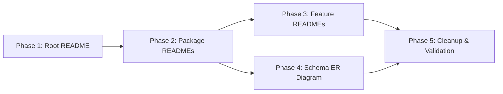

# Implementation Plan: Monorepo Documentation Restructure

**Branch**: `006-docs-restructure` | **Date**: 2026-04-19 | **Spec**: [spec.md](./spec.md)
**Input**: Feature specification from `/specs/006-docs-restructure/spec.md`

## Summary

Restructure ~90+ scattered markdown files into a clean 3-tier documentation hierarchy (Root → Package → Feature), dissolve the `docs/` directory entirely, delete obsolete content, and produce comprehensive per-package and per-feature READMEs with Mermaid diagrams, scoped DB documentation, and a navigable Table of Contents. Zero information loss for actionable content.

## Technical Context

**Language/Version**: Markdown (GitHub Flavored Markdown + Mermaid)
**Primary Dependencies**: Mermaid (native GitHub rendering), Drizzle schema (for auto-generated ER diagrams)
**Storage**: N/A (documentation-only feature)
**Testing**: Manual link validation + grep-based broken-link checker script
**Target Platform**: GitHub repository (rendered in GitHub UI, VS Code, and IDEs)
**Project Type**: Documentation restructure (no application code changes)
**Performance Goals**: N/A
**Constraints**: All content changes are markdown-only; no application code modified
**Scale/Scope**: ~90 existing docs → ~25 new/rewritten READMEs across 4 packages and 16 features

## Constitution Check

_GATE: Must pass before Phase 0 research. Re-check after Phase 1 design._

1. **☑ Clean Architecture** — Documentation hierarchy mirrors clean architecture layers; per-feature READMEs document domain/application/infrastructure boundaries
2. **☑ Server-Components First** — N/A (no UI code)
3. **☑ Bilingual & RTL-First** — N/A (docs in English only per spec assumption)
4. **☑ Feature-Oriented Core Kernel** — Feature READMEs placed inside feature directories, following the self-contained structure
5. **☑ Type-Safe & Testable** — N/A (no application code)
6. **☑ DRY Principle** — Each fact documented in exactly one canonical location with cross-references; no content duplication
7. **☑ SOLID Design** — N/A (no application code)
8. **☑ Definition of Done** — Broken-link validation script, content migration checklist, visual review

**Violations found**: None

## Project Structure

### Documentation Hierarchy (Target State)

```text
findeg.stationary/
├── README.md                                          # TIER 1: Root (rewrite)
├── CHANGELOG.md                                       # Preserved as-is
│
├── packages/backend/
│   ├── README.md                                      # TIER 2: Backend package (rewrite)
│   ├── docs/database/
│   │   ├── SCHEMA.md                                  # Central ER reference (update)
│   │   ├── SETUP.md                                   # DB setup guide (preserve)
│   │   └── TAXONOMY.md                                # Category taxonomy (preserve)
│   └── src/features/
│       ├── catalog/README.md                          # TIER 3: Feature (rewrite)
│       ├── cart/README.md                             # TIER 3 (rewrite)
│       ├── order/README.md                            # TIER 3 (rewrite)
│       ├── identity/README.md                         # TIER 3 (rewrite)
│       ├── administration/README.md                   # TIER 3 (rewrite)
│       ├── review/README.md                           # TIER 3 (rewrite)
│       ├── media/README.md                            # TIER 3 (rewrite)
│       ├── core/README.md                             # TIER 3 (rewrite)
│       ├── notifications/README.md                    # TIER 3 (new)
│       └── school/README.md                           # TIER 3 (new)
│
├── packages/dashboard/
│   ├── README.md                                      # TIER 2: Dashboard package (new)
│   └── src/features/
│       ├── administration/README.md                   # TIER 3 (rewrite)
│       └── catalog/README.md                          # TIER 3 (new)
│
├── packages/storefront/
│   ├── README.md                                      # TIER 2: Storefront package (new)
│   └── src/features/
│       ├── catalog/README.md                          # TIER 3 (rewrite)
│       ├── cart/README.md                             # TIER 3 (rewrite)
│       ├── order/README.md                            # TIER 3 (rewrite)
│       ├── review/README.md                           # TIER 3 (rewrite)
│       ├── notifications/README.md                    # TIER 3 (new)
│       └── school/README.md                           # TIER 3 (new)
│
├── packages/ui/
│   └── README.md                                      # TIER 2: UI package (rewrite)
│
└── docs/                                              # DELETED (fully dissolved)
```

**Structure Decision**: 3-tier hierarchy — Root README → Package READMEs → Feature READMEs. The `docs/` directory is fully dissolved. Backend retains `docs/database/` for the central schema reference (not a general-purpose docs folder).

---

## Content Migration Map

### Files to MIGRATE (content absorbed into new hierarchy)

| Source File                                                | Target Location                                  | Notes                                                |
| ---------------------------------------------------------- | ------------------------------------------------ | ---------------------------------------------------- |
| `docs/architecture/ARCHITECTURE_PLAYBOOK.md`               | Root README + Backend README                     | Core diagrams → Root; layer details → Backend README |
| `docs/architecture/clean-architecture.md`                  | Backend README                                   | Layer rules section                                  |
| `docs/architecture/DOMAIN_TYPE_BLOCKS.md`                  | Backend README                                   | Domain modeling section                              |
| `docs/architecture/BACKEND_MIGRATION_PATTERNS.md`          | Backend README                                   | Migration patterns section                           |
| `docs/development/component-placement.md`                  | Dashboard README + Storefront README             | Component conventions per app                        |
| `docs/development/conventions.md`                          | Root README + Package READMEs                    | DOs/DON'Ts per package                               |
| `docs/guides/CODING_STANDARDS.md`                          | Root README                                      | Contributing standards section                       |
| `docs/guides/DEVELOPMENT.md`                               | Root README                                      | Quick start / dev workflow                           |
| `docs/guides/MONOREPO_MIGRATION.md`                        | Root README                                      | Historical context section                           |
| `docs/guides/SCALING.md`                                   | Root README                                      | Architecture decisions                               |
| `docs/guides/LOGGING.md`                                   | Backend README                                   | Logging section                                      |
| `docs/guides/CHANGELOG_AUTOMATION.md`                      | Root README                                      | Contributing section                                 |
| `docs/guides/SHADCN_COMPONENT_ADOPTION_MAP.md`             | UI README                                        | Component inventory                                  |
| `docs/testing/CYPRESS_CODING_STANDARDS.md`                 | Dashboard README + Storefront README             | Testing standards per app                            |
| `docs/testing/FRONTEND_TEST_MASTER_PLAN.md`                | Dashboard README + Storefront README             | Test strategy per app                                |
| `docs/onboarding/README.md`                                | Root README                                      | Quick start section                                  |
| `docs/features/SCHOOL_LIST_PRIVATE_ACCESS_FEATURE_SPEC.md` | `packages/backend/src/features/school/README.md` | Active feature spec — preserve                       |
| `docs/features/NEXT_PHASE_PUBLIC_SHOP_FEATURES_SPEC.md`    | Root README (roadmap mention)                    | Absorb into roadmap; rest deleted                    |
| `docs/architecture/RELEASE_NOTES.md`                       | Root README (changelog reference)                | Historical; absorb key points                        |
| `ADMIN_PAGES_UPDATE_GUIDE.md`                              | Dashboard README                                 | Admin page patterns                                  |
| `packages/dashboard/docs/admin/*.md` (6 files)             | Dashboard README                                 | Admin design/navigation/patterns                     |

### Files to DELETE (obsolete after migration)

| File                                       | Reason                                           |
| ------------------------------------------ | ------------------------------------------------ |
| `docs/` directory (entire)                 | Dissolved per clarification Q1                   |
| `ADMIN_PAGES_UPDATE_GUIDE.md`              | Content migrated to Dashboard README             |
| `packages/backend/EXPORTS_VERIFICATION.md` | One-time verification artifact; no longer needed |

### Files to PRESERVE as-is

| File                                                  | Reason                                      |
| ----------------------------------------------------- | ------------------------------------------- |
| `CHANGELOG.md`                                        | Living file; out of scope                   |
| `packages/backend/docs/database/SCHEMA.md`            | Central schema reference; updated not moved |
| `packages/backend/docs/database/SETUP.md`             | DB setup guide; linked from Root README     |
| `packages/backend/docs/database/TAXONOMY.md`          | Category taxonomy reference                 |
| `packages/backend/scripts/data/seed/README.md`        | Seed script docs                            |
| `packages/backend/scripts/data/seed/tables/README.md` | Seed table docs                             |

---

## Implementation Phases

### Phase 1: Deep Codebase Investigation

- Inspect `turbo.json`, `package.json`, and deployment configs to document the full build process and CI/CD strategy.
- Investigate `docker-compose.yml` and container orchestration details for local development and production.
- Read key files in `src/features/*` to map real business logic, entities, services, and integration boundaries.

### Phase 2: Root README (Tier 1)

**File**: `README.md` (root — full rewrite)

Sections to include:

1. **Executive Summary (for Stakeholders & POs)** — Product vision, current feature status matrix, business goals, target market positioning, and high-level progress overview. Written for non-technical audiences.
2. **Business Overview** — What FindEg is, the market (Egypt school supplies B2C/B2B2C), core value proposition.
3. **Technology Stack & Architecture Overview** — Next.js 16, TypeScript, Turborepo, Drizzle ORM, PostgreSQL, Tailwind CSS 4, next-intl. High-level clean architecture Mermaid diagram.
4. **Monorepo Package Map & Integration** — Detailed explanation of how packages integrate and talk to each other.
5. **Build, Docker & Deployment Strategy** — How we build (`turbo`), Docker usage (`docker-compose.yml`), CI/CD approach, testing pipelines (`vitest`, `cypress`), and deployment environments.
6. **Quick Start & Environment Setup** — Prerequisites, install, DB setup, dev servers.
7. **Test Accounts** — Role table.
8. **Engineering Standards** — Detailed coding standards summary (clean code rules), commit conventions, changelog automation.
9. **Documentation Map** — Visual tree of all READMEs with clickable links (Mermaid graph).
10. **Current Status & Roadmap** — Phase 1 MVP status, upcoming School List feature.

Sources absorbed: Deep analysis of `turbo.json`, `package.json`, `docker-compose.yml`, `src/`, codebase architecture docs.

### Phase 2: Package READMEs (Tier 2)

#### 2A. Backend README

**File**: `packages/backend/README.md` (full rewrite)

Sections:

1. Purpose & role in the monorepo
2. Architecture — clean arch layers Mermaid diagram, layer responsibilities, ServiceResult pattern, domain errors, DI
3. Feature inventory — table listing all 10 features with purpose and link
4. Database schema overview — auto-generated ER diagram from Drizzle, table inventory table
5. Coding standards — DOs/DON'Ts, pure TypeScript rules, no framework imports
6. Testing strategy — Vitest, coverage goals, test patterns
7. Environment setup — env vars, build commands
8. Public API / exports

Sources absorbed: `docs/architecture/clean-architecture.md`, `docs/architecture/DOMAIN_TYPE_BLOCKS.md`, `docs/architecture/BACKEND_MIGRATION_PATTERNS.md`, `docs/guides/LOGGING.md`

#### 2B. Dashboard README

**File**: `packages/dashboard/README.md` (new)

Sections:

1. Purpose & role — admin panel on port 3001
2. Architecture — App Router structure, Server/Client component strategy, admin shell layout
3. **Page inventory** — table listing every admin page (route, purpose, key components)
4. Feature inventory — table listing features with link
5. Navigation config — sidebar structure, permission model
6. **Component map** — what each major UI component represents (AdminShell, AdminHeader, AdminSidebar, ProductForm, etc.) and how users interact with them
7. Theming & dark mode — standards, patterns, ToggleTheme
8. Coding standards — DOs/DON'Ts specific to dashboard
9. Testing strategy — Cypress E2E, Vitest unit, test account usage
10. i18n — message file structure, translation patterns

Sources absorbed: `ADMIN_PAGES_UPDATE_GUIDE.md`, `packages/dashboard/docs/admin/*.md`, `docs/development/component-placement.md`, `docs/testing/CYPRESS_CODING_STANDARDS.md`, `docs/testing/FRONTEND_TEST_MASTER_PLAN.md`

#### 2C. Storefront README

**File**: `packages/storefront/README.md` (new)

Sections:

1. Purpose & role — customer-facing shop on port 3000
2. Architecture — App Router structure, Server Components strategy, `use cache`, PPR
3. **Page inventory** — table listing every customer-facing page (route, purpose, key sections/components)
4. Feature inventory — table listing 6 features with links
5. **User interaction flows** — how a customer navigates the shop (browse → search → product → cart → checkout), with Mermaid sequence diagrams
6. Page routing — route groups, locale handling, middleware
7. i18n & RTL — bilingual patterns, logical CSS, message files
8. Coding standards — DOs/DON'Ts
9. Testing strategy — Cypress E2E setup
10. Performance — caching strategy, streaming, Suspense patterns

Sources absorbed: `docs/development/component-placement.md`, `docs/development/conventions.md`

#### 2D. UI README

**File**: `packages/ui/README.md` (rewrite)

Sections:

1. Purpose & role — shared React component library
2. Component inventory — table of all exported components (shadcn-based)
3. Usage patterns — import syntax, theming tokens, dark mode support
4. Contribution guide — how to add/modify components
5. shadcn adoption map

Sources absorbed: `docs/guides/SHADCN_COMPONENT_ADOPTION_MAP.md`

### Phase 3: Feature READMEs (Tier 3)

For each of the ~18 feature modules across backend/dashboard/storefront, write or rewrite a README with:

**Backend features** (10 modules): purpose, domain entities & relationships, service contracts (interface methods), scoped DB tables/columns (which tables this feature reads/writes), sequence diagrams (how each use-case interacts with the DB), edge cases.

**Dashboard features** (2 modules): purpose, UI component tree, page descriptions (what each page shows and how users interact with it), backend services consumed, permissions, navigation entry.

**Storefront features** (6 modules): purpose, page routes with descriptions of what each page displays, UI component breakdown, user interaction flows (e.g., how a user adds to cart, checks out), backend services consumed, data fetching patterns (RSC/cache).

### Phase 4: Schema Reference & ER Diagram

**File**: `packages/backend/docs/database/SCHEMA.md` (update)

- Auto-generate the full ER Mermaid diagram by reading the Drizzle schema files
- Table inventory with column names, types, and FK relationships
- Index and constraint documentation

### Phase 5: Cleanup & Validation

1. Delete `docs/` directory entirely
2. Delete `ADMIN_PAGES_UPDATE_GUIDE.md`
3. Delete `packages/backend/EXPORTS_VERIFICATION.md`
4. Run broken-link validation across all new/rewritten markdown files
5. Verify SC-001 (≤3 hops), SC-002 (zero broken links), SC-007 (zero duplication)

---

## Execution Order & Dependencies



Phase 1 must come first (establishes the doc map). Phase 2 depends on Phase 1 (needs the root links). Phases 3 and 4 can run in parallel after Phase 2. Phase 5 runs last to validate everything.

## Complexity Tracking

No constitution violations. No complexity justifications needed.
