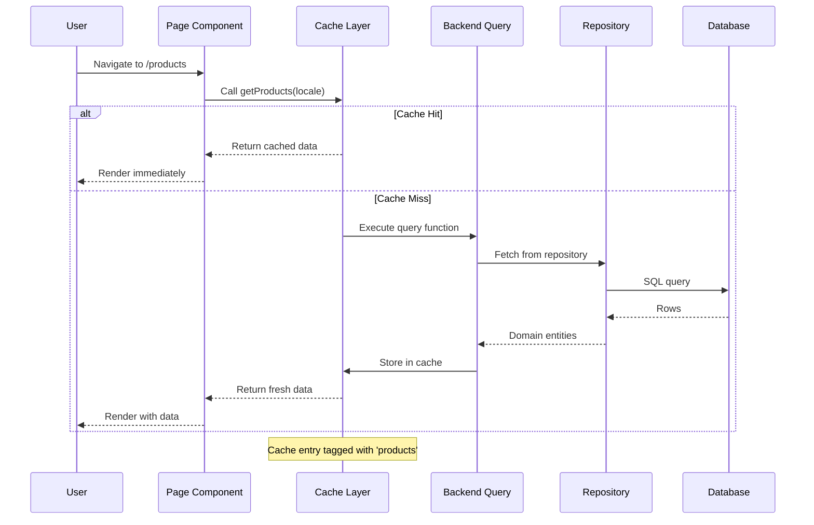
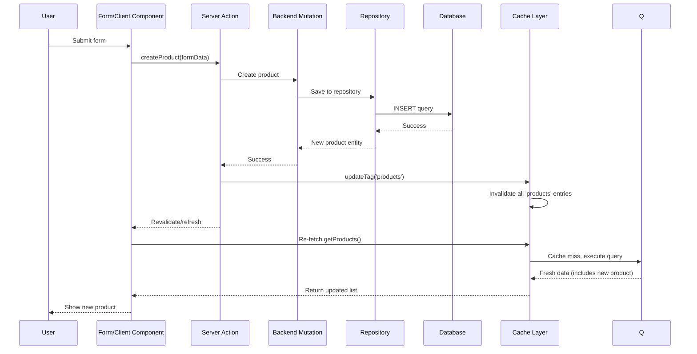

# Feature Specification: Next.js 16 Cache Components & PPR Migration

**Feature Branch**: `006-nextjs16-cache-components`  
**Created**: 2026-04-06  
**Status**: Draft  
**Parent Spec**: `005-decouple-app-infrastructure`  
**Input**: Migrate dashboard and storefront to Next.js 16 Cache Components pattern with Partial Prerendering (PPR)

## Constitution Compliance _(mandatory before implementation)_

This feature MUST comply with the FindEg.com Constitution (`.specify/memory/constitution.md`). Review gates:

- **I. Clean Architecture**: Enforces application layer exports from backend; eliminates Service Container pattern
- **II. Server-Components First**: Maximizes Server Components with "use cache" directive; Client Components only for interactivity
- **III. Bilingual & RTL-First**: Maintains i18n support throughout cached components
- **IV. Feature-Oriented Core Kernel**: Backend exports cacheable query/action functions per feature
- **V. Type-Safe & Testable**: TypeScript strict mode; serializable cache keys; testable cache invalidation
- **VI. DRY Principle**: Single source of truth for cached data; no duplicated fetch logic
- **VII. SOLID Design**: Dependency Inversion via application layer functions, not DI container

---

## Executive Summary

**Problem**: Dashboard and storefront cannot build in Next.js 16 because they import `container` (DI infrastructure) from backend. Next.js 16's Turbopack cannot bundle infrastructure code with Node.js-only dependencies (postgres, fs, etc.). Additionally, apps miss significant performance opportunities from Cache Components and Partial Prerendering (PPR).

**Solution**: Refactor apps to use Next.js 16's "use cache" directive and backend application layer exports instead of Service Container pattern. Enable PPR for instant navigation and optimal static/dynamic rendering.

**Impact**:
- ✅ **Builds**: Dashboard and storefront will build successfully
- ✅ **Performance**: 5-10x faster Fast Refresh, instant page navigation with PPR
- ✅ **Architecture**: Clean separation - apps consume functions, not infrastructure
- ✅ **Developer Experience**: Explicit caching, better debugging, aligned with Next.js 16 best practices

**Effort**: ~3-5 days (80-120 hours) depending on component count

---

## Clarifications

### Session 2026-04-06

**Q1: Where should "use cache" directives live - backend or apps?**
→ A: **Apps create data layer (Option B)** - Backend exports pure TypeScript service classes/functions with NO Next.js dependencies. Each app (dashboard, storefront) creates `src/data/{feature}/queries.ts` with "use cache" wrappers that call backend services. This keeps backend framework-agnostic and allows different cache strategies per app.

**Architecture Pattern**:
- Backend: `export class ProductService { async getAll(locale) { /* pure TS */ } }`
- Dashboard: `"use cache"; cacheTag('products'); return await backend.products.getAll(locale);`
- Storefront: `"use cache"; cacheTag('public-products'); return await backend.products.getAll(locale);` (different cache strategy)

**Q2: When to use updateTag() vs revalidateTag() for cache invalidation?**
→ A: **Use updateTag() exclusively for admin workflows** - Provides immediate cache invalidation for read-your-writes semantics. Use `revalidateTag(tag, 'max')` ONLY for public/anonymous user caches where eventual consistency is acceptable (e.g., public product catalog updates that can tolerate 5-10 min delay). For MVP, use updateTag() for all mutations.

**Decision Matrix**:
- Admin actions (create, update, delete): `updateTag()` - immediate
- Background jobs (bulk imports, scheduled updates): `revalidateTag(tag, 'max')` - eventual
- Public user actions: `updateTag()` - immediate for UX consistency

**Q3: What cache tagging strategy should be used?**
→ A: **Multi-level tagging** - Use both entity-level tags (e.g., `product-${id}`) and collection-level tags (e.g., `products`, `products-${locale}`). On mutations, invalidate both levels for complete cache coverage.

**Tagging Guidelines**:
- Entity cache: `cacheTag('product-${id}', 'category-${id}')` - single item
- Collection cache: `cacheTag('products', 'products-${locale}')` - lists
- Related caches: `cacheTag('product-${id}', 'products', 'category-${categoryId}')` - invalidate related
- Naming convention: singular for entity, plural for collection, kebab-case for multi-word

---

## User Scenarios & Testing _(mandatory)_

### User Story 1 - Dashboard Builds Successfully with Cache Components (Priority: P0 - BLOCKING)

**As a** developer  
**I want** dashboard to build for production  
**So that** I can deploy the application and run e2e tests

**Why this priority**: Currently **blocks all deployment and testing**. Dashboard build fails at Turbopack bundling phase when it tries to import `container` from backend.

**Current Error**:
```
Error: Turbopack build failed with 102 errors:
Module not found: Can't resolve 'postgres'
  at ./packages/backend/src/features/core/infrastructure/di/ServiceContainer.ts
```

**Acceptance Scenarios**:

1. **Given** dashboard source code  
   **When** developer runs `pnpm --filter @dashboard build`  
   **Then** build completes without module resolution errors  
   **And** no Node.js-only modules appear in client bundles  
   **And** build outputs static and dynamic routes correctly

2. **Given** backend exports cacheable functions with "use cache"  
   **When** dashboard imports these functions  
   **Then** TypeScript resolves types correctly  
   **And** cache keys are generated automatically  
   **And** no infrastructure code is bundled

3. **Given** a cached component in dashboard  
   **When** data is fetched  
   **Then** subsequent requests use cached data  
   **And** stale-while-revalidate works as configured  
   **And** cache invalidation via `updateTag()` reflects immediately

**Independent Test**: 
```bash
# Must pass without errors
pnpm --filter @dashboard build
pnpm --filter @storefront build

# Bundle analysis should show no Node.js modules
npx @next/bundle-analyzer
```

---

### User Story 2 - Instant Page Navigation with PPR (Priority: P1)

**As a** dashboard user  
**I want** instant page transitions between admin pages  
**So that** the interface feels native and responsive

**Why this priority**: PPR provides immediate navigation by pre-rendering static shells and streaming dynamic content. This is a core Next.js 16 feature that dramatically improves UX.

**Acceptance Scenarios**:

1. **Given** user navigates from Products → Orders  
   **When** link is clicked  
   **Then** static shell appears instantly (< 100ms)  
   **And** dynamic data streams in without layout shift  
   **And** loading states show via Suspense boundaries

2. **Given** shared layouts (sidebar, header, footer)  
   **When** multiple pages are prefetched  
   **Then** layout is downloaded once, not per page  
   **And** incremental prefetching only fetches missing data  
   **And** prefetch cache respects stale times

3. **Given** cached product list with "use cache"  
   **When** user navigates back from product detail  
   **Then** list renders from cache immediately  
   **And** no re-fetch occurs if within stale time  
   **And** background revalidation happens if past revalidate time

**Independent Test**:
```bash
# Performance metrics via Lighthouse
npm run dev
# Navigate: Dashboard → Products → Orders → back to Products
# Measure: Time to Interactive (TTI) < 1s for cached routes
```

---

### User Story 3 - Explicit Cache Management for Admin Actions (Priority: P1)

**As a** dashboard admin  
**I want** my edits (create/update/delete) to reflect immediately  
**So that** I have confidence my changes were saved

**Why this priority**: Admin workflows demand read-your-writes semantics. Using `updateTag()` ensures users see their changes instantly without stale data.

**Acceptance Scenarios**:

1. **Given** admin creates a new product  
   **When** Server Action calls `updateTag('products')`  
   **Then** product list cache expires immediately  
   **And** fresh data is fetched on next render  
   **And** new product appears in the list

2. **Given** admin updates brand status  
   **When** Server Action completes  
   **Then** `updateTag('brands')` invalidates cache  
   **And** UI reflects new status without page reload  
   **And** other users see update on next request

3. **Given** multiple related caches (product + variants)  
   **When** product is updated  
   **Then** multiple tags can be invalidated atomically  
   **And** cache consistency is maintained  
   **And** no partial/stale state is visible

**Independent Test**:
```typescript
// E2E test in Cypress
cy.visit('/admin/products/new')
cy.get('[name="title"]').type('New Product')
cy.get('button[type="submit"]').click()
cy.url().should('include', '/admin/products')
cy.contains('New Product').should('be.visible') // Immediate reflection
```

---

### User Story 4 - Frontend Components Optimized for Streaming (Priority: P2)

**As a** developer  
**I want** components to leverage Suspense and streaming  
**So that** users see content progressively without blocking

**Acceptance Scenarios**:

1. **Given** a dashboard page with multiple data sources  
   **When** page loads  
   **Then** static header/sidebar render immediately  
   **And** dashboard widgets stream in as data resolves  
   **And** loading skeletons show via Suspense fallbacks

2. **Given** slow backend API call (analytics, reports)  
   **When** component wraps it in Suspense  
   **Then** page doesn't block on slow data  
   **And** fast content displays first  
   **And** slow content streams in when ready

3. **Given** nested Suspense boundaries  
   **When** data dependencies resolve at different times  
   **Then** most specific boundary shows loading state  
   **And** resolved sections render independently  
   **And** layout remains stable (no CLS)

**Independent Test**:
```bash
# Simulate slow network in Chrome DevTools
# Verify progressive rendering and no layout shift
npm run dev
# Throttle: Slow 3G
# Navigate to dashboard → Check First Contentful Paint < 1.5s
```

---

### Edge Cases

1. **Cache Key Collisions**: Two functions with same signature but different closures → Automatic capture prevents this
2. **Non-Serializable Props**: Passing class instances to cached components → TypeScript error at compile time
3. **Runtime Data in Static Cache**: Calling `cookies()` inside "use cache" → Build timeout error with clear message
4. **Stale Data After Deployment**: New build invalidates all caches → Build ID changes per deploy
5. **Large Cache Keys**: Complex objects as arguments → Serialization overhead, prefer primitive keys
6. **Cache Stampede**: Many requests for same expired key → LRU cache handles deduplication

---

## Requirements _(mandatory)_

### Functional Requirements

**Backend Architecture**:

- **FR-001**: Backend MUST export pure TypeScript service classes/functions with NO "use cache" directives
- **FR-002**: Backend MUST export pure TypeScript mutation functions with NO "use server" directives
- **FR-003**: Backend MUST NOT export `container` or any infrastructure implementations
- **FR-004**: Backend MUST NOT import from 'next/cache' or any Next.js-specific modules
- **FR-005**: Each backend feature MUST have `index.ts` exporting: service classes, domain types, DTOs
- **FR-006**: Backend service methods MUST accept only serializable arguments (primitives, plain objects, arrays)

**Dashboard/Storefront Architecture**:

- **FR-007**: Apps MUST create data layer at `src/data/{feature}/` directory structure
- **FR-008**: App data layer queries MUST have "use cache" directives and call backend services
- **FR-009**: App data layer actions MUST have "use server" directives and call backend services
- **FR-010**: App data layer MUST use `cacheTag()` for cache invalidation in queries
- **FR-011**: App data layer actions MUST use `updateTag()` for immediate cache invalidation (admin workflows)
- **FR-012**: App data layer actions MAY use `revalidateTag(tag, 'max')` for eventual consistency (background jobs, bulk operations where immediate invalidation is not critical)
- **FR-013**: Apps MUST import from their own data layer, NOT directly from backend
- **FR-014**: Apps MUST NOT use `getServices()` or any DI container pattern
- **FR-015**: Apps MUST remove `packages/dashboard/src/server/getServices.ts`
- **FR-016**: Apps MUST remove `packages/storefront/src/server/getServices.ts` (if exists)
- **FR-017**: Pages SHOULD be structured with Suspense boundaries for progressive loading; "use cache" directives belong in app data layer functions, not page files
- **FR-018**: Components MUST wrap dynamic data in `<Suspense>` boundaries
- **FR-019**: Loading states MUST be defined via `loading.tsx` or `<Suspense fallback>`
- **FR-020**: Client Components MUST be minimal and justified (forms, interactive widgets only)

**Caching Configuration**:

- **FR-021**: `next.config.ts` MUST have `cacheComponents: true`
- **FR-022**: Default `cacheLife` profile MUST be configured in `next.config.ts`
- **FR-023**: Custom profiles (e.g., 'products', 'analytics') SHOULD be defined for different data types
- **FR-024**: Cache handlers (Redis, KV) MAY be configured via `cacheHandlers` for runtime caching
- **FR-025**: Development MUST use in-memory cache, production MAY use remote cache

**Performance Requirements**:

- **FR-026**: Static shells MUST render in < 200ms (PPR)  
- **FR-027**: Prefetch requests MUST be incremental (not full page duplicates)
- **FR-028**: Shared layouts MUST be deduplicated across prefetched links
- **FR-029**: Cache hit rate SHOULD be > 80% for dashboard pages
- **FR-030**: Fast Refresh MUST complete in < 1s for 95% of changes (Turbopack)

### Non-Functional Requirements

**Developer Experience**:

- **NFR-001**: Cache behavior MUST be debuggable via `NEXT_PRIVATE_DEBUG_CACHE=1`
- **NFR-002**: TypeScript MUST prevent non-serializable props at compile time
- **NFR-003**: Build errors MUST clearly indicate cause (e.g., "runtime data in use cache")
- **NFR-004**: Migration guide MUST document patterns for each refactoring scenario
- **NFR-005**: Code examples MUST show before/after for common cases

**Testing**:

- **NFR-006**: Cache invalidation MUST be testable in unit tests
- **NFR-007**: E2E tests MUST verify read-your-writes semantics
- **NFR-008**: Performance tests MUST validate cache hit rates
- **NFR-009**: Bundle analysis MUST run on CI to detect infrastructure leakage

**Documentation**:

- **NFR-010**: Architecture diagram MUST show data flow: App → Backend Function (use cache) → DB
- **NFR-011**: Decision log MUST explain why Service Container was removed
- **NFR-012**: Cheat sheet MUST show when to use: use cache vs updateTag vs revalidateTag vs refresh
- **NFR-013**: Examples MUST cover: simple query, complex query, mutation with cache update, interleaved components

---

## Success Criteria _(mandatory, scoped to spec)_

### Build-Time Metrics

- **SC-001**: `pnpm --filter @dashboard build` exits with code 0
- **SC-002**: `pnpm --filter @storefront build` exits with code 0
- **SC-003**: Bundle analysis shows ZERO Node.js-only modules in client bundles
- **SC-004**: TypeScript strict mode passes with no `@ts-ignore` comments added
- **SC-005**: Build time < 3 minutes for dashboard (Turbopack baseline) - measured via `time pnpm --filter @dashboard build`

### Runtime Metrics

- **SC-006**: Static shell TTI < 200ms (measured via Lighthouse)
- **SC-007**: Cache hit rate > 80% for product list (after 10 navigations) - measured via `NEXT_PRIVATE_DEBUG_CACHE=1` logs
- **SC-008**: Admin create-product workflow shows new product immediately (< 500ms)
- **SC-009**: Prefetch reduces navigation TTI by > 50% vs cold navigation
- **SC-010**: Fast Refresh completes in < 1s for 95% of component edits

### Code Quality Metrics

- **SC-011**: ZERO imports of `getServices` remain in dashboard/storefront
- **SC-012**: ZERO imports from `*/infrastructure/*` paths in apps
- **SC-013**: ALL Server Actions use `updateTag()` or `revalidateTag()`
- **SC-014**: ALL pages define loading states (loading.tsx or Suspense)
- **SC-015**: Cache Components coverage > 70% of routes - measured by counting routes with data layer queries vs total routes

### Documentation Metrics

- **SC-016**: Migration guide covers 10+ refactoring patterns
- **SC-017**: Architecture diagram shows new data flow
- **SC-018**: Decision log documents Service Container removal
- **SC-019**: 5+ code examples in docs/features/cache-components.md

---

## Out of Scope _(mandatory, prevents scope creep)_

The following are explicitly **NOT** part of this spec:

1. **❌ Backend API Redesign**: We refactor exports, not domain logic or API contracts
2. **❌ Database Migration**: Infrastructure layer changes (Drizzle → Prisma) are separate
3. **❌ UI/UX Redesign**: Component visual design remains unchanged
4. **❌ Remote Cache Setup**: Redis/KV integration is optional, not required for MVP
5. **❌ Service Worker/Offline**: Client-side caching beyond Next.js built-in
6. **❌ Storefront Public Pages**: Focus on dashboard (admin) first; storefront is Phase 2
7. **❌ Internationalization Changes**: i18n remains as-is, just integrated with cache
8. **❌ Authentication/Authorization**: Auth logic unchanged, only how it's consumed
9. **❌ Testing Framework Migration**: Keep Cypress/Jest/Vitest as-is
10. **❌ Monorepo Structure**: Package boundaries remain unchanged

---

## Technical Design _(mandatory architecture)_

### System Architecture

```
┌─────────────────────────────────────────────────────────────┐
│                     DASHBOARD APP (Next.js 16)              │
├─────────────────────────────────────────────────────────────┤
│                                                              │
│  ┌────────────────────────────────────────────────────┐    │
│  │ Pages (Server Components)                          │    │
│  │                                                      │    │
│  │  app/[locale]/admin/products/page.tsx               │    │
│  │  ┌────────────────────────────────────────┐        │    │
│  │  │ export default async function Page()   │        │    │
│  │  │   const products =                     │        │    │
│  │  │     await getProducts(locale)  ←───────┼────────┼────┐
│  │  │   return <ProductList products />      │        │    │
│  │  └────────────────────────────────────────┘        │    │
│  └──────────────────────────┬─────────────────────────┘    │
│                             │ Imports from data layer      │
│  ┌──────────────────────────▼─────────────────────────┐    │
│  │ Dashboard Data Layer (App-specific caching)        │    │
│  │                                                      │    │
│  │  src/data/products/queries.ts                       │    │
│  │  ┌────────────────────────────────────────┐        │    │
│  │  │ "use cache"                            │        │    │
│  │  │ export async function getProducts(l) { │        │    │
│  │  │   cacheLife('hours')                   │        │    │
│  │  │   cacheTag('products', `products-${l}`)│        │    │
│  │  │                                         │        │    │
│  │  │   const { products } =                 │        │    │
│  │  │     createCatalogServices()  ←─────────┼────────┼────┤
│  │  │   return await products.getAll(l)      │        │    │
│  │  │ }                                       │        │    │
│  │  └────────────────────────────────────────┘        │    │
│  │                                                      │    │
│  │  src/data/products/actions.ts                       │    │
│  │  ┌────────────────────────────────────────┐        │    │
│  │  │ "use server"                           │        │    │
│  │  │ export async function createProduct() {│        │    │
│  │  │   const { products } =                 │        │    │
│  │  │     createCatalogServices()  ←─────────┼────────┼────┤
│  │  │   await products.create(input)         │        │    │
│  │  │   updateTag('products')                │        │    │
│  │  │ }                                       │        │    │
│  │  └────────────────────────────────────────┘        │    │
│  └────────────────────────────────────────────────────┘    │
│                                                              │
└──────────────────────────────────────────────────────────────┘
                                   ▲
                                   │ Import via package.json exports
                                   │
┌──────────────────────────────────┼───────────────────────────┐
│              BACKEND PACKAGE (@backend)               │
├──────────────────────────────────────────────────────────────┤
│                                                               │
│  ┌────────────────────────────────────────────────────┐     │
│  │ features/catalog/index.ts (Package Exports)        │     │
│  │                                                      │     │
│  │  // Service Factories (Pure TypeScript)             │     │
│  │  export { createCatalogServices }                   │     │
│  │    from './application/services/factory'            │     │
│  │                                                      │     │
│  │  // Domain Types                                     │     │
│  │  export type { Product, ProductFilters }            │     │
│  │  export type { CreateProductInput }                 │     │
│  │                                                      │     │
│  │  ❌ NO "use cache" directives                       │     │
│  │  ❌ NO "use server" directives                      │     │
│  │  ❌ NO next/cache imports                           │     │
│  └─────────────────────┬────────────────────────────────┘     │
│                        │                                      │
│  ┌─────────────────────▼──────────────────────────────┐     │
│  │ features/catalog/application/services/             │     │
│  │   factory.ts                                        │     │
│  │                                                      │     │
│  │  export function createCatalogServices() {         │     │
│  │    const db = DrizzleConnection.getInstance()      │     │
│  │    return {                                         │     │
│  │      products: new ProductService(               ◄─┼─┐   │
│  │        new ProductRepository(db)                   │ │   │
│  │      )                                              │ │   │
│  │    }                                                │ │   │
│  │  }                                                   │ │   │
│  └─────────────────────────────────────────────────────┘ │   │
│                                                           │   │
│  ┌─────────────────────────────────────────────────────┐ │   │
│  │ features/catalog/infrastructure/                    │ │   │
│  │   database/DrizzleConnection.ts                     │ │   │
│  │   repositories/ProductRepository.ts  ◄──────────────┼─┘   │
│  │                                                      │     │
│  │   ❌ NOT EXPORTED via package.json                  │     │
│  │   ✅ Used internally by service factory             │     │
│  └──────────────────────────────────────────────────────┘     │
│                                                               │
└───────────────────────────────────────────────────────────────┘
```

### Data Flow Sequence

**Read Operation (Cached Query)**:



**Write Operation (Mutation with Cache Update)**:



### Component Refactoring Patterns

#### Pattern 1: Simple Page Query

**Before (Service Container)**:
```typescript
// app/products/page.tsx
import { getServices } from '@/server/getServices';

export default async function ProductsPage() {
  const { products } = getServices();
  const data = await products.getAll('en');
  
  return <ProductList products={data} />;
}
```

**After (App Data Layer)**:
```typescript
// app/products/page.tsx
import { getProducts } from '@/data/products/queries';

export default async function ProductsPage() {
  const products = await getProducts('en');
  
  return <ProductList products={products} />;
}

// Created: src/data/products/queries.ts
// "use cache"
// import { cacheLife, cacheTag } from 'next/cache';
// import { createCatalogServices } from '@backend/features/catalog';
// 
// export async function getProducts(locale: string) {
//   cacheLife('hours');
//   cacheTag('products', `products-${locale}`);
//   
//   const { products } = createCatalogServices();
//   return await products.getAll(locale);
// }
```

#### Pattern 2: Page with Suspense Boundary

**After (PPR Optimized with App Data Layer)**:
```typescript
// app/products/page.tsx
import { Suspense } from 'react';
import { ProductListSkeleton } from './_components/ProductListSkeleton';
import { getProducts } from '@/data/products/queries';

// Static shell (no "use cache" at page level)
export default function ProductsPage() {
  return (
    <div>
      <h1>Products</h1>
      <Suspense fallback={<ProductListSkeleton />}>
        <ProductList />
      </Suspense>
    </div>
  );
}

// Dynamic data in separate component
async function ProductList() {
  const products = await getProducts('en'); // Cached in data layer
  return <ul>{products.map(p => <li key={p.id}>{p.title}</li>)}</ul>;
}
```

#### Pattern 3: Server Action with Cache Update

**Before**:
```typescript
// app/actions.ts
import { getServices } from '@/server/getServices';

export async function createProduct(input: CreateProductInput) {
  const { adminProduct } = getServices();
  const product = await adminProduct.create(input);
  revalidatePath('/products');
  return product;
}
```

**After (App Data Layer Action)**:
```typescript
// Import from app data layer, not directly from pages
import { createProduct } from '@/data/products/actions';

// In form component
export async function handleSubmit(formData: FormData) {
  const input = { /* ... parse formData */ };
  const product = await createProduct(input);
  // Cache already invalidated by action
  return product;
}

// Created: src/data/products/actions.ts
// "use server"
// import { updateTag } from 'next/cache';
// import { createCatalogServices } from '@backend/features/catalog';
//
// export async function createProduct(input: CreateProductInput) {
//   const { products } = createCatalogServices();
//   const product = await products.create(input);
//   updateTag('products'); // Immediate invalidation for admin
//   return product;
// }
```

#### Pattern 4: Component with Multiple Data Sources

**After (Nested Suspense)**:
```typescript
// app/dashboard/page.tsx
'use cache';

import { Suspense } from 'react';

export default function DashboardPage() {
  return (
    <div className="grid grid-cols-3 gap-4">
      {/* Fast data */}
      <Suspense fallback={<SkeletonCard />}>
        <ProductStats />
      </Suspense>
      
      {/* Slow data - doesn't block fast data */}
      <Suspense fallback={<SkeletonCard />}>
        <AnalyticsWidget />
      </Suspense>
      
      {/* Medium data */}
      <Suspense fallback={<SkeletonCard />}>
        <RecentOrders />
      </Suspense>
    </div>
  );
}

async function ProductStats() {
  const stats = await getProductStats(); // Fast query
  return <StatsCard data={stats} />;
}

async function AnalyticsWidget() {
  const analytics = await getAnalytics(); // Slow query
  return <AnalyticsCard data={analytics} />;
}
```

#### Pattern 5: Interleaved Components (Pass-Through)

**After (Children Pattern)**:
```typescript
// Cached wrapper component
async function CachedProductLayout({ 
  children 
}: { 
  children: React.ReactNode 
}) {
  'use cache';
  
  const categories = await getCategories(); // Cached
  
  return (
    <div>
      <Sidebar categories={categories} />
      {children} {/* Dynamic content passed through */}
    </div>
  );
}

// Usage - children can be dynamic
<CachedProductLayout>
  <DynamicUserContent userId={session.userId} />
</CachedProductLayout>
```

### Backend Query/Action Structure

**File Structure per Feature**:
```
features/catalog/
├── index.ts                      # Package exports (service factories, types)
├── domain/
│   ├── entities/
│   └── types/
├── application/
│   ├── services/                 # Pure TypeScript service classes
│   │   ├── ProductService.ts
│   │   ├── CategoryService.ts
│   │   └── factory.ts            # Service factory
│   └── interfaces/
└── infrastructure/               # NOT exported
    ├── database/
    └── repositories/
```

**Backend Service** (`ProductService.ts` - Pure TypeScript, NO Next.js APIs):
```typescript
// Backend is framework-agnostic: no "use cache", no next/* imports
import type { Product, CreateProductInput } from '../../domain';
import type { IProductRepository } from '../interfaces/IProductRepository';

export class ProductService {
  constructor(private readonly repository: IProductRepository) {}

  async getAll(locale: string): Promise<Product[]> {
    return await this.repository.findAll(locale);
  }
  
  async create(input: CreateProductInput): Promise<Product> {
    // Domain logic: validation, business rules
    // ...
    return await this.repository.create(input);
  }
}
```

**Backend Service Factory** (`factory.ts`):
```typescript
import { DrizzleConnection } from '../../infrastructure/database/connection';
import { ProductRepository } from '../../infrastructure/repositories/ProductRepository';
import { CategoryRepository } from '../../infrastructure/repositories/CategoryRepository';
import { ProductService } from './ProductService';
import { CategoryService } from './CategoryService';

export function createCatalogServices() {
  const db = DrizzleConnection.getInstance();
  
  return {
    products: new ProductService(new ProductRepository(db)),
    categories: new CategoryService(new CategoryRepository(db)),
  };
}
```

**Backend Feature Export** (`features/catalog/index.ts`):
```typescript
// Service factory
export { createCatalogServices } from './application/services/factory';

// Domain types
export type { Product, Category, Brand } from './domain';
export type { CreateProductInput, UpdateProductInput } from './domain';
export type { ProductFilters } from './domain';
```

**App Data Layer Structure** (Dashboard):
```
packages/dashboard/src/data/
├── products/
│   ├── queries.ts      # "use cache" functions
│   └── actions.ts      # "use server" functions
├── categories/
│   ├── queries.ts
│   └── actions.ts
├── orders/
│   ├── queries.ts
│   └── actions.ts
└── dashboard/
    └── queries.ts      # Dashboard stats
```

**App Data Layer Query** (`packages/dashboard/src/data/products/queries.ts` - WITH "use cache"):
```typescript
"use cache";

import { cacheLife, cacheTag } from 'next/cache';
import { createCatalogServices } from '@backend/features/catalog';
import type { Product } from '@backend/features/catalog';

/**
 * Get all products (Backend is called, result is cached by Next.js)
 */
export async function getProducts(locale: string): Promise<Product[]> {
  // Configure cache lifetime
  cacheLife('hours');
  
  // Tag for cache invalidation
  cacheTag('products', `products-${locale}`);
  
  // Call backend service (which handles DB access)
  const { products } = createCatalogServices();
  return await products.getAll(locale);
}
```

**App Data Layer Action** (`packages/dashboard/src/data/products/actions.ts` - WITH "use server"):
```typescript
"use server";

import { updateTag } from 'next/cache';
import { createCatalogServices } from '@backend/features/catalog';
import type { CreateProductInput } from '@backend/features/catalog';

/**
 * Create product action (App layer handles cache invalidation)
 */
export async function createProduct(input: CreateProductInput) {
  // Call backend service
  const { products } = createCatalogServices();
  const product = await products.create(input);
  
  // App layer: Handle cache invalidation for UI update
  updateTag('products');
  updateTag(`products-${input.locale}`);
  
  return product;
}
```

### Cache Configuration

**next.config.ts**:
```typescript
const nextConfig: NextConfig = {
  // Enable Cache Components (PPR)
  cacheComponents: true,
  
  // Define custom cache profiles
  cacheLife: {
    // Fast-changing data (user sessions, notifications)
    realtime: {
      stale: 0,      // Client cache: 0s
      revalidate: 0, // Server cache: 0s (always fresh)
      expire: 60,    // Hard expire: 1min
    },
    
    // Medium-frequency updates (products, categories)
    hours: {
      stale: 300,      // Client: 5min
      revalidate: 3600,// Server: 1hr (background revalidate)
      expire: 86400,   // Hard expire: 24hr
    },
    
    // Slow-changing data (analytics, reports)
    days: {
      stale: 3600,     // Client: 1hr
      revalidate: 86400,// Server: 24hr
      expire: 604800,  // Hard expire: 7 days
    },
    
    // Very stable data (settings, config)
    max: {
      stale: 3600,     // Client: 1hr
      revalidate: 604800,// Server: 7 days
      expire: 31536000,// Hard expire: 1 year
    },
  },
  
  // Optional: Remote cache handler (Redis, KV)
  cacheHandlers: {
    // Development: in-memory only
    // Production: can configure Redis/KV
  },
};
```

### Migration Checklist per Component

For each dashboard page/component:

1. **✅ Identify Data Dependencies**
   - What backend services does it use?
   - Which queries? Which mutations?

2. **✅ Choose Caching Strategy**
   - Static shell? → Add "use cache" at file level
   - Dynamic data? → Wrap in `<Suspense>`
   - Mixed? → Use interleaved pattern

3. **✅ Replace Service Container**
   - Remove `getServices()` import
   - Import functions directly from `@backend/features/[feature]`

4. **✅ Add Loading States**
   - Create `loading.tsx` for route-level loading
   - Add `<Suspense fallback>` for component-level streaming

5. **✅ Update Server Actions**
   - Import mutations from backend
   - Add `updateTag()` for admin, `revalidateTag(tag, 'max')` for public

6. **✅ Test Cache Behavior**
   - Verify cache hit/miss in dev logs (`NEXT_PRIVATE_DEBUG_CACHE=1`)
   - Test invalidation after mutations
   - Check bundle analysis for no infrastructure

---

## Implementation Plan _(mandatory task breakdown)_

### Phase 1: Backend Verification & Service Factory Setup (Est: 1 day)

**Tasks**:

1. **T001**: Verify backend service classes export clean interfaces (ProductService, CategoryService, OrderService, etc.)
2. **T002**: Create `application/services/factory.ts` for each feature exporting service factories (e.g., `createCatalogServices()`)
3. **T003**: Update feature `index.ts` to export service factories
4. **T004**: Update package.json exports to expose service factories
5. **T005**: Remove `container` export from `features/core/index.ts`
6. **T006**: Verify NO `'use cache'` directives in backend code
7. **T007**: Verify NO `'use server'` directives in backend code
8. **T008**: Verify NO `next/cache` imports in backend code
9. **T009**: Add TypeScript type tests to verify no Next.js APIs in backend
10. **T010**: Build backend and verify no errors

**Success Criteria**:
- Backend builds successfully
- `container` is not exported
- Service factories are exported and callable
- ZERO `'use cache'` or `'use server'` in backend
- ZERO `next/cache` imports in backend
- Backend remains pure TypeScript

---

### Phase 2: Dashboard Data Layer Creation - Core Features (Est: 2-3 days)

**Goal**: Create app-layer data layer (`src/data/`) with "use cache" queries and "use server" actions

**Tasks**:

15. **T015**: Create `packages/dashboard/src/data/products/queries.ts` with "use cache" functions
16. **T016**: Create `packages/dashboard/src/data/products/actions.ts` with "use server" functions
17. **T017**: Create `packages/dashboard/src/data/categories/queries.ts` and `actions.ts`
18. **T018**: Create `packages/dashboard/src/data/orders/queries.ts` and `actions.ts`
19. **T019**: Create `packages/dashboard/src/data/dashboard/queries.ts` for stats
20. **T020**: Update `next.config.ts` with cacheLife profiles
21. **T021**: Remove `packages/dashboard/src/server/getServices.ts`
22. **T022**: Migrate dashboard home page to use data layer queries
23. **T023**: Migrate products list page with Suspense boundaries
24. **T024**: Migrate product detail page with Suspense
25. **T025**: Migrate product create/edit forms with data layer actions
26. **T026**: Migrate categories pages
27. **T027**: Migrate brands pages
28. **T028**: Migrate orders pages
29. **T029**: Create loading.tsx for each route
30. **T030**: Implement skeleton components for Suspense fallbacks
31. **T031**: Test cache invalidation after mutations

**Success Criteria**:
- Dashboard builds successfully
- All pages render data correctly
- Cache hit rate > 70%
- Mutations reflect immediately

---

### Phase 3: Dashboard Migration - Remaining Pages (Est: 1 day)

**Tasks**:

29. **T029**: Migrate school lists pages
30. **T030**: Migrate analytics pages
31. **T031**: Migrate user management pages
32. **T032**: Migrate settings pages
33. **T033**: Migrate media library pages
34. **T034**: Audit all remaining getServices() calls
35. **T035**: Remove any remaining infrastructure imports

**Success Criteria**:
- ZERO `getServices()` calls remain
- ZERO infrastructure imports
- All pages have loading states

---

### Phase 4: Performance Optimization (Est: 1 day)

**Tasks**:

36. **T036**: Run Lighthouse audits on dashboard pages
37. **T037**: Optimize slow queries with better caching
38. **T038**: Add prefetch hints for common navigation paths
39. **T039**: Implement incremental static regeneration for product pages
40. **T040**: Configure custom cache profiles for different data types
41. **T041**: Add cache warming for frequently accessed pages
42. **T042**: Measure and document cache hit rates
43. **T043**: Optimize bundle size via code splitting

**Success Criteria**:
- TTI < 200ms for static shells
- Cache hit rate > 80%
- Bundle size reduced vs baseline

---

### Phase 5: Storefront Migration (Optional - Est: 2 days)

**Tasks**:

44. **T044**: Audit storefront for getServices() usage
45. **T045**: Migrate public product pages
46. **T046**: Migrate search pages
47. **T047**: Migrate cart functionality
48. **T048**: Migrate checkout flow
49. **T049**: Add Suspense for slow public queries
50. **T050**: Test cache behavior for public users

**Success Criteria**:
- Storefront builds successfully
- Public pages have optimal caching
- Anonymous users get instant navigation

---

### Phase 6: Testing & Documentation (Est: 1 day)

**Tasks**:

51. **T051**: Write E2E tests for cache invalidation
52. **T052**: Write E2E tests for read-your-writes semantics
53. **T053**: Write unit tests for cache key generation
54. **T054**: Add bundle analysis to CI pipeline
55. **T055**: Document migration patterns in docs/
56. **T056**: Create architecture diagram
57. **T057**: Write decision log for Service Container removal
58. **T058**: Create cheat sheet for use cache vs updateTag
59. **T059**: Record video walkthrough of changes
60. **T060**: Update ARCHITECTURE_PLAYBOOK.md

**Success Criteria**:
- Test coverage > 80%
- CI enforces no infrastructure in bundles
- Documentation complete

---

## Dependencies _(mandatory, blocks & risks)_

### Prerequisites

- **BLOCKING**: Spec 005-decouple-app-infrastructure must be complete (TypeScript paths fixed)
- **REQUIRED**: Next.js 16 stable release (currently on 16.2.2)
- **REQUIRED**: React 19.2+ (for View Transitions, useEffectEvent)
- **REQUIRED**: pnpm workspace with @backend package

### External Dependencies

- **Next.js 16**: Cache Components API stable
- **Turbopack**: Default bundler must handle externals correctly
- **TypeScript 5.1+**: For strict serialization checking
- **React**: Canary release with latest features

### Known Risks

1. **High**: Cache behavior differences between dev and prod
   - Mitigation: Extensive testing in production mode locally
   
2. **Medium**: Performance regression if cache miss rate high
   - Mitigation: Monitor cache hit rates, tune cacheLife profiles
   
3. **Medium**: Developer learning curve for new patterns
   - Mitigation: Comprehensive docs, examples, pair programming

4. **Low**: Breaking changes in Next.js 16 future releases
   - Mitigation: Pin versions, follow Next.js canary releases

---

## Testing Strategy _(comprehensive validation)_

### Unit Tests

**Backend Query Functions**:
```typescript
describe('getProducts', () => {
  it('should cache results with correct tags', async () => {
    const products = await getProducts('en');
    
    expect(products).toBeDefined();
    // Verify cache tags were set
    expect(mockCacheTag).toHaveBeenCalledWith('products', 'products-en');
  });
  
  it('should use hours cacheLife profile', async () => {
    await getProducts('en');
    expect(mockCacheLife).toHaveBeenCalledWith('hours');
  });
});
```

**Cache Invalidation**:
```typescript
describe('createProduct action', () => {
  it('should invalidate products cache after creation', async () => {
    await createProductAction(mockInput);
    
    expect(mockUpdateTag).toHaveBeenCalledWith('products');
  });
});
```

### Integration Tests

**E2E Cache Behavior** (Cypress):
```typescript
describe('Product List Cache', () => {
  it('should load from cache on second visit', () => {
    // First visit - cache miss
    cy.visit('/admin/products');
    cy.intercept('GET', '/api/products').as('firstFetch');
    cy.wait('@firstFetch');
    
    // Navigate away and back - cache hit
    cy.visit('/admin/dashboard');
    cy.visit('/admin/products');
    cy.get('@firstFetch.all').should('have.length', 1); // No second fetch
  });
  
  it('should invalidate cache after creating product', () => {
    cy.visit('/admin/products');
    cy.get('[data-testid="create-product"]').click();
    
    cy.get('[name="title"]').type('Test Product');
    cy.get('button[type="submit"]').click();
    
    // Should see new product immediately (updateTag worked)
    cy.contains('Test Product').should('be.visible');
  });
});
```

**Suspense Streaming**:
```typescript
describe('Dashboard Streaming', () => {
  it('should show static shell immediately', () => {
    cy.visit('/admin/dashboard');
    
    // Header should appear instantly
    cy.get('header').should('be.visible');
    cy.get('[data-testid="loading-products"]').should('be.visible');
    
    // Dynamic content streams in
    cy.get('[data-testid="product-stats"]', { timeout: 5000 })
      .should('be.visible');
  });
});
```

### Performance Tests

**Lighthouse CI**:
```yaml
# .lighthouserc.json
{
  "ci": {
    "collect": {
      "url": [
        "http://localhost:3000/admin/dashboard",
        "http://localhost:3000/admin/products"
      ],
      "numberOfRuns": 3
    },
    "assert": {
      "assertions": {
        "first-contentful-paint": ["error", { "maxNumericValue": 1500 }],
        "interactive": ["error", { "maxNumericValue": 2000 }],
        "speed-index": ["error", { "maxNumericValue": 2000 }]
      }
    }
  }
}
```

**Bundle Analysis**:
```bash
# CI pipeline check
npm run build
npm run analyze

# Fail if Node.js modules detected
if grep -r "postgres\|drizzle-orm\|fs\|net" .next/static/chunks; then
  echo "ERROR: Node.js modules found in client bundle"
  exit 1
fi
```

---

## Migration Guide _(mandatory for developers)_

### Quick Start

1. **Update Dependencies**:
```bash
pnpm add next@latest react@latest react-dom@latest
```

2. **Enable Cache Components**:
```typescript
// next.config.ts
const nextConfig: NextConfig = {
  cacheComponents: true,
};
```

3. **Replace Service Container Calls**:
```diff
- import { getServices } from '@/server/getServices';
+ import { getProducts } from '@/data/products/queries';

export default async function Page() {
-  const { products } = getServices();
-  const data = await products.getAll('en');
+  const data = await getProducts('en');
  
  return <ProductList products={data} />;
}
```

4. **Create App Data Layer** (if not exists):
```typescript
// packages/dashboard/src/data/products/queries.ts
"use cache";
import { cacheLife, cacheTag } from 'next/cache';
import { createCatalogServices } from '@backend/features/catalog';

export async function getProducts(locale: string) {
  cacheLife('hours');
  cacheTag('products', `products-${locale}`);
  
  const { products } = createCatalogServices();
  return await products.getAll(locale);
}
```

5. **Add Loading States**:
```typescript
// app/products/loading.tsx
export default function Loading() {
  return <ProductListSkeleton />;
}
```

6. **Update Server Actions**:
```typescript
// packages/dashboard/src/data/products/actions.ts
'use server';
import { updateTag } from 'next/cache';
import { createCatalogServices } from '@backend/features/catalog';

export async function createProductAction(input: CreateProductInput) {
  const { products } = createCatalogServices();
  const product = await products.create(input);
  updateTag('products'); // Invalidate cache
  return product;
}
```

### Common Scenarios

#### Scenario 1: Simple Data Fetch
**Before**: Using getServices()
**After**: Direct function import with "use cache"

[See Pattern 1 above](#pattern-1-simple-page-query)

#### Scenario 2: Complex Page with Multiple Data Sources
**Before**: Sequential fetches
**After**: Parallel fetches with Suspense

[See Pattern 4 above](#pattern-4-component-with-multiple-data-sources)

#### Scenario 3: Form Submission
**Before**: revalidatePath()
**After**: updateTag() for immediate update

[See Pattern 3 above](#pattern-3-server-action-with-cache-update)

### Troubleshooting

**Build Error: "Module not found: Can't resolve 'postgres'"**
→ You're importing infrastructure. Check imports for `getServices` or `*/infrastructure/*`

**Cache Not Invalidating After Mutation**
→ Ensure Server Action calls `updateTag()` with correct tag name

**Stale Data After Update**
→ Use `updateTag()` for admin workflows (immediate), `revalidateTag(tag, 'max')` for public workflows (eventual)

**TypeScript Error: "Type X is not serializable"**
→ Cache function arguments must be primitives or plain objects. No class instances.

---

## Future Enhancements _(not in MVP scope)_

1. **Remote Cache Integration**: Redis or KV database for distributed caching
2. **Cache Warming**: Pre-populate cache during build for critical paths
3. **Cache Analytics Dashboard**: Real-time hit/miss rates, expiration metrics
4. **Advanced Prefetching**: ML-based prediction of user navigation
5. **Service Worker Integration**: Offline-first with cache sync
6. **Edge Caching**: Deploy static shells to edge locations
7. **GraphQL Integration**: Use cache tags with GraphQL queries
8. **Optimistic UI**: Optimistic updates with cache rollback on error

---

## References

- [Next.js 16 Release Notes](https://nextjs.org/blog/next-16)
- [Cache Components Documentation](https://nextjs.org/docs/app/api-reference/directives/use-cache)
- [PPR Guide](https://nextjs.org/docs/app/api-reference/config/next-config-js/cacheComponents)
- [Migration to Cache Components](https://nextjs.org/docs/app/guides/migrating-to-cache-components)
- [Turbopack Performance](https://nextjs.org/docs/app/api-reference/turbopack)
- [React 19.2 Features](https://react.dev/blog/2025/10/01/react-19-2)

---

**Spec Version**: 1.0  
**Last Updated**: 2026-04-06  
**Status**: Ready for Review → Implementation
