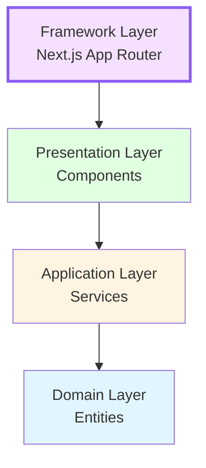

# 🔴 App Layer (Next.js Routing)

> **The entry point layer.** Follows Next.js App Router conventions. Route files should be **thin orchestrators** — they fetch data via services and delegate rendering to components/templates.

---

## Architecture Position



**Key Rule**: Framework Layer is the entry point. It uses Presentation layer components and handles routing.

---

## Purpose

The `app/` directory defines **WHERE things are accessed** — URL routes, layouts, loading states, and error boundaries. It uses Next.js App Router conventions and should contain minimal logic beyond data fetching and layout composition.

---

## Directory Structure

```
app/
├── globals.css                # Global CSS
└── [locale]/                  # i18n locale segment
    ├── layout.tsx             # Root layout (fonts, providers, metadata)
    ├── error.tsx              # Global error boundary
    ├── not-found.tsx          # Global 404
    ├── (shop)/                # Shop route group
    │   ├── layout.tsx         # Shop layout (Header, Footer)
    │   ├── page.tsx           # Home page
    │   ├── HomePage.tsx       # Template (Server Component)
    │   ├── _components/       # Shared shop components
    │   ├── shop/              # /shop route
    │   ├── product/[id]/      # /product/:id route
    │   └── categories/        # /categories route
    ├── (admin)/               # Admin route group
    │   ├── layout.tsx         # Admin layout (Sidebar, Topbar)
    │   └── admin/
    │       ├── page.tsx
    │       ├── products/
    │       ├── categories/
    │       └── _components/
    ├── (auth)/                # Auth route group
    │   ├── layout.tsx
    │   ├── admin-login/
    │   └── registration/
    └── (dashboard)/           # Customer dashboard group
        ├── layout.tsx
        ├── dashboard/
        └── my-account/
```

---

## Import Rules

### ✅ Allowed Imports

| Source                                    | Why                                                    |
| ----------------------------------------- | ------------------------------------------------------ |
| `@/server/getServices`                    | Server Components fetch data via the service layer     |
| `@/domain/entities/*`, `@/domain/types/*` | For typing data passed to components                   |
| `@/components/*`                          | Route files render components                          |
| `@/hooks/*`, `@/providers/*`              | Layouts compose providers; client components use hooks |
| `@/application/actions/*`                 | Client components call server actions                  |
| `@/lib/*`                                 | Constants, utilities, UI types                         |
| `next/*`, `next-intl/*`                   | Framework APIs (navigation, headers, metadata)         |
| `@/application/services/interfaces/*`     | For typing when needed                                 |

### ❌ Forbidden Imports

| Source                                  | Why                                                      |
| --------------------------------------- | -------------------------------------------------------- |
| `@/infrastructure/*`                    | Route files must NEVER touch databases or repos directly |
| `@/application/services/ProductService` | Don't import concrete classes — use `getServices()`      |
| `@/infrastructure/di/ServiceContainer`  | Only `getServices.ts` should import the container        |

---

## Key Patterns

### Thin Route Files

```typescript
// ✅ GOOD — app/[locale]/(shop)/page.tsx
import HomePage from './HomePage';
export default function Page() {
  return <HomePage />;
}
```

### Data Fetching in Server Components

```typescript
// ✅ GOOD — Server Component fetches data via services
import { getServices } from "@/server/getServices";

export default async function AdminDashboardPage() {
  const { adminDashboard } = getServices();
  const stats = await adminDashboard.getStats();
  return <DashboardView stats={stats} />;
}
```

### Route Groups for Layout Separation

```
(shop)/       → Header + Footer
(admin)/      → Sidebar + Topbar
(auth)/       → Minimal layout (login pages)
(dashboard)/  → Customer-facing dashboard layout
```

Route groups `(groupName)` don't affect the URL but apply different `layout.tsx` files.

### Special Files

| File            | Purpose                                       |
| --------------- | --------------------------------------------- |
| `page.tsx`      | Route component (Server Component by default) |
| `layout.tsx`    | Shared layout wrapping child routes           |
| `loading.tsx`   | Loading UI shown during Suspense              |
| `error.tsx`     | Error boundary (`'use client'` required)      |
| `not-found.tsx` | 404 page for this route segment               |

---

## DOs ✅

- **Keep route files thin** — delegate to template components
- **Fetch data in Server Components** via `getServices()`
- **Use route groups** for layout separation
- **Use `_components/`** for page-specific components
- **Use `loading.tsx` and `error.tsx`** for route-level UX
- **Pass locale** as a parameter for i18n-aware data fetching

## DON'Ts ❌

- **DON'T put business logic in route files** — use entity methods or services
- **DON'T import infrastructure directly** — data path: `page → getServices() → Service → Repository`
- **DON'T create large multi-purpose page components** — split into template + smaller components
- **DON'T use `'use client'` in `page.tsx`** when possible — push interactivity to leaf components

---

## Adding a New Route — Checklist

1. **Create the route directory** under the appropriate group: `(shop)/`, `(admin)/`, etc.
2. **Create `page.tsx`** — keep it thin, delegate to a template component
3. If the page needs **server data** → use `getServices()` in the Server Component
4. If the page needs **client interactivity** → create a `'use client'` component
5. **Page-specific components** → co-locate in the route directory or `_components/`
6. **Shared components** → place in `src/components/common/` or `src/components/layout/`
7. Add `loading.tsx` and/or `error.tsx` if appropriate
