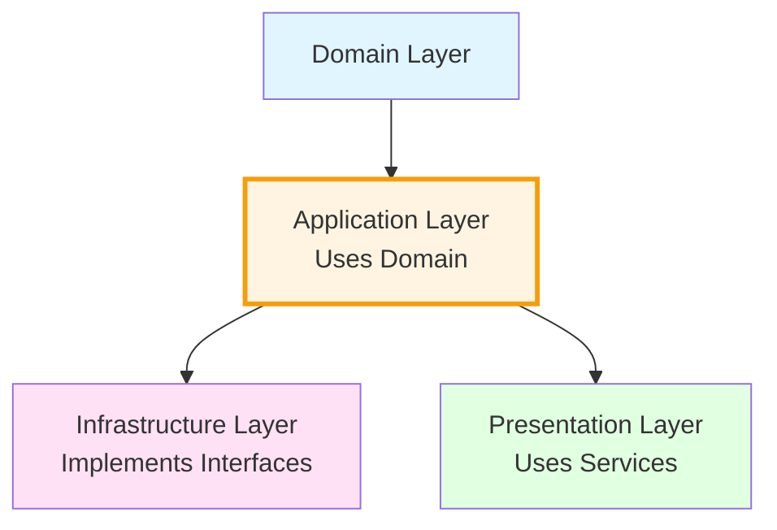

# 🟢 Application Layer

> **The orchestration layer.** Contains business use cases, service interfaces, repository interfaces, and server actions. It coordinates domain logic and defines the contracts that infrastructure must implement.

---

## Architecture Position



**Key Rule**: Application Layer depends on Domain Layer and defines interfaces that Infrastructure implements.

---

## Purpose

The `application/` layer defines **what the application DOES** — its services, use cases, and the interfaces it needs from the outside world (repositories, session providers, etc.). It depends on `domain/` but never on `infrastructure/` or the UI.

---

## Directory Structure

```
application/
├── services/
│   ├── interfaces/          # All service interfaces (contracts)
│   │   ├── IProductService.ts
│   │   ├── ICategoryService.ts
│   │   ├── ICartService.ts
│   │   ├── IAuthService.ts
│   │   ├── ISessionProvider.ts
│   │   ├── IAdminProductService.ts
│   │   ├── IAdminCategoryService.ts
│   │   ├── IAdminDashboardService.ts
│   │   └── index.ts         # Barrel export
│   ├── ProductService.ts    # Implementations
│   ├── CategoryService.ts
│   ├── CartService.ts
│   ├── AuthService.ts
│   ├── AdminProductService.ts
│   ├── AdminCategoryService.ts
│   └── AdminDashboardService.ts
├── repositories/            # Repository interfaces (contracts)
│   ├── IProductRepository.ts
│   ├── ICategoryRepository.ts
│   ├── IOrderRepository.ts
│   ├── IUserRepository.ts
│   └── IReviewRepository.ts
└── actions/                 # Next.js Server Actions
    ├── admin/
    │   ├── categories.ts
    │   └── products.ts
    └── auth/
        ├── login.ts
        └── logout.ts
```

---

## Import Rules

### ✅ Allowed Imports

| Source                                   | Why                                                      |
| ---------------------------------------- | -------------------------------------------------------- |
| `@/domain/entities/*`                    | Services operate on domain entities                      |
| `@/domain/types/*`                       | Services use DTOs for inputs/outputs                     |
| Other `@/application/*` files            | Services can use repository interfaces, other interfaces |
| `@/server/getServices` (in actions only) | Server Actions need access to the service container      |
| `next/cache` (in actions only)           | `revalidatePath`, `revalidateTag` for cache invalidation |
| `next/navigation` (in actions only)      | `redirect` after mutations                               |
| Pure libraries like `bcryptjs`           | For business logic (password hashing in AuthService)     |

### ❌ Forbidden Imports

| Source                                 | Why                                                            |
| -------------------------------------- | -------------------------------------------------------------- |
| `@/infrastructure/*`                   | Application defines interfaces, infrastructure implements them |
| `@/components/*`, `@/hooks/*`          | Application doesn't know about the UI                          |
| `react`                                | Service logic is server-side; React is a rendering concern     |
| `drizzle-orm`, database drivers        | Database access is an infrastructure concern                   |
| `@/infrastructure/di/ServiceContainer` | Only `getServices.ts` should touch the container directly      |

---

## Key Concepts

### Service Interfaces → Implementations

```typescript
// ✅ Interface first — interfaces/IProductService.ts
export interface IProductService {
  getAll(language?: string): Promise<Product[]>;
  getById(id: number, language?: string): Promise<Product | null>;
  getFeaturedProducts(limit?: number, language?: string): Promise<Product[]>;
}

// Implementation — ProductService.ts
export class ProductService implements IProductService {
  constructor(private productRepository: IProductRepository) {}

  async getAllProducts(sortOption?: SortOption, language?: string): Promise<Product[]> {
    const products = await this.productRepository.getAll(language);
    return this.sortProducts(products, sortOption);
  }
}
```

### Repository Interfaces (Contracts)

```typescript
export interface IProductRepository {
  getAll(language?: string): Promise<Product[]>;
  getById(id: number, language?: string): Promise<Product | null>;
  search(query: string, language?: string): Promise<Product[]>;
  getByCategory(category: string, language?: string): Promise<Product[]>;
  getFeatured(limit?: number, language?: string): Promise<Product[]>;
}
```

### Thin Server Actions

```typescript
'use server';
import { getServices } from '@/server/getServices';

export async function createCategoryAction(input: AdminCategoryInput) {
  const { adminCategory } = getServices();
  try {
    await adminCategory.create(input);
    revalidatePath('/admin/categories');
    return { success: true };
  } catch (error) {
    return { success: false, error: 'Failed to create category' };
  }
}
```

---

## DOs ✅

- **Define an interface for every service** — enables DI, testing, and swappable implementations
- **Accept dependencies through the constructor** (Dependency Injection)
- **Keep server actions thin** — business logic in services, actions handle service calls + cache invalidation + error formatting
- **Use repository interfaces in services**, not concrete classes
- **Separate read and write** service interfaces when possible (e.g., `IProductService` for shop, `IAdminProductService` for admin)

## DON'Ts ❌

- **DON'T import from infrastructure** — the DI container wires implementations to interfaces
- **DON'T put UI logic in services** (price formatting → `src/lib/` or component helpers)
- **DON'T access the ServiceContainer directly in services** — inject dependencies via constructor
- **DON'T mix read and write operations** in the same service interface when possible

---

## Design Principles

1. **Dependency Inversion**: Application defines interfaces, Infrastructure implements them
2. **Use Domain Entities**: Services work with domain entities, not database models
3. **Business Logic in Services**: Sorting, filtering, validation — not in repositories
4. **Single Responsibility**: Each service has a clear, single purpose

---

## Testing

Services are easy to test by mocking repositories:

```typescript
describe('ProductService', () => {
  it('should sort products by price ascending', async () => {
    const mockRepository: IProductRepository = {
      getAll: jest.fn().mockResolvedValue([
        { id: 1, price: 100, name: 'Product 1' },
        { id: 2, price: 50, name: 'Product 2' },
      ]),
    };
    const service = new ProductService(mockRepository);
    const products = await service.getAllProducts('price-asc');
    expect(products[0].price).toBe(50);
  });
});
```

---

## Adding a New Feature — Checklist

1. **Define the repository interface** in `application/repositories/INewRepository.ts`
2. **Define the service interface** in `application/services/interfaces/INewService.ts`
3. **Export it** from `application/services/interfaces/index.ts`
4. **Create the service implementation** in `application/services/NewService.ts`
5. Ensure the service `implements` the interface
6. If the feature needs mutations, create **server actions** in `application/actions/`
7. **Register** the service in `infrastructure/di/ServiceContainer.ts`
8. **Expose** the service in `server/getServices.ts`
